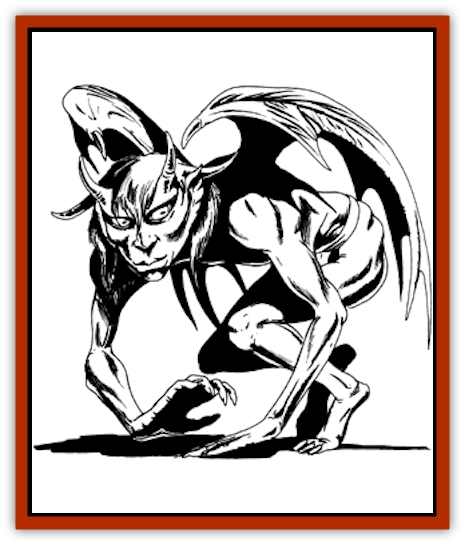

# Averx

| Statistic | **Averx** |
| --- | --- |
| **Activity Cycle:** | Any |
| **Alignment:** | Neutral |
| **Armor Class:** | 4 |
| **Climate/Terrain:** | Subterranean |
| **Damage/Attack:** | By weapon type |
| **Diet:** | Omnivore |
| **Frequency:** | Rare |
| **Hit Dice:** | 1+3 (leaders 2+1) |
| **Intelligence:** | Genius (18) |
| **Magic Resistance:** | 25% |
| **Morale:** | Steady (11) |
| **Movement:** | 9, Fl 15 |
| **No. Appearing:** | 4-16 (10%: 1-2) |
| **No. of Attacks:** | 1 |
| **Organization:** | Clan |
| **Size:** | T (1½' tall) |
| **Special Attacks:** | Spells, +4 to surprise foes |
| **Special Defenses:** | Spells, thieving abilities |
| **THAC0:** | 19 |
| **Treasure:** | W; Q on individuals |
| **XP Value:** | 650 / Leaders: 975 |

Averxes, in their usual form, resemble small, thin, gray-skinned humans with horns, amber eyes, miniature wings, and little clothing. These miniature "dungeon demons" or "cave devils" enjoy hampering and stealing from adventurers or other beings unlucky enough to stumble across their path, but they have other concerns and goals as well.

**Combat:** Averxes can move silently, hide in shadows, and read languages with an 85% chance of success. They utilize other thieving abilities at the fifth level of use, using Table 19 in the Dungeon Master's Guide. All averxes have infravision to 120', but light causes them no harm.

They can use each of the following spells twice per day: *blink*, *enlarge*, *invisibility*, and *levitate*. They can also cast, thrice per day, *faerie fire*, *audible glamer*, *phantasmal force*, *light*, and *spook*. All spells work as though cast by a 5th-level mage. In addition to these spells, an averx leader can cast *fear*, *silence 15' radius*, and *warp wood* once a day. These spells can be cast even in total silence, though the averx must have its hands free for somatic gestures. Oddly enough, no averx is affected by a cursed weapon or item, and they are immune to all forms of *curse* spells.

Averxes avoid direct combat, preferring hit-and-run raids, traps, sabotage, misdirection, and bluffing. They attack other beings only if attacked themselves or if such beings enter and harm the averxes' territory, but they enjoy causing trouble for its own sake as well. In particular, these creatures hunt out small, evil beings like jermlaine and other vermin of the Underdark, killing them and casting their bodies into any available deep pits.

In all combat situation, averxes are extremely clever, observant, and commanding. They set traps of fiendish design in the underground corridors leading to their most carefully guarded lairs and realms, using all manner of snares, pits, poisons, and the like.

**Habitat/Society:** Averxes prefer to live deep underground in the most beautiful natural areas imaginable, especially in vast, crystalline caverns. They enjoy lighting their homes in different ways to enhance the natural beauty, and they conduct elaborate rituals in honor of their homes at irregular intervals. Any intruders who damage these caverns in any way, whether by mining, construction, or simple rock collecting, will spark the averxes' communal anger.

Averxes do not usually carry treasure upon their persons, but each one is likely to have thin rope or cord, knives, wire, oil, tinderboxes, caltrops, or darts. Leaders may carry cursed items for bothersome intruders to "find". An averx lair has only a relatively small amount of treasure, and averxes usually carry a few gems around with them for their own pleasure. A lair is usually high in a cavern ceiling, in a hole or tunnel or along a ledge. Every effort is made to conceal this area from view and to keep it safe.

Sometimes one or two averxes, acting on their own curiosity, make their ways into dungeons or deep cellars. They rarely stay long, preferring to acquire some minor treasures and leave - possibly after causing a little mischief.

**Ecology:** With their array of powers, one would guess that averxes are nothing more than nuisance monsters. Some sages, however, believe that averxes were created by unknown (and possibly extinct) greater powers as guardians of subterranean lands and protectors of their beauty. They prey on small animals and evil creatures but largely leave everything else alone.

---
## Discovery & Documentation

**Source Publication:** Dragon172 (1991)
**Campaign Setting:** Dragon Magazine
**Author(s):** 

### Other Creatures Found in This Source Book
   * [[Biclops|Biclops]]
   * [[Fungus_Cushion|Fungus, Cushion]]
