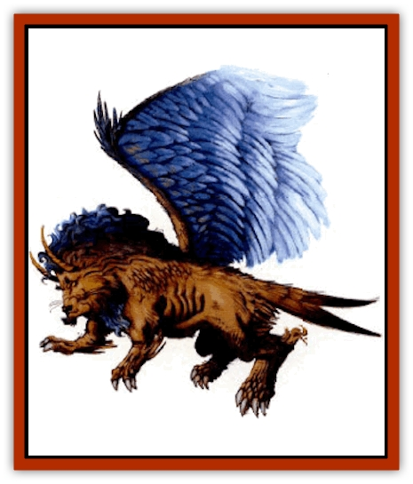

# Aviarag

| Statistic | **Aviarag** |
| --- | --- |
| **Activity Cycle:** | Day |
| **Alignment:** | Neutral good |
| **Armor Class:** | 4 |
| **Climate/Terrain:** | Any land |
| **Damage/Attack:** | 1d8/1d8/1d10 |
| **Diet:** | Omnivore |
| **Frequency:** | Very rare |
| **Hit Dice:** | 8 |
| **Intelligence:** | Very (12) |
| **Magic Resistance:** | Nil |
| **Morale:** | Elite (13) |
| **Movement:** | 12, Fl 24 (C) |
| **No. Appearing:** | 1 |
| **No. of Attacks:** | 3 + special |
| **Organization:** | Solitary |
| **Size:** | L (15' wingspan) |
| **Special Attacks:** | Rake |
| **Special Defenses:** | Nil |
| **THAC0:** | 13 |
| **Treasure:** | Nil (special) |
| **XP Value:** | 3,000 |

**Psionics Summary**

| Level | Dis/Sci/Dev | Attack/Defense | Score | PSPs |
| --- | --- | --- | --- | --- |
| 8 | 2/3/20 | II,PB,PsC/MB,MBk,TW | 13 | 50 |

**Clairsentience -** *Sciences:* nil; *Devotions:* all-round vision, danger sense, poison sense, radial navigation.

**Telepathy -** *Sciences:* mind link, psionic blast, mind wipe; *Devotions:* contact, ESP, id insinuation, life detection, sight link, psionic crush.

The aviarag resembles an adult male [[Cat_Great|lion]], but it has large wings (15 feet across), as well as horns similar to a goat's protruding from its head. The aviarag's tail is birdlike and split like the tail of a swallow. This gives the aviarag its high maneuverability despite its size.

On the ground, the aviarag moves equally well on all fours or on its hind legs only. The aviarag's eyes are black and yellow, and it can see as far as 30 miles in clear conditions. The hide is a tawny brown color and the wing feathers are deep blue with white tips. The tail feathers are also deep blue, but with no white tip.

**Combat:** The aviarag attacks mainly with its sharp claws. When airborne, the foreclaws strike first and cause 1-8 (1d8) points of damage each. If both foreclaws hit, the rear claw attacks become a single raking attack that adds a +2 bonus to the attack roll for 10-24 (2d8+8) points of damage. In the air the aviarag usually drops a raked opponent after the rake attack. On the ground the aviarag can attack with its foreclaws, but does not rake. The aviarag can also bite, causing 1-10 (1d10) points of damage.

The aviarag prefers to dive on its opponents from behind, letting out a piercing roar lust before it hits. Intended victims must successfully save vs. petrification or freeze in place for 1 round.

The aviarag keeps its psionics in reserve unless it is badly outnumbered. In that case, the aviarag attempts to psionic blast each of its opponents in turn until the odds are evened up. In a melee combat it uses the tower of iron will defense.

**Habitat/Society:** The aviaraq is a solitary creature, preferring its own company to that of any others. It has a large, roughly circular territory, 15 miles in diameter.

The lair of an aviarag is invariably at the top of the highest peak in its territory. The aviarag prefers small rodents and mammals for food, but attacks larger creatures if it is hungry. A well-fed aviarag can go for three weeks without food if necessary. It eats only freshly killed meat.

The aviarag uses its psionic powers to determine the intentions of any intelligent creatures it meets. If the aviarag detects any thoughts of combat, it attacks. If it reads peaceful intentions. there is a 50% chance the aviarag will offer assistance in the form of guidance to water or shelter, in exchange for food, or some shiny bauble for its lair. While it doesn't covet treasure as such, the aviarag does like shiny things. An aviarag's lair contains 5-50 (5d10) such objects. There is a 1% cumulative chance for each item that an object is valuable.

Once every two years the female aviarag goes in search of a mate. Aviarags do not mate for life. After a brief mating season the female returns to her lair. From 1-4 (1d4) young are born three months after mating. They remain with their mother for the first year, then leave to set up a territory of their own.

**Ecology:** Young aviarags can be trained as flying mounts or as beasts of burden. However, they are intelligent creatures and are more likely to provide these services in exchange for food, shelter, and protection than to answer the call of the whip.

Aviarags live for about 30 years.

---
## Discovery & Documentation

**Source Publication:** Dark Sun Appendix II - Terrors Beyond Tyr (1991)
**Campaign Setting:** Dark Sun
**Author(s):** Jim Atkiss, Steve Brown, Timothy B. Brown, Andrew P. Morris, Bruce Nesmith, Wes Nicholson, Bill Slavicsek

### Other Creatures Found in This Source Book
   * [[Aarakocra_Athas|Aarakocra (Athas)]]
   * [[Animal_Domestic_Athas_II|Animal, Domestic (Athas) II]]
   * [[Baazrag|Baazrag]]
   * [[Baazrag_Boneclaw|Baazrag, Boneclaw]]
   * [[Bloodgrass|Bloodgrass]]
   * [[Cactus_Hunting|Cactus, Hunting]]
   * [[Cactus_Rock|Cactus, Rock]]
   * [[Cilops|Cilops]]
   * [[Crodlu|Crodlu]]
   * [[Dagorran|Dagorran]]
   * [[Dhaot|Dhaot]]
   * [[Drake_Lesser_Athas_General_Information|Drake, Lesser (Athas), General Information]]
   * [[Drake_Lesser_Athas_Magma|Drake, Lesser (Athas), Magma]]
   * [[Drake_Lesser_Athas_Rain|Drake, Lesser (Athas), Rain]]
   * [[Drake_Lesser_Athas_Silt|Drake, Lesser (Athas), Silt]]
   * [[Drake_Lesser_Athas_Sun|Drake, Lesser (Athas), Sun]]
   * [[Dray|Dray]]
   * [[Drik|Drik]]
   * [[Dune_Reaper|Dune Reaper]]
   * [[Dwarf_Athas|Dwarf (Athas)]]
   * [[Elemental_Beast_Athas_Air|Elemental Beast (Athas), Air]]
   * [[Elemental_Beast_Athas_Earth|Elemental Beast (Athas), Earth]]
   * [[Elemental_Beast_Athas_Fire|Elemental Beast (Athas), Fire]]
   * [[Elemental_Beast_Athas_Water|Elemental Beast (Athas), Water]]
   * [[Elf_Athas|Elf (Athas)]]
   * [[Fael|Fael]]
   * [[Feylaar|Feylaar]]
   * [[Fordorran|Fordorran]]
   * [[Giant_Half-giant|Giant, Half-giant]]
   * [[Giant_Shadow|Giant, Shadow]]
   * [[Golem_Athas_Magma|Golem (Athas), Magma]]
   * [[Golem_Athas_Salt|Golem (Athas), Salt]]
   * [[Golem_Athas_General_Information|Golem (Athas), General Information]]
   * [[Gorak|Gorak]]
   * [[Halfling_Athas|Halfling (Athas)]]
   * [[Human_Athas|Human (Athas)]]
   * [[Jhakar|Jhakar]]
   * [[Kaisharga|Kaisharga]]
   * [[Kes'trekel|Kes'trekel]]
   * [[Klar|Klar]]
   * [[Krag|Krag]]
   * [[Kragling|Kragling]]
   * [[Lirr|Lirr]]
   * [[Mastyrial|Mastyrial]]
   * [[Meorty|Meorty]]
   * [[Mul|Mul]]
   * [[Nikaal|Nikaal]]
   * [[Paraelemental_Beast_General_Information|Paraelemental Beast, General Information]]
   * [[Paraelemental_Beast_Magma|Paraelemental Beast, Magma]]
   * [[Paraelemental_Beast_Rain|Paraelemental Beast, Rain]]
   * [[Paraelemental_Beast_Silt|Paraelemental Beast, Silt]]
   * [[Paraelemental_Beast_Sun|Paraelemental Beast, Sun]]
   * [[Pakubrazi|Pakubrazi]]
   * [[Psionocus|Psionocus]]
   * [[Psurlon|Psurlon]]
   * [[Raaig|Raaig]]
   * [[Retriever_Obsidian|Retriever, Obsidian]]
   * [[Ruktoi|Ruktoi]]
   * [[Ruvoka_Athas|Ruvoka (Athas)]]
   * [[Sand_Howler|Sand Howler]]
   * [[Scorpion_Athas|Scorpion (Athas)]]
   * [[Seed_Brain|Seed, Brain]]
   * [[Silt_Horror_Black|Silt Horror, Black]]
   * [[Silt_Horror_Magma|Silt Horror, Magma]]
   * [[Silt_Horror_Red|Silt Horror, Red]]
   * [[Silt_Spawn|Silt Spawn]]
   * [[Slig|Slig]]
   * [[Spider_Athas|Spider (Athas)]]
   * [[Spinewyrm|Spinewyrm]]
   * [[Ssurran|Ssurran]]
   * [[Stalking_Horror|Stalking Horror]]
   * [[Tarek|Tarek]]
   * [[Tari|Tari]]
   * [[Thri-kreen|Thri-kreen]]
   * [[T'liz|T'liz]]
   * [[Tohr-kreen_II|Tohr-kreen II]]
   * [[Tohr-kreen_III|Tohr-kreen III]]
   * [[Trin|Trin]]
   * [[Tul'k|Tul'k]]
   * [[Undead_Athas_General_Information|Undead (Athas), General Information]]
   * [[Wraith_Athas|Wraith (Athas)]]
   * [[Xerichou|Xerichou]]
   * [[Zombie_Thinking|Zombie, Thinking]]
