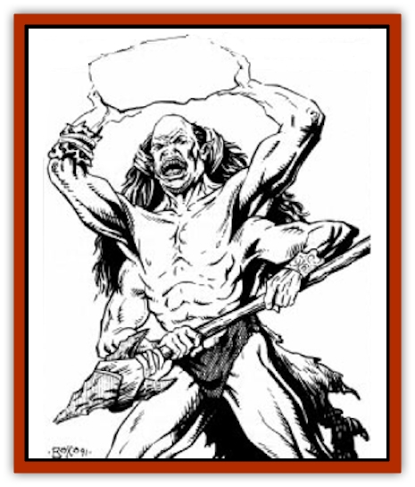

# B'rohg

| Statistic | **B'rohg** |
| --- | --- |
| **Activity Cycle:** | Any |
| **Alignment:** | Neutral |
| **Armor Class:** | 7 (10) |
| **Climate/Terrain:** | Any |
| **Damage/Attack:** | 11-18 (1d8+10) |
| **Diet:** | Omnivore |
| **Frequency:** | Common |
| **Hit Dice:** | 5+3 |
| **Intelligence:** | Low (5-7) |
| **Magic Resistance:** | See below |
| **Morale:** | Average (10) |
| **Movement:** | 15 |
| **No. Appearing:** | 1-12 |
| **No. of Attacks:** | 4 |
| **Organization:** | Bands or cliques |
| **Size:** | H (15' tall) |
| **Special Attacks:** | See below |
| **Special Defenses:** | See below |
| **THAC0:** | 15 |
| **Treasure:** | J,K |
| **XP Value:** | 650 / Leader: 975 / Renegade: 975 |

These multi-armed, humanoid kin to [[Giant_Athas|giants]] are often hunted for combat in the gladiatorial arenas of Athas due to their strength, size, and special combat abilities.

B'rohg are tall, slim, humanoid giants with four arms and two legs. They have burnt orange skin, the result of having spent their lives on the hot deserts of Athas. They stand 15' in height when fully mature, with sharp, angled features, a flat nose, and pointed ears located towards the backside of their skull. Some b'rohg are bald on top, but do have hair (which they will grow to waist-length) growing from the back of their heads. B'rohg have no facial hair. A b'rohg's garb is simple and well-suited to his primitive lifestyle. Males and females alike wear loose fitting skins or breeches made from reptilian leather.

B'rohg communicate with one another through a series of primitive grunts and hand signals. Because of their low intelligence, it is impossible to teach a b'rohg contemporary speech. It is possible to learn the grunt and sign language of the b'rohg through much study; however, such communication tends to be limited to simple concepts. Psionic or magical communication is also somewhat limited due to their low intelligence - contact is still limited to fairly simple ideas.

**Combat:** Naturally ambidextrous and very strong, b'rohg are highly prized for arena combat. B'rohg are formidable opponents due to their ability to make four separate attacks per round. The primary two attacks are unmodified. The other two attacks are attempted with a -2 attack roll penalty. B'rohg prefer to fight with primitive stone weapons, such as spears and clubs, but will use any available weapon. A favored form of attack is wielding clubs in the lower two arms and long spears in the upper arms. While most younger b'rohg favor an all-out, 4-weapon attack, some older b'rohg prefer to pad their lower two arms and use them as shields, thus "equalizing" the match. Using the latter method, b'rohg get two chances to parry while still making two attacks.

Because of their lack of intellectual development, b'rohg have never mastered the use of missile weapons other than those which can be thrown (rocks, etc.). Because of the motion of throwing, a b'rohg can only throw a maximum of two objects per round, and they do so by throwing from the same side simultaneously.

There will be a dominant male leader present in any group of six or more b'rohg. The leader has 6+3 Hit Dice and a THAC0 of 13. The leader also brings his battle savvy into play, directing the combat actions of his warriors. When a leader is present, the b'rohg are more likely to set ambushes for approaching enemies rather than conduct a simple frontal assault. Also, b'rohg under the command of a leader will turn and run after losing two of their original number. Otherwise b.rohg tend to fight to the bitter end.

**Habitat/Society:** B'rohg are a throw-back to simpler times. They are nomadic hunters and gatherers who continue to live within a primitive, "stone age" culture primarily because of their low intelligence. A b'rohg child taken and raised in a human community is unable to comprehend anything but primitive concepts; his lack of intelligence makes him unable to excel. B'rohg live in small bands comprised of 1-4 family units called cliques. Family units consist of one male, one or two females, and generally no more than four total offspring. Males are dominant within the family structure, but tasks within a band are accomplished by the most capable member regardless of gender. The strongest in the band are primarily hunters, while the older, weaker members and the children are gatherers and water bearers. B'rohg have yet to master fire, but are not afraid of it; in fact, they are often attracted to it if they see the distant glow. B'rohg are scavengers, and their clothing often testifies to this fact. When clothed, they combine animal skins with "found" or discarded scraps of clothing and armor.

B'rohg typically live to be 80 years of age but seldom do because of the harshness of their environment and a high mortality rate among their young. B'rohg do not understand the concept of death and tend to leave things that do not exhibit signs of life alone. An exception to this is seen in combat, where they may repeatedly strike a dead opponent just to make sure it does not arise later. B'rohg will eat the flesh of other races, but are not cannibalistic; they do not consume their own kind.

Neither suspicious nor superstitious, b'rohg are reactionary when magic is used in their presence. Depending on previous experiences with spellcasters, the creatures may be awed or angered. When encountering magic for the first time, their reaction tends to be one of curiosity (until the spellcaster's intent - malevolent or benevolent - has been established).

Their nomadic lifestyle calls for periods of movement followed by periods of rest. While on the move, the adults carry the few belongings they have and their children in simple sleds made from skins or leathers stretched across a triangle of wooden poles. Each adult drags a single sled across the ground to the next temporary settlement. Once in an area fresh for further hunting and gathering, the group settles down, forming small hovels out of their sleds and additional skins. Where possible, the hovels use existing rocks and crevices to serve as walls or additional rooms, respectively. When under the direction of a dominant male leader, the group selects an easily defended position over any others.

**Ecology:** B'rohg do not directly contribute to the social or economic well-being of Athas, as they neither create nor produce any raw materials or refined goods. They are, however, top draws at gladiatorial arenas, although they seldom benefit from their victories. Some captive b'rohg are too stupid to attempt to escape, while others die in their mad flight from the sorcerer-kings' cities. B'rohg are sometimes "seduced" into gladiatorial slavery by being tempted with sweetmeats, fresh cold water, and a variety of simple yet enticing "luxuries". However, this seduction is the exception and not the rule, as most b'rohg are sought out and overcome by shear force of numbers before being taken into slavery. Few people have ever made lasting friends with a b'rohg. Due to their limited intelligence b.rohg seldom remember friend from foe for any length of time.

**Renegade B'rohg**

  B'rohg that are taken to the gladiatorial games of the city states are never allowed to win their freedom. Despite their humanoid form, b'rohg are considered animals by their trainers and owners, suitable for nothing more than entertainment through savage combat. However, low intelligence does not equate to low cunning, and many b'rohg have escaped their bonds to live free again in the Athasian wilderness. However, once trained for so-called civilized combat, the b'rohg is no longer suited to his original lifestyle.

While in the arena, renegades learn a great deal about more sophisticated combat techniques. They learn the benefits and use of armor, something rarely practiced in the wild. Renegade b'rohg fashion their own armor when they reach the wilderness, using animal bone, chitin, and wood as available. A renegade b'rohg has AC 3, 4, or 5 (1d3+2).

Also, a renegade b'rohg usually escapes with a fair weapon from the arena. It is either metal (25%) or obsidian (75%), and the renegade is skilled enough to use it and some other primitive weapon (a club or spear) at the same time. Renegade b'rohg can attack with both weapons each round without attack roll penalties.

Renegade b'rohg tend to live solitary lives. In encounters with other, more primitive b'rohg, the renegade keeps his distance, ashamed of his original capture, but also ashamed by the simplistic lives of his kin. The only places where renegades find universal acceptance is among the slave tribes. Once again among the familiar trappings of gladiatorial companionship, but without the abuse of servitude, renegades make excellent warriors and laborers.

There is a 20% chance that any encounter with b'rohg will, in fact, be with a single renegade b'rohg.

---
## Discovery & Documentation

**Source Publication:** MC12 Dark Sun Appendix I - Terrors of the Desert (1991)
**Campaign Setting:** Dark Sun
**Author(s):** Tom Prusa, Louis J. Prosperi, Walter M. Baas

### Other Creatures Found in This Source Book
   * [[Animal_Herd_Athas|Animal, Herd (Athas)]]
   * [[Animal_Household_Athas|Animal, Household (Athas)]]
   * [[Antloid_Desert|Antloid, Desert]]
   * [[Banshee_Dwarf|Banshee, Dwarf]]
   * [[Beetle_Agony|Beetle, Agony]]
   * [[Bog_Wader|Bog Wader]]
   * [[Brambleweed|Brambleweed]]
   * [[Burnflower|Burnflower]]
   * [[Cat_Psionic|Cat, Psionic]]
   * [[Cha'thrang|Cha'thrang]]
   * [[Cistern_Fiend|Cistern Fiend]]
   * [[Clam_Giant|Clam, Giant]]
   * [[Cloud_Ray|Cloud Ray]]
   * [[Drake_Athas_Air|Drake (Athas), Air]]
   * [[Drake_Athas_Earth|Drake (Athas), Earth]]
   * [[Drake_Athas_Fire|Drake (Athas), Fire]]
   * [[Drake_Athas_Water|Drake (Athas), Water]]
   * [[Dune_Runner|Dune Runner]]
   * [[Dune_Trapper|Dune Trapper]]
   * [[Elemental_Athas_Greater_Air|Elemental (Athas), Greater, Air]]
   * [[Elemental_Athas_Greater_Earth|Elemental (Athas), Greater, Earth]]
   * [[Elemental_Athas_Greater_Fire|Elemental (Athas), Greater, Fire]]
   * [[Elemental_Athas_Greater_Water|Elemental (Athas), Greater, Water]]
   * [[Elemental_Athas_Lesser_Air_Earth|Elemental (Athas), Lesser, Air/Earth]]
   * [[Elemental_Athas_Lesser_Fire_Water|Elemental (Athas), Lesser, Fire/Water]]
   * [[Elemental_Athas_General_Information|Elemental (Athas), General Information]]
   * [[Erdland|Erdland]]
   * [[Esperweed|Esperweed]]
   * [[Flailer|Flailer]]
   * [[Floater|Floater]]
   * [[Giant_Athas|Giant (Athas)]]
   * [[Golem_Athas_I|Golem (Athas) I]]
   * [[Golem_Athas_II|Golem (Athas) II]]
   * [[Golem_Athas_III|Golem (Athas) III]]
   * [[Golem_Athas_General_Information|Golem (Athas), General Information]]
   * [[Halfling_Renegade|Halfling, Renegade]]
   * [[Hej-kin|Hej-kin]]
   * [[Id_Fiend|Id Fiend]]
   * [[Insect_Swarm_Athas|Insect Swarm (Athas)]]
   * [[Kank_Wild|Kank, Wild]]
   * [[Kirre|Kirre]]
   * [[Megapede|Megapede]]
   * [[Mul_Wild|Mul, Wild]]
   * [[Nightmare_Beast|Nightmare Beast]]
   * [[Plant_Carnivorous_Athas|Plant, Carnivorous (Athas)]]
   * [[Pterran|Pterran]]
   * [[Pterrax|Pterrax]]
   * [[Pulp_Bee|Pulp Bee]]
   * [[Pyreen|Pyreen]]
   * [[Rasclinn|Rasclinn]]
   * [[Razorwing|Razorwing]]
   * [[Roc_Athas|Roc (Athas)]]
   * [[Sand_Bride|Sand Bride]]
   * [[Sand_Cactus|Sand Cactus]]
   * [[Sand_Vortex|Sand Vortex]]
   * [[Scrab|Scrab]]
   * [[Silt_Horror|Silt Horror]]
   * [[Silt_Runner|Silt Runner]]
   * [[Sink_Worm|Sink Worm]]
   * [[Sloth_Athas|Sloth (Athas)]]
   * [[So-ut|So-ut]]
   * [[Spider_Cactus|Spider Cactus]]
   * [[Spider_Crystal|Spider, Crystal]]
   * [[Spirit_of_the_Land|Spirit of the Land]]
   * [[T'Chowb|T'Chowb]]
   * [[Thrax|Thrax]]
   * [[Tohr-kreen_I|Tohr-kreen I]]
   * [[Villichi|Villichi]]
   * [[Zhackal|Zhackal]]
   * [[Zombie_Plant|Zombie Plant]]
