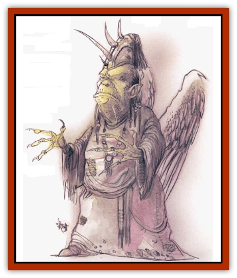

# Baatezu - Greater - Amnizu

| Statistic | **Baatezu, Greater, Amnizu** |
| --- | --- |
| **Activity Cycle:** | Any |
| **Alignment:** | Lawful evil |
| **Armor Class:** | -1 |
| **Climate/Terrain:** | Baator |
| **Damage/Attack:** | 2d4 |
| **Diet:** | Carnivore |
| **Frequency:** | Rare |
| **Hit Dice:** | 9 |
| **Intelligence:** | Exceptional (15-16) |
| **Magic Resistance:** | 50% |
| **Morale:** | Elite (13-14) |
| **Movement:** | 6, Fl 15 (C) |
| **No. Appearing:** | 1-2 |
| **No. of Attacks:** | 1 |
| **Organization:** | Solitary |
| **Size:** | M (4' tall) |
| **Special Attacks:** | Energy channel, forget |
| **Special Defenses:** | +2 weapons to hit |
| **THAC0:** | 11 (see below) |
| **Treasure:** | V,Y |
| **XP Value:** | 11,000 |

The amnizu dwell primarily on Stygia, the fifth plane of Baator. They often enter the upper layers of Baator on missions.

The amnizu are gruesome and unseemly: short (4 feet tall) with elongated, bald heads, stubby legs and arms, and large, leathery wings. Amnizu have pug noses, large eyes, and snarling mouths tilled with jagged, razor-sharp teeth.

**Combat:** The amnizu are greater [[Baatezu_General_Information|baatezu]] and, as such, prefer to leave combat to underlings. Their touch, a channeling of harmful energy, does 2d4 points of damage. It bypasses ordinary armor, so the amnizu need only hit Armor Class 10 to cause damage. Magical pluses of armor, shield, or a protective device such as a *ring of protection* improve the defender's Armor Class. Magical items that give a base Armor Class also protect against the touch.

Because of the amnizu's close ties to the river Styx, its attacks work as a powerful *forget* spell that causes the target to forget one whole day's memory unless he saves vs. spells.

In addition to those magical abilities available to all baatezu, an amnizu can use the following spell-like abilities, one per round: *fireball* (3 times per day) and *imprisonment* (once per day). Once per day amnizu can attempt to *gate* in 2 to 20 [[Baatezu_Lesser_Abishai|abishai]] (50% chance of success) or 1 to 8 [[Baatezu_Lesser_Erinyes|erinyes]] (30% chance).

A *holy word* drives an amnizu back to its own plane, Stygia.

**Habitat/Society:** The amnizu, as greater baatezu, enjoy a nobility of sorts. They follow orders only because of their desire to advance and their fear of the [[Baatezu_Greater_Pit_Fiend|pit fiends]]. The higher a fiend advances in Baator, the more closely the Dark Eight watch it. Given the opportunity, however, amnizu order their minions to attack anything under the control of the Dark Eight. Possibly an amnizu would even attack a pit fiend given sufficient reason, if it thought it could evade suspicion.

The amnizu guard the river Styx, which enters Baator through Stygia as well as Avernus - a weak point in Baator's defenses. For their own perverse ends as well as the protection of Stygia, amnizu individually command an army of thousands of abishai and erinyes.

**Ecology:** The amnizu protect Baator from invaders, and thus they are given their power of *imprisonment*. Mortals who travel here to combat evil generally become fodder for the amnizu.

---
## Discovery & Documentation

**Source Publication:** MC8 Outer Planes Appendix (1990)
**Campaign Setting:** Planescape
**Author(s):** Timothy B. Brown, Jamie LaFountain

### Other Creatures Found in This Source Book
   * [[Aasimon_Agathinon|Aasimon, Agathinon]]
   * [[Aasimon_Deva|Aasimon, Deva]]
   * [[Aasimon_Light|Aasimon, Light]]
   * [[Aasimon_General_Information|Aasimon, General Information]]
   * [[Aasimon_Planetar|Aasimon, Planetar]]
   * [[Aasimon_Solar|Aasimon, Solar]]
   * [[Air_Sentinel|Air Sentinel]]
   * [[Animal_Lord|Animal Lord]]
   * [[Archon|Archon]]
   * [[Baatezu_Lesser_Abishai|Baatezu, Lesser, Abishai]]
   * [[Baatezu_Lesser_Barbazu|Baatezu, Lesser, Barbazu]]
   * [[Baatezu_Greater_Cornugon|Baatezu, Greater, Cornugon]]
   * [[Baatezu_Lesser_Erinyes|Baatezu, Lesser, Erinyes]]
   * [[Baatezu_General_Information|Baatezu, General Information]]
   * [[Baatezu_Greater_Gelugon|Baatezu, Greater, Gelugon]]
   * [[Baatezu_Lesser_Hamatula|Baatezu, Lesser, Hamatula]]
   * [[Baatezu_Lemure|Baatezu, Lemure]]
   * [[Baatezu_Least_Nupperibo|Baatezu, Least, Nupperibo]]
   * [[Baatezu_Lesser_Osyluth|Baatezu, Lesser, Osyluth]]
   * [[Baatezu_Greater_Pit_Fiend|Baatezu, Greater, Pit Fiend]]
   * [[Baatezu_Least_Spinagon|Baatezu, Least, Spinagon]]
   * [[Balaena|Balaena]]
   * [[Bariaur|Bariaur]]
   * [[Bebilith|Bebilith]]
   * [[Bodak|Bodak]]
   * [[Dog_Moon|Dog, Moon]]
   * [[Dragon_Adamantite|Dragon, Adamantite]]
   * [[Einheriar|Einheriar]]
   * [[Gehreleth|Gehreleth]]
   * [[Githyanki|Githyanki]]
   * [[Githzerai|Githzerai]]
   * [[Hordling|Hordling]]
   * [[Lammasu_Celestial|Lammasu, Celestial]]
   * [[Larva|Larva]]
   * [[Maelephant|Maelephant]]
   * [[Marut|Marut]]
   * [[Mediator|Mediator]]
   * [[Mortai|Mortai]]
   * [[Night_Hag|Night Hag]]
   * [[Nightmare|Nightmare]]
   * [[Noctral|Noctral]]
   * [[Per|Per]]
   * [[Phoenix|Phoenix]]
   * [[Slaad|Slaad]]
   * [[Tanar'ri_Greater_Babau|Tanar'ri, Greater, Babau]]
   * [[Tanar'ri_Greater_Chasme|Tanar'ri, Greater, Chasme]]
   * [[Tanar'ri_Greater_Nabassu|Tanar'ri, Greater, Nabassu]]
   * [[Tanar'ri_Least_Dretch|Tanar'ri, Least, Dretch]]
   * [[Tanar'ri_Least_Manes|Tanar'ri, Least, Manes]]
   * [[Tanar'ri_Least_Rutterkin|Tanar'ri, Least, Rutterkin]]
   * [[Tanar'ri_Lesser_Alu-Fiend|Tanar'ri, Lesser, Alu-Fiend]]
   * [[Tanar'ri_Lesser_Bar-Lgura|Tanar'ri, Lesser, Bar-Lgura]]
   * [[Tanar'ri_Lesser_Cambion|Tanar'ri, Lesser, Cambion]]
   * [[Tanar'ri_Lesser_Succubus|Tanar'ri, Lesser, Succubus]]
   * [[Tanar'ri_Guardian_Molydeus|Tanar'ri, Guardian, Molydeus]]
   * [[Tanar'ri_General_Information|Tanar'ri, General Information]]
   * [[Tanar'ri_True_Balor|Tanar'ri, True, Balor]]
   * [[Tanar'ri_True_Glabrezu|Tanar'ri, True, Glabrezu]]
   * [[Tanar'ri_True_Hezrou|Tanar'ri, True, Hezrou]]
   * [[Tanar'ri_True_Marilith|Tanar'ri, True, Marilith]]
   * [[Tanar'ri_True_Nalfeshnee|Tanar'ri, True, Nalfeshnee]]
   * [[Tanar'ri_True_Vrock|Tanar'ri, True, Vrock]]
   * [[Titan|Titan]]
   * [[Translator|Translator]]
   * [[T'uen-rin|T'uen-rin]]
   * [[Vaporighu|Vaporighu]]
   * [[Warden_Beast|Warden Beast]]
   * [[Yugoloth_Greater_Arcanaloth|Yugoloth, Greater, Arcanaloth]]
   * [[Yugoloth_Lesser_Dergoloth|Yugoloth, Lesser, Dergoloth]]
   * [[Yugoloth_Lesser_Hydroloth|Yugoloth, Lesser, Hydroloth]]
   * [[Yugoloth_General_Information|Yugoloth, General Information]]
   * [[Yugoloth_Lesser_Mezzoloth|Yugoloth, Lesser, Mezzoloth]]
   * [[Yugoloth_Greater_Nycaloth|Yugoloth, Greater, Nycaloth]]
   * [[Yugoloth_Lesser_Piscoloth|Yugoloth, Lesser, Piscoloth]]
   * [[Yugoloth_Greater_Ultroloth|Yugoloth, Greater, Ultroloth]]
   * [[Yugoloth_Lesser_Yagnoloth|Yugoloth, Lesser, Yagnoloth]]
   * [[Zoveri|Zoveri]]
