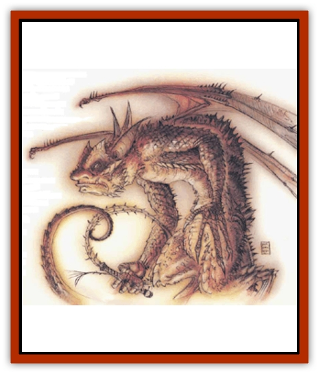

# Baatezu - Greater - Cornugon

| Statistic | **Baatezu, Greater, Cornugon** |
| --- | --- |
| **Activity Cycle:** | Any |
| **Alignment:** | Lawful evil |
| **Armor Class:** | -2 |
| **Climate/Terrain:** | Baator |
| **Damage/Attack:** | 1d4/1d4/1d4+1/1d3 or 1d3 + weapon +6 (Strength bonus) |
| **Diet:** | Carnivore |
| **Frequency:** | Very rare |
| **Hit Dice:** | 10 |
| **Intelligence:** | Exceptional (15-16) |
| **Magic Resistance:** | 50% |
| **Morale:** | Elite (13-14) |
| **Movement:** | 9, F1 18 (C) |
| **No. Appearing:** | 1-4 |
| **No. of Attacks:** | 4 or 1 + weapon |
| **Organization:** | Solitary |
| **Size:** | L (9' tall) |
| **Special Attacks:** | Fear, wounding, stun |
| **Special Defenses:** | Regeneration, +2 weapons to hit |
| **THAC0:** | 11 |
| **Treasure:** | D,S |
| **XP Value:** | 10,000 |

Cornugons are elite defense forces. They look frightening: 9 feet tall, only vaguely humanoid, and covered with grotesque scales. Their huge wings and snaking, prehensile tail add to their intimidating demeanor. In combat they favor a long barbed whip.

**Combat:** Cornugons are fearless fighters, rarely retreating from combat even against overwhelming odds. They have 18/00 Strength (+6 damage adjustment). Cornugons attack with their tail for 1d3 points of damage, creating a wound that bleeds 1 point per round until treated. In addition, they attack with either claws (1d4 points of damage) and bite (1d4+1 points of damage), or with a barbed whip (1d6 points of damage and save vs. paralyzation or be stunned for 1d4 rounds).

In addition to the magical abilities inherent in all [[Baatezu_General_Information|baatezu]], cornugons can use the spell-like powers *detect magic*, *ESP*, *lightning bolt* (3 times per day), *produce flame*, *pyrotechnics* and *wall of fire* (once per day). They can attempt to *gate* in the following: 2 to 12 [[Baatezu_Lesser_Barbazu|barbazu]] (50% chance, once per day), 2 to 16 [[Baatezu_Lesser_Abishai|abishai]] (35% chance, once per day), and 1 to 3 additional cornugons (20% chance, once per day).

All comugons radiate a *fear* aura in a 5-foot radius. Anyone entering the radius must save vs. rod, staff, or wand or flee in terror for 1d6 melee rounds. Cornugons regenerate 2 hit points per melee round.

**Habitat/Society:** Cornugons, the elite fighting force in Baator, form terrifying armies up to 2,000 strong. Only pit fiends may lead these hideous fighting forces into battle. [[Baatezu_Greater_Pit_Fiend|Pit fiends]] and [[Baatezu_Greater_Gelugon|gelugons]] prize cornugons as personal guardians and try to obtain them as personal retainers. The Dark Eight have 106 cornugons in their retinue.

Cornugon armies usually form only in the lowest layers of Baator. In the upper layers, individual comugons serve as generals to vast armies of lesser baatezu. This duty is desirable for its rapid advancement, second only to guardian duty among the Dark Eight.

**Ecology:** The cornugons are greater baatezu, and as such enjoy a certain prestige. Of all the baatezu, the cornugons and [[Baatezu_Lesser_Hamatula|hamatula]] advance most rapidly.

With several successful campaigns to their credit, heroic comugons receive promotions to the upper layer of Baator, where they command vast, gruesome legions of baatezu. From there, distinguished action leads to promotion to gelugons, the ruthless inhabitants of the frigid layer of Caina.

Although powerful and cunning, the cornugons display treachery in their ranks least often of all baatezu, due to their militaristic nature. Their loyalty makes them an unusual asset. It is said that the 106 cornugons that guard the Dark Eight are completely loyal and would give their lives in defense of the council, behavior nearly unheard of in Baator. Whether this is due to genuine loyalty or fear of the pit fiends is unknown, but seldom in the history of the Dark Eight has a cornugon guardian displayed traitorous behavior.

---
## Discovery & Documentation

**Source Publication:** MC8 Outer Planes Appendix (1990)
**Campaign Setting:** Planescape
**Author(s):** Timothy B. Brown, Jamie LaFountain

### Other Creatures Found in This Source Book
   * [[Aasimon_Agathinon|Aasimon, Agathinon]]
   * [[Aasimon_Deva|Aasimon, Deva]]
   * [[Aasimon_Light|Aasimon, Light]]
   * [[Aasimon_General_Information|Aasimon, General Information]]
   * [[Aasimon_Planetar|Aasimon, Planetar]]
   * [[Aasimon_Solar|Aasimon, Solar]]
   * [[Air_Sentinel|Air Sentinel]]
   * [[Animal_Lord|Animal Lord]]
   * [[Archon|Archon]]
   * [[Baatezu_Lesser_Abishai|Baatezu, Lesser, Abishai]]
   * [[Baatezu_Greater_Amnizu|Baatezu, Greater, Amnizu]]
   * [[Baatezu_Lesser_Barbazu|Baatezu, Lesser, Barbazu]]
   * [[Baatezu_Lesser_Erinyes|Baatezu, Lesser, Erinyes]]
   * [[Baatezu_General_Information|Baatezu, General Information]]
   * [[Baatezu_Greater_Gelugon|Baatezu, Greater, Gelugon]]
   * [[Baatezu_Lesser_Hamatula|Baatezu, Lesser, Hamatula]]
   * [[Baatezu_Lemure|Baatezu, Lemure]]
   * [[Baatezu_Least_Nupperibo|Baatezu, Least, Nupperibo]]
   * [[Baatezu_Lesser_Osyluth|Baatezu, Lesser, Osyluth]]
   * [[Baatezu_Greater_Pit_Fiend|Baatezu, Greater, Pit Fiend]]
   * [[Baatezu_Least_Spinagon|Baatezu, Least, Spinagon]]
   * [[Balaena|Balaena]]
   * [[Bariaur|Bariaur]]
   * [[Bebilith|Bebilith]]
   * [[Bodak|Bodak]]
   * [[Dog_Moon|Dog, Moon]]
   * [[Dragon_Adamantite|Dragon, Adamantite]]
   * [[Einheriar|Einheriar]]
   * [[Gehreleth|Gehreleth]]
   * [[Githyanki|Githyanki]]
   * [[Githzerai|Githzerai]]
   * [[Hordling|Hordling]]
   * [[Lammasu_Celestial|Lammasu, Celestial]]
   * [[Larva|Larva]]
   * [[Maelephant|Maelephant]]
   * [[Marut|Marut]]
   * [[Mediator|Mediator]]
   * [[Mortai|Mortai]]
   * [[Night_Hag|Night Hag]]
   * [[Nightmare|Nightmare]]
   * [[Noctral|Noctral]]
   * [[Per|Per]]
   * [[Phoenix|Phoenix]]
   * [[Slaad|Slaad]]
   * [[Tanar'ri_Greater_Babau|Tanar'ri, Greater, Babau]]
   * [[Tanar'ri_Greater_Chasme|Tanar'ri, Greater, Chasme]]
   * [[Tanar'ri_Greater_Nabassu|Tanar'ri, Greater, Nabassu]]
   * [[Tanar'ri_Least_Dretch|Tanar'ri, Least, Dretch]]
   * [[Tanar'ri_Least_Manes|Tanar'ri, Least, Manes]]
   * [[Tanar'ri_Least_Rutterkin|Tanar'ri, Least, Rutterkin]]
   * [[Tanar'ri_Lesser_Alu-Fiend|Tanar'ri, Lesser, Alu-Fiend]]
   * [[Tanar'ri_Lesser_Bar-Lgura|Tanar'ri, Lesser, Bar-Lgura]]
   * [[Tanar'ri_Lesser_Cambion|Tanar'ri, Lesser, Cambion]]
   * [[Tanar'ri_Lesser_Succubus|Tanar'ri, Lesser, Succubus]]
   * [[Tanar'ri_Guardian_Molydeus|Tanar'ri, Guardian, Molydeus]]
   * [[Tanar'ri_General_Information|Tanar'ri, General Information]]
   * [[Tanar'ri_True_Balor|Tanar'ri, True, Balor]]
   * [[Tanar'ri_True_Glabrezu|Tanar'ri, True, Glabrezu]]
   * [[Tanar'ri_True_Hezrou|Tanar'ri, True, Hezrou]]
   * [[Tanar'ri_True_Marilith|Tanar'ri, True, Marilith]]
   * [[Tanar'ri_True_Nalfeshnee|Tanar'ri, True, Nalfeshnee]]
   * [[Tanar'ri_True_Vrock|Tanar'ri, True, Vrock]]
   * [[Titan|Titan]]
   * [[Translator|Translator]]
   * [[T'uen-rin|T'uen-rin]]
   * [[Vaporighu|Vaporighu]]
   * [[Warden_Beast|Warden Beast]]
   * [[Yugoloth_Greater_Arcanaloth|Yugoloth, Greater, Arcanaloth]]
   * [[Yugoloth_Lesser_Dergoloth|Yugoloth, Lesser, Dergoloth]]
   * [[Yugoloth_Lesser_Hydroloth|Yugoloth, Lesser, Hydroloth]]
   * [[Yugoloth_General_Information|Yugoloth, General Information]]
   * [[Yugoloth_Lesser_Mezzoloth|Yugoloth, Lesser, Mezzoloth]]
   * [[Yugoloth_Greater_Nycaloth|Yugoloth, Greater, Nycaloth]]
   * [[Yugoloth_Lesser_Piscoloth|Yugoloth, Lesser, Piscoloth]]
   * [[Yugoloth_Greater_Ultroloth|Yugoloth, Greater, Ultroloth]]
   * [[Yugoloth_Lesser_Yagnoloth|Yugoloth, Lesser, Yagnoloth]]
   * [[Zoveri|Zoveri]]
