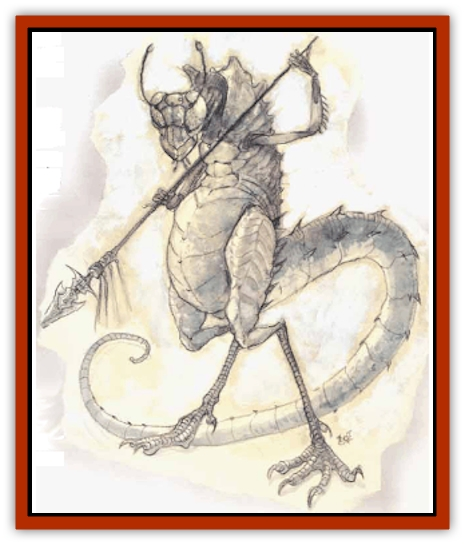

# Baatezu - Greater - Gelugon

| Statistic | **Baatezu, Greater, Gelugon** |
| --- | --- |
| **Activity Cycle:** | Any |
| **Alignment:** | Lawful evil |
| **Armor Class:** | -3 |
| **Climate/Terrain:** | Baator (Caina) |
| **Damage/Attack:** | 1d4+4/1d4+4/2d4+4/3d4+4 (Strength bonus) |
| **Diet:** | Carnivore |
| **Frequency:** | Rare |
| **Hit Dice:** | 11 |
| **Intelligence:** | Genius (17-18) |
| **Magic Resistance:** | 50% |
| **Morale:** | Champion (15-16) |
| **Movement:** | 15 |
| **No. Appearing:** | 1-8 |
| **No. of Attacks:** | 4 |
| **Organization:** | Solitary |
| **Size:** | H (12' tall) |
| **Special Attacks:** | Tail freeze, fear |
| **Special Defenses:** | Regeneration, +2 weapons to hit |
| **THAC0:** | 9 |
| **Treasure:** | A,W |
| **XP Value:** | 19,000 |

Gelugons are ferocious [[Baatezu_General_Information|baatezu]] that live in frigid Caina. They look alien, with 12-foot insectlike bodies, claws on hands and feet, and sharp pincers at the mouth. Their heads bulge with multifaceted eyes. The gelugon has a long, thick tail covered with razor-sharp spikes.

**Combat:** Gelugons are extremely strong, with 18/76 Strength (+4 damage adjustment). They attack four times per round with their two claws (1d4 points of damage), pincers (2d4 points), and tail (3d4 points and paralysis) instead of weapons. The tail radiates cold like the wind of Caina itself: the victim must save vs. paralyzation or be paralyzed by numbing cold for 1d6 rounds. The gelugon may direct each of its four attacks against a different opponent.

One in four gelugons carries a long spear (2d6 points of damage plus Strength bonus). Those struck by the spear must save vs. paralyzation or be numbed by cold (*slow* for 2d4 rounds).

In addition to those available to all baatezu, the gelugon can use these spell-like powers: *detect invisibility* (always active), *detect magic*, *fly*, *polymorph self*,  and *wall of ice*. They can attempt to *gate* in 2 to 12 [[Baatezu_Lesser_Barbazu|barbazu]] (50% chance, once per day), 2 to 8 [[Baatezu_Lesser_Osyluth|osyluth]] (35% chance, once per day), and 1 to 2 gelugons (20% chance, once per day). Because gelugons guard the front of Baator's lowest layer, there is a 25% chance that a pit fiend comes to aid them if the gelugons are losing in combat.

Gelugons can see perfectly in total darkness, and regenerate 2 hit points per round. They radiate *fear* in a 1 foot radius (save vs. rod, staff, wand or flee in panic for 1 melee rounds).

**Habitat/Society:** Second in power and station only to the [[Baatezu_Greater_Pit_Fiend|pit fiends]], gelugons are the guardians of Caina, the frigid eighth layer of Baator. Because Caina is a single layer away from the heart of Baator, the pit fiends have placed great trust in the gelugons.

Gelugons are the only baatezu native to Caina. Although other varieties of baatezu occasionally come to this cold place, they dislike it and prefer the hotter layers. Gelugons are unique in baatezu society in that they both lead and serve in their layer's armies. It is unknown how they choose their leaders.

The only portal to the fortress of Malsheem on Nessus, the lowest layer of Baator, lies at the bottom of a deep pit in Caina, guarded at all times by 9,999 gelugons.

**Ecology:** Wholly unnatural creatures, gelugons can only be created by promotion from lower stations.

When a gelugon has performed well, it may be promoted to pit fiend. Such promotion is difficult: First, the gelugon must serve flawlessly for 777 years. Any blemish on its record eliminates it from the promotion list. But 777 years of perfect service is the easy part. If the gelugon is selected to become a pit fiend, it enters the Pit of Flame, where it is tormented for 1,001 days. After almost three years of hideous, painful torture, the former gelugon emerges as a pit fiend.

---
## Discovery & Documentation

**Source Publication:** MC8 Outer Planes Appendix (1990)
**Campaign Setting:** Planescape
**Author(s):** Timothy B. Brown, Jamie LaFountain

### Other Creatures Found in This Source Book
   * [[Aasimon_Agathinon|Aasimon, Agathinon]]
   * [[Aasimon_Deva|Aasimon, Deva]]
   * [[Aasimon_Light|Aasimon, Light]]
   * [[Aasimon_General_Information|Aasimon, General Information]]
   * [[Aasimon_Planetar|Aasimon, Planetar]]
   * [[Aasimon_Solar|Aasimon, Solar]]
   * [[Air_Sentinel|Air Sentinel]]
   * [[Animal_Lord|Animal Lord]]
   * [[Archon|Archon]]
   * [[Baatezu_Lesser_Abishai|Baatezu, Lesser, Abishai]]
   * [[Baatezu_Greater_Amnizu|Baatezu, Greater, Amnizu]]
   * [[Baatezu_Lesser_Barbazu|Baatezu, Lesser, Barbazu]]
   * [[Baatezu_Greater_Cornugon|Baatezu, Greater, Cornugon]]
   * [[Baatezu_Lesser_Erinyes|Baatezu, Lesser, Erinyes]]
   * [[Baatezu_General_Information|Baatezu, General Information]]
   * [[Baatezu_Lesser_Hamatula|Baatezu, Lesser, Hamatula]]
   * [[Baatezu_Lemure|Baatezu, Lemure]]
   * [[Baatezu_Least_Nupperibo|Baatezu, Least, Nupperibo]]
   * [[Baatezu_Lesser_Osyluth|Baatezu, Lesser, Osyluth]]
   * [[Baatezu_Greater_Pit_Fiend|Baatezu, Greater, Pit Fiend]]
   * [[Baatezu_Least_Spinagon|Baatezu, Least, Spinagon]]
   * [[Balaena|Balaena]]
   * [[Bariaur|Bariaur]]
   * [[Bebilith|Bebilith]]
   * [[Bodak|Bodak]]
   * [[Dog_Moon|Dog, Moon]]
   * [[Dragon_Adamantite|Dragon, Adamantite]]
   * [[Einheriar|Einheriar]]
   * [[Gehreleth|Gehreleth]]
   * [[Githyanki|Githyanki]]
   * [[Githzerai|Githzerai]]
   * [[Hordling|Hordling]]
   * [[Lammasu_Celestial|Lammasu, Celestial]]
   * [[Larva|Larva]]
   * [[Maelephant|Maelephant]]
   * [[Marut|Marut]]
   * [[Mediator|Mediator]]
   * [[Mortai|Mortai]]
   * [[Night_Hag|Night Hag]]
   * [[Nightmare|Nightmare]]
   * [[Noctral|Noctral]]
   * [[Per|Per]]
   * [[Phoenix|Phoenix]]
   * [[Slaad|Slaad]]
   * [[Tanar'ri_Greater_Babau|Tanar'ri, Greater, Babau]]
   * [[Tanar'ri_Greater_Chasme|Tanar'ri, Greater, Chasme]]
   * [[Tanar'ri_Greater_Nabassu|Tanar'ri, Greater, Nabassu]]
   * [[Tanar'ri_Least_Dretch|Tanar'ri, Least, Dretch]]
   * [[Tanar'ri_Least_Manes|Tanar'ri, Least, Manes]]
   * [[Tanar'ri_Least_Rutterkin|Tanar'ri, Least, Rutterkin]]
   * [[Tanar'ri_Lesser_Alu-Fiend|Tanar'ri, Lesser, Alu-Fiend]]
   * [[Tanar'ri_Lesser_Bar-Lgura|Tanar'ri, Lesser, Bar-Lgura]]
   * [[Tanar'ri_Lesser_Cambion|Tanar'ri, Lesser, Cambion]]
   * [[Tanar'ri_Lesser_Succubus|Tanar'ri, Lesser, Succubus]]
   * [[Tanar'ri_Guardian_Molydeus|Tanar'ri, Guardian, Molydeus]]
   * [[Tanar'ri_General_Information|Tanar'ri, General Information]]
   * [[Tanar'ri_True_Balor|Tanar'ri, True, Balor]]
   * [[Tanar'ri_True_Glabrezu|Tanar'ri, True, Glabrezu]]
   * [[Tanar'ri_True_Hezrou|Tanar'ri, True, Hezrou]]
   * [[Tanar'ri_True_Marilith|Tanar'ri, True, Marilith]]
   * [[Tanar'ri_True_Nalfeshnee|Tanar'ri, True, Nalfeshnee]]
   * [[Tanar'ri_True_Vrock|Tanar'ri, True, Vrock]]
   * [[Titan|Titan]]
   * [[Translator|Translator]]
   * [[T'uen-rin|T'uen-rin]]
   * [[Vaporighu|Vaporighu]]
   * [[Warden_Beast|Warden Beast]]
   * [[Yugoloth_Greater_Arcanaloth|Yugoloth, Greater, Arcanaloth]]
   * [[Yugoloth_Lesser_Dergoloth|Yugoloth, Lesser, Dergoloth]]
   * [[Yugoloth_Lesser_Hydroloth|Yugoloth, Lesser, Hydroloth]]
   * [[Yugoloth_General_Information|Yugoloth, General Information]]
   * [[Yugoloth_Lesser_Mezzoloth|Yugoloth, Lesser, Mezzoloth]]
   * [[Yugoloth_Greater_Nycaloth|Yugoloth, Greater, Nycaloth]]
   * [[Yugoloth_Lesser_Piscoloth|Yugoloth, Lesser, Piscoloth]]
   * [[Yugoloth_Greater_Ultroloth|Yugoloth, Greater, Ultroloth]]
   * [[Yugoloth_Lesser_Yagnoloth|Yugoloth, Lesser, Yagnoloth]]
   * [[Zoveri|Zoveri]]
