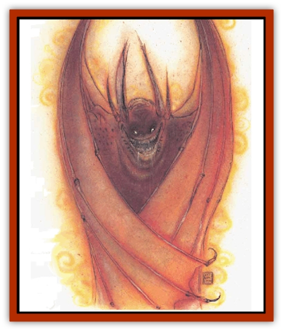

# Baatezu - Greater - Pit Fiend

| Statistic | **Baatezu, Greater, Pit Fiend** |
| --- | --- |
| **Activity Cycle:** | Any |
| **Alignment:** | Lawful evil |
| **Armor Class:** | -5 |
| **Climate/Terrain:** | Baator |
| **Damage/Attack:** | 1d4/1d4/1d6/1d6/2d6/2d4 or weapon +6 (Strength bonus) |
| **Diet:** | Carnivore |
| **Frequency:** | Very rare |
| **Hit Dice:** | 13 |
| **Intelligence:** | Genius (17-18) |
| **Magic Resistance:** | 50% |
| **Morale:** | Fearless (19-20) |
| **Movement:** | 15, Fl 24 (C) |
| **No. Appearing:** | 1-4 |
| **No. of Attacks:** | 6 |
| **Organization:** | Solitary |
| **Size:** | L (12' tall) |
| **Special Attacks:** | Fear, poison, tail constriction |
| **Special Defenses:** | Regeneration, +3 weapons to hit |
| **THAC0:** | 7 |
| **Treasure:** | G,W |
| **XP Value:** | 21,000 |

The most terrible [[Baatezu_General_Information|baatezu]], pit fiends are giant winged humanoids, gargoylish in appearance, with huge bat-wings that can wrap around their body in defense, large fangs that drip with vile, green liquid, and hulking red, scaly bodies that burst into flame when thev are angered or excited.

**Combat:** : No baatezu is more terrifying in combat than a pit fiend. The pit fiend uses its 18/00 Strength (+6 damage adjustment) to attack six times per round, dividing its attacks among up to six different opponents if necessary. It can attack with two hard, scaly wing buffets (1d4 points of damage each), powerful claws (1d6 points), and a bite (2d6 points and poison; save vs. poison or die in 1d4 rounds). The bite also infects the victim with a disease, whether or not he saves against the poison.

Pit fiends can also attack with their tail every round (2d4 points of damage). The tail can then hold and constrict the victim for 2d4 points of damage per round until the victim makes a successful Strength check to break free. Pit fiends also carry jagged-toothed clubs which inflict 1d6+1 points of damage; this replaces one claw attack.

In addition to those magical abilities inherent to all baatezu, a pit fiend can use one of the following spell-like powers once per round: *detect magic*, *detect invisibility*, *fireball*, *hold person*, *improved invisibility*, *polymorph self*, *produce flame*, *pyrotechnics*, and *wall of fire*, Once per year, a pit fiend can cast a *wish* spell. Once per round, it may automatically *gate* in two lesser baatezu or one greater baatezu. Once per day, a pit fiend can use a *symbol of pain*; the victim must save vs. rod, staff, or wand or suffer a -4 penalty on attack rolls and a -2 penalty to Dexterity for 2d10 rounds.

Pit fiends regenerate 2 hit points per round. They radiate a powerful *fear* aura in a 20-foot radius (save versus rod, staff, or wand at a -3 penalty or flee in panic for 1d10 rounds).

**Habitat/Society:** Pit fiends are the lords of Baator, the baatezu with the greatest power and station. Pit fiends are found throughout Baator, but are very rare on the upper layers and in the frigid cold of Caina, the eighth layer. Pit fiends are very rare on Avernus, Dis, and Minauros. They are rare on phlegethos, Stygia, Malbolge, and Maladomini. In the fearful realm of Nessus, the pit fiends are common.

Wherever they are, pit fiends wield enormous power. They lead legions of dozens of complete armies into battle against the tanar'ri. These huge forces are terrifying to behold, and any non-native of the Lower Planes of less than 10 Hit Dice who sees them flees in panic for 1 to 3 days. Those of 10 Hit Dice and greater must save vs. rod, staff, or wand or flee in panic for 1d12 turns.

It is rumored that pit fiends are not the most powerful beings in Baator, but themselves servants of some greater power. If there are greater beings in Baator, certainly they are powerful enough to hide their presence from mere mortal sages.

**Ecology:** Pit fiends are spawned from the powerful [[Baatezu_Greater_Gelugon|gelugons]] of Baator's eighth layer. When gelugons are found worthy, they are cast into the Pit of Flame for 1,001 days. They emerge as pit fiends.

---
## Discovery & Documentation

**Source Publication:** MC8 Outer Planes Appendix (1990)
**Campaign Setting:** Planescape
**Author(s):** Timothy B. Brown, Jamie LaFountain

### Other Creatures Found in This Source Book
   * [[Aasimon_Agathinon|Aasimon, Agathinon]]
   * [[Aasimon_Deva|Aasimon, Deva]]
   * [[Aasimon_Light|Aasimon, Light]]
   * [[Aasimon_General_Information|Aasimon, General Information]]
   * [[Aasimon_Planetar|Aasimon, Planetar]]
   * [[Aasimon_Solar|Aasimon, Solar]]
   * [[Air_Sentinel|Air Sentinel]]
   * [[Animal_Lord|Animal Lord]]
   * [[Archon|Archon]]
   * [[Baatezu_Lesser_Abishai|Baatezu, Lesser, Abishai]]
   * [[Baatezu_Greater_Amnizu|Baatezu, Greater, Amnizu]]
   * [[Baatezu_Lesser_Barbazu|Baatezu, Lesser, Barbazu]]
   * [[Baatezu_Greater_Cornugon|Baatezu, Greater, Cornugon]]
   * [[Baatezu_Lesser_Erinyes|Baatezu, Lesser, Erinyes]]
   * [[Baatezu_General_Information|Baatezu, General Information]]
   * [[Baatezu_Greater_Gelugon|Baatezu, Greater, Gelugon]]
   * [[Baatezu_Lesser_Hamatula|Baatezu, Lesser, Hamatula]]
   * [[Baatezu_Lemure|Baatezu, Lemure]]
   * [[Baatezu_Least_Nupperibo|Baatezu, Least, Nupperibo]]
   * [[Baatezu_Lesser_Osyluth|Baatezu, Lesser, Osyluth]]
   * [[Baatezu_Least_Spinagon|Baatezu, Least, Spinagon]]
   * [[Balaena|Balaena]]
   * [[Bariaur|Bariaur]]
   * [[Bebilith|Bebilith]]
   * [[Bodak|Bodak]]
   * [[Dog_Moon|Dog, Moon]]
   * [[Dragon_Adamantite|Dragon, Adamantite]]
   * [[Einheriar|Einheriar]]
   * [[Gehreleth|Gehreleth]]
   * [[Githyanki|Githyanki]]
   * [[Githzerai|Githzerai]]
   * [[Hordling|Hordling]]
   * [[Lammasu_Celestial|Lammasu, Celestial]]
   * [[Larva|Larva]]
   * [[Maelephant|Maelephant]]
   * [[Marut|Marut]]
   * [[Mediator|Mediator]]
   * [[Mortai|Mortai]]
   * [[Night_Hag|Night Hag]]
   * [[Nightmare|Nightmare]]
   * [[Noctral|Noctral]]
   * [[Per|Per]]
   * [[Phoenix|Phoenix]]
   * [[Slaad|Slaad]]
   * [[Tanar'ri_Greater_Babau|Tanar'ri, Greater, Babau]]
   * [[Tanar'ri_Greater_Chasme|Tanar'ri, Greater, Chasme]]
   * [[Tanar'ri_Greater_Nabassu|Tanar'ri, Greater, Nabassu]]
   * [[Tanar'ri_Least_Dretch|Tanar'ri, Least, Dretch]]
   * [[Tanar'ri_Least_Manes|Tanar'ri, Least, Manes]]
   * [[Tanar'ri_Least_Rutterkin|Tanar'ri, Least, Rutterkin]]
   * [[Tanar'ri_Lesser_Alu-Fiend|Tanar'ri, Lesser, Alu-Fiend]]
   * [[Tanar'ri_Lesser_Bar-Lgura|Tanar'ri, Lesser, Bar-Lgura]]
   * [[Tanar'ri_Lesser_Cambion|Tanar'ri, Lesser, Cambion]]
   * [[Tanar'ri_Lesser_Succubus|Tanar'ri, Lesser, Succubus]]
   * [[Tanar'ri_Guardian_Molydeus|Tanar'ri, Guardian, Molydeus]]
   * [[Tanar'ri_General_Information|Tanar'ri, General Information]]
   * [[Tanar'ri_True_Balor|Tanar'ri, True, Balor]]
   * [[Tanar'ri_True_Glabrezu|Tanar'ri, True, Glabrezu]]
   * [[Tanar'ri_True_Hezrou|Tanar'ri, True, Hezrou]]
   * [[Tanar'ri_True_Marilith|Tanar'ri, True, Marilith]]
   * [[Tanar'ri_True_Nalfeshnee|Tanar'ri, True, Nalfeshnee]]
   * [[Tanar'ri_True_Vrock|Tanar'ri, True, Vrock]]
   * [[Titan|Titan]]
   * [[Translator|Translator]]
   * [[T'uen-rin|T'uen-rin]]
   * [[Vaporighu|Vaporighu]]
   * [[Warden_Beast|Warden Beast]]
   * [[Yugoloth_Greater_Arcanaloth|Yugoloth, Greater, Arcanaloth]]
   * [[Yugoloth_Lesser_Dergoloth|Yugoloth, Lesser, Dergoloth]]
   * [[Yugoloth_Lesser_Hydroloth|Yugoloth, Lesser, Hydroloth]]
   * [[Yugoloth_General_Information|Yugoloth, General Information]]
   * [[Yugoloth_Lesser_Mezzoloth|Yugoloth, Lesser, Mezzoloth]]
   * [[Yugoloth_Greater_Nycaloth|Yugoloth, Greater, Nycaloth]]
   * [[Yugoloth_Lesser_Piscoloth|Yugoloth, Lesser, Piscoloth]]
   * [[Yugoloth_Greater_Ultroloth|Yugoloth, Greater, Ultroloth]]
   * [[Yugoloth_Lesser_Yagnoloth|Yugoloth, Lesser, Yagnoloth]]
   * [[Zoveri|Zoveri]]
