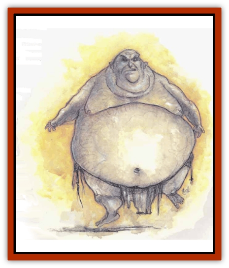

# Baatezu - Least - Nupperibo

| Statistic | **Baatezu, Least, Nupperibo** |
| --- | --- |
| **Activity Cycle:** | Any |
| **Alignment:** | Lawful evil |
| **Armor Class:** | 9 |
| **Climate/Terrain:** | Baator |
| **Damage/Attack:** | 1d2/1d2 or by weapon |
| **Diet:** | None |
| **Frequency:** | Common |
| **Hit Dice:** | 1 |
| **Intelligence:** | Non- (0) |
| **Magic Resistance:** | Nil |
| **Morale:** | See below |
| **Movement:** | 6 |
| **No. Appearing:** | 1-100 |
| **No. of Attacks:** | 2 or 1 (by weapon) |
| **Organization:** | Army |
| **Size:** | M (5' tall) |
| **Special Attacks:** | Nil |
| **Special Defenses:** | Regeneration |
| **THAC0:** | 19 |
| **Treasure:** | Nil |
| **XP Value:** | 120 |

Nupperibos are [[Baatezu_General_Information|baatezu]] petitioners, slightly higher in station than the lemures. They are lowly and woeful beings, used as fighting, feeding, and tormenting stock by all baatezu from the pit fiends on down.

Nupperibos are much like [[Baatezu_Lemure|lemures]] in appearance, but are even less defined than those creatures. Nupperibos are amorphous, vaguely humanoid monsters with no discernible features. They have appendages that might be construed as arms and head.

Nupperibos are blind, deaf, and mute.

**Combat:** Nupperibos, like lemures, attack any nonbaatezu they encounter in Baator, heedless of their own safety. They need never check morale, for they fight until destroyed.

A nupperibo attacks with two claws (1d2 points of damage each). When they form armies, they receive weapons, though seldom anything better than a club. In these cases, they do damage as per weapon type.

They regenerate 1 hit point per round in Baatao or any other lower plane. Any piece of a nupperibo including its burnt ashes, regenerates. Only holy water, a holy sword, or other sanctified weapon can destroyone permanently.

The mindless nupperibos are immune to all mind-affecting spells such as *charm person* or illusions. Of the special powers common to all baatezu, nupperibos use *cause fear*, and that only under orders and when at least 10 nupperibo all attack the same defender.

**Habitat/Society:** Nupperibos exist by the hundreds of thousands on the first and second layers of Baator. They are remanants of lawful evil creatures not sufficiently malign to become lemures. Nupperibos readily obey all commands from superiors in order to lessen their torment, and thus are accorded a slightly higher station than lemures; they are considered least baatezu.

There is, however, a unique and curious relationship between the lemures and the nupperibos. The nupperibos are slightly higher in station than the lemures, hut they can never become higher forms of baatezu without first being demoted to lemure status. Doubtless some greater power in Baator has set the advancement path that way for its own fiendish reasons.

Nupperibos are commonly used as trading stock to the [[Yugoloth_General_Information|yugoloths]] in return for their mercenary services. Like the baatezu, the yugoloths treat the nupperibos horribly and ultimately consume them.

**Ecology:** Nupperibos have no intelligence, but are sensitive to mental commands from stronger baatezu and never disobey those commands.

When a nupperibo is destroyed, it reforms into another nupperibo. However, there is a 1% chance that it becomes a lemure. Although this means a reduction in station (however slight), it also means a chance to become a [[Baatezu_Least_Spinagon|spinagon]] in the future.

Whether left in Baator or traded to yugolotbs, nupperibos lead a completely wretched existence. Lower planar creatures consider them insignificant.

---
## Discovery & Documentation

**Source Publication:** MC8 Outer Planes Appendix (1990)
**Campaign Setting:** Planescape
**Author(s):** Timothy B. Brown, Jamie LaFountain

### Other Creatures Found in This Source Book
   * [[Aasimon_Agathinon|Aasimon, Agathinon]]
   * [[Aasimon_Deva|Aasimon, Deva]]
   * [[Aasimon_Light|Aasimon, Light]]
   * [[Aasimon_General_Information|Aasimon, General Information]]
   * [[Aasimon_Planetar|Aasimon, Planetar]]
   * [[Aasimon_Solar|Aasimon, Solar]]
   * [[Air_Sentinel|Air Sentinel]]
   * [[Animal_Lord|Animal Lord]]
   * [[Archon|Archon]]
   * [[Baatezu_Lesser_Abishai|Baatezu, Lesser, Abishai]]
   * [[Baatezu_Greater_Amnizu|Baatezu, Greater, Amnizu]]
   * [[Baatezu_Lesser_Barbazu|Baatezu, Lesser, Barbazu]]
   * [[Baatezu_Greater_Cornugon|Baatezu, Greater, Cornugon]]
   * [[Baatezu_Lesser_Erinyes|Baatezu, Lesser, Erinyes]]
   * [[Baatezu_General_Information|Baatezu, General Information]]
   * [[Baatezu_Greater_Gelugon|Baatezu, Greater, Gelugon]]
   * [[Baatezu_Lesser_Hamatula|Baatezu, Lesser, Hamatula]]
   * [[Baatezu_Lemure|Baatezu, Lemure]]
   * [[Baatezu_Lesser_Osyluth|Baatezu, Lesser, Osyluth]]
   * [[Baatezu_Greater_Pit_Fiend|Baatezu, Greater, Pit Fiend]]
   * [[Baatezu_Least_Spinagon|Baatezu, Least, Spinagon]]
   * [[Balaena|Balaena]]
   * [[Bariaur|Bariaur]]
   * [[Bebilith|Bebilith]]
   * [[Bodak|Bodak]]
   * [[Dog_Moon|Dog, Moon]]
   * [[Dragon_Adamantite|Dragon, Adamantite]]
   * [[Einheriar|Einheriar]]
   * [[Gehreleth|Gehreleth]]
   * [[Githyanki|Githyanki]]
   * [[Githzerai|Githzerai]]
   * [[Hordling|Hordling]]
   * [[Lammasu_Celestial|Lammasu, Celestial]]
   * [[Larva|Larva]]
   * [[Maelephant|Maelephant]]
   * [[Marut|Marut]]
   * [[Mediator|Mediator]]
   * [[Mortai|Mortai]]
   * [[Night_Hag|Night Hag]]
   * [[Nightmare|Nightmare]]
   * [[Noctral|Noctral]]
   * [[Per|Per]]
   * [[Phoenix|Phoenix]]
   * [[Slaad|Slaad]]
   * [[Tanar'ri_Greater_Babau|Tanar'ri, Greater, Babau]]
   * [[Tanar'ri_Greater_Chasme|Tanar'ri, Greater, Chasme]]
   * [[Tanar'ri_Greater_Nabassu|Tanar'ri, Greater, Nabassu]]
   * [[Tanar'ri_Least_Dretch|Tanar'ri, Least, Dretch]]
   * [[Tanar'ri_Least_Manes|Tanar'ri, Least, Manes]]
   * [[Tanar'ri_Least_Rutterkin|Tanar'ri, Least, Rutterkin]]
   * [[Tanar'ri_Lesser_Alu-Fiend|Tanar'ri, Lesser, Alu-Fiend]]
   * [[Tanar'ri_Lesser_Bar-Lgura|Tanar'ri, Lesser, Bar-Lgura]]
   * [[Tanar'ri_Lesser_Cambion|Tanar'ri, Lesser, Cambion]]
   * [[Tanar'ri_Lesser_Succubus|Tanar'ri, Lesser, Succubus]]
   * [[Tanar'ri_Guardian_Molydeus|Tanar'ri, Guardian, Molydeus]]
   * [[Tanar'ri_General_Information|Tanar'ri, General Information]]
   * [[Tanar'ri_True_Balor|Tanar'ri, True, Balor]]
   * [[Tanar'ri_True_Glabrezu|Tanar'ri, True, Glabrezu]]
   * [[Tanar'ri_True_Hezrou|Tanar'ri, True, Hezrou]]
   * [[Tanar'ri_True_Marilith|Tanar'ri, True, Marilith]]
   * [[Tanar'ri_True_Nalfeshnee|Tanar'ri, True, Nalfeshnee]]
   * [[Tanar'ri_True_Vrock|Tanar'ri, True, Vrock]]
   * [[Titan|Titan]]
   * [[Translator|Translator]]
   * [[T'uen-rin|T'uen-rin]]
   * [[Vaporighu|Vaporighu]]
   * [[Warden_Beast|Warden Beast]]
   * [[Yugoloth_Greater_Arcanaloth|Yugoloth, Greater, Arcanaloth]]
   * [[Yugoloth_Lesser_Dergoloth|Yugoloth, Lesser, Dergoloth]]
   * [[Yugoloth_Lesser_Hydroloth|Yugoloth, Lesser, Hydroloth]]
   * [[Yugoloth_General_Information|Yugoloth, General Information]]
   * [[Yugoloth_Lesser_Mezzoloth|Yugoloth, Lesser, Mezzoloth]]
   * [[Yugoloth_Greater_Nycaloth|Yugoloth, Greater, Nycaloth]]
   * [[Yugoloth_Lesser_Piscoloth|Yugoloth, Lesser, Piscoloth]]
   * [[Yugoloth_Greater_Ultroloth|Yugoloth, Greater, Ultroloth]]
   * [[Yugoloth_Lesser_Yagnoloth|Yugoloth, Lesser, Yagnoloth]]
   * [[Zoveri|Zoveri]]
