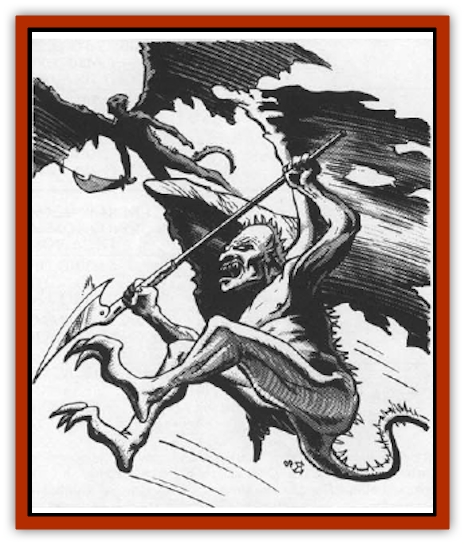

# Baatezu - Least - Spinagon

| Statistic | **Baatezu, Least, Spinagon** |
| --- | --- |
| **Activity Cycle:** | Any |
| **Alignment:** | Lawful evil |
| **Armor Class:** | 4 |
| **Climate/Terrain:** | Baator |
| **Damage/Attack:** | 1d4/1d4/by weapon |
| **Diet:** | Carnivore |
| **Frequency:** | Common |
| **Hit Dice:** | 3+3 |
| **Intelligence:** | Average to very (8-12) |
| **Magic Resistance:** | 15% |
| **Morale:** | Average (8-10) |
| **Movement:** | 6, Fl 18 (C) |
| **No. Appearing:** | 1 or 1-3 |
| **No. of Attacks:** | 3 |
| **Organization:** | Solitary |
| **Size:** | S (3' tall) |
| **Special Attacks:** | Flame spikes |
| **Special Defenses:** | See below |
| **THAC0:** | 17 |
| **Treasure:** | Nil |
| **XP Value:** | 3,000 |

Spinagons, the smallest [[Baatezu_General_Information|baatezu]], look like [[Gargoyle_I|gargoyles]] - small humanoids with wings and a spiked tail. They carry small military forks or other nasty weapons. Spinagons have long, razor-sharp talons on their feet.

**Combat:** Spinagons avoid combat, preferring to flee and alert more powerful baatezu. However, spinagons carry a small military fork (use javelin statistics; 1d6 points of damage). In flight, the spinagon can also rake with the claws on its feet (1d4 points of damage apiece).

Small spikes and spines protrude from the spinagon's body. In combat the spinagon can launch up to 12 of these spikes as projectiles while in flight, two per round. The spikes burst into flame when launched, causing flammable materials to ignite on contact. For purposes of range and damage, treat a spinagon's spikes as darts. The spinagon can hurl itself at a target and wound it with 1d4 spikes (1d3 points of damage each); they hit automatically and are not used up, but the spinagon cannot otherwise attack that round.

Although they do not have the spell-like abilities common to other baatezu, spinagons can use the spell-like powers *affect normal fires*, *change self*, *command*, *produce flame*, *scare*, and *stinking cloud*. Once per day they can attempt to *gate* in 1 to 3 additional spinagons (35% chance of success).

**Habitat/Society:** Spinagons are common throughout the layers of Baator and plentiful in layers three through seven. They serve as messengers and lackeys for more powerful baatezu, which includes just about all of them. Spinagons are loyal messengers, seldom failing to properly deliver a letter or memorized missive. However, many baatezu scorn them as weak and ill-equipped for combat.

Indirectly, the spinagons act as scouts for Baator. Because spinagons have a vast number of messages to deliver and errands to run, they travel everywhere in the plane. If these wretched, cowardly creatures discover intruders, they fly off to call a more powerful baatezu. They do not attack or fight unless cornered and unable to barter their way out. A spinagon might even compromise its message to avoid combat.

Spinagons herd [[Baatezu_Lemure|lemures]] and [[Baatezu_Least_Nupperibo|nupperibos]] and marshall them into large armies for more powerful baatezu. A greater baatezu that wants to form its army quickly for an upcoming battle treats the spinagons with respect.

**Ecology:** Spinagons, though lowly, gain status quickly by gathering armies for greater baatezu. Often less influential baatezu get their armies last, whereas the more important baatezu get theirs immediately. Because of this, spinagons are subject to abuse and threats by middle-level baatezu disappointed with their performance.

Baator is a strange place, ruled by a perverse discipline that simultaneously encourages both structured behavior and treachery. But stranger still is the advancement process of the spinagon. When a spinagon advances, those it has served decide how much advancement the spinagon receives. Therefore, if a spinagon serves a [[Baatezu_Greater_Gelugon|gelugon]] well, it may be promoted as high as [[Baatezu_Greater_Amnizu|amnizu]]. Stories tell of the [[Baatezu_Greater_Pit_Fiend|pit fiend]] Greth advancing a spinagon to a [[Baatezu_Lesser_Hamatula|hamatula]].

---
## Discovery & Documentation

**Source Publication:** MC8 Outer Planes Appendix (1990)
**Campaign Setting:** Planescape
**Author(s):** Timothy B. Brown, Jamie LaFountain

### Other Creatures Found in This Source Book
   * [[Aasimon_Agathinon|Aasimon, Agathinon]]
   * [[Aasimon_Deva|Aasimon, Deva]]
   * [[Aasimon_Light|Aasimon, Light]]
   * [[Aasimon_General_Information|Aasimon, General Information]]
   * [[Aasimon_Planetar|Aasimon, Planetar]]
   * [[Aasimon_Solar|Aasimon, Solar]]
   * [[Air_Sentinel|Air Sentinel]]
   * [[Animal_Lord|Animal Lord]]
   * [[Archon|Archon]]
   * [[Baatezu_Lesser_Abishai|Baatezu, Lesser, Abishai]]
   * [[Baatezu_Greater_Amnizu|Baatezu, Greater, Amnizu]]
   * [[Baatezu_Lesser_Barbazu|Baatezu, Lesser, Barbazu]]
   * [[Baatezu_Greater_Cornugon|Baatezu, Greater, Cornugon]]
   * [[Baatezu_Lesser_Erinyes|Baatezu, Lesser, Erinyes]]
   * [[Baatezu_General_Information|Baatezu, General Information]]
   * [[Baatezu_Greater_Gelugon|Baatezu, Greater, Gelugon]]
   * [[Baatezu_Lesser_Hamatula|Baatezu, Lesser, Hamatula]]
   * [[Baatezu_Lemure|Baatezu, Lemure]]
   * [[Baatezu_Least_Nupperibo|Baatezu, Least, Nupperibo]]
   * [[Baatezu_Lesser_Osyluth|Baatezu, Lesser, Osyluth]]
   * [[Baatezu_Greater_Pit_Fiend|Baatezu, Greater, Pit Fiend]]
   * [[Balaena|Balaena]]
   * [[Bariaur|Bariaur]]
   * [[Bebilith|Bebilith]]
   * [[Bodak|Bodak]]
   * [[Dog_Moon|Dog, Moon]]
   * [[Dragon_Adamantite|Dragon, Adamantite]]
   * [[Einheriar|Einheriar]]
   * [[Gehreleth|Gehreleth]]
   * [[Githyanki|Githyanki]]
   * [[Githzerai|Githzerai]]
   * [[Hordling|Hordling]]
   * [[Lammasu_Celestial|Lammasu, Celestial]]
   * [[Larva|Larva]]
   * [[Maelephant|Maelephant]]
   * [[Marut|Marut]]
   * [[Mediator|Mediator]]
   * [[Mortai|Mortai]]
   * [[Night_Hag|Night Hag]]
   * [[Nightmare|Nightmare]]
   * [[Noctral|Noctral]]
   * [[Per|Per]]
   * [[Phoenix|Phoenix]]
   * [[Slaad|Slaad]]
   * [[Tanar'ri_Greater_Babau|Tanar'ri, Greater, Babau]]
   * [[Tanar'ri_Greater_Chasme|Tanar'ri, Greater, Chasme]]
   * [[Tanar'ri_Greater_Nabassu|Tanar'ri, Greater, Nabassu]]
   * [[Tanar'ri_Least_Dretch|Tanar'ri, Least, Dretch]]
   * [[Tanar'ri_Least_Manes|Tanar'ri, Least, Manes]]
   * [[Tanar'ri_Least_Rutterkin|Tanar'ri, Least, Rutterkin]]
   * [[Tanar'ri_Lesser_Alu-Fiend|Tanar'ri, Lesser, Alu-Fiend]]
   * [[Tanar'ri_Lesser_Bar-Lgura|Tanar'ri, Lesser, Bar-Lgura]]
   * [[Tanar'ri_Lesser_Cambion|Tanar'ri, Lesser, Cambion]]
   * [[Tanar'ri_Lesser_Succubus|Tanar'ri, Lesser, Succubus]]
   * [[Tanar'ri_Guardian_Molydeus|Tanar'ri, Guardian, Molydeus]]
   * [[Tanar'ri_General_Information|Tanar'ri, General Information]]
   * [[Tanar'ri_True_Balor|Tanar'ri, True, Balor]]
   * [[Tanar'ri_True_Glabrezu|Tanar'ri, True, Glabrezu]]
   * [[Tanar'ri_True_Hezrou|Tanar'ri, True, Hezrou]]
   * [[Tanar'ri_True_Marilith|Tanar'ri, True, Marilith]]
   * [[Tanar'ri_True_Nalfeshnee|Tanar'ri, True, Nalfeshnee]]
   * [[Tanar'ri_True_Vrock|Tanar'ri, True, Vrock]]
   * [[Titan|Titan]]
   * [[Translator|Translator]]
   * [[T'uen-rin|T'uen-rin]]
   * [[Vaporighu|Vaporighu]]
   * [[Warden_Beast|Warden Beast]]
   * [[Yugoloth_Greater_Arcanaloth|Yugoloth, Greater, Arcanaloth]]
   * [[Yugoloth_Lesser_Dergoloth|Yugoloth, Lesser, Dergoloth]]
   * [[Yugoloth_Lesser_Hydroloth|Yugoloth, Lesser, Hydroloth]]
   * [[Yugoloth_General_Information|Yugoloth, General Information]]
   * [[Yugoloth_Lesser_Mezzoloth|Yugoloth, Lesser, Mezzoloth]]
   * [[Yugoloth_Greater_Nycaloth|Yugoloth, Greater, Nycaloth]]
   * [[Yugoloth_Lesser_Piscoloth|Yugoloth, Lesser, Piscoloth]]
   * [[Yugoloth_Greater_Ultroloth|Yugoloth, Greater, Ultroloth]]
   * [[Yugoloth_Lesser_Yagnoloth|Yugoloth, Lesser, Yagnoloth]]
   * [[Zoveri|Zoveri]]
