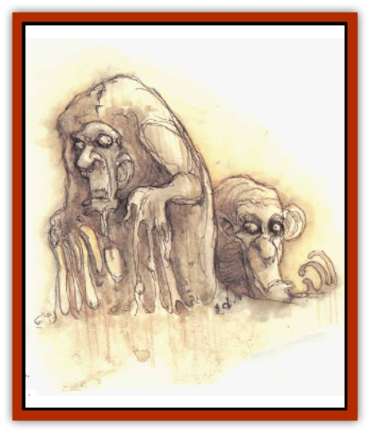

# Baatezu - Lemure

| Statistic | **Baatezu, Lemure** |
| --- | --- |
| **Activity Cycle:** | Any |
| **Alignment:** | Lawful evil |
| **Armor Class:** | 7 |
| **Climate/Terrain:** | Baator |
| **Damage/Attack:** | 1-3 |
| **Diet:** | Carnivore |
| **Frequency:** | Common |
| **Hit Dice:** | 2 |
| **Intelligence:** | Semi- (2-4) |
| **Magic Resistance:** | Nil |
| **Morale:** | See below |
| **Movement:** | 3 |
| **No. Appearing:** | 10-100 |
| **No. of Attacks:** | 1 |
| **Organization:** | Horde |
| **Size:** | M (5' tall) |
| **Special Attacks:** | Battle drive |
| **Special Defenses:** | Regeneration |
| **THAC0:** | 19 |
| **Treasure:** | Nil |
| **XP Value:** | 120 |

The lowliest denizens of Baator, lernures are grotesque, disfigured blobs of molten flesh, with a vaguely humanoid torso and head. Their faces are equally unrecognizable, with twisted, melted features molded into permanent expressions of horrid anguish. Sometimes, lemures display some slight vestige of their mortal life: a facial feature, nervous twitch, or a small shred of clothing. However, these fragments of their former lives become less and less apparent as the lemure passes its tortured, wretched existence as the weakest [[Baatezu_General_Information|baatezu]] in Baator. Lemures have no minds and no means of communicating.

**Combat:** Unless ordered otherwise, lemures relentlessly attack anything except another baatezu, regardless of danger. They never check morale.

In combat, they claw for 1d3 points of damage. Their main strength is in their large numbers. Lemures attack in wave after wave, dozens of them, until they either wear down more powerful opponents or are destroyed.

Lemures have no mind of their own, so they are immune to any mind-affecting spells such as *charm person* or illusions. They do not, however, have the spell-like abilities common to other baatezu.

Lemures regenerate 1 hit point per melee round. Any piece of a lemure, even its burnt ashes, regenerates until the creature is whole again. The only way to permanently destroy lemures is with holy water, a holy sword, or other holy item.

In desperate battles when success is more important than huge losses, baatezu leaders initiate a fearsome battle drive, a wedge formation of 1,000 or more lemures. On command from a superior, the lemures march slowly, mindlessly toward their destination. As they arrive, the lemure are invariably cut down by the dozens. Oblivious, they attack with +2 to their attack rolls. Eventually, the sheer number of lemures prevails, but they commonly see 70 to 90% casualties.

**Habitat/Society:** Lemures are wretched creatures, forever tormented by the other baatezu. Their existence is both dismal and insignificant.

They wander the first two layers of Baator in large hordes, avoiding other haatezu and relentlessly attacking intruders. Sages believe there are infinite numbers of lemures on Baator.

**Ecology:** Occasionally a lemure is selected to form a [[Baatezu_Least_Spinagon|spinagon]], a least baatezu. This is done randomly, and is not based on merit, although sometimes, for the pleasure of the baatezu involved, more than one lemure is selected for such a promotion. The mindless lemures are pitted against each other in a brutal fight to the death. Winners of such a fight are either promoted to spinagons or slaughtered outright, depending on their entertainment value. Lemures are occasionally transformed into [[Wraith|wraiths]] or [[Spectre|spectres]], as well. Other baatezu consider the lemures beneath notice.

---
## Discovery & Documentation

**Source Publication:** MC8 Outer Planes Appendix (1990)
**Campaign Setting:** Planescape
**Author(s):** Timothy B. Brown, Jamie LaFountain

### Other Creatures Found in This Source Book
   * [[Aasimon_Agathinon|Aasimon, Agathinon]]
   * [[Aasimon_Deva|Aasimon, Deva]]
   * [[Aasimon_Light|Aasimon, Light]]
   * [[Aasimon_General_Information|Aasimon, General Information]]
   * [[Aasimon_Planetar|Aasimon, Planetar]]
   * [[Aasimon_Solar|Aasimon, Solar]]
   * [[Air_Sentinel|Air Sentinel]]
   * [[Animal_Lord|Animal Lord]]
   * [[Archon|Archon]]
   * [[Baatezu_Lesser_Abishai|Baatezu, Lesser, Abishai]]
   * [[Baatezu_Greater_Amnizu|Baatezu, Greater, Amnizu]]
   * [[Baatezu_Lesser_Barbazu|Baatezu, Lesser, Barbazu]]
   * [[Baatezu_Greater_Cornugon|Baatezu, Greater, Cornugon]]
   * [[Baatezu_Lesser_Erinyes|Baatezu, Lesser, Erinyes]]
   * [[Baatezu_General_Information|Baatezu, General Information]]
   * [[Baatezu_Greater_Gelugon|Baatezu, Greater, Gelugon]]
   * [[Baatezu_Lesser_Hamatula|Baatezu, Lesser, Hamatula]]
   * [[Baatezu_Least_Nupperibo|Baatezu, Least, Nupperibo]]
   * [[Baatezu_Lesser_Osyluth|Baatezu, Lesser, Osyluth]]
   * [[Baatezu_Greater_Pit_Fiend|Baatezu, Greater, Pit Fiend]]
   * [[Baatezu_Least_Spinagon|Baatezu, Least, Spinagon]]
   * [[Balaena|Balaena]]
   * [[Bariaur|Bariaur]]
   * [[Bebilith|Bebilith]]
   * [[Bodak|Bodak]]
   * [[Dog_Moon|Dog, Moon]]
   * [[Dragon_Adamantite|Dragon, Adamantite]]
   * [[Einheriar|Einheriar]]
   * [[Gehreleth|Gehreleth]]
   * [[Githyanki|Githyanki]]
   * [[Githzerai|Githzerai]]
   * [[Hordling|Hordling]]
   * [[Lammasu_Celestial|Lammasu, Celestial]]
   * [[Larva|Larva]]
   * [[Maelephant|Maelephant]]
   * [[Marut|Marut]]
   * [[Mediator|Mediator]]
   * [[Mortai|Mortai]]
   * [[Night_Hag|Night Hag]]
   * [[Nightmare|Nightmare]]
   * [[Noctral|Noctral]]
   * [[Per|Per]]
   * [[Phoenix|Phoenix]]
   * [[Slaad|Slaad]]
   * [[Tanar'ri_Greater_Babau|Tanar'ri, Greater, Babau]]
   * [[Tanar'ri_Greater_Chasme|Tanar'ri, Greater, Chasme]]
   * [[Tanar'ri_Greater_Nabassu|Tanar'ri, Greater, Nabassu]]
   * [[Tanar'ri_Least_Dretch|Tanar'ri, Least, Dretch]]
   * [[Tanar'ri_Least_Manes|Tanar'ri, Least, Manes]]
   * [[Tanar'ri_Least_Rutterkin|Tanar'ri, Least, Rutterkin]]
   * [[Tanar'ri_Lesser_Alu-Fiend|Tanar'ri, Lesser, Alu-Fiend]]
   * [[Tanar'ri_Lesser_Bar-Lgura|Tanar'ri, Lesser, Bar-Lgura]]
   * [[Tanar'ri_Lesser_Cambion|Tanar'ri, Lesser, Cambion]]
   * [[Tanar'ri_Lesser_Succubus|Tanar'ri, Lesser, Succubus]]
   * [[Tanar'ri_Guardian_Molydeus|Tanar'ri, Guardian, Molydeus]]
   * [[Tanar'ri_General_Information|Tanar'ri, General Information]]
   * [[Tanar'ri_True_Balor|Tanar'ri, True, Balor]]
   * [[Tanar'ri_True_Glabrezu|Tanar'ri, True, Glabrezu]]
   * [[Tanar'ri_True_Hezrou|Tanar'ri, True, Hezrou]]
   * [[Tanar'ri_True_Marilith|Tanar'ri, True, Marilith]]
   * [[Tanar'ri_True_Nalfeshnee|Tanar'ri, True, Nalfeshnee]]
   * [[Tanar'ri_True_Vrock|Tanar'ri, True, Vrock]]
   * [[Titan|Titan]]
   * [[Translator|Translator]]
   * [[T'uen-rin|T'uen-rin]]
   * [[Vaporighu|Vaporighu]]
   * [[Warden_Beast|Warden Beast]]
   * [[Yugoloth_Greater_Arcanaloth|Yugoloth, Greater, Arcanaloth]]
   * [[Yugoloth_Lesser_Dergoloth|Yugoloth, Lesser, Dergoloth]]
   * [[Yugoloth_Lesser_Hydroloth|Yugoloth, Lesser, Hydroloth]]
   * [[Yugoloth_General_Information|Yugoloth, General Information]]
   * [[Yugoloth_Lesser_Mezzoloth|Yugoloth, Lesser, Mezzoloth]]
   * [[Yugoloth_Greater_Nycaloth|Yugoloth, Greater, Nycaloth]]
   * [[Yugoloth_Lesser_Piscoloth|Yugoloth, Lesser, Piscoloth]]
   * [[Yugoloth_Greater_Ultroloth|Yugoloth, Greater, Ultroloth]]
   * [[Yugoloth_Lesser_Yagnoloth|Yugoloth, Lesser, Yagnoloth]]
   * [[Zoveri|Zoveri]]
