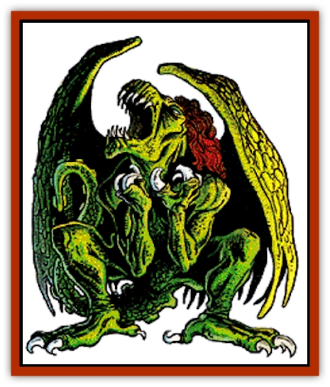

# Baatezu - Lesser - Abishai

| Statistic | **Black** | **Green** | **Red** |
| --- | --- | --- | --- |
| **Activity Cycle:** | Any | Any | Any |
| **Alignment:** | Lawful evil | Lawful evil | Lawful evil |
| **Armor Class:** | 5 | 3 | 1 |
| **Climate/Terrain:** | Baator | Baator | Baator |
| **Damage/Attack:** | 1d4/1d4/1d4+1 | 1d4/1d4/1d4+1 | 1d4/1d4/1d4+1 |
| **Diet:** | Carnivore | Carnivore | Carnivore |
| **Frequency:** | Common | Common | Common |
| **Hit Dice:** | 4+1 | 5+2 | 6+3 |
| **Intelligence:** | Average (8-10) | Average (8-10) | Average (8-10) |
| **Magic Resistance:** | 30% | 30% | 30% |
| **Morale:** | Average (8-10) | Average (8-10) | Steady (11-12) |
| **Movement:** | 9, Fl 12 (C) | 9, Fl 12 (C) | 9, Fl 12 (C) |
| **No. Appearing:** | 2-20 | 2-8 | 1 |
| **No. of Attacks:** | 3 | 3 | 3 |
| **Organization:** | Solitary | Solitary | Solitary |
| **Size:** | L (8' tall) | L (7' tall) | M (6' tall) |
| **Special Attacks:** | Poison, dive | Poison, dive | Poison, dive |
| **Special Defenses:** | +1 or better weapons to hit, regeneration | + 1 or better weapons to hit, regeneration | +1 or better weapons to hit, regeneration |
| **THAC0:** | 17 | 15 | 13 |
| **Treasure:** | Nil | Nil | Nil |
| **XP Value:** | 7,000 | 8,000 | 9,000 |

Abishai are common to the first and second layers of Baator. They look like gothic [[Gargoyle_I|gargoyles]], thin and reptilian, with long, prehensile tails and large wings. The three varieties of abishai have different skin colors - in ascending order of station, black, green, and red. All have a vinegary smell and rasping voices. The air seems to warm perceptibly in their presence.

**Combat:** In battle, the abishai strikes with two claws (1d4 points of damage each) and its flexible tail (1d4 + 1 points of damage and poison; note that the poison is fatal unless a successful save vs. poison is made).

Abishai can fly high into the air and dive at their enemies, striking with both claws. They attack at +2, and a hit does double damage (2d4 points per claw).

In addition to the powers of all baatezu, an abishai can *change self*, *command*, *produce flame*, *pyrotechnics*, and *scare*.

Once per day they can attempt to *gate* in 2 to 12 [[Baatezu_Lemure|lemures]] (60% chance of success) or 1 to 3 abishai (30% chance).

Abishai are susceptible to holy water (2d4 points of damage per vial). They regenerate 1 hit point per round unless the damage is done by holy water or a holy magical weapon.

**Habitat/Society:** Abishai are voracious and evil. They delight in tormenting those few baatezu lower in station than themselves. Abishai tempt mortals bold enough to travel to Baator by using their *change self* and *charm person* abilities to impersonate more powerful baatezu.

**Ecology:** The abishai make up large, evil armies that fight the [[Tanar'ri_General_Information|tanar'ri]] and intruders into Baator. In some cases, a red abishai may prove worthy enough to command a force of lemures. If successful, the red abishai may be promoted to a higher form of [[Baatezu_General_Information|baatezu]].

As part of their efforts to corrupt mortals, abishai like to bestow powerful magic on inexperienced wizards. Usually the low-level spellcaster cannot control these enormous energies, and chaos and destruction result.

---
## Discovery & Documentation

**Source Publication:** MC8 Outer Planes Appendix (1990)
**Campaign Setting:** Planescape
**Author(s):** Timothy B. Brown, Jamie LaFountain

### Other Creatures Found in This Source Book
   * [[Aasimon_Agathinon|Aasimon, Agathinon]]
   * [[Aasimon_Deva|Aasimon, Deva]]
   * [[Aasimon_Light|Aasimon, Light]]
   * [[Aasimon_General_Information|Aasimon, General Information]]
   * [[Aasimon_Planetar|Aasimon, Planetar]]
   * [[Aasimon_Solar|Aasimon, Solar]]
   * [[Air_Sentinel|Air Sentinel]]
   * [[Animal_Lord|Animal Lord]]
   * [[Archon|Archon]]
   * [[Baatezu_Greater_Amnizu|Baatezu, Greater, Amnizu]]
   * [[Baatezu_Lesser_Barbazu|Baatezu, Lesser, Barbazu]]
   * [[Baatezu_Greater_Cornugon|Baatezu, Greater, Cornugon]]
   * [[Baatezu_Lesser_Erinyes|Baatezu, Lesser, Erinyes]]
   * [[Baatezu_General_Information|Baatezu, General Information]]
   * [[Baatezu_Greater_Gelugon|Baatezu, Greater, Gelugon]]
   * [[Baatezu_Lesser_Hamatula|Baatezu, Lesser, Hamatula]]
   * [[Baatezu_Lemure|Baatezu, Lemure]]
   * [[Baatezu_Least_Nupperibo|Baatezu, Least, Nupperibo]]
   * [[Baatezu_Lesser_Osyluth|Baatezu, Lesser, Osyluth]]
   * [[Baatezu_Greater_Pit_Fiend|Baatezu, Greater, Pit Fiend]]
   * [[Baatezu_Least_Spinagon|Baatezu, Least, Spinagon]]
   * [[Balaena|Balaena]]
   * [[Bariaur|Bariaur]]
   * [[Bebilith|Bebilith]]
   * [[Bodak|Bodak]]
   * [[Dog_Moon|Dog, Moon]]
   * [[Dragon_Adamantite|Dragon, Adamantite]]
   * [[Einheriar|Einheriar]]
   * [[Gehreleth|Gehreleth]]
   * [[Githyanki|Githyanki]]
   * [[Githzerai|Githzerai]]
   * [[Hordling|Hordling]]
   * [[Lammasu_Celestial|Lammasu, Celestial]]
   * [[Larva|Larva]]
   * [[Maelephant|Maelephant]]
   * [[Marut|Marut]]
   * [[Mediator|Mediator]]
   * [[Mortai|Mortai]]
   * [[Night_Hag|Night Hag]]
   * [[Nightmare|Nightmare]]
   * [[Noctral|Noctral]]
   * [[Per|Per]]
   * [[Phoenix|Phoenix]]
   * [[Slaad|Slaad]]
   * [[Tanar'ri_Greater_Babau|Tanar'ri, Greater, Babau]]
   * [[Tanar'ri_Greater_Chasme|Tanar'ri, Greater, Chasme]]
   * [[Tanar'ri_Greater_Nabassu|Tanar'ri, Greater, Nabassu]]
   * [[Tanar'ri_Least_Dretch|Tanar'ri, Least, Dretch]]
   * [[Tanar'ri_Least_Manes|Tanar'ri, Least, Manes]]
   * [[Tanar'ri_Least_Rutterkin|Tanar'ri, Least, Rutterkin]]
   * [[Tanar'ri_Lesser_Alu-Fiend|Tanar'ri, Lesser, Alu-Fiend]]
   * [[Tanar'ri_Lesser_Bar-Lgura|Tanar'ri, Lesser, Bar-Lgura]]
   * [[Tanar'ri_Lesser_Cambion|Tanar'ri, Lesser, Cambion]]
   * [[Tanar'ri_Lesser_Succubus|Tanar'ri, Lesser, Succubus]]
   * [[Tanar'ri_Guardian_Molydeus|Tanar'ri, Guardian, Molydeus]]
   * [[Tanar'ri_General_Information|Tanar'ri, General Information]]
   * [[Tanar'ri_True_Balor|Tanar'ri, True, Balor]]
   * [[Tanar'ri_True_Glabrezu|Tanar'ri, True, Glabrezu]]
   * [[Tanar'ri_True_Hezrou|Tanar'ri, True, Hezrou]]
   * [[Tanar'ri_True_Marilith|Tanar'ri, True, Marilith]]
   * [[Tanar'ri_True_Nalfeshnee|Tanar'ri, True, Nalfeshnee]]
   * [[Tanar'ri_True_Vrock|Tanar'ri, True, Vrock]]
   * [[Titan|Titan]]
   * [[Translator|Translator]]
   * [[T'uen-rin|T'uen-rin]]
   * [[Vaporighu|Vaporighu]]
   * [[Warden_Beast|Warden Beast]]
   * [[Yugoloth_Greater_Arcanaloth|Yugoloth, Greater, Arcanaloth]]
   * [[Yugoloth_Lesser_Dergoloth|Yugoloth, Lesser, Dergoloth]]
   * [[Yugoloth_Lesser_Hydroloth|Yugoloth, Lesser, Hydroloth]]
   * [[Yugoloth_General_Information|Yugoloth, General Information]]
   * [[Yugoloth_Lesser_Mezzoloth|Yugoloth, Lesser, Mezzoloth]]
   * [[Yugoloth_Greater_Nycaloth|Yugoloth, Greater, Nycaloth]]
   * [[Yugoloth_Lesser_Piscoloth|Yugoloth, Lesser, Piscoloth]]
   * [[Yugoloth_Greater_Ultroloth|Yugoloth, Greater, Ultroloth]]
   * [[Yugoloth_Lesser_Yagnoloth|Yugoloth, Lesser, Yagnoloth]]
   * [[Zoveri|Zoveri]]
