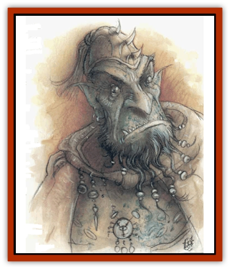

# Baatezu - Lesser - Barbazu

| Statistic | **Baatezu, Lesser, Barbazu** |
| --- | --- |
| **Activity Cycle:** | Any |
| **Alignment:** | Lawful evil |
| **Armor Class:** | 3 |
| **Climate/Terrain:** | Baator |
| **Damage/Attack:** | 1d2/1d2/1d8 or 2d6 (weapon) |
| **Diet:** | Carnivore |
| **Frequency:** | Common |
| **Hit Dice:** | 6+6 |
| **Intelligence:** | Low (5-7) |
| **Magic Resistance:** | 30% |
| **Morale:** | Steady (11-12) |
| **Movement:** | 15 |
| **No. Appearing:** | 20-100 |
| **No. of Attacks:** | 3 or 1 (weapon) |
| **Organization:** | Military |
| **Size:** | M (6' tall) |
| **Special Attacks:** | Glaive, disease, battle frenzy |
| **Special Defenses:** | +1 weapon to hit |
| **THAC0:** | 13 |
| **Treasure:** | Nil |
| **XP Value:** | 6,000 |

The barbazu are the vilest soldiers in Baator, employed in large numbers as elite shock troops. A barbazu is a foul, humanoid creature with a long tail, clawed hands and feet, pointed ears, and a snaky, disgusting beard. Its skin is moist, though scaly like a reptile. It carries a cruel, saw-toothed glaive capable of heavy damage.

**Combat:** The barbazu are the most violent [[Baatezu_General_Information|baatezu]], taking advantage of any excuse to attack. This makes them unpopular and subject to frequent, harsh discipline, but by the same token they make excellent shock troops. Deployed in large armies sometimes numbering in the thousands, barbazu guard the middle layers of Baator and launch devastating attacks against the [[Tanar'ri_General_Information|tanar'ri]]. They also make popular guards for personal treasure or demesnes of the more powerful baatezu.

The barbazu attacks with a saw-toothed glaive (2d6 points of damage, and wound bleeds for 2 points of damage each round until wound is bound or victim dies). Bleeding glaive wounds are cumulative (2 points of damage per round per wound). The barbazu can attack with two claws (1d2 points of damage each) and its wirelike beard (1d8 points of damage). If both claws hit, the beard automatically hits for maximum damage. Also, when the beard hits, there is a 25% chance the victim contracts a disease from the foul attack.

A barbazu can use the following spell-like powers, in addition to those available to all baatezu: *affect normal fires*, *command*, *fear* (by touch), and *produce flame*. Once per day the barbazu can also attempt to *gate* in 2 to 12 [[Baatezu_Lesser_Abishai|abishai]] (50% chance of success) or 1 to 6 additional barbazu (35% chance).

Barbazu are subject to a battle frenzy. In combat a group of barbazu is 10% likely per melee round to go berserk. The roll is cumulative per melee round, so that it they are 20% likely to go berserk on the second round, 30% on the third, and so forth. They stay berserk until combat ceases. While berserk, the barbazu need not make morale checks. They attack twice as many times per round at +2 on attack rolls and damage dice. Their Armor Class, however, takes a +3 penalty.

**Habitat/Society:** The barbazu are bred for battle. All other denizens of Baator recognize their exceeding cruelty and extreme value in combat. Barbazu rush into combat and often do not stop until either they or their opponent is dead. Perhaps the most impetuous and chaotic of the baatezu, they have gained a bad reputation among outsiders.

Although barbazu are lesser baatezu, they never command armies. They are simply too chaotic to lead. Sometimes an exceptional barbazu is promoted to [[Baatezu_Lesser_Osyluth|osyluth]], but most never survive to see promotion.

**Ecology:** The barbazu fill the armies of Baator's middle layers and commonly guard greater baatezu. They do not fight out of loyalty or comraderie, but rather out of their violent need to hurt and kill.

---
## Discovery & Documentation

**Source Publication:** MC8 Outer Planes Appendix (1990)
**Campaign Setting:** Planescape
**Author(s):** Timothy B. Brown, Jamie LaFountain

### Other Creatures Found in This Source Book
   * [[Aasimon_Agathinon|Aasimon, Agathinon]]
   * [[Aasimon_Deva|Aasimon, Deva]]
   * [[Aasimon_Light|Aasimon, Light]]
   * [[Aasimon_General_Information|Aasimon, General Information]]
   * [[Aasimon_Planetar|Aasimon, Planetar]]
   * [[Aasimon_Solar|Aasimon, Solar]]
   * [[Air_Sentinel|Air Sentinel]]
   * [[Animal_Lord|Animal Lord]]
   * [[Archon|Archon]]
   * [[Baatezu_Lesser_Abishai|Baatezu, Lesser, Abishai]]
   * [[Baatezu_Greater_Amnizu|Baatezu, Greater, Amnizu]]
   * [[Baatezu_Greater_Cornugon|Baatezu, Greater, Cornugon]]
   * [[Baatezu_Lesser_Erinyes|Baatezu, Lesser, Erinyes]]
   * [[Baatezu_General_Information|Baatezu, General Information]]
   * [[Baatezu_Greater_Gelugon|Baatezu, Greater, Gelugon]]
   * [[Baatezu_Lesser_Hamatula|Baatezu, Lesser, Hamatula]]
   * [[Baatezu_Lemure|Baatezu, Lemure]]
   * [[Baatezu_Least_Nupperibo|Baatezu, Least, Nupperibo]]
   * [[Baatezu_Lesser_Osyluth|Baatezu, Lesser, Osyluth]]
   * [[Baatezu_Greater_Pit_Fiend|Baatezu, Greater, Pit Fiend]]
   * [[Baatezu_Least_Spinagon|Baatezu, Least, Spinagon]]
   * [[Balaena|Balaena]]
   * [[Bariaur|Bariaur]]
   * [[Bebilith|Bebilith]]
   * [[Bodak|Bodak]]
   * [[Dog_Moon|Dog, Moon]]
   * [[Dragon_Adamantite|Dragon, Adamantite]]
   * [[Einheriar|Einheriar]]
   * [[Gehreleth|Gehreleth]]
   * [[Githyanki|Githyanki]]
   * [[Githzerai|Githzerai]]
   * [[Hordling|Hordling]]
   * [[Lammasu_Celestial|Lammasu, Celestial]]
   * [[Larva|Larva]]
   * [[Maelephant|Maelephant]]
   * [[Marut|Marut]]
   * [[Mediator|Mediator]]
   * [[Mortai|Mortai]]
   * [[Night_Hag|Night Hag]]
   * [[Nightmare|Nightmare]]
   * [[Noctral|Noctral]]
   * [[Per|Per]]
   * [[Phoenix|Phoenix]]
   * [[Slaad|Slaad]]
   * [[Tanar'ri_Greater_Babau|Tanar'ri, Greater, Babau]]
   * [[Tanar'ri_Greater_Chasme|Tanar'ri, Greater, Chasme]]
   * [[Tanar'ri_Greater_Nabassu|Tanar'ri, Greater, Nabassu]]
   * [[Tanar'ri_Least_Dretch|Tanar'ri, Least, Dretch]]
   * [[Tanar'ri_Least_Manes|Tanar'ri, Least, Manes]]
   * [[Tanar'ri_Least_Rutterkin|Tanar'ri, Least, Rutterkin]]
   * [[Tanar'ri_Lesser_Alu-Fiend|Tanar'ri, Lesser, Alu-Fiend]]
   * [[Tanar'ri_Lesser_Bar-Lgura|Tanar'ri, Lesser, Bar-Lgura]]
   * [[Tanar'ri_Lesser_Cambion|Tanar'ri, Lesser, Cambion]]
   * [[Tanar'ri_Lesser_Succubus|Tanar'ri, Lesser, Succubus]]
   * [[Tanar'ri_Guardian_Molydeus|Tanar'ri, Guardian, Molydeus]]
   * [[Tanar'ri_General_Information|Tanar'ri, General Information]]
   * [[Tanar'ri_True_Balor|Tanar'ri, True, Balor]]
   * [[Tanar'ri_True_Glabrezu|Tanar'ri, True, Glabrezu]]
   * [[Tanar'ri_True_Hezrou|Tanar'ri, True, Hezrou]]
   * [[Tanar'ri_True_Marilith|Tanar'ri, True, Marilith]]
   * [[Tanar'ri_True_Nalfeshnee|Tanar'ri, True, Nalfeshnee]]
   * [[Tanar'ri_True_Vrock|Tanar'ri, True, Vrock]]
   * [[Titan|Titan]]
   * [[Translator|Translator]]
   * [[T'uen-rin|T'uen-rin]]
   * [[Vaporighu|Vaporighu]]
   * [[Warden_Beast|Warden Beast]]
   * [[Yugoloth_Greater_Arcanaloth|Yugoloth, Greater, Arcanaloth]]
   * [[Yugoloth_Lesser_Dergoloth|Yugoloth, Lesser, Dergoloth]]
   * [[Yugoloth_Lesser_Hydroloth|Yugoloth, Lesser, Hydroloth]]
   * [[Yugoloth_General_Information|Yugoloth, General Information]]
   * [[Yugoloth_Lesser_Mezzoloth|Yugoloth, Lesser, Mezzoloth]]
   * [[Yugoloth_Greater_Nycaloth|Yugoloth, Greater, Nycaloth]]
   * [[Yugoloth_Lesser_Piscoloth|Yugoloth, Lesser, Piscoloth]]
   * [[Yugoloth_Greater_Ultroloth|Yugoloth, Greater, Ultroloth]]
   * [[Yugoloth_Lesser_Yagnoloth|Yugoloth, Lesser, Yagnoloth]]
   * [[Zoveri|Zoveri]]
