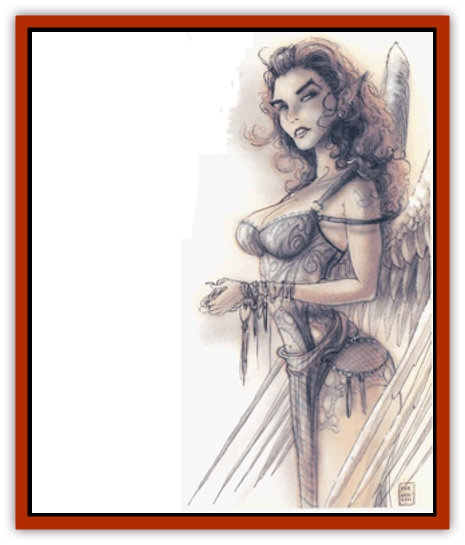

# Baatezu - Lesser - Erinyes

| Statistic | **Baatezu, Lesser, Erinyes** |
| --- | --- |
| **Activity Cycle:** | Any |
| **Alignment:** | Lawful evil |
| **Armor Class:** | 2 |
| **Climate/Terrain:** | Baator |
| **Damage/Attack:** | By weapon |
| **Diet:** | Carnivore |
| **Frequency:** | Uncommon |
| **Hit Dice:** | 6+6 |
| **Intelligence:** | High (13-14) |
| **Magic Resistance:** | 30% |
| **Morale:** | Steady (11-12) |
| **Movement:** | 12, Fl 21 (C) |
| **No. Appearing:** | 1 |
| **No. of Attacks:** | 1 |
| **Organization:** | Solitary |
| **Size:** | M (6' tall) |
| **Special Attacks:** | Charm, fear, rope of entanglement |
| **Special Defenses:** | +1 weapons to hit |
| **THAC0:** | 13 |
| **Treasure:** | See below |
| **XP Value:** | 7,000 |

Erinyes, most unusual of the [[Baatezu_General_Information|baatezu]], do not appear gruesome or disgusting but attractive, a fitting characteristic considering their mission. Erinyes are female, but can look like mortal men or women of any race, and always the most perfect physical specimens. They cannot, however, pass for mortals, for their huge, feathery wings mark them as denizens of Baator.

Erinyes can communicate through telepathy, but prefer direct speech when luring mortals. They can speak any known language.

**Combat:** Erinyes prefer to use powers rather than fight physically, but they can wield any weapon with proficiency. An erinyes can *cause fear* in any creature that looks upon it. The victim must save vs. rod, staff, or wand or flee in panic for 1d6 rounds. Erinyes carry a *rope of entanglement* that they use in combat or to bind unsuspecting victims.

Erinyes possess a powerful *charm person* ability that works against any target the erinyes looks on within 60 feet, even if the victim does not look back. The victim must immediately save vs. spells as if half his current level. For example, an 8th-level warrior would save as though he were 4th level. Failure means the victim becomes completely loyal to the erinyes and does anything to protect and obey it, even when that means the death of the victim or loved ones. Fortunately for mortal beings, an erinyes can only charm one person at a time. The effects of the charm last until the erinyes releases the victim or dies.

In addition to those available to all baatezu, an erinyes can use the spell-like powers detect invisibility, invisibility, locate object, polymorph self, and produce flame. Once per day it can attempt to gate in either 1 to 8 [[Baatezu_Least_Spinagon|spinagons]] (50% chance) or 1 to 4 [[Baatezu_Lesser_Barbazu|barbazu]] (35% chance).

**Habitat/Society:** Cunning and evil, the solitary erinyes have the special duty among the baatezu of tempting mortals. Even though the erinyes are lesser baatezu, they report directly to the Dark Eight outside the normal chain of command.

Only 500 erinyes exist at any one time. Lesser baatezu are promoted to fill out their numbers.

As tempters, the erinyes can do something no other baatezu can do, not even the pit fiends: enter the Prime Material Plane unsummoned. There it tries, through its *charm person* power and its comely form to lure mortals back to Baator. They cannot bring anyone or anything with them when they pass into the Prime Material Plane, and they can only bring one person back when they return. They cannot bring hack inorganic matter, so victims arrive in Baator without possessions.

Mortals so trapped are doomed to die in the inhuman plains of Baator unless their own strength can save them. A mortal who dies this way becomes a [[Baatezu_Lemure|lemure]] and serves forever as a soldier of Baator. Because of this power to tempt and doom mortals, most baatezu respect the erinyes.

**Ecology:** Unlike other baatezu, the erinyes often refuse promotion from their station. Many do not wish to give up the special status afforded to them and return to the routine ranks of Baator.

---
## Discovery & Documentation

**Source Publication:** MC8 Outer Planes Appendix (1990)
**Campaign Setting:** Planescape
**Author(s):** Timothy B. Brown, Jamie LaFountain

### Other Creatures Found in This Source Book
   * [[Aasimon_Agathinon|Aasimon, Agathinon]]
   * [[Aasimon_Deva|Aasimon, Deva]]
   * [[Aasimon_Light|Aasimon, Light]]
   * [[Aasimon_General_Information|Aasimon, General Information]]
   * [[Aasimon_Planetar|Aasimon, Planetar]]
   * [[Aasimon_Solar|Aasimon, Solar]]
   * [[Air_Sentinel|Air Sentinel]]
   * [[Animal_Lord|Animal Lord]]
   * [[Archon|Archon]]
   * [[Baatezu_Lesser_Abishai|Baatezu, Lesser, Abishai]]
   * [[Baatezu_Greater_Amnizu|Baatezu, Greater, Amnizu]]
   * [[Baatezu_Lesser_Barbazu|Baatezu, Lesser, Barbazu]]
   * [[Baatezu_Greater_Cornugon|Baatezu, Greater, Cornugon]]
   * [[Baatezu_General_Information|Baatezu, General Information]]
   * [[Baatezu_Greater_Gelugon|Baatezu, Greater, Gelugon]]
   * [[Baatezu_Lesser_Hamatula|Baatezu, Lesser, Hamatula]]
   * [[Baatezu_Lemure|Baatezu, Lemure]]
   * [[Baatezu_Least_Nupperibo|Baatezu, Least, Nupperibo]]
   * [[Baatezu_Lesser_Osyluth|Baatezu, Lesser, Osyluth]]
   * [[Baatezu_Greater_Pit_Fiend|Baatezu, Greater, Pit Fiend]]
   * [[Baatezu_Least_Spinagon|Baatezu, Least, Spinagon]]
   * [[Balaena|Balaena]]
   * [[Bariaur|Bariaur]]
   * [[Bebilith|Bebilith]]
   * [[Bodak|Bodak]]
   * [[Dog_Moon|Dog, Moon]]
   * [[Dragon_Adamantite|Dragon, Adamantite]]
   * [[Einheriar|Einheriar]]
   * [[Gehreleth|Gehreleth]]
   * [[Githyanki|Githyanki]]
   * [[Githzerai|Githzerai]]
   * [[Hordling|Hordling]]
   * [[Lammasu_Celestial|Lammasu, Celestial]]
   * [[Larva|Larva]]
   * [[Maelephant|Maelephant]]
   * [[Marut|Marut]]
   * [[Mediator|Mediator]]
   * [[Mortai|Mortai]]
   * [[Night_Hag|Night Hag]]
   * [[Nightmare|Nightmare]]
   * [[Noctral|Noctral]]
   * [[Per|Per]]
   * [[Phoenix|Phoenix]]
   * [[Slaad|Slaad]]
   * [[Tanar'ri_Greater_Babau|Tanar'ri, Greater, Babau]]
   * [[Tanar'ri_Greater_Chasme|Tanar'ri, Greater, Chasme]]
   * [[Tanar'ri_Greater_Nabassu|Tanar'ri, Greater, Nabassu]]
   * [[Tanar'ri_Least_Dretch|Tanar'ri, Least, Dretch]]
   * [[Tanar'ri_Least_Manes|Tanar'ri, Least, Manes]]
   * [[Tanar'ri_Least_Rutterkin|Tanar'ri, Least, Rutterkin]]
   * [[Tanar'ri_Lesser_Alu-Fiend|Tanar'ri, Lesser, Alu-Fiend]]
   * [[Tanar'ri_Lesser_Bar-Lgura|Tanar'ri, Lesser, Bar-Lgura]]
   * [[Tanar'ri_Lesser_Cambion|Tanar'ri, Lesser, Cambion]]
   * [[Tanar'ri_Lesser_Succubus|Tanar'ri, Lesser, Succubus]]
   * [[Tanar'ri_Guardian_Molydeus|Tanar'ri, Guardian, Molydeus]]
   * [[Tanar'ri_General_Information|Tanar'ri, General Information]]
   * [[Tanar'ri_True_Balor|Tanar'ri, True, Balor]]
   * [[Tanar'ri_True_Glabrezu|Tanar'ri, True, Glabrezu]]
   * [[Tanar'ri_True_Hezrou|Tanar'ri, True, Hezrou]]
   * [[Tanar'ri_True_Marilith|Tanar'ri, True, Marilith]]
   * [[Tanar'ri_True_Nalfeshnee|Tanar'ri, True, Nalfeshnee]]
   * [[Tanar'ri_True_Vrock|Tanar'ri, True, Vrock]]
   * [[Titan|Titan]]
   * [[Translator|Translator]]
   * [[T'uen-rin|T'uen-rin]]
   * [[Vaporighu|Vaporighu]]
   * [[Warden_Beast|Warden Beast]]
   * [[Yugoloth_Greater_Arcanaloth|Yugoloth, Greater, Arcanaloth]]
   * [[Yugoloth_Lesser_Dergoloth|Yugoloth, Lesser, Dergoloth]]
   * [[Yugoloth_Lesser_Hydroloth|Yugoloth, Lesser, Hydroloth]]
   * [[Yugoloth_General_Information|Yugoloth, General Information]]
   * [[Yugoloth_Lesser_Mezzoloth|Yugoloth, Lesser, Mezzoloth]]
   * [[Yugoloth_Greater_Nycaloth|Yugoloth, Greater, Nycaloth]]
   * [[Yugoloth_Lesser_Piscoloth|Yugoloth, Lesser, Piscoloth]]
   * [[Yugoloth_Greater_Ultroloth|Yugoloth, Greater, Ultroloth]]
   * [[Yugoloth_Lesser_Yagnoloth|Yugoloth, Lesser, Yagnoloth]]
   * [[Zoveri|Zoveri]]
