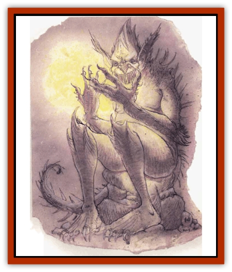

# Baatezu - Lesser - Hamatula

| Statistic | **Baatezu, Lesser, Hamatula** |
| --- | --- |
| **Activity Cycle:** | Any |
| **Alignment:** | Lawful evil |
| **Armor Class:** | 1 |
| **Climate/Terrain:** | Baator |
| **Damage/Attack:** | 2d4/2d4/3d4 |
| **Diet:** | Carnivore |
| **Frequency:** | Uncommon |
| **Hit Dice:** | 7 |
| **Intelligence:** | Very (11-12) |
| **Magic Resistance:** | 30% |
| **Morale:** | Fearless (19-20) |
| **Movement:** | 12 |
| **No. Appearing:** | 1 or 3-12 |
| **No. of Attacks:** | 3 |
| **Organization:** | Solitary |
| **Size:** | M (7' tall) |
| **Special Attacks:** | Fear, hug |
| **Special Defenses:** | +1 weapons to hit |
| **THAC0:** | 13 |
| **Treasure:** | Nil |
| **XP Value:** | 6,000 |

Hamatula are solitary patrollers of the third and fourth layers of Baator. They are large humanoids, covered from head to toe with sharp barbs right down to their long, meaty tails. Each hamatula has unusually long, sharp claws on its hands, and keen eyes that shift and dart about, giving the creature a nervous look.

**Combat:** Hamatula are guardians and patrol troops They are excellent guardians and are never surprised.

Hamatula rarely use weapons in combat, preferring to attack with two raking claws (2d4 points of damage each) and bite (3d4 points of damage). If a hamatula hits in combat with both claw attacks, it can hug its victim, impaling him on its cruel barbs (2d4 points of damage, no attack roll required). The victim is now pinned and takes 2d4 points of damage per round until released. (A hamatula that takes 15 points of damage in a single round will release its victim at the end of the round.) A victim who has 16 or greater Strength can tear free with a successful Strength check.

In addition to the magical abilities inherent to all baatezu, hamatula have the spell-like powers *affect normal fires*, *hold person*, *produce flame*, and *pyrotechnics*. Once per day they can also attempt to *gate* in either 2 to 12 [[Baatezu_Lesser_Abishai|abishai]] (50% chance) or 1 to 4 hamatula (35% chance)

Hamatula radiate *fear* upon striking an opponent for the first time. The defender must save vs. rod, staff or wand or flee in panic for 1d6 rounds.

**Habitat/Society:** Hamatula zealously patrol the third and fourth layers of Baator for intruders, knowing that promotion and increased status hinge on success.

Relatively solitary, the hamatula travel in groups only when commanded to do so by a superior. They may be deployed in a small group to investigate a report of intrusion.

On Phlegethos, the fourth layer of Baator, the [[Baatezu_Greater_Pit_Fiend|pit fiend]] Gazra lives in a crystal castle. The hamatula cast captured intruders into the cells under the castle for torture. Gazra oversees the first four layers of Baator with an army of 5,000 hamatula. Twenty hamatula with maximum hit points guard him at all times. Loyal service to their lord is the fastest way to rise in status.

**Ecology:** Unlike other [[Baatezu_General_Information|baatezu]], hamatula cannot pass from layer to layer on Baator or to other Lower Planes. Sages speculate that this ensures that the creatures do not wander from their duties.

Hamatula are doubly unique among the baatezu because only they produce a useful byproduct. A gland behind their ears produces a powerful hallucinogen that is <q>harvested</q> by greater baatezu and used to torment and interrogate prisoners. A few brave (or wealthy) sages have obtained samples of this secretion, though not enough to perform any meaningful experiments. They believe that greater quantities of this secretion could produce an extremely potent *potion of illusion*.

---
## Discovery & Documentation

**Source Publication:** MC8 Outer Planes Appendix (1990)
**Campaign Setting:** Planescape
**Author(s):** Timothy B. Brown, Jamie LaFountain

### Other Creatures Found in This Source Book
   * [[Aasimon_Agathinon|Aasimon, Agathinon]]
   * [[Aasimon_Deva|Aasimon, Deva]]
   * [[Aasimon_Light|Aasimon, Light]]
   * [[Aasimon_General_Information|Aasimon, General Information]]
   * [[Aasimon_Planetar|Aasimon, Planetar]]
   * [[Aasimon_Solar|Aasimon, Solar]]
   * [[Air_Sentinel|Air Sentinel]]
   * [[Animal_Lord|Animal Lord]]
   * [[Archon|Archon]]
   * [[Baatezu_Lesser_Abishai|Baatezu, Lesser, Abishai]]
   * [[Baatezu_Greater_Amnizu|Baatezu, Greater, Amnizu]]
   * [[Baatezu_Lesser_Barbazu|Baatezu, Lesser, Barbazu]]
   * [[Baatezu_Greater_Cornugon|Baatezu, Greater, Cornugon]]
   * [[Baatezu_Lesser_Erinyes|Baatezu, Lesser, Erinyes]]
   * [[Baatezu_General_Information|Baatezu, General Information]]
   * [[Baatezu_Greater_Gelugon|Baatezu, Greater, Gelugon]]
   * [[Baatezu_Lemure|Baatezu, Lemure]]
   * [[Baatezu_Least_Nupperibo|Baatezu, Least, Nupperibo]]
   * [[Baatezu_Lesser_Osyluth|Baatezu, Lesser, Osyluth]]
   * [[Baatezu_Greater_Pit_Fiend|Baatezu, Greater, Pit Fiend]]
   * [[Baatezu_Least_Spinagon|Baatezu, Least, Spinagon]]
   * [[Balaena|Balaena]]
   * [[Bariaur|Bariaur]]
   * [[Bebilith|Bebilith]]
   * [[Bodak|Bodak]]
   * [[Dog_Moon|Dog, Moon]]
   * [[Dragon_Adamantite|Dragon, Adamantite]]
   * [[Einheriar|Einheriar]]
   * [[Gehreleth|Gehreleth]]
   * [[Githyanki|Githyanki]]
   * [[Githzerai|Githzerai]]
   * [[Hordling|Hordling]]
   * [[Lammasu_Celestial|Lammasu, Celestial]]
   * [[Larva|Larva]]
   * [[Maelephant|Maelephant]]
   * [[Marut|Marut]]
   * [[Mediator|Mediator]]
   * [[Mortai|Mortai]]
   * [[Night_Hag|Night Hag]]
   * [[Nightmare|Nightmare]]
   * [[Noctral|Noctral]]
   * [[Per|Per]]
   * [[Phoenix|Phoenix]]
   * [[Slaad|Slaad]]
   * [[Tanar'ri_Greater_Babau|Tanar'ri, Greater, Babau]]
   * [[Tanar'ri_Greater_Chasme|Tanar'ri, Greater, Chasme]]
   * [[Tanar'ri_Greater_Nabassu|Tanar'ri, Greater, Nabassu]]
   * [[Tanar'ri_Least_Dretch|Tanar'ri, Least, Dretch]]
   * [[Tanar'ri_Least_Manes|Tanar'ri, Least, Manes]]
   * [[Tanar'ri_Least_Rutterkin|Tanar'ri, Least, Rutterkin]]
   * [[Tanar'ri_Lesser_Alu-Fiend|Tanar'ri, Lesser, Alu-Fiend]]
   * [[Tanar'ri_Lesser_Bar-Lgura|Tanar'ri, Lesser, Bar-Lgura]]
   * [[Tanar'ri_Lesser_Cambion|Tanar'ri, Lesser, Cambion]]
   * [[Tanar'ri_Lesser_Succubus|Tanar'ri, Lesser, Succubus]]
   * [[Tanar'ri_Guardian_Molydeus|Tanar'ri, Guardian, Molydeus]]
   * [[Tanar'ri_General_Information|Tanar'ri, General Information]]
   * [[Tanar'ri_True_Balor|Tanar'ri, True, Balor]]
   * [[Tanar'ri_True_Glabrezu|Tanar'ri, True, Glabrezu]]
   * [[Tanar'ri_True_Hezrou|Tanar'ri, True, Hezrou]]
   * [[Tanar'ri_True_Marilith|Tanar'ri, True, Marilith]]
   * [[Tanar'ri_True_Nalfeshnee|Tanar'ri, True, Nalfeshnee]]
   * [[Tanar'ri_True_Vrock|Tanar'ri, True, Vrock]]
   * [[Titan|Titan]]
   * [[Translator|Translator]]
   * [[T'uen-rin|T'uen-rin]]
   * [[Vaporighu|Vaporighu]]
   * [[Warden_Beast|Warden Beast]]
   * [[Yugoloth_Greater_Arcanaloth|Yugoloth, Greater, Arcanaloth]]
   * [[Yugoloth_Lesser_Dergoloth|Yugoloth, Lesser, Dergoloth]]
   * [[Yugoloth_Lesser_Hydroloth|Yugoloth, Lesser, Hydroloth]]
   * [[Yugoloth_General_Information|Yugoloth, General Information]]
   * [[Yugoloth_Lesser_Mezzoloth|Yugoloth, Lesser, Mezzoloth]]
   * [[Yugoloth_Greater_Nycaloth|Yugoloth, Greater, Nycaloth]]
   * [[Yugoloth_Lesser_Piscoloth|Yugoloth, Lesser, Piscoloth]]
   * [[Yugoloth_Greater_Ultroloth|Yugoloth, Greater, Ultroloth]]
   * [[Yugoloth_Lesser_Yagnoloth|Yugoloth, Lesser, Yagnoloth]]
   * [[Zoveri|Zoveri]]
