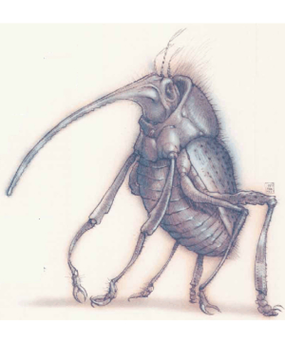

# Baatezu - Lesser - Kocrachon

| Statistic | **Baatezu, Lesser, Kocrachon** |
| --- | --- |
| **Activity Cycle:** | Any |
| **Alignment:** | Lawful evil |
| **Armor Class:** | 2 (0 if attacked from behind) |
| **Climate/Terrain:** | Baator |
| **Damage/Attack:** | 1d6/1d6/2d6 or 1d8/1d8 (weapons) |
| **Diet:** | Carnivore |
| **Frequency:** | Uncommon |
| **Hit Dice:** | 6+6 |
| **Intelligence:** | High (13) |
| **Magic Resistance:** | 30% |
| **Morale:** | Elite (14) |
| **Movement:** | 12, Fl 12 (D) |
| **No. Appearing:** | 3d6 |
| **No. of Attacks:** | 3 or 2 |
| **Organization:** | Pack |
| **Size:** | M (5' tall) |
| **Special Attacks:** | Cause disease, pain |
| **Special Defenses:** | +1 or better weapon to hit; immune to normal cold and heat |
| **THAC0:** | 13 |
| **Treasure:** | Nil |
| **XP Value:** | 5,000 |

The kocrachon is a loathsome, beetlelike fiend, with heady eyes staring out from beneath its enameled carapace. Its three antennae wave above its head, discerning subtle changes of atmosphere, sound, and smell in its environment. It has four arms and two legs; the arm end in opposable pincer-claws. A proboscis juts out from the creature's forehead, located just above its eyes. The kocrachon's wings are located underneath its shell, which parts when the fiend is ready to fly away to safety or to a new victim.

**Combat:** The kocrachon would far rather flee than fight, for its job is to cause pain and extract information rather than to serve as militia. However, when backed into a corner, this baatezu is just as deadly as any of its brethren.

The kocrachon is able to attack with only two of its four arms; this pair of claws causes 1d6 points of damage each. The other two claws, being considerably smaller, aren't strong enough to clamp on an enemy and cause damage. However, these claws are highly manipulative, and the attached arms are strong enough for the kocrachon to wield small weapons such as scalpels and knives. The [[Baatezu_General_Information|baatezu]] never uses these arms in combat if it is weaponless, but if it has some cutting instrument it causes 1d8 points of damage for each blade because of skill. Half of that damage is automatically healed in 4 hours.

Kocrachons typically make three attacks per round: their two primary claws and a bite, which causes 2d6 points of damage. If they choose to forgo this routine, they can attempt to *cause pain* with a special attack using their scalpels. By making only one attack in the round, they can lay an opponent open to the bone or find the sensitive point in the exoskeleton, depending on the race of the creature. Any being hit when a kocrachon uses this attack must save versus spell at -6 or suffer a penalty of -4 to all attack and damage rolls. In addition, the victim's AC value is reduced by 2 places, and movement by 3. These effects last for 2d6 rounds. Note that the kocrachon can only use this attack after it has studied its opponent for 3 rounds to determine where the incision would he most effective.

The kocrachon is also able to *cause disease* as per the spell. If it can bite a victim and hold on to it (a successful bend bars/lift gates roll detaches the creature) for 3 rounds, it transmits a disease to its victim; it cannot attack while infecting its victim. This disease is fatal within 1-3 weeks after transmission. Oddly, the kocrachon can instead opt to transmit a healing fluid through its bite, healing 1d12 points of damage. This baatezu can use both bites three times per day.

Kocrachons have all the standard abilities of baatezu of their rank; that is, they have the spell-like abilities *advanced illusion*, *animate dead*, *charm person*, *infravision*, *know alignment* (always active), *suggestion*, and *teleport without error*. They also have the standard baatezu immunities. However, they delight in pretending to suffer from an attack that causes no damage in order to lure their enemies closer.

**Habitat/Society:** The kocrachon is a baatezu designed primarily to inflict pain. Upon creation, however, it isn't immediately aware of this mission. Whether it is promoted or demoted to kocrachon status, the baatezu must study at the School of Pain, which is hidden underneath the Knoll of Blades in Dis, the second layer of Baator. Here, the kocrachons study the physiology of known mortal and immortal creatures - as well as the psychology of those minds. Thus, kocrachons learn how to inflict tortures both mental and physical on those unfortunate enough to fall into their clutches. Only rarely do they actually kill their victims, prefereng instead to inflict pain and still more pain.

Kocrachons that capture [[Archon|archons]], [[Aasimon_Deva|devas]], or other [[Aasimon_General_Information|aasimons]] are accorded respect and high honors; these creatures withstand incredible amounts of ahuse, which reflects well upon their torturers. The baatezu "experiment" on these and other good creatures until there's nothing left but a shivering, screaming wreck of a celestial being. Naturally, the fiends love to sink their claws and knives into goodness. Sometimes, however, they also work on [[Tanar'ri_General_Information|tanar'ri]], but their performance isn't as highly lauded as those who learn their work on the insufferable good.

Kocrachons are almost never sent to the forefront of the Blood War, for their services are too valuable behind the lines. Some sages speculate that kocrachons torture petitioners and prisoners as preparation for molding them into various types of baatezu. The petitioners of Baator learn that only the powerful and strong can inflict pain, and this goads them into striving for higher status among the baatezu. Strangely, some prisoners develop a sort of kinship for thosc who give them such exquisite pain. Hatred for their captors may still burn in their breasts, but that emotion recedes before the craving for more pain. Some even experience a twisted devotion to their torturers and may willingly do as the kocrachons suggest.

**Ecology:** A kocrachon can freely pass from layer to layer in Baator, though it prefers to remain in one place to concentrate on a particular set of victims. Still, it goes where it's told - and usually without question. When it has served its time (around 223 years) faithfully and well, it can be promoted to the status of [[Baatezu_Lesser_Erinyes|erinyes]]. From there, only its own imagination and ability limit it. Becoming an erinyes is a vital steppingstone for an ambitious baatezu; thus, other baatezu often seek to become kocrachon, viewing the position as a key step toward climbing the hierarchical ladder. Kocrachons themselves are eager to serve and torture, anticipating what lies ahead for them in the service of the Dark Eight.

---
## Discovery & Documentation

**Source Publication:** Planes of Law (1995)
**Campaign Setting:** Planescape
**Author(s):** Colin McComb, Wolfgang Baur

### Other Creatures Found in This Source Book
   * [[Achaierai|Achaierai]]
   * [[Archon|Archon]]
   * [[Bladeling|Bladeling]]
   * [[Busen|Busen]]
   * [[Dragon_Rust|Dragon, Rust]]
   * [[Formian|Formian]]
   * [[Gear_Spirit|Gear Spirit]]
   * [[Hellcat|Hellcat]]
   * [[Kyton|Kyton]]
   * [[Moigno|Moigno]]
   * [[Parai|Parai]]
