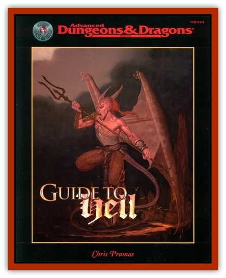

# Baatezu - Lesser - Mezzikim

| Statistic | **Baatezu, Lesser, Mezzikim** |
| --- | --- |
| **Activity Cycle:** | Any |
| **Alignment:** | Lawful evil |
| **Armor Class:** | As host |
| **Climate/Terrain:** | Any |
| **Damage/Attack:** | As host |
| **Diet:** | None |
| **Frequency:** | Rare |
| **Hit Dice:** | 1-6 |
| **Intelligence:** | Average (8-10) |
| **Magic Resistance:** | 5% |
| **Morale:** | Elite (13-14) |
| **Movement:** | 12, Fl 24 |
| **No. Appearing:** | 1 |
| **No. of Attacks:** | 1 |
| **Organization:** | Solitary |
| **Size:** | M |
| **Special Attacks:** | Possession, <i>cause disease</i> |
| **Special Defenses:** | Insubstantial |
| **THAC0:** | 21, -1 per HD |
| **Treasure:** | Nil |
| **XP Value:** | 1 HD: 650 / 2 HD: 975 / 3 HD: 1,400 / 4 HD: 2,000 / 5 HD: 3,000 / 6 HD: 4,000 |

Mezzikim are the tortured souls of devils in Hell, sent to the Prime Material Plane to cause pain and suffering among mortals. They are invisible to the naked eye, and insubstantial as well. Like ethereal creatures, they can travel through solid objects without hindrance. In their insubstantial state, they cannot interact with the Prime Material Plane. However, they can possess mortals and cause them to sicken and, in some cases, die.

Those able to see invisible objects (through the *detect invisibility* spell, for instance) are confronted by a bestial-looking devil with scales, claws, and wings. This appearance, though frightful, is only an affectation. Mezzikim actually have little power while insubstantial.

**Combat:** While insubstantial, mezzikim can neither make attacks nor be attacked. They can, however, use the following magical abilities, each three times per day: *affect normal fires*, *audible glamer*, *cantrip*, and *ventriloquism*. They use these abilities to spook mortals, and engender an atmosphere of fear. Note, however, that mezzikim lack the ordinary spell-like abilities and resistances of normal [[Baatezu_General_Information|baatezu]]. These are linked to their physical bodies and are not available to them while on the Prime Material.

The primary power of the mezzikim is possession. This power is used for a variety of purposes. Sometimes mezzikim are instructed to possess a particular mortal to find out information. They have also been known to start epidemics, sow confusion, or kill their hosts. Once the target has been chosen, the mezzikim can attempt possession. This takes 1 round, and the victim must make a save vs. spell with a -1 penalty for each hit die of the mezzikim. Those that fail are possessed. Should the mezzikim fail to possess the target, it cannot make another attempt for a full 24 hours. Also, the target will realize that something strange has just happened (this feeling manifests as a sudden chill or a sense of foreboding).

Once a mezzikim has successfully possessed a mortal, he is in control of the victim's body entirely. The mezzikim has no access to the memories or abilities of the victim, but can speak and interact normally. The victim's consciousness is aware, but cannot act other than to try to oust the devil using willpower alone. The victim is allowed to make a further saving throw each day, modified by his magical defense (Wisdom) adjustment. Success indicates the devil was forced out, while failure means he remains in place.

While controlling the victim, the mezzikim can *levitate* at will. Additionally, he increases the host's Strength by 2, to a maximum of 19. Once per turn, he can spit needles covered with poisonous bile at an opponent within 10 feet. These needles inflict 1d8 damage and the target must save vs. poison or take an additional 1d6+1 damage from the bile. Other than this special attack, the mezzikim is limited to one attack per round using whatever weapons are handy.

The presence of the mezzikim can corrupt the body of the host. At any point of the possession, the mezzikim can *cause disease* on the victim. The devil chooses the potency of the disease, as per the spell. There is also a 25% that the disease is contagious.

Mezzikim are difficult to dislodge once in possession of a host. They can be driven out by causing their hit points in damage to the host, but this often kills the victim and is a dangerous proposition at best. The exception to this is holy water, which does damage only the mezzikim. The best way to oust mezzikim is through the spell *exorcise*.

**Habitat/Society:** Mezzikim are the souls of devils whose bodies remain in Hell. For offenses against one of the lords or other baatezu nobles, they have been sentenced to spend time on the Prime Material Plane. Their physical bodies are restrained within magical circles and then tortured for six hundred sixty-six nights. When the ritual is complete, the souls of the devils are only too ready to flee the scarred and burned husks of their bodies. The magic of the ritual propels them to the Prime Material Plane, where they remain as insubstantial spirits until their sentence is complete.

The pain of their torture remains, even though their bodies are left behind. This spiritual agony only abates when they cause suffering to the mortals of the Prime Material. The mezzikim are thus thoroughly motivated to possess mortals and reak havoc in their society.

**Ecology:** The mezzikim are not really a race as such. They come from the ranks of the baatezu, and can represent any of the lesser devils. They are commonly the souls of [[Baatezu_Lesser_Abishai|abishai]], [[Baatezu_Lesser_Barbazu|barbazu]], and [[Baatezu_Lesser_Hamatula|hamatula]].

The mezzikim have no society. They usually operate individually, unless ordered otherwise. Agents of the Asmodeus and other baatezu on the Prime Material can command their services, and often use them for particular missions. In general, though, the mezzikim choose their victims quickly and randomly, their only interest the lessening of the pain of their souls.

---
## Discovery & Documentation

**Source Publication:** Guide to Hell (1999)
**Campaign Setting:** Planescape
**Author(s):** Chris Pramas

### Other Creatures Found in This Source Book
   * [[Baatezu_Greater_Amnizu|Baatezu, Greater, Amnizu]]
   * [[Baatezu_Lesser_Barbazu|Baatezu, Lesser, Barbazu]]
   * [[Baatezu_Greater_Cornugon|Baatezu, Greater, Cornugon]]
   * [[Baatezu_Greater_Gelugon|Baatezu, Greater, Gelugon]]
   * [[Baatezu_Lesser_Hamatula|Baatezu, Lesser, Hamatula]]
   * [[Baatezu_Lesser_Kocrachon|Baatezu, Lesser, Kocrachon]]
   * [[Baatezu_Lemure|Baatezu, Lemure]]
   * [[Baatezu_Least_Nupperibo|Baatezu, Least, Nupperibo]]
   * [[Baatezu_Lesser_Osyluth|Baatezu, Lesser, Osyluth]]
   * [[Baatezu_Least_Spinagon|Baatezu, Least, Spinagon]]
