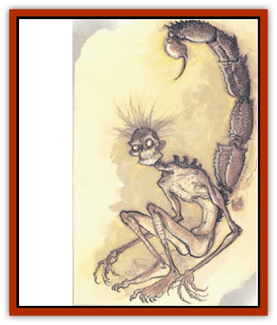

# Baatezu - Lesser - Osyluth

| Statistic | **Baatezu, Lesser, Osyluth** |
| --- | --- |
| **Activity Cycle:** | Any |
| **Alignment:** | Lawful evil |
| **Armor Class:** | 3 |
| **Climate/Terrain:** | Baator |
| **Damage/Attack:** | 1d4/1d4/1d8/3d4 |
| **Diet:** | Carnivore |
| **Frequency:** | Uncommon |
| **Hit Dice:** | 5 |
| **Intelligence:** | Very (11-12) |
| **Magic Resistance:** | 30% |
| **Morale:** | Steady (11-12) |
| **Movement:** | 12 |
| **No. Appearing:** | 2-8 |
| **No. of Attacks:** | 4 |
| **Organization:** | Solitary |
| **Size:** | L (9' tall) |
| **Special Attacks:** | Fear, poison |
| **Special Defenses:** | +1 weapons to hit |
| **THAC0:** | 15 |
| **Treasure:** | Nil |
| **XP Value:** | 7,000 |

The "police officer" of Baator, the osyluth is horrid: bony and wretched, almost a dried husk of a human form, with a fearsome human skull covered by sickly dried skin stretched tight. The osyluth has a large scorpionlike tail and a foul odor of decay and rot.

**Combat:** Terrible opponents, osyluths attack ruthlessly, driven by hatred and rage. They have two claw attacks (1d4 points of damage each) and a bite (1d8 points of damage). Osyluth also attack with their tail, which does 3d4 points of damage and injects poison. The victim must save vs. poison with a -3 penalty. Failure means the victim loses 1d4 points of Strength for 1d10 rounds.

In addition to those available to all baatezu, osyluths have the spell-like powers *fly*, *improved phantasmal force*, *invisibility*, and *wall of ice*. Osyluths can also generate *fear* in a 5-foot radius. Defenders must save vs. rod, staff, or wand or flee in panic for 1d6 rounds. Once per day they may also attempt to *gate* in either 1 to 100 nupperibo (50% chance) or 1 to 2 osyluths (35% chance). Osyluths can see perfectly in total darkness.

**Habitat/Society:** Osyluths are the only [[Baatezu_General_Information|baatezu]] to have power over baatezu of higher station. They roam the layers and observe the actions of other baatezu, ensuring that they act properly. An osyluth can send offenders into the Pit of Flame for 101 days of torment. After the torture, the offending baatezu returns to its former position. Osyluths have this power over any other baatezu save for [[Baatezu_Greater_Pit_Fiend|pit fiends]], who are above their discipline.

But with this power comes danger. Any baatezu that has the opportunity to destroy an osyluth without being discovered usually does so. If caught in this act, however, the offender is instantly reduced to marked [[Baatezu_Lemure|lemure]] status. These marked lemures never advance beyond their station and are particularly hated by all baatezu.

Because the osyluths are charged with disciplining other baatezu, they are supposed to be absolutely loyal, never step out of line, nor do anything against the nature of baatezu. The osyluths generally obey the stricture, although several historical exceptions are known.

*The Ring of Cantrum:* Once per century, 100 osyluths meet with the Dark Eight to promote [[Baatezu_Greater_Gelugon|gelugons]] to pit fiend status. The moot is named after the pit fiend Cantrum, the founder of the Dark Eight. The 100 osyluths gather in a ring around the pit fiends and present information on promising gelugons, including major campaigns and compliance with the nature of Baator. All 100 osyluths combined have one of the nine votes cast in the Ring.

**Ecology:** Osyluths spend a century as such before advancing among the baatezu. Following every Ring of Cantrum, all 1,000 osyluths advance to [[Baatezu_Lesser_Hamatula|hamatula]] status. Simultaneously, 1,000 new osyluths are formed. Despite this guaranteed advancement, osyluths still have incentives to surpass even their exacting standards. An osyluth that performs with distinction becomes an [[Baatezu_Greater_Amnizu|amnizu]] rather than a hamatula. This accelerated advancement is rare, but serves the pit fiends well for it guards against complacency in the osyluth ranks.

---
## Discovery & Documentation

**Source Publication:** MC8 Outer Planes Appendix (1990)
**Campaign Setting:** Planescape
**Author(s):** Timothy B. Brown, Jamie LaFountain

### Other Creatures Found in This Source Book
   * [[Aasimon_Agathinon|Aasimon, Agathinon]]
   * [[Aasimon_Deva|Aasimon, Deva]]
   * [[Aasimon_Light|Aasimon, Light]]
   * [[Aasimon_General_Information|Aasimon, General Information]]
   * [[Aasimon_Planetar|Aasimon, Planetar]]
   * [[Aasimon_Solar|Aasimon, Solar]]
   * [[Air_Sentinel|Air Sentinel]]
   * [[Animal_Lord|Animal Lord]]
   * [[Archon|Archon]]
   * [[Baatezu_Lesser_Abishai|Baatezu, Lesser, Abishai]]
   * [[Baatezu_Greater_Amnizu|Baatezu, Greater, Amnizu]]
   * [[Baatezu_Lesser_Barbazu|Baatezu, Lesser, Barbazu]]
   * [[Baatezu_Greater_Cornugon|Baatezu, Greater, Cornugon]]
   * [[Baatezu_Lesser_Erinyes|Baatezu, Lesser, Erinyes]]
   * [[Baatezu_General_Information|Baatezu, General Information]]
   * [[Baatezu_Greater_Gelugon|Baatezu, Greater, Gelugon]]
   * [[Baatezu_Lesser_Hamatula|Baatezu, Lesser, Hamatula]]
   * [[Baatezu_Lemure|Baatezu, Lemure]]
   * [[Baatezu_Least_Nupperibo|Baatezu, Least, Nupperibo]]
   * [[Baatezu_Greater_Pit_Fiend|Baatezu, Greater, Pit Fiend]]
   * [[Baatezu_Least_Spinagon|Baatezu, Least, Spinagon]]
   * [[Balaena|Balaena]]
   * [[Bariaur|Bariaur]]
   * [[Bebilith|Bebilith]]
   * [[Bodak|Bodak]]
   * [[Dog_Moon|Dog, Moon]]
   * [[Dragon_Adamantite|Dragon, Adamantite]]
   * [[Einheriar|Einheriar]]
   * [[Gehreleth|Gehreleth]]
   * [[Githyanki|Githyanki]]
   * [[Githzerai|Githzerai]]
   * [[Hordling|Hordling]]
   * [[Lammasu_Celestial|Lammasu, Celestial]]
   * [[Larva|Larva]]
   * [[Maelephant|Maelephant]]
   * [[Marut|Marut]]
   * [[Mediator|Mediator]]
   * [[Mortai|Mortai]]
   * [[Night_Hag|Night Hag]]
   * [[Nightmare|Nightmare]]
   * [[Noctral|Noctral]]
   * [[Per|Per]]
   * [[Phoenix|Phoenix]]
   * [[Slaad|Slaad]]
   * [[Tanar'ri_Greater_Babau|Tanar'ri, Greater, Babau]]
   * [[Tanar'ri_Greater_Chasme|Tanar'ri, Greater, Chasme]]
   * [[Tanar'ri_Greater_Nabassu|Tanar'ri, Greater, Nabassu]]
   * [[Tanar'ri_Least_Dretch|Tanar'ri, Least, Dretch]]
   * [[Tanar'ri_Least_Manes|Tanar'ri, Least, Manes]]
   * [[Tanar'ri_Least_Rutterkin|Tanar'ri, Least, Rutterkin]]
   * [[Tanar'ri_Lesser_Alu-Fiend|Tanar'ri, Lesser, Alu-Fiend]]
   * [[Tanar'ri_Lesser_Bar-Lgura|Tanar'ri, Lesser, Bar-Lgura]]
   * [[Tanar'ri_Lesser_Cambion|Tanar'ri, Lesser, Cambion]]
   * [[Tanar'ri_Lesser_Succubus|Tanar'ri, Lesser, Succubus]]
   * [[Tanar'ri_Guardian_Molydeus|Tanar'ri, Guardian, Molydeus]]
   * [[Tanar'ri_General_Information|Tanar'ri, General Information]]
   * [[Tanar'ri_True_Balor|Tanar'ri, True, Balor]]
   * [[Tanar'ri_True_Glabrezu|Tanar'ri, True, Glabrezu]]
   * [[Tanar'ri_True_Hezrou|Tanar'ri, True, Hezrou]]
   * [[Tanar'ri_True_Marilith|Tanar'ri, True, Marilith]]
   * [[Tanar'ri_True_Nalfeshnee|Tanar'ri, True, Nalfeshnee]]
   * [[Tanar'ri_True_Vrock|Tanar'ri, True, Vrock]]
   * [[Titan|Titan]]
   * [[Translator|Translator]]
   * [[T'uen-rin|T'uen-rin]]
   * [[Vaporighu|Vaporighu]]
   * [[Warden_Beast|Warden Beast]]
   * [[Yugoloth_Greater_Arcanaloth|Yugoloth, Greater, Arcanaloth]]
   * [[Yugoloth_Lesser_Dergoloth|Yugoloth, Lesser, Dergoloth]]
   * [[Yugoloth_Lesser_Hydroloth|Yugoloth, Lesser, Hydroloth]]
   * [[Yugoloth_General_Information|Yugoloth, General Information]]
   * [[Yugoloth_Lesser_Mezzoloth|Yugoloth, Lesser, Mezzoloth]]
   * [[Yugoloth_Greater_Nycaloth|Yugoloth, Greater, Nycaloth]]
   * [[Yugoloth_Lesser_Piscoloth|Yugoloth, Lesser, Piscoloth]]
   * [[Yugoloth_Greater_Ultroloth|Yugoloth, Greater, Ultroloth]]
   * [[Yugoloth_Lesser_Yagnoloth|Yugoloth, Lesser, Yagnoloth]]
   * [[Zoveri|Zoveri]]
