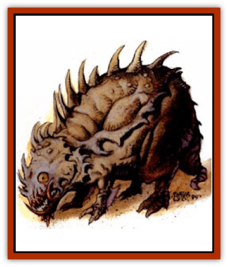

# Baazrag

| Statistic | **Baazrag** |
| --- | --- |
| **Activity Cycle:** | Day |
| **Alignment:** | Neutral |
| **Armor Class:** | 4 |
| **Climate/Terrain:** | Stony barrens |
| **Damage/Attack:** | 1d3 |
| **Diet:** | Omnivore |
| **Frequency:** | Uncommon |
| **Hit Dice:** | 1 |
| **Intelligence:** | Animal (1) |
| **Magic Resistance:** | Nil |
| **Morale:** | Unsteady (5-7) |
| **Movement:** | 18 |
| **No. Appearing:** | 1 or 4-40 (4d10) |
| **No. of Attacks:** | 1 |
| **Organization:** | Pack |
| **Size:** | T (2' long) |
| **Special Attacks:** | Swarm, gnawing |
| **Special Defenses:** | Nil |
| **THAC0:** | 19 |
| **Treasure:** | Nil |
| **XP Value:** | 65 |

In the broken crags and tiny caves of the barrens lives the timid baazrag. Two feet long or less, it is one of the smallest omnivores in the stony barren regions. The baazrag's face is protected by a bony covering that reaches down on either side of the head and across the nose, with holes for the creature's nostrils and eyes. The mouth and lower law are not protected below the bony covering. The beast's humped back is covered with a hard, natural armor that protects the animal, especially the fluid storage sack just beneath the shell. Its four legs are comparatively frail but are adequate for darting from shelter to shelter around its rocky home. The tail of the Baazrag about 5" long. Newborns are red-brown, green, yellow, or orange, but the color fades gradually to a sandy gray at old age.

**Combat:** A lone baazrag attempts to flee or hide rather than engage in combat, even against creatures of a size similar to itself. A baazrag's home is usually a hole in the rocks just for one. The baazrag seldom wanders far from it.

A baazrag attacks with a bite that causes l-3 points of damage. If a baazrag successfully bites a target twice in consecutive rounds, it has gnawed the target's flesh and releases a toxin into the bloodstream. This toxin slows natural healing to 20% of the normal rate for all damage, not just the bite wound. For example, an adventurer with 15 points of current damage suffers 5 points of damage from a baazrag that gnaws him. This would normally take 20 days to heal naturally, but the toxin increases it to 100 days. Magical healing or *neutralize poison* negates the effects of the poison. The poison loses its ability to slow healing after six hours.

If all the baazrags encountered are not killed or driven off in 5 rounds, the entire pack swarms the area. Each round after round 5, 2-16 (2d8) additional baazrags arrive to attack, until the entire pack has arrived. They flee when the pack has suffered 80% or more casualties.

**Habitat/Society:** Baazrag packs band together only for mutual defense of their territory. Otherwise, they have little contact with those of other bands.

Noble families of Tyr and Balic domesticate the baazrag to rid their households of unwanted pests and insects. The families also organize teams of the creatures to pull wagons. Each baazrag can pull as much as 50 pounds of cargo and transport. A wagon weighing 100 pounds and carrying 500 pounds of cargo requires 12 baazrags to pull it, moving at a rate of 9. Doubling the number of beasts increases the movement rate to 15, the maximum for a harnessed baazrag.

 Other baazrags have been specially trained to hunt unwanted pests in the sewers. The templars of Tyr have a special squad with several dozen swimming baazrags that are used to clean out infested areas.

**Ecology:** Baazrag females bear their young either in litters of 2-6 (2d3) or singly. Single births are very rare and are cause for concern. Single births invariably indicate a [[Baazrag_Boneclaw|boneclaw]] and the whole pack will move to another location quickly. Litters live with the mother until adulthood when they find homes of their own.

Baazrag flesh can be eaten. Each adult has 25 pounds of meat. The fluid sac beneath the shell on its back contains 1-4 (1d4) pints of water, but it is tainted with the same toxin that slows normal healing. The water can be purified by a *purify food and water* spell or by a neutralize poison spell. Drinking tainted water causes 1-6 (1d6) hours of illness.

Captured wild baazrags can be sold in various markets as pets or team animals. Undamaged specimens bring 10 cp in the marketplaces around Tyr.

---
## Discovery & Documentation

**Source Publication:** Dark Sun Appendix II - Terrors Beyond Tyr (1991)
**Campaign Setting:** Dark Sun
**Author(s):** Jim Atkiss, Steve Brown, Timothy B. Brown, Andrew P. Morris, Bruce Nesmith, Wes Nicholson, Bill Slavicsek

### Other Creatures Found in This Source Book
   * [[Aarakocra_Athas|Aarakocra (Athas)]]
   * [[Animal_Domestic_Athas_II|Animal, Domestic (Athas) II]]
   * [[Aviarag|Aviarag]]
   * [[Baazrag_Boneclaw|Baazrag, Boneclaw]]
   * [[Bloodgrass|Bloodgrass]]
   * [[Cactus_Hunting|Cactus, Hunting]]
   * [[Cactus_Rock|Cactus, Rock]]
   * [[Cilops|Cilops]]
   * [[Crodlu|Crodlu]]
   * [[Dagorran|Dagorran]]
   * [[Dhaot|Dhaot]]
   * [[Drake_Lesser_Athas_General_Information|Drake, Lesser (Athas), General Information]]
   * [[Drake_Lesser_Athas_Magma|Drake, Lesser (Athas), Magma]]
   * [[Drake_Lesser_Athas_Rain|Drake, Lesser (Athas), Rain]]
   * [[Drake_Lesser_Athas_Silt|Drake, Lesser (Athas), Silt]]
   * [[Drake_Lesser_Athas_Sun|Drake, Lesser (Athas), Sun]]
   * [[Dray|Dray]]
   * [[Drik|Drik]]
   * [[Dune_Reaper|Dune Reaper]]
   * [[Dwarf_Athas|Dwarf (Athas)]]
   * [[Elemental_Beast_Athas_Air|Elemental Beast (Athas), Air]]
   * [[Elemental_Beast_Athas_Earth|Elemental Beast (Athas), Earth]]
   * [[Elemental_Beast_Athas_Fire|Elemental Beast (Athas), Fire]]
   * [[Elemental_Beast_Athas_Water|Elemental Beast (Athas), Water]]
   * [[Elf_Athas|Elf (Athas)]]
   * [[Fael|Fael]]
   * [[Feylaar|Feylaar]]
   * [[Fordorran|Fordorran]]
   * [[Giant_Half-giant|Giant, Half-giant]]
   * [[Giant_Shadow|Giant, Shadow]]
   * [[Golem_Athas_Magma|Golem (Athas), Magma]]
   * [[Golem_Athas_Salt|Golem (Athas), Salt]]
   * [[Golem_Athas_General_Information|Golem (Athas), General Information]]
   * [[Gorak|Gorak]]
   * [[Halfling_Athas|Halfling (Athas)]]
   * [[Human_Athas|Human (Athas)]]
   * [[Jhakar|Jhakar]]
   * [[Kaisharga|Kaisharga]]
   * [[Kes'trekel|Kes'trekel]]
   * [[Klar|Klar]]
   * [[Krag|Krag]]
   * [[Kragling|Kragling]]
   * [[Lirr|Lirr]]
   * [[Mastyrial|Mastyrial]]
   * [[Meorty|Meorty]]
   * [[Mul|Mul]]
   * [[Nikaal|Nikaal]]
   * [[Paraelemental_Beast_General_Information|Paraelemental Beast, General Information]]
   * [[Paraelemental_Beast_Magma|Paraelemental Beast, Magma]]
   * [[Paraelemental_Beast_Rain|Paraelemental Beast, Rain]]
   * [[Paraelemental_Beast_Silt|Paraelemental Beast, Silt]]
   * [[Paraelemental_Beast_Sun|Paraelemental Beast, Sun]]
   * [[Pakubrazi|Pakubrazi]]
   * [[Psionocus|Psionocus]]
   * [[Psurlon|Psurlon]]
   * [[Raaig|Raaig]]
   * [[Retriever_Obsidian|Retriever, Obsidian]]
   * [[Ruktoi|Ruktoi]]
   * [[Ruvoka_Athas|Ruvoka (Athas)]]
   * [[Sand_Howler|Sand Howler]]
   * [[Scorpion_Athas|Scorpion (Athas)]]
   * [[Seed_Brain|Seed, Brain]]
   * [[Silt_Horror_Black|Silt Horror, Black]]
   * [[Silt_Horror_Magma|Silt Horror, Magma]]
   * [[Silt_Horror_Red|Silt Horror, Red]]
   * [[Silt_Spawn|Silt Spawn]]
   * [[Slig|Slig]]
   * [[Spider_Athas|Spider (Athas)]]
   * [[Spinewyrm|Spinewyrm]]
   * [[Ssurran|Ssurran]]
   * [[Stalking_Horror|Stalking Horror]]
   * [[Tarek|Tarek]]
   * [[Tari|Tari]]
   * [[Thri-kreen|Thri-kreen]]
   * [[T'liz|T'liz]]
   * [[Tohr-kreen_II|Tohr-kreen II]]
   * [[Tohr-kreen_III|Tohr-kreen III]]
   * [[Trin|Trin]]
   * [[Tul'k|Tul'k]]
   * [[Undead_Athas_General_Information|Undead (Athas), General Information]]
   * [[Wraith_Athas|Wraith (Athas)]]
   * [[Xerichou|Xerichou]]
   * [[Zombie_Thinking|Zombie, Thinking]]
