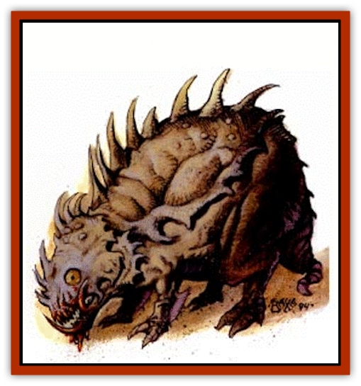

# Baazrag - Boneclaw

| Statistic | **Baazrag, Boneclaw** |
| --- | --- |
| **Activity Cycle:** | Any |
| **Alignment:** | Neutral |
| **Armor Class:** | 0 |
| **Climate/Terrain:** | Stony barrens |
| **Damage/Attack:** | 1d6/1d6/1d10 |
| **Diet:** | Omnivore, prefers fresh meat |
| **Frequency:** | Very rare |
| **Hit Dice:** | 6 |
| **Intelligence:** | Low (5-7) |
| **Magic Resistance:** | Nil |
| **Morale:** | Elite (13) |
| **Movement:** | 18 |
| **No. Appearing:** | 1 |
| **No. of Attacks:** | 3 + special |
| **Organization:** | Solitary |
| **Size:** | L (8' tall) |
| **Special Attacks:** | Charging |
| **Special Defenses:** | Special |
| **THAC0:** | 15 |
| **Treasure:** | Nil |
| **XP Value:** | 650 |

**Psionics Summary**

| Level | Dis/Sci/Dev | Attack/Defense | Score | PSPs |
| --- | --- | --- | --- | --- |
| 6 | 1/1/3 | MT/MB | 7 | 20 |

**Telepathy -** *Science:* mind link; *Devotions:* contact, life detection, mind thrust.

Once in a very great while, a [[Baazrag|baazrag]] litter consists of only one young, much larger than normal. This creature is a boneclaw. The boneclaw stands more than 8 feet tall. The boneclaw's head is protected by a bony covering. The upper body and back are covered with a hard shell that deflects all normal missiles smaller than a javelin. Its shell has sharp serrated edges everywhere except around the mouth and eyes. The boneclaw is a dull brown color, with sand-colored claws and red eyes that glow in the dark.

**Combat:** Boneclaws try to eat whatever moves. They use their charge attack if they have 10 feet of clear space to reach full speed. Boneclaws run right through a group of travelers or a herd of animals, darting from side to side to swipe as many creatures as possible in one pass. As many as four creatures can be hit if they are all within three feet of each other when the boneclaws start their charge. The speed of this attack gives boneclaws a -4 advantage on initiative for the first round of combat. Each opponent must be attacked separately. Any opponent hit receives 1-4 (1d4) points of damage and must successfully save vs. petrification. An unsuccessful save means the sharp edges cut so cleanly the opponent didn't realize it was hit and it continues to lose blood at 1 hit point per round for 1-4 rounds or until the wound is treated.

After the charge, boneclaws attack with their sharp claws and their bite. If they can leap toward their opponents, the boneclaws can attack with all four claws for 1-6 (1d6) points of damage each. Otherwise, they rear up on their hind legs and attack with the front claws only. In either case, the boneclaws attempt to bite their opponent Boneclaws eat any chunks of flesh or equipment they can tear off, even while preparing to bite again.

**Habitat/Society:** Boneclaws are solitary creatures. Their territory extends to a 2-mile radius from their lair. Boneclaws usually take over deserted baazrag lairs. If there is no water readily available, boneclaws will dig until they hit water. Deserted boneclaw lairs have been known to save the lives of thirsty travelers because of the well that may be found in some of them. If there is no prey available, boneclaws can survive on vegetation for as long as three months, or can go as long as one month without food at all.

**Ecology:** Boneclaws are sterile. There are male and female boneclaws, but breeding is not part of their agenda. They live only to eat and to kill anything that gets in their way. Boneclaws may be slain and eaten. Each creature has 125 pounds of edible flesh, but it is tough and stringy.

Boneclaws have no defined place in the food chain, but fit somewhere toward the top of the chain. The only creatures that prey on boneclaws are [[Drake_Athas_General_Information|drakes]], [[Nightmare_Beast|nightmare beasts]], and occasionally [[Bulette|bulettes]].

The shell of a boneclaw can be used to make sharp knives that are popular in the kitchens of Athas. The knives can also be used as slashing weapons that give a +1 bonus to damage. The knives also give a 5% chance that victims do not notice the wound until they faint from blood loss. However, boneclaw knives used as stabbing weapons are 50% likely to shatter on impact as their structure is not designed to take the shock.

---
## Discovery & Documentation

**Source Publication:** Dark Sun Appendix II - Terrors Beyond Tyr (1991)
**Campaign Setting:** Dark Sun
**Author(s):** Jim Atkiss, Steve Brown, Timothy B. Brown, Andrew P. Morris, Bruce Nesmith, Wes Nicholson, Bill Slavicsek

### Other Creatures Found in This Source Book
   * [[Aarakocra_Athas|Aarakocra (Athas)]]
   * [[Animal_Domestic_Athas_II|Animal, Domestic (Athas) II]]
   * [[Aviarag|Aviarag]]
   * [[Baazrag|Baazrag]]
   * [[Bloodgrass|Bloodgrass]]
   * [[Cactus_Hunting|Cactus, Hunting]]
   * [[Cactus_Rock|Cactus, Rock]]
   * [[Cilops|Cilops]]
   * [[Crodlu|Crodlu]]
   * [[Dagorran|Dagorran]]
   * [[Dhaot|Dhaot]]
   * [[Drake_Lesser_Athas_General_Information|Drake, Lesser (Athas), General Information]]
   * [[Drake_Lesser_Athas_Magma|Drake, Lesser (Athas), Magma]]
   * [[Drake_Lesser_Athas_Rain|Drake, Lesser (Athas), Rain]]
   * [[Drake_Lesser_Athas_Silt|Drake, Lesser (Athas), Silt]]
   * [[Drake_Lesser_Athas_Sun|Drake, Lesser (Athas), Sun]]
   * [[Dray|Dray]]
   * [[Drik|Drik]]
   * [[Dune_Reaper|Dune Reaper]]
   * [[Dwarf_Athas|Dwarf (Athas)]]
   * [[Elemental_Beast_Athas_Air|Elemental Beast (Athas), Air]]
   * [[Elemental_Beast_Athas_Earth|Elemental Beast (Athas), Earth]]
   * [[Elemental_Beast_Athas_Fire|Elemental Beast (Athas), Fire]]
   * [[Elemental_Beast_Athas_Water|Elemental Beast (Athas), Water]]
   * [[Elf_Athas|Elf (Athas)]]
   * [[Fael|Fael]]
   * [[Feylaar|Feylaar]]
   * [[Fordorran|Fordorran]]
   * [[Giant_Half-giant|Giant, Half-giant]]
   * [[Giant_Shadow|Giant, Shadow]]
   * [[Golem_Athas_Magma|Golem (Athas), Magma]]
   * [[Golem_Athas_Salt|Golem (Athas), Salt]]
   * [[Golem_Athas_General_Information|Golem (Athas), General Information]]
   * [[Gorak|Gorak]]
   * [[Halfling_Athas|Halfling (Athas)]]
   * [[Human_Athas|Human (Athas)]]
   * [[Jhakar|Jhakar]]
   * [[Kaisharga|Kaisharga]]
   * [[Kes'trekel|Kes'trekel]]
   * [[Klar|Klar]]
   * [[Krag|Krag]]
   * [[Kragling|Kragling]]
   * [[Lirr|Lirr]]
   * [[Mastyrial|Mastyrial]]
   * [[Meorty|Meorty]]
   * [[Mul|Mul]]
   * [[Nikaal|Nikaal]]
   * [[Paraelemental_Beast_General_Information|Paraelemental Beast, General Information]]
   * [[Paraelemental_Beast_Magma|Paraelemental Beast, Magma]]
   * [[Paraelemental_Beast_Rain|Paraelemental Beast, Rain]]
   * [[Paraelemental_Beast_Silt|Paraelemental Beast, Silt]]
   * [[Paraelemental_Beast_Sun|Paraelemental Beast, Sun]]
   * [[Pakubrazi|Pakubrazi]]
   * [[Psionocus|Psionocus]]
   * [[Psurlon|Psurlon]]
   * [[Raaig|Raaig]]
   * [[Retriever_Obsidian|Retriever, Obsidian]]
   * [[Ruktoi|Ruktoi]]
   * [[Ruvoka_Athas|Ruvoka (Athas)]]
   * [[Sand_Howler|Sand Howler]]
   * [[Scorpion_Athas|Scorpion (Athas)]]
   * [[Seed_Brain|Seed, Brain]]
   * [[Silt_Horror_Black|Silt Horror, Black]]
   * [[Silt_Horror_Magma|Silt Horror, Magma]]
   * [[Silt_Horror_Red|Silt Horror, Red]]
   * [[Silt_Spawn|Silt Spawn]]
   * [[Slig|Slig]]
   * [[Spider_Athas|Spider (Athas)]]
   * [[Spinewyrm|Spinewyrm]]
   * [[Ssurran|Ssurran]]
   * [[Stalking_Horror|Stalking Horror]]
   * [[Tarek|Tarek]]
   * [[Tari|Tari]]
   * [[Thri-kreen|Thri-kreen]]
   * [[T'liz|T'liz]]
   * [[Tohr-kreen_II|Tohr-kreen II]]
   * [[Tohr-kreen_III|Tohr-kreen III]]
   * [[Trin|Trin]]
   * [[Tul'k|Tul'k]]
   * [[Undead_Athas_General_Information|Undead (Athas), General Information]]
   * [[Wraith_Athas|Wraith (Athas)]]
   * [[Xerichou|Xerichou]]
   * [[Zombie_Thinking|Zombie, Thinking]]
