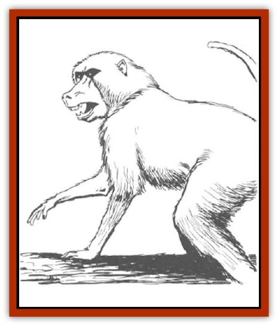

# Baboon

| Statistic | **Banderlog** | **Wild Baboon** |
| --- | --- | --- |
| **Activity Cycle:** | Day | Day |
| **Alignment:** | Neutral | Neutral |
| **Armor Class:** | 6 | 7 |
| **Climate/Terrain:** | Tropical and subtropical/Forests | Tropical and subtropical/ / Forests, mountains, and plains |
| **Damage/Attack:** | 2-5 | 1-4 |
| **Diet:** | Herbivore | Herbivore |
| **Frequency:** | Very rare | Common |
| **Hit Dice:** | 4 | 1+1 |
| **Intelligence:** | Low (5-7) | Low (5-7) |
| **Magic Resistance:** | Nil | Nil |
| **Morale:** | Average (9) | Unsteady (5) |
| **Movement:** | 6, 12 in trees | 12, 12 in trees |
| **No. Appearing:** | 4-24 | 10-40 |
| **No. of Attacks:** | 1 | 1 |
| **Organization:** | Tribal | Tribal |
| **Size:** | S (4' tall) | S (4' tall) |
| **Special Attacks:** | See below | Nil |
| **Special Defenses:** | Climbing | Climbing |
| **THAC0:** | 15 | 18 |
| **Treasure:** | See below | Nil |
| **XP Value:** | 120 | 35 |

Baboons are large, herbivorous monkeys. They usually live in the trees of tropical and subtropical jungles, but tribes are sometimes found in tropical mountains and plains.

Baboons have dark brown fur, long arms and legs, and large heads with dog-like muzzles and sharp canine teeth. Most baboon tails are short and stubby, but some are as much as two feet long. A collar of gray fur circles the necks of the largest males.

**Combat:** If the tribe's home territory is entered, the baboons will try to drive the invaders off, but it is 90% likely that a baboon tribe will flee if threatened or surprised, hiding in trees or behind ground foliage until the danger has passed. Extremely agile, baboons can climb at twice their normal movement in fiveround bursts when fleeing from an enemy. However, if cornered or if an infant is endangered, baboons can be vicious fighters, particularly the larger males. Baboons attack by dropping on their victims from above or charging and leaping, biting with their sharp teeth for 1d4 points of damage. The tribe is led by 2d4 large males that serve as the first line of defense and receive a +1 damage bonus to their attacks. Male baboons sometimes attempt to discourage intruders by baring their fangs and screeching.

**Habitat/Society:** Baboons live in tribes of 10-40, though some tribes include as many as 100 members. About half the tribe are juveniles or infants; the remainder are adult males and females. The young will not attack, and female generally attack only if their children are threatened. Females give birth to one child every year.

Baboons eat in the morning, nap during the afternoon, then rest at night after a final meal, sleeping in tree branches or on rocky cliffs. Though the males may roam several miles searching for food, they always return to the tribe before sundown, carrying fruit, nuts, and other food in pouches in their cheeks. Baboons are among the more intelligent primates, with excellent memories and an insatiable curiosity. They do not collect treasure.

**Ecology:** Baboons eat fruit, seeds. grass, roots, and leaves. They also enjoy bird eggs and insects. When food is scarce, baboons will eat live prey, such as mice and frogs. Groups of large males have been known to chase down and kill small antelope and leopards, though this is extremely unusual. Given the opportunity, most predators will eat baboons. Since jungle baboons spend most of their time in the high trees, they are generally safe from attacks. Giant snakes are their most feared natural enemies. Mountain baboons have a harder time of it; their enemies include mountain lions, sabre-tooths, and wolf packs.

Men hunt baboons for their furry pelts and chewy but succulent meat. Baboon teeth are sometimes used for necklaces and other simple jewelry. If captured when young, baboons can be tamed as pets. Some primitive cultures consider baboons to be sacred and worship them as emissaries of the gods.

**Banderlog**

  Banderlogs resemble baboons with green skin and brown fur. They are somewhat stronger than baboons and are able to communicate in a simple language of chatters and grunts. Not as panic prone as baboons, banderlogs attack at close quarters with their long canine teeth for 1d4+1 points of damage, but are more likely to use coconuts or retch plant globes (the purple membranous fruit of retch plants, also know as globe palms) as missile weapons. Banderlogs will cling to tree branches with one hand and hurl missiles with the other at targets up to 30 feet away. Coconuts strike for 1d4+1 points of damage and retch plant globes burst to splash nauseating fluid over a five-foot radius with a 25% chance for splash contact at a distance of 1d6+3 feet (splashed creatures vomit and retch for three rounds, and their Strengths are reduced by half for the next hour; no saving throw allowed). Like baboons, banderlogs can climb for short bursts at twice their normal movement allowance.

Banderlogs are organized into small tribes led by one or more large males with 6-8 hp per die (+1 damage to attacks). They live in communal nests made of leaves in the higher branches of palm trees. They normally do not collect treasure, but there is 5% chance that a tribe has a piece of jewelry or some other random valuable item in their nest. Their diet is similar to that of baboons, occasionally supplemented by rodents and large insects. Lions and other carnivores prey on banderlogs, while hunters kill them to make furs from their pelts and jewelry from their teeth.

---
## Discovery & Documentation

**Source Publication:** MC2 Volume II (1993)
**Campaign Setting:** Advanced Dungeons & Dragons 2nd Edition
**Author(s):** Jay Batista, Scott Bennie, Grant Boucher, William W. Connors, Steve Gilbert, Heike Kubasch, James Lowder, David Edward Martin, Bruce Nesmith, Jean Rabe, Rick Swan, John J. Terra, Gary L. Thomas

### Other Creatures Found in This Source Book
   * [[Ant|Ant]]
   * [[Ant_Lion_Giant|Ant Lion, Giant]]
   * [[Ape_Carnivorous|Ape, Carnivorous]]
   * [[Badger|Badger]]
   * [[Barracuda|Barracuda]]
   * [[Beetle_Giant|Beetle, Giant]]
   * [[Bulette|Bulette]]
   * [[Bullywug|Bullywug]]
   * [[Dwarf_Duergar|Dwarf, Duergar]]
   * [[Dwarf_Gully|Dwarf, Gully]]
   * [[Eagle|Eagle]]
   * [[Eel|Eel]]
   * [[Elemental_Air_Kin|Elemental, Air Kin]]
   * [[Elemental_Water_Kin|Elemental, Water Kin]]
   * [[Elemental_Water_Kin_Water_Weird|Elemental, Water Kin, Water Weird]]
   * [[Firestar|Firestar]]
   * [[Firetail|Firetail]]
   * [[Fish_Giant|Fish, Giant]]
   * [[Frog|Frog]]
   * [[Gorgon|Gorgon]]
   * [[Hawk|Hawk]]
   * [[Heucuva|Heucuva]]
   * [[Hippocampus|Hippocampus]]
   * [[Hippogriff|Hippogriff]]
   * [[Kelpie|Kelpie]]
   * [[Kenku|Kenku]]
   * [[Killmoulis|Killmoulis]]
   * [[Kuo-Toa|Kuo-Toa]]
   * [[Lamia|Lamia]]
   * [[Lammasu|Lammasu]]
   * [[Lamprey|Lamprey]]
   * [[Leech|Leech]]
   * [[Leprechaun|Leprechaun]]
   * [[Leucrotta|Leucrotta]]
   * [[Locathah|Locathah]]
   * [[Lycanthrope_Wereboar|Lycanthrope, Wereboar]]
   * [[Lycanthrope_Werefox|Lycanthrope, Werefox]]
   * [[Mammal_Minimal|Mammal, Minimal]]
   * [[Mammal_Small|Mammal, Small]]
   * [[Mimic|Mimic]]
   * [[Morkoth|Morkoth]]
   * [[Muckdweller|Muckdweller]]
   * [[Myconid|Myconid]]
   * [[Naga|Naga]]
   * [[Obliviax|Obliviax]]
   * [[Octopus_Giant|Octopus, Giant]]
   * [[Otyugh|Otyugh]]
   * [[Piranha|Piranha]]
   * [[Plant_Dangerous_I|Plant, Dangerous I]]
   * [[Plant_Intelligent|Plant, Intelligent]]
   * [[Poltergeist|Poltergeist]]
   * [[Porcupine|Porcupine]]
   * [[Rat_Osquip|Rat, Osquip]]
   * [[Roc|Roc]]
   * [[Roper|Roper]]
   * [[Rot_Grub|Rot Grub]]
   * [[Rust_Monster|Rust Monster]]
   * [[Sahuagin|Sahuagin]]
   * [[Sea_Lion|Sea Lion]]
   * [[Sea_Horse_Giant|Sea Horse, Giant]]
   * [[Shambling_Mound|Shambling Mound]]
   * [[Shark|Shark]]
   * [[Sphinx|Sphinx]]
   * [[Squid_Giant|Squid, Giant]]
   * [[Stirge|Stirge]]
   * [[Swanmay|Swanmay]]
   * [[Tarrasque|Tarrasque]]
   * [[Tasloi|Tasloi]]
   * [[Triton|Triton]]
   * [[Troglodyte|Troglodyte]]
   * [[Urchin|Urchin]]
   * [[Urd|Urd]]
   * [[Weasel|Weasel]]
   * [[Wolverine|Wolverine]]
   * [[Yellow_Musk_Creeper|Yellow Musk Creeper]]
