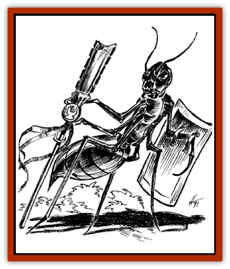
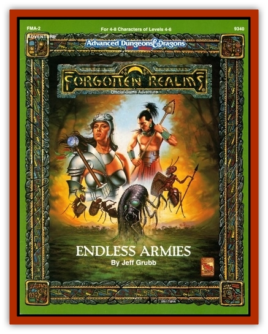

# Bacar

| Statistic | **Bacar** |
| --- | --- |
| **Activity Cycle:** | Any |
| **Alignment:** | Neutral |
| **Armor Class:** | 5 (4 with shield) |
| **Climate/Terrain:** | Tropical |
| **Damage/Attack:** | 1-6/by weapon type |
| **Diet:** | Omnivore |
| **Frequency:** | Very rare |
| **Hit Dice:** | 3 |
| **Intelligence:** | Low (6) and see below |
| **Magic Resistance:** | Nil |
| **Morale:** | Steady (12) |
| **Movement:** | 9 |
| **No. Appearing:** | 2-8 |
| **No. of Attacks:** | 2 or 3 (bite + weapon(s)) |
| **Organization:** | Colony |
| **Size:** | L (10') |
| **Special Attacks:** | Insect control |
| **Special Defenses:** | Nil |
| **THAC0:** | 18 |
| **Treasure:** | A |
| **XP Value:** | 270 |

The bacars are intelligent, enchanted [[Ant|ants]] created by hishna and pluma magic as the guardians of the sacred site of Ixtzul. They appear to be giant ants, but carry weapons and shields. Their bodies are dark red, running to black along the thorax, and their underbellies are a steel blue, consisting of overlapping plates of chitin.

**Combat:** The bacars are organized along a military society, and are usually found only in patrols of 2-8 creatures, save at their lair at Ixtzul. In patrols they fight only with their bite, and only if in groups of 6 or more do they use weapons and shields.

A lone bacar is relatively unintelligent, following its orders to the exclusion of other matters (such as <q>Patrol</q>, <q>Gather</q>, <q>Scout</q>, etc.) Their base Intelligence is 6. For each additional bacar within 20', however, the collective Intelligence is raised by one, so that a party of 3 bacars have Average Intelligence of 8, and 6 bacars are Very intelligent (11). At the Very Intelligent level, they begin to use their weapons, including long obsidian knives (1-3), macas (1-8) and slings (1-4). When using macas, the bacars use shields, raising their Armor Class to 4. When using slings or knives, they do not use shields, but they wield two knives at the same time.

At the Highly Intelligent level (13 or better), bacars may operate outside the valley. In addition, at that stage they may mentally command colonies of army ants in the area. This allows them to effectively cast the priest's *creeping doom* spell once per day in a typical jungle. (See the valley area itself for locations of ant colonies in the Ixtzul Vale.)

**Habitat/Society:** The bacars exist in an expanded version of ant society, aided by their limited telepathic abilities. Orders are passed from the queen (and in this case Mirandos) to the soldiers by means of touching antennae. Individually, the bacars have little initiative, and do not act unless ordered to. A bacar sent to gather food pays no attention to an advancing army (though if the army is edible, they try to drag parts of it off as food, then inform the nest that new food exists in that direction).

Typical bacar tasks include:

*Gather:* Bring back carrion, small living creatures, and succulent leaves and vines to feed the colony.

*Scout:* Look for things that were not there before. If things are present, or changed, report immediately back to the nest. If there is a potential danger (one of the scouting bacars is killed), one scout is sent back, the others forming a rearguard.

*Guard:* Let nothing that is not bacar (except Mirandos and her followers) pass. Do not report back; fight until dead (18 morale when in this state).

*Attack:* Used when a particular enemy is identified (usually by scent). The enemy is to be slain. All non-bacars are slain. Use of *creeping doom* where applicable.

*Capture:* As for Attack, but the targets are to be knocked unconscious and taken alive. If the creeping doom is used, it is to herd the target to the bacars.

*Track:* Used against a retreating foe. The prey is to be tracked down. If possible use the *creeping doom*. All other potential targets are ignored unless they attack the trackers. Once captured or slain, the trackers return to Ixtzul.

*Maintain:* The most common function of the bacars when not involved in battle, they patrol the grounds, cleaning up bits of vegetation and debris, checking with their antennae to maintain the wards that hold the Star Worm. The colony has the power to reinstate the wards that weaken over time. Bacars engaged in maintenance do not fight unless attacked. They report strange activity in their area.

**Ecology:** The bacars have a queen to which all defer, who provides both the eggs for new bacars (though not at levels of a normal ant colony), and orders for her soldiers. The queen is a large, bloated creature with no defenses of her own, AC 9, with 50 hp. Attacking the queen brings all bacars within 50 yards, with an additional 2-12 arriving each round thereafter.

If the queen is slain, the bacars lose their telepathic abilities. They act as individual monsters, attacking when attacked or hungry. Killing the queen also breaks the bonds holding [[H'Calos|H'Calos the Star Worm]] in check.

---
## Discovery & Documentation

**Source Publication:** FMA2 Endless Armies (1991)
**Campaign Setting:** Maztica (Forgotten Realms)
**Author(s):** Jeff Grub and Tim Beach

### Other Creatures Found in This Source Book
   * [[H'Calos|H'Calos]]
