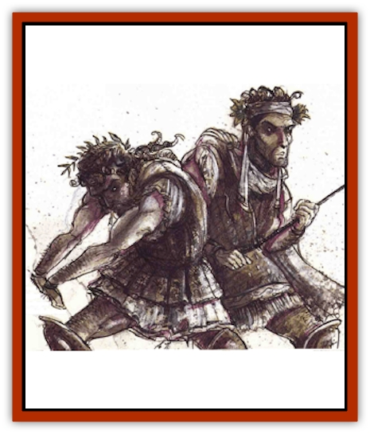

# Bacchae

| Statistic | **Bacchae** |
| --- | --- |
| **Activity Cycle:** | Any |
| **Alignment:** | Chaotic neutral |
| **Armor Class:** | 7 |
| **Climate/Terrain:** | Arborea, pastoral |
| **Damage/Attack:** | 1d10 |
| **Diet:** | Carnivore |
| **Frequency:** | Uncommon |
| **Hit Dice:** | 2 |
| **Intelligence:** | Average (8-10) |
| **Magic Resistance:** | Nil |
| **Morale:** | Fanatic (17) |
| **Movement:** | 12 |
| **No. Appearing:** | 8d8 |
| **No. of Attacks:** | 1 |
| **Organization:** | Mob |
| **Size:** | M (6' tal1) |
| **Special Attacks:** | Tearing, blood frenzy |
| **Special Defenses:** | Immune to enchantments and charms, <i>shadow walk</i> |
| **THAC0:** | 19 |
| **Treasure:** | O,R (Z) |
| **XP Value:** | 270 |

The bacchae are petitioners possessed by the spirit or Dionysian revelry, transformed into whirling mobs of debauched creatures capable of tearing apart anything in their path. They are most common in Olympus, though they are found throughout the first layer of Arborea.

Bacchae wear loose robes, crowns of mistletoe, grape leaves, or laurel, and sandals or crude leather shoes. Their garments are usually stained, torn, and dirty; in winter, they include bulky layers of shawls, woolen leggings, and scarves. Bacchae speak the language of the region they live in and thc languages or satyrs, dryads, and oreads.

**Combat:** Bacchae attack in a flurry of eye-gouging, biting, scratching, clubbing, and kicking, a whirlwind attack that does 1d10 points of damage unless the bacchae can be held at arm's length. They never use missile weapons more complicated than a thrown rock, stick, or goblet. They are immune to all enchantment/charm spells.

More importantly, Baccae can tear items, clothing, and armor away from their opponents during combat, even shredding chain mail, yanking away plates, and cracking boiled leather armor. Each bacchae who strikes successfully with 4 or more than the required attack roll tears away a single item: a shield, cloak, breastplate, helmet, or the like. The loss of a shield or magical cloak has an obvious and immediate effect on the victim's Armor Class, but losing bits or armor has a slower effect. Each successful attack on armor costs the defender 1 point of Armor Class (it takes more effort to tear away an entire set of plate armor than it does to take away leather or ring mail). Items lost to bacchae must make two saving throws versus crushing blow or be torn to shreds: the first when initially taken away, the second the following round when the mob tears at it. If the item survives, it is cast aside and ignored. Any item that doesn't make its saving throw is torn, shredded, shattered, or punctured.

It doesn't take much to incite the bacchae into a violent attack: Bacchae usually demand any wine or beer that they come across, and refusal results in instant attack. Even before melee is begun, bacchae are easily whipped into a blood frenzy. When they see the first sign of weakness and someone (even a fellow) in the combat falls, all woundws bacchae are provoked into a blood frenzy. They make all attack and damage rolls at +2, and they gain a +1 bonus to initiative.

Bacchae can stop an attack as quickly as it begins, sometimes without any apparent reason. At no obvious signal and for no obvious reason, an entire mob or them stops attacking and offers their opponents wine, ale, and food. Mysterious, yes, but also welcome. Sometimes this is no more than a short pause to regain their breath before renewing the assault, but (especially when they are outmatched) it is a sincere recognition of their opponents' skill and an honest attempt to patch things up. At other times, it seems like a sign of contempt when the bacchae realize that no challenge is involved in the brawl. 'Course, not everyone reacts well to these peace offerings. If they are refused, though, all the bacchae are immediately driven back into blood frency. Determination of when the bacchae attack or cease an attack is a strictly random DM call.

The bacchae travel in a blur. More than just a blur of wine and laughtcr, they can move at magical speed from point to point. This allows hundreds of bacchae to descend on a designated amphitheater, glen, or feast hall as quickly as a plague of locusts, shocking the locals into joining their revelry. More importantly, it allows them to escape before militias or town watches up the celebrations. Usually, traveling bacchae have a specific goal in mind, but even when they don't they can travel with terrific speed (they move as per the *shadow walk* spell). When they remember or when sorely pressed, mobs may use shadows walk to retreat from combat. Groups can travel this way twice per day; individual bacchae cannot *shadow walk* and must stumble along on their own.

**Habitat/Society:** The bacchae have a tribal mentality: either a being is a member of their tribe, or it is an enemy. They can only be convinced to accept those who are as dirty, drunken, and frenzied as they are, though they make exceptions for musicians and vintners. The bacchae invite strangers to join their frenetic dancing, drinking, and fighting for a night before passing judgment on the newcomer. A reaction roll of 11 or better means that the new recruit is accepted (all Charisma and faction adjustments apply). Once accepted, a new member of the tribe must act in character or risk being scapegoated, cast out, or attacked.

Anyone who carouses with the bacchae long enough becomes one of them, infused with the wild spirit or Dionysus and Pan, their patrons. Each day that a creature stays with the bacchae it must make a check to avoid being transformed into a bacchae. The process depends on the reveler's Wisdom and levels or Hit Dice: the more powerful and less wise the creature, the more likely it is to be permanently transformed. The base chance is 20 out of 20, and each point of Wisdom subtracts 1 from the chance, and each Hit Die less than the 2-HD bacchae subtracts 1 as well (each additional level or Hit Die adds to the chance). For example, a 7th-level tiefling rogue joins a bacchanal debauch for a night and is accepted by the mob. With a Wisdom of 9, her chance of becoming a member of the bacchae is 20 -9 Wisdom +5 level difference (7th level - 2 HD) = 16 in 20. A 0-level petitioner with a 10 Wisdom would have a 20 -10 Wisdom -2 level difference = 8 in 20 chance of becoming a bacchae permanently. Player characters transformed into bacchae can be restored to their usual forms by a *shapechange*, *heal*, or *limited wish* spell. A *polymorph other* restores the form but not the mind of the affected character.

Bacchae place little value on appearance, cleanliness, conventional rules, and manners - in fact, they despise these things. Bacchae celebrate living fast and well: They praise wit, endurance, good humor, and a certain fiery joy in life. They often dare each other to ridiculous stunts: they die young, and die happy.

**Ecology:** The bacchae tear apart and devour anyone or anything that doesn't join their movable feast. They are on good terms with the Seelie Court and some of the hardier carousers of Ysgard, but most normal petitioners and planars give them a wide berth. The only exceptions are the [[Satyr|satyrs]], [[Centaur|centaurs]], [[Dryad|dryads]], and [[Oread|oreads]], who enjoy the company of the bacchae, at least for a night.

Some Sensates join and leave the bacchae at will. The Sensates seem to consider traveling with a mob of bacchae some sort of crass but rugged holiday. Members of the Dionysian sect called the Children of the Vine consider it a divine blessing to be accepted by the bacchae, but - oddly enough - the bacchae accept very few of them. Perhaps the bacchae have a perverse sense of humor.

Bacchae have been seen in the halls of Ysgard (where they gleefully battle the petitioners there, though few bacchae survive) and in Limbo (where the [[Githzerai|githzerai]] kill them on sight), but they are most common throughout Arborea.

---
## Discovery & Documentation

**Source Publication:** Planes of Chaos (1994)
**Campaign Setting:** Planescape
**Author(s):** Wolfgang Baur, L. W. Smith

### Other Creatures Found in This Source Book
   * [[Asrai|Asrai]]
   * [[Astral_Dreadnought|Astral Dreadnought]]
   * [[Chaos_Beast|Chaos Beast]]
   * [[Fensir|Fensir]]
   * [[Abyssal_Lord|Abyssal Lord]]
   * [[Howler|Howler]]
   * [[Imp_Chaos|Imp, Chaos]]
   * [[Lillend|Lillend]]
   * [[Murska|Murska]]
   * [[Oread|Oread]]
   * [[Ratatosk|Ratatosk]]
   * [[Tanar'ri_Greater_Goristro|Tanar'ri, Greater, Goristro]]
   * [[Tanar'ri_Lesser_Armanite|Tanar'ri, Lesser, Armanite]]
   * [[Varrangoin|Varrangoin]]
   * [[Viper_Tree|Viper Tree]]
