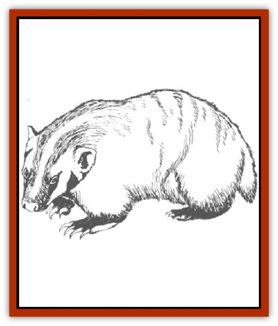

# Badger

| Statistic | **Common** | **Giant** |
| --- | --- | --- |
| **Activity Cycle:** | Night | Night |
| **Alignment:** | Neutral | Neutral |
| **Armor Class:** | 4 | 4 |
| **Climate/Terrain:** | Temperate/Forests, plains, swamp and mountains | Temperate/Forests, plains, swamp and mountains |
| **Damage/Attack:** | 1-2/1-2/1-3 | 1-3/1-3/1-6 |
| **Diet:** | Carnivore | Carnivore |
| **Frequency:** | Uncommon | Uncommon |
| **Hit Dice:** | 1+2 | 3 |
| **Intelligence:** | Semi- (2-4) | Semi- (2-4) |
| **Magic Resistance:** | Nil | Nil |
| **Morale:** | Average (8) | Average (8) |
| **Movement:** | 6, Br 3 | 6, Br 3 |
| **No. Appearing:** | 2-5 | 2-5 |
| **No. of Attacks:** | 3 | 3 |
| **Organization:** | Family | Family |
| **Size:** | S (2' long) | M (4' long) |
| **Special Attacks:** | Nil | Nil |
| **Special Defenses:** | Nil | Nil |
| **THAC0:** | 19 | 17 |
| **Treasure:** | Nil | Nil |
| **XP Value:** | 35 | 65 |

Badgers are carnivorous burrowing animals that live underground and hunt at night. Badgers are quick-tempered and courageous; if threatened, badgers will unhesitatingly attack creatures many times larger than themselves.

The badger's plump body is about two feet long, covered from head to toe with long thick fur. From a distance, the badger appears to be silver or gray in color, but a close examination reveals that each shaft of hair is actually a combination of several colors, usually gray, black, white, and brown. A white stripe about one to two inches thick begins at the badger's nose and runs between its eyes and down its back. Black patches of fur adorn each side of its lace. The badger gets its name from these <q>badges</q> of color.

The badger's short legs are extremely strong, ending in sharp claws that enable it to burrow through the rockiest soil and effectively defend itself from predators. When attempting to catch scents in the air, the badger perches on its hind legs like a gopher. It waddles when it walks, making it look awkward and clumsy as its body slowly shifts from side to side. But the badger actually can move quite fast when necessary; in fact, its speed accounts for its relatively high AC rating. The badger has sharp senses of smell, hearing, and sight. It also gives off an unpleasant aroma similar to human sweat.

**Combat:** If a badger is encountered away from its lair, it normally attempts to run away and hide. However, if disturbed in its lair or if cornered, it fights with surprising viciousness, regardless of the size or strength of its opponent. The badger attacks by baring its sharp teeth and lunging at its opponent, attempting to bite and claw. Snapping, chewing, and slashing, the badger goes for its opponent's throat if within reach, otherwise it assaults the opponent's abdomen; any exposed areas of an opponent, such as face or arms, are also likely targets of a badger's attack. A badger snarls and salivates while attacking, and in most cases fights to the death.

**Habitat/Society:** Badgers are extremely skilled burrowers. They prefer to dig their dens in the soft earth of forest floors and farmlands, but they can also thrive in mountains and hillsides. The entrance to a badger den is a circular hole about one to two feet in diameter, surrounded by a ring of soil from the original excavation. The tunnel angles gently into the earth, is usually about four to six feet long, and ends in a chamber that can be as small as four feet wide or as large as 10 feet wide, depending on the size of the family. The floor of the den is typically littered with remnants of previous meals and beds of beasts and grass for sleeping. Badgers are not particularly good housekeepers; if a den becomes excessively filthy, the family may relocate to a nearby area and dig new living quarters.

Badgers are not social animals, but they are extremely loyal to their mates and their families. Badgers are most typically encountered as either solitary creatures or as a mated pair. If more than a pair is encountered, the rest are the pair's offspring. A family reacts aggressively toward any strangers, including other badgers, invading the immediate territory of its den.

Male badgers hunt at night while the females remain in the den to care for their young. If a mated pair has no young, they often hunt together. Badgers bring captured prey back to their den and usually devour the entire creature, bones and all. When not hunting, badgers stay home. Badgers living in cold climates hibernate for most of the winter. Badgers do not collect treasure.

**Ecology:** Badger flesh is greasy, tough, and not particularly appetizing. Because of their vicious nature, hunting badgers is not worth the trouble for most predators, although a hungry wolf or fox can occasionally be seen pawing the entrance to a badger den. Badgers eat rodents, squirrels, gophers, and other small animals.

Badger fur is sold commercially to make coats, gloves, and mufflers. A quality pelt brings as much as 10-30 gold pieces. Badger hair can be made into brushes.

**Giant Badger**

  There is a very rare variety of badger found in remote forests that grows to about twice the size of the common badger (about four feet long). It inflicts more damage when attacking, and it tends to be more aggressive. Its statistics are otherwise identical to those of the common badger. Its pelt is also more valuable.

---
## Discovery & Documentation

**Source Publication:** MC2 Volume II (1993)
**Campaign Setting:** Advanced Dungeons & Dragons 2nd Edition
**Author(s):** Jay Batista, Scott Bennie, Grant Boucher, William W. Connors, Steve Gilbert, Heike Kubasch, James Lowder, David Edward Martin, Bruce Nesmith, Jean Rabe, Rick Swan, John J. Terra, Gary L. Thomas

### Other Creatures Found in This Source Book
   * [[Ant|Ant]]
   * [[Ant_Lion_Giant|Ant Lion, Giant]]
   * [[Ape_Carnivorous|Ape, Carnivorous]]
   * [[Baboon|Baboon]]
   * [[Barracuda|Barracuda]]
   * [[Beetle_Giant|Beetle, Giant]]
   * [[Bulette|Bulette]]
   * [[Bullywug|Bullywug]]
   * [[Dwarf_Duergar|Dwarf, Duergar]]
   * [[Dwarf_Gully|Dwarf, Gully]]
   * [[Eagle|Eagle]]
   * [[Eel|Eel]]
   * [[Elemental_Air_Kin|Elemental, Air Kin]]
   * [[Elemental_Water_Kin|Elemental, Water Kin]]
   * [[Elemental_Water_Kin_Water_Weird|Elemental, Water Kin, Water Weird]]
   * [[Firestar|Firestar]]
   * [[Firetail|Firetail]]
   * [[Fish_Giant|Fish, Giant]]
   * [[Frog|Frog]]
   * [[Gorgon|Gorgon]]
   * [[Hawk|Hawk]]
   * [[Heucuva|Heucuva]]
   * [[Hippocampus|Hippocampus]]
   * [[Hippogriff|Hippogriff]]
   * [[Kelpie|Kelpie]]
   * [[Kenku|Kenku]]
   * [[Killmoulis|Killmoulis]]
   * [[Kuo-Toa|Kuo-Toa]]
   * [[Lamia|Lamia]]
   * [[Lammasu|Lammasu]]
   * [[Lamprey|Lamprey]]
   * [[Leech|Leech]]
   * [[Leprechaun|Leprechaun]]
   * [[Leucrotta|Leucrotta]]
   * [[Locathah|Locathah]]
   * [[Lycanthrope_Wereboar|Lycanthrope, Wereboar]]
   * [[Lycanthrope_Werefox|Lycanthrope, Werefox]]
   * [[Mammal_Minimal|Mammal, Minimal]]
   * [[Mammal_Small|Mammal, Small]]
   * [[Mimic|Mimic]]
   * [[Morkoth|Morkoth]]
   * [[Muckdweller|Muckdweller]]
   * [[Myconid|Myconid]]
   * [[Naga|Naga]]
   * [[Obliviax|Obliviax]]
   * [[Octopus_Giant|Octopus, Giant]]
   * [[Otyugh|Otyugh]]
   * [[Piranha|Piranha]]
   * [[Plant_Dangerous_I|Plant, Dangerous I]]
   * [[Plant_Intelligent|Plant, Intelligent]]
   * [[Poltergeist|Poltergeist]]
   * [[Porcupine|Porcupine]]
   * [[Rat_Osquip|Rat, Osquip]]
   * [[Roc|Roc]]
   * [[Roper|Roper]]
   * [[Rot_Grub|Rot Grub]]
   * [[Rust_Monster|Rust Monster]]
   * [[Sahuagin|Sahuagin]]
   * [[Sea_Lion|Sea Lion]]
   * [[Sea_Horse_Giant|Sea Horse, Giant]]
   * [[Shambling_Mound|Shambling Mound]]
   * [[Shark|Shark]]
   * [[Sphinx|Sphinx]]
   * [[Squid_Giant|Squid, Giant]]
   * [[Stirge|Stirge]]
   * [[Swanmay|Swanmay]]
   * [[Tarrasque|Tarrasque]]
   * [[Tasloi|Tasloi]]
   * [[Triton|Triton]]
   * [[Troglodyte|Troglodyte]]
   * [[Urchin|Urchin]]
   * [[Urd|Urd]]
   * [[Weasel|Weasel]]
   * [[Wolverine|Wolverine]]
   * [[Yellow_Musk_Creeper|Yellow Musk Creeper]]
