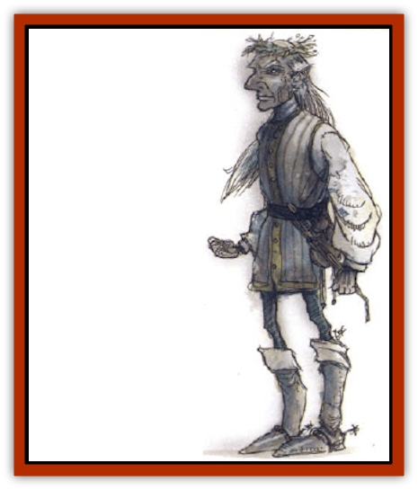

# Baelnorn

| Statistic | **Baelnorn** |
| --- | --- |
| **Activity Cycle:** | Any |
| **Alignment:** | Lawful good (15% are lawful neutral) |
| **Armor Class:** | 0 |
| **Climate/Terrain:** | Any temperate land |
| **Damage/Attack:** | 1d10 or by weapon |
| **Diet:** | None |
| **Frequency:** | Very rare |
| **Hit Dice:** | 9+6 |
| **Intelligence:** | As in life (17-20) |
| **Magic Resistance:** | 50% |
| **Morale:** | Fearless (20) |
| **Movement:** | 9 |
| **No. Appearing:** | 1 |
| **No. of Attacks:** | 1 |
| **Organization:** | Solitary |
| **Size:** | M (5' tall) |
| **Special Attacks:** | Spells |
| **Special Defenses:** | +1 or better weapon to hit |
| **THAC0:** | 11 |
| **Treasure:** | Any (as guardian) |
| **XP Value:** | 10,000 |

Baelnorn are [[Elf|elves]] who have sought undeath to serve their families, communities, or other purposes (usually to see a wrong righted, or to achieve a certain magical discovery or deed). They are lifelike creatures that appear as tall, impressive-looking elves with shriveled skin and glowing white eyes. Most baelnorns keep to the crypts, ruins, or mage-towers they guard or work in, and they are never seen except by those who intrude into such places.

**Combat:** Baelnorn do not project a terrifying aura as do [[Lich|liches]], but the chill of their unlife inflicts the same touch damage (plus paralysis if the victim fails a save). However, some go armed into battle if they possess magical weapons that cause greater damage than their touch. They employ spells as they did in life (most were 15th-level wizards), using spellbooks and magical components, but many develop variant spells that don't require material components. Most baelnorn have developed rare and strange spells lost to today's mages. They also employ magical items.

Baelnorn can be hit only by +1 or better magical weapons, by magical beings, or by creatures with 6 or more Hit Dice. They are immune to *charming*, cold-based spells, death (and related) magic, *disintegrate*, electricity, *enfeeblement*, *feeblemind*, *hold* (and related magic), insanity, and *sleep* spells. Neither nonintelligent animals nor undead willingly attack a baelnorn.

Baelnorn have a special power: Thrice per day, up to five turns at a time, and without employing a spell to do it, they can use a *project image* power to send a [[Wraith|wraith]]like likeness of themselves, called a *sending*, up to a mile distant. Baelnorn can see through these images with their normal 90-foot infravision, and into the Ethereal Plane too. They can also hear and speak through them, and can even cast spells (the image serves as the source of the spell). This link transcends physical and all known magical barriers, and it can even cross the boundaries between the Prime Material and Ethereal Planes.

A sending is AC 0, MV Fl 9 (A), and has the hit points of the baelnorn itself, but lacks the ability to carry solid objects (including weapons or items), turn undead, or inflict damage by touch. Only half the damage (round down) suffered by a baelnorn's sending is borne by the creature itself. A sending vanishes at the baelnorn's will or when it is killed; it cannot be turned or magically dispelled. A sending can push against or move small things, so it may push its finger through sand or ashes to write a message, or turn a page of an open book, but it has insufficient mass to carry things. A baelnorn can have only one sending in operation at a time.

These creatures are turned as liches (although they cannot be turned while in the area they guard or are linked to), and they themselves turn undead as 14th-level priests.

**Habitat/Society:** Baelnorn spend their existences diligently working at whatever task they find important enough to endure undeath for. If they guard a place or an item of power, they typically spend centuries laying traps, placing items at the ready, setting spell triggers, creating or summoning guardian monsters, and formulating defensive strategies. Many baelnorn have no interest in combat, but they are both fearless and brilliant and will always do whatever best serves their task.

**Ecology:** Baelnorn do not have phylacteries, but many have specialized clones that are activated if they are destroyed. (They pass into a *spirit trap*, created by a powerful and secret 7th-level spell, and then are whisked into their next body.)

The process by which elves become baelnorn is old, secret, and complicated. They have never been numerous, and none have been created in recorded history. Baelnorn do not eat, drink, excrete, or breathe, and nothing preys upon them.

---
## Discovery & Documentation

**Source Publication:** Monstrous Compendium, 1994 Annual, Volume 1 (1995)
**Campaign Setting:** Advanced Dungeons & Dragons 2nd Edition
**Author(s):** David Wise

### Other Creatures Found in This Source Book
   * [[Abyss_Ant|Abyss Ant]]
   * [[Achaierai|Achaierai]]
   * [[Afanc|Afanc]]
   * [[Al-Jahar|Al-Jahar]]
   * [[Baneguard|Baneguard]]
   * [[Banelar|Banelar]]
   * [[Bird_Talking|Bird, Talking]]
   * [[Blazing_Bones|Blazing Bones]]
   * [[Campestri|Campestri]]
   * [[Caniquine|Caniquine]]
   * [[Cat_Winged|Cat, Winged]]
   * [[Crypt_Servant|Crypt Servant]]
   * [[Death's_Head_Tree|Death's Head Tree]]
   * [[Dog_Saluqi|Dog, Saluqi]]
   * [[Dragon_Electrum|Dragon, Electrum]]
   * [[Dragon_Fang|Dragon, Fang]]
   * [[Dragon_Linnorm_Corpse_Tearer|Dragon, Linnorm, Corpse Tearer]]
   * [[Dragon_Linnorm_Dread|Dragon, Linnorm, Dread]]
   * [[Dragon_Linnorm_Flame|Dragon, Linnorm, Flame]]
   * [[Dragon_Linnorm_Forest|Dragon, Linnorm, Forest]]
   * [[Dragon_Linnorm_Frost|Dragon, Linnorm, Frost]]
   * [[Dragon_Linnorm_Gray|Dragon, Linnorm, Gray]]
   * [[Dragon_Linnorm_Land|Dragon, Linnorm, Land]]
   * [[Dragon_Linnorm_Midgard|Dragon, Linnorm, Midgard]]
   * [[Dragon_Linnorm_Rain|Dragon, Linnorm, Rain]]
   * [[Dragon_Linnorm_Sea|Dragon, Linnorm, Sea]]
   * [[Dragon_Neutral_Jacinth|Dragon, Neutral, Jacinth]]
   * [[Dragon_Neutral_Jade|Dragon, Neutral, Jade]]
   * [[Dragon_Neutral_Pearl|Dragon, Neutral, Pearl]]
   * [[Dread|Dread]]
   * [[Dragon-kin|Dragon-kin]]
   * [[Elemental_Earth_Kin_Chrysmal|Elemental, Earth Kin, Chrysmal]]
   * [[Elemental_Earth_Kin_Earth_Weird|Elemental, Earth Kin, Earth Weird]]
   * [[Elemental_Fire_Kin_Azer|Elemental, Fire Kin, Azer]]
   * [[Elemental_Sandman|Elemental, Sandman]]
   * [[Elemental_Wind_Walker|Elemental, Wind Walker]]
   * [[Elemental_Vermin|Elemental Vermin]]
   * [[Feystag|Feystag]]
   * [[Flame_Skull|Flame Skull]]
   * [[Foulwing|Foulwing]]
   * [[Gambado|Gambado]]
   * [[Garbug|Garbug]]
   * [[Genie_Tasked_Administrator|Genie, Tasked, Administrator]]
   * [[Genie_Tasked_Deceiver|Genie, Tasked, Deceiver]]
   * [[Genie_Tasked_Harim_Servant|Genie, Tasked, Harim Servant]]
   * [[Genie_Tasked_Messenger|Genie, Tasked, Messenger]]
   * [[Genie_Tasked_Miner|Genie, Tasked, Miner]]
   * [[Genie_Tasked_Oathbinder|Genie, Tasked, Oathbinder]]
   * [[Gibbering_Mouther|Gibbering Mouther]]
   * [[Gnasher|Gnasher]]
   * [[Gnasher_Winged|Gnasher, Winged]]
   * [[Golem_Brain|Golem, Brain]]
   * [[Golem_Hammer|Golem, Hammer]]
   * [[Golem_Metagolem|Golem, Metagolem]]
   * [[Golem_Spiderstone|Golem, Spiderstone]]
   * [[Gorynych|Gorynych]]
   * [[Greelox|Greelox]]
   * [[Helmed_Horror|Helmed Horror]]
   * [[Jarbo|Jarbo]]
   * [[Laraken|Laraken]]
   * [[Lich_Psionic|Lich, Psionic]]
   * [[Living_Steel|Living Steel]]
   * [[Lock_Lurker|Lock Lurker]]
   * [[Loxo|Loxo]]
   * [[Lycanthrope_Loup_de_Noir|Lycanthrope, Loup de Noir]]
   * [[Lycanthrope_Werebadger|Lycanthrope, Werebadger]]
   * [[Lycanthrope_Werejaguar|Lycanthrope, Werejaguar]]
   * [[Lythlyx|Lythlyx]]
   * [[Magebane|Magebane]]
   * [[Marrashi|Marrashi]]
   * [[Metalmaster|Metalmaster]]
   * [[Mimic_House_Hunter|Mimic, House Hunter]]
   * [[Naga_Bone|Naga, Bone]]
   * [[Nautilus_Giant|Nautilus, Giant]]
   * [[Nightshade_Toril|Nightshade (Toril)]]
   * [[Nishruu|Nishruu]]
   * [[Noran|Noran]]
   * [[Opinicus|Opinicus]]
   * [[Ormyrr|Ormyrr]]
   * [[Parasite|Parasite]]
   * [[Pasari-Niml|Pasari-Niml]]
   * [[Plant_Vampire_Moss|Plant, Vampire Moss]]
   * [[Pteraman|Pteraman]]
   * [[Rautym|Rautym]]
   * [[Shadeling|Shadeling]]
   * [[Skum|Skum]]
   * [[Snake_Giant_Cobra|Snake, Giant Cobra]]
   * [[Snake_Stone|Snake, Stone]]
   * [[Spectral_Wizard|Spectral Wizard]]
   * [[Spell_Weaver|Spell Weaver]]
   * [[Spider_Brain|Spider, Brain]]
   * [[Suwyze|Suwyze]]
   * [[Tatalla|Tatalla]]
   * [[Tick_Heart|Tick, Heart]]
   * [[Tree_Dark|Tree, Dark]]
   * [[Tree_Singing|Tree, Singing]]
   * [[Tressym|Tressym]]
   * [[Troll_Snow|Troll, Snow]]
   * [[Tuyewera|Tuyewera]]
   * [[Ulitharid|Ulitharid]]
   * [[Undead_Dwarf|Undead Dwarf]]
   * [[Undead_Lake_Monster|Undead Lake Monster]]
   * [[Whipsting|Whipsting]]
   * [[Windghost|Windghost]]
   * [[Wolf_Dread|Wolf, Dread]]
   * [[Wolf_Stone|Wolf, Stone]]
   * [[Wolf_Vampiric|Wolf, Vampiric]]
   * [[Wraith_Shimmering|Wraith, Shimmering]]
   * [[Xantravar|Xantravar]]
   * [[Xaver|Xaver]]
