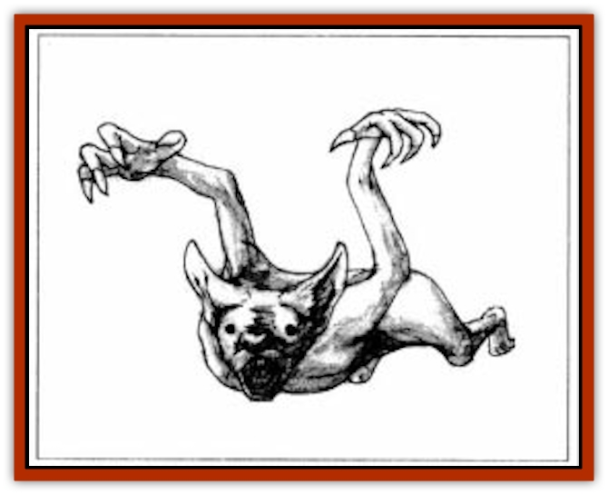

# Bainligor

| Statistic | **Bainligor** |
| --- | --- |
| **Activity Cycle:** | Night |
| **Alignment:** | Neutral evil |
| **Armor Class:** | 7 |
| **Climate/Terrain:** | Underdark |
| **Damage/Attack:** | See below |
| **Diet:** | Omnivore |
| **Frequency:** | Rare |
| **Hit Dice:** | 2+1 to 10+9 |
| **Intelligence:** | Very (11-12) |
| **Magic Resistance:** | Nil |
| **Morale:** | Unsteady (5-7) |
| **Movement:** | 6, Jp 9 |
| **No. Appearing:** | 4-400 |
| **No. of Attacks:** | 2 |
| **Organization:** | Tribal |
| **Size:** | M (3-6' tall) |
| **Special Attacks:** | Echolocation, stun |
| **Special Defenses:** | Dodge missiles |
| **THAC0:** | See below |
| **Treasure:** | Nil (Q&times;10) |
| **XP Value:** | See below |

Bainligors are small, flightless [[Bat|bat]]-people. Their primitive tribal culture is found in the upper reaches of the Underdark, where they subsist almost entirely on insects, spiders, rothe, and edible fungi. Bainligors are considered hideous by even the most charitable. Their ears are huge and pointed, their ridged snouts and elaborately sculpted facial features are those of bats.

Though bainligors can speak Underdark trade common, most of their speech is too high-pitched for others to hear. Even if one speaks in a voice low enough to be heard by other races, its voice remains a high-pitched squeak. As a result, bainligors rarely speak with outsiders and carry on less trade than other races. Most of what they have is of little value; bone and stone tools, tanned hides, and small quantities of food are their usual treasures.

**Combat:** The cries of a rampaging pack of bainligor are inaudible to the ears of most humans and demihumans, but dogs and cats often warn against such attacks; they can hear bainligors coming. Bainligors hunt in darkness using echolocation just as did their bat ancestors. They are completely unaffected by *darkness 15' radius*, *invisibility*, and *blindness* spells and all visual illusions.  In battle, bainligors attack en masse, hoping to pull prey down quickly. The smallest rake for 1d4 points of damage with claws and bite with needle-like teeth for the same, larget bainligors attack for 1d6 or 1d6+1, 1d10 for elders and eventually 1d12 for the Revered. Deafness spells blind the bainligor, reducing their attacks by -4.

Bainligor can use their echolocation chirps as a weapon. Once per hour, a bainligor can emit a burst of ultrasoni sound that hammers flesh like a gigantic fist. The attack replaces other attacks, inflicting 1d6 points of damage per Hit Die of the bainligor. A target creature failing a saving throw vs. paralyzation is stunned and unable to do more than defend, at a -2 penalty to AC and no dexrerity bonus for 1d4 rounds. A creature failing by 8 or more is permanently deafened.

Bainligor can dodge missiles. When involved in melee their AC against missile attacks is six places higher (AC 1). When concentrating on evading such attacks, they are hit only on an attack roll of 20. This ability only affects missile attacks that require an attack roll.

**Habitat/Society:** Bainligor society is based on reverence of the elderly; young bainligors always defer to the commands of the old. As they age, the bat-people continue to grow larger throughout their lives in a series of magical transformations. Eventually, the eldest of the bainligor leave their tribes, compelled by an inner voice to seek out dry, empty caverns where their bodies are transformed for the last time. Once they return from their seclusion, they are undead creatures of 10+9 Hit Dice, called Revered Ones. These creatures are chieftains, war leaders, priests, and guardians of their descendants; the strongest of them may rule a swarm of bainligors for generations. A few of the undead (about 10%) become spellcasters after they make the transition to unlife; all of their followers are fanatically loyal to them.

**Ecology:** Bainligors are nomads and scavengers, feasting on insectss detritus, and even rotting flesh if necessary. Rather than a source of shame, this scavenging, wandering existence is a source of pride among the bainligor, for they believe that they can survive anywhere, on anything, whereas others are tied to the earth by their possessions, their cities, and their weakness for special foods. Eating noxious foods is a source of many bainligor boasts.

Tales are told of the Deep Tribes, those who starved until they were reduced to nothing but dozens of the Revered, who still hunt in great swarms, not for nourishment but for the joy of their great strength and the fear they cause in others. These are likely nothing more than myths told to bainligor young, for such sightings have never been confirmed by sages or savants of the Underdark races.

| Age | HD | THAC0 | Dmg | Sonic Burst | XP Value |
| --- | --- | --- | --- | --- | --- |
| Young | 2+1 | 19 | 1d4/1d4 | 2d6 | 270 |
| Adult | 4+3 | 15 | 1d6/1d6 | 4d6 | 650 |
| Middle-aged | 6+5 | 13 | 1d6+1/1d6+1 | 6d6 | 975 |
| Elderly | 8+7 | 11 | 1d10/1d10 | 8d6 | 2,000 |
| Revered | 10+9 | 9 | 1d12/1d12 | 100d6 | 5,000 |

---
## Discovery & Documentation

**Source Publication:** Monstrous Compendium, 1997 Annual, Volume 4 (1995)
**Campaign Setting:** Advanced Dungeons & Dragons 2nd Edition
**Author(s):** Jon Pickens

### Other Creatures Found in This Source Book
   * [[Anemone_Giant_Sea|Anemone, Giant Sea]]
   * [[Asperii|Asperii]]
   * [[Beast_of_Chaos|Beast of Chaos]]
   * [[Blindheim|Blindheim]]
   * [[Bloodsipper_Far_Realm|Bloodsipper (Far Realm)]]
   * [[Bulette_Gohlbrorn|Bulette, Gohlbrorn]]
   * [[Child_of_the_Sea|Child of the Sea]]
   * [[Clockwork_Horror|Clockwork Horror]]
   * [[Clockwork_Swordsman|Clockwork Swordsman]]
   * [[Coral|Coral]]
   * [[Darklore|Darklore]]
   * [[Dharculus|Dharculus]]
   * [[Dolphin_Athas|Dolphin (Athas)]]
   * [[Dragon_Neutral_Moonstone|Dragon, Neutral, Moonstone]]
   * [[Dragon_Prismatic|Dragon, Prismatic]]
   * [[Dream_Stalker|Dream Stalker]]
   * [[Dragon-kin_Albino_Wyrm|Dragon-kin, Albino Wyrm]]
   * [[Echyan|Echyan]]
   * [[Firestar|Firestar]]
   * [[Firetail|Firetail]]
   * [[Fish_Ascallion|Fish, Ascallion]]
   * [[Fish_Deep_Ocean|Fish, Deep Ocean]]
   * [[Fish_Tropical|Fish, Tropical]]
   * [[Fish_Vurgens|Fish, Vurgens]]
   * [[Fogwarden|Fogwarden]]
   * [[Fraal|Fraal]]
   * [[Giant_Crag|Giant, Crag]]
   * [[Gibberling_Brood|Gibberling, Brood]]
   * [[Glutton_Sea|Glutton, Sea]]
   * [[Golden_Ammonite|Golden Ammonite]]
   * [[Golem_Brass_Minotaur|Golem, Brass Minotaur]]
   * [[Golem_Gemstone|Golem, Gemstone]]
   * [[Golem_Maggot|Golem, Maggot]]
   * [[Groundling|Groundling]]
   * [[Hermit_Sea|Hermit, Sea]]
   * [[Hound_of_Law|Hound of Law]]
   * [[Human_Amazon|Human, Amazon]]
   * [[Human_Pygmy|Human, Pygmy]]
   * [[Inquisitor|Inquisitor]]
   * [[Kercpa|Kercpa]]
   * [[Kreel|Kreel]]
   * [[Lycanthrope_Lythari|Lycanthrope, Lythari]]
   * [[Mercurial|Mercurial]]
   * [[Mold_Chromatic|Mold, Chromatic]]
   * [[Mummy_Bog|Mummy, Bog]]
   * [[Neh-thalggu|Neh-thalggu]]
   * [[Nymph_Grain|Nymph, Grain]]
   * [[Nymph_Unseelie|Nymph, Unseelie]]
   * [[Octopus_Octo-Jelly|Octopus, Octo-Jelly]]
   * [[Puddingfish|Puddingfish]]
   * [[Sea_Demon|Sea Demon]]
   * [[Shade|Shade]]
   * [[Shadowrath|Shadowrath]]
   * [[Shark_Athas|Shark (Athas)]]
   * [[Siren_Ravenloft|Siren (Ravenloft)]]
   * [[Skeleton_Variant|Skeleton, Variant]]
   * [[Skyfish|Skyfish]]
   * [[Spectral_Scion|Spectral Scion]]
   * [[Spyder_Fiend|Spyder Fiend]]
   * [[Squid_Squark|Squid, Squark]]
   * [[Tanar'ri_Lesser_Uridezu|Tanar'ri, Lesser, Uridezu]]
   * [[Troll_Mutate|Troll Mutate]]
   * [[Vaati|Vaati]]
   * [[Vampire_Cerebral|Vampire, Cerebral]]
   * [[Varkha|Varkha]]
   * [[Wizshade|Wizshade]]
   * [[Worm_Lukhorn|Worm, Lukhorn]]
   * [[Wyste|Wyste]]
   * [[Yugoloth_Lesser_Gacholoth|Yugoloth, Lesser, Gacholoth]]
   * [[Zombie_Mud|Zombie, Mud]]
