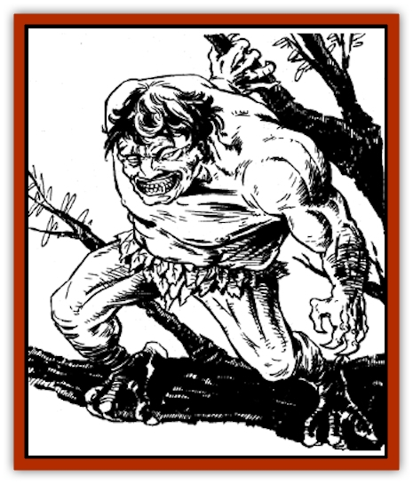

# Bajang

| Statistic | **Bajang** |
| --- | --- |
| **Activity Cycle:** | Night |
| **Alignment:** | Chaotic evil |
| **Armor Class:** | 2 |
| **Climate/Terrain:** | Tropical jungle |
| **Damage/Attack:** | 1-4/1-4 |
| **Diet:** | Carnivore |
| **Frequency:** | Very rare |
| **Hit Dice:** | 6 |
| **Intelligence:** | High (13-14) |
| **Magic Resistance:** | 10% |
| **Morale:** | Steady (12) |
| **Movement:** | 12 |
| **No. Appearing:** | 1 |
| **No. of Attacks:** | 2 |
| **Organization:** | Solitary |
| **Size:** | S (3' tall) |
| **Special Attacks:** | Spells, poison |
| **Special Defenses:** | See below |
| **THAC0:** | 15 |
| **Treasure:** | P |
| **XP Value:** | 3,000 |

The bajang is an intelligent creature found in tropical jungles. It delights in terrorizing human settlements. A lesser spirit, its lifeforce is tied to a single tree in the forest in which it dwells.

The bajang's true form is that of a stunted, stocky human with a blunt nose, wispy hair, and pale brown skin. It has beady orange eyes and a wide, lipless mouth, which is permanently creased in an evil sneer. Its hands are bony claws, and its feet resemble the talons of a vulture. The creature speaks its own language, as well as the language common to the area it inhabits.

The bajang can *shape change* at will into the form of a small [[Cat_Small|wildcat]]. The creature is most often encountered in this form. As a wildcat, it has light brown fur and retains its distinctive orange eyes.

**Combat:** A vicious and devious fighter, the bajang prefers wounded, weak, or otherwise helpless prey, attacking them in their sleep or ambushing them from behind. Generally, a bajang won't negotiate with opponents unless its life is clearly endangered, in which case it may lie outrageously or make any threat to save itself. If its tree is endangered, however, a bajang will always fight to the death.

Since its bony hands are too awkward to manipulate weapons, the bajang can only rake with its claws in melee. However, any opponent struck by its claws must make a saving throw vs. poison. A failed save means the victim suffers a -1 penalty on all saving throws and to-hit rolls for the next 2-7 (1d6 + 1) rounds. The effect is cumulative; each claw rake can increase the penalty.

In human form, the bajang can cast *curse*, *omen*, *divination*, *fate*, *ghost light*, *wind breath*, *steam breath*, and *transfix* three times per day. It can cast *ancient curse* once per day. Typically, the bajang is nowhere to be seen when it *transfixes* its victims, ordering them to stay put for an indefinite period. (This enables the creature to attack at leisure.) In combat, the bajang often uses *wind breath* and *steam breath* to weaken opponents, followed by claw attacks if it is within range. It holds *ancient curse* in reserve, and prefers to use it to threaten opponents who are about to destroy the bajang or its lifeforce tree.

The best way to eliminate a bajang is destroying its tree. After finding the tree - usually by observing the bajang's frantic efforts to protect it - a character can destroy it by chopping it down, setting it afire, or with another ruinous technique such as a *wood rot* spell. The bajang suffers no ill effects while its tree is under attack, but once the tree is destroyed, the creature is immediately reduced to 0 hit points and disappears.

In wildcat form, the bajang retains the Armor Class, Hit Dice, movement, and hit points of its original form. It can attack three times per round, inflicting 1-2 points of damage for each successful bite and front claw attack. If both forepaw attacks are successful in the same round, it can attempt two rear claw attacks for an additional 1-2 points of damage each. A bajang cannot cast spells while in wildcat form.

**Habitat/Society:** The bajang makes its lair in its lifeforce tree. It prefers to live in a dense jungle, where its tree is more difficult for enemies to locate. Any tree is suitable for a bajang lair, but the creature usually selects one within a mile of a small village. The bajang raids the village regularly, attacking a sleeping victim and carrying the body back into the forest.

Bajang are solitary creatures, and they do not mate to reproduce. Instead, they are <q>reincarnated</q>. When a bajang is killed, its spirit becomes dormant, waiting to be reborn in a corrupted forest. A <q>corrupted</q> forest might be the site of a bloody battle, the burial place of an evil wu jen, or the secret meeting place of an evil sect. When a tree has grown to maturity in this forest, the bajang's dormant spirit is absorbed through the roots during a full moon. A swelling appears at the bottom of the tree, then rises through the trunk. When the swelling reaches the highest limb, the now fully-formed bajang bursts through the bark. Its lifeforce is joined with that of the tree.

A bajang's treasure is a small collection of coins stored in a hollow of its tree. Bajang collect treasure more as a souvenir from a victim than for monetary value.

**Ecology:** Bajangs are carnivores, feasting on carrion when no other option exists. They are solitary, but some bajangs occasionally serve as familiars for powerful, evil wu jen.

---
## Discovery & Documentation

**Source Publication:** MC6 Kara-Tur Appendix (1990)
**Campaign Setting:** Kara-Tur (Forgotten Realms)
**Author(s):** Rick Swan

### Other Creatures Found in This Source Book
   * [[Bakemono|Bakemono]]
   * [[Bisan|Bisan]]
   * [[Buso|Buso]]
   * [[Carp_Giant|Carp, Giant]]
   * [[Centipede_Spirit|Centipede, Spirit]]
   * [[Chu-u|Chu-u]]
   * [[Con-tinh|Con-tinh]]
   * [[Doc_cu'o'c|Doc cu'o'c]]
   * [[Duruch'i-lin|Duruch'i-lin]]
   * [[Flame_Spirit|Flame Spirit]]
   * [[Foo_Creature|Foo Creature]]
   * [[Gaki|Gaki]]
   * [[Gargantua|Gargantua]]
   * [[Goblin_Rat|Goblin Rat]]
   * [[Hai_Nu|Hai Nu]]
   * [[Hannya|Hannya]]
   * [[Hengeyokai|Hengeyokai]]
   * [[Hsing-sing|Hsing-sing]]
   * [[Hu_Hsien|Hu Hsien]]
   * [[Human_Kara-Tur|Human (Kara-Tur)]]
   * [[Ikiryo|Ikiryo]]
   * [[Jishin_Mushi|Jishin Mushi]]
   * [[Kala|Kala]]
   * [[Kaluk|Kaluk]]
   * [[Kappa|Kappa]]
   * [[Korobokuru|Korobokuru]]
   * [[Krakentua|Krakentua]]
   * [[Kuei|Kuei]]
   * [[Memedi|Memedi]]
   * [[Men-shen|Men-shen]]
   * [[Nat|Nat]]
   * [[Ningyo|Ningyo]]
   * [[Oni|Oni]]
   * [[P'oh|P'oh]]
   * [[P'oh_Gohei|P'oh, Gohei]]
   * [[Shan_Sao|Shan Sao]]
   * [[Shirokinukatsukami|Shirokinukatsukami]]
   * [[Spirit_Folk|Spirit Folk]]
   * [[Spirit_Nature|Spirit, Nature]]
   * [[Spirit_Stone|Spirit, Stone]]
   * [[Tako|Tako]]
   * [[Tengu|Tengu]]
   * [[Wang-Liang|Wang-Liang]]
   * [[Yuan-ti_Histachii|Yuan-ti, Histachii]]
   * [[Yuki-on-na|Yuki-on-na]]
