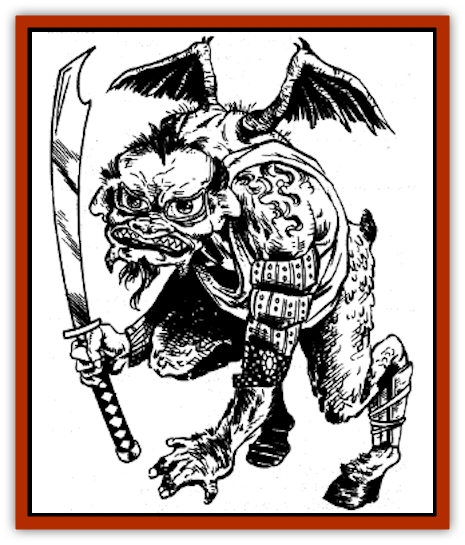

# Bakemono

| Statistic | **Bakemono** |
| --- | --- |
| **Activity Cycle:** | Night |
| **Alignment:** | Chaotic evil |
| **Armor Class:** | 6 |
| **Climate/Terrain:** | Any nonarctic land |
| **Damage/Attack:** | 1-6 (weapon) |
| **Diet:** | Carnivore |
| **Frequency:** | Uncommon |
| **Hit Dice:** | 1-1 |
| **Intelligence:** | Low (5-7) |
| **Magic Resistance:** | Nil |
| **Morale:** | Average (10) |
| **Movement:** | 6 |
| **No. Appearing:** | 1-100 |
| **No. of Attacks:** | 1 |
| **Organization:** | Band |
| **Size:** | S (4' tall) |
| **Special Attacks:** | Nil |
| **Special Defenses:** | Nil |
| **THAC0:** | 20 |
| **Treasure:** | A |
| **XP Value:** | 15 / Lieutenant: 35 |

The bakemono is an eastern variety of [[Goblin|goblin]], with similar habits and characteristics. Unlike goblins, bakemono are surface dwellers, and they are even more stupid than their western cousins.

No two bakemono are quite the same, even in size and overall shape. Their skin color varies from brilliant orange to fiery red to deep blue, while their eyes are typically black, yellow, green, or gray. Physical features may include a combination of small stunted wings, stumpy tails, hooves, fur, scales, huge noses, feathers, floppy ears, and hunched bodies. Clothing is similarly varied, ranging from tattered robes to shabby leather armor to filthy, cotton peasant dress. Most speak in high, shrill voices. All share the same nasty disposition.

Bakemono speak three languages: the trade language, the language of humans common to the area they inhabit, and their own language, which is similar to that of [[Oni|oni]].

**Combat:** Bakemono are clumsy, impulsive fighters; strategic planning is unknown to them. They ambush their opponents whenever possible, and often charge straight ahead with weapons swinging. Bakemono seldom make their own weapons or armor, preferring to use items they have scavenged or looted on raids. A typical force is equipped as follows: spear (40%), naginata and short sword (20%), tetsubo and short sword (10%), short sword and shortbow (10%), kusari-gama and trident (10%), chain and shuriken (5%), and katana (5%).

When a large force is encountered, 20% of the bakemono have an Armor Class of 5. This AC rating stems from the armor pieces they're wearing. The pieces are in poor repair, often having been crudely and drastically altered to fit the individual bakemono's strange body. Bakemono armor won't fit PCs.

Like goblins, bakemono hate daylight and other strong illumination, but they are not unusually sensitive and incur no attack penalties when fighting in bright light. However, bakemono lack the goblin's infravision ability, so they enjoy no particular advantage when fighting in darkness.

**Habitat/Society:** A typical band of bakemono consists of 20-80 (1d4 x20) adult males, a number of adult females equal to 60% of the number of males, and a number of children equal to the total number of adults. An oni or ogre mage usually rules each band. For every 20 adult males, there is a lieutenant of greater size (HD 2, AC 4, THAC0 19, Dmg 1-8). This lieutenant receives his orders from the oni (or [[Ogre|ogre mage]]) and has absolute command of the 20 males beneath him.

Conflict is a way of life. Bakemono drift from band to band as the mood strikes them, and accusations of disloyalty and treason often trigger violent battles. When not fighting amongst themselves, bakemono execute loosely-organized raids against human or humanoid settlements, or engage in banditry, preying on travelers and explorers. Neither females nor children fight in battles.

Bakemono steal virtually all their possessions, including weapons, food, and clothing. Except for a few inconsequential trinkets, all treasure items are divided among the lieutenants. Occasionally, bakemono acquire slaves as a result of their raids. There is a 20% chance that a bakemono band has slaves of various races. The slaves usually number 10-40% of the size of the band.

Since bakemono are poor miners, they are not inclined to make their lairs underground as western goblins do. Instead, bakemono typically establish a lair in an abandoned temple or village, driving out the rightful inhabitants if necessary. Bakemono lairs always lie in disrepair, are strewn with debris, and wreak of filth. Many lairs appear deserted as a result. On occasion (40% of the time), bakemono build a wooden stockade around their lair. About 10% of the band mans the stockade at all times, but it is not unusual to encounter these guards asleep, intoxicated, or otherwise neglecting their duties.

**Ecology:** Bakemono eat all types of wild game. Although they enjoy cooked meat, such preparation usually requires more effort than the bakemono are willing to spend. They also have a great weakness for strong drink and have been known to engage in brutal assaults on villages for the sole purpose of stealing sake. Aside from oni and ogre mages, bakemono have little to do with other creatures, and openly despise all humanoid races.

---
## Discovery & Documentation

**Source Publication:** MC6 Kara-Tur Appendix (1990)
**Campaign Setting:** Kara-Tur (Forgotten Realms)
**Author(s):** Rick Swan

### Other Creatures Found in This Source Book
   * [[Bajang|Bajang]]
   * [[Bisan|Bisan]]
   * [[Buso|Buso]]
   * [[Carp_Giant|Carp, Giant]]
   * [[Centipede_Spirit|Centipede, Spirit]]
   * [[Chu-u|Chu-u]]
   * [[Con-tinh|Con-tinh]]
   * [[Doc_cu'o'c|Doc cu'o'c]]
   * [[Duruch'i-lin|Duruch'i-lin]]
   * [[Flame_Spirit|Flame Spirit]]
   * [[Foo_Creature|Foo Creature]]
   * [[Gaki|Gaki]]
   * [[Gargantua|Gargantua]]
   * [[Goblin_Rat|Goblin Rat]]
   * [[Hai_Nu|Hai Nu]]
   * [[Hannya|Hannya]]
   * [[Hengeyokai|Hengeyokai]]
   * [[Hsing-sing|Hsing-sing]]
   * [[Hu_Hsien|Hu Hsien]]
   * [[Human_Kara-Tur|Human (Kara-Tur)]]
   * [[Ikiryo|Ikiryo]]
   * [[Jishin_Mushi|Jishin Mushi]]
   * [[Kala|Kala]]
   * [[Kaluk|Kaluk]]
   * [[Kappa|Kappa]]
   * [[Korobokuru|Korobokuru]]
   * [[Krakentua|Krakentua]]
   * [[Kuei|Kuei]]
   * [[Memedi|Memedi]]
   * [[Men-shen|Men-shen]]
   * [[Nat|Nat]]
   * [[Ningyo|Ningyo]]
   * [[Oni|Oni]]
   * [[P'oh|P'oh]]
   * [[P'oh_Gohei|P'oh, Gohei]]
   * [[Shan_Sao|Shan Sao]]
   * [[Shirokinukatsukami|Shirokinukatsukami]]
   * [[Spirit_Folk|Spirit Folk]]
   * [[Spirit_Nature|Spirit, Nature]]
   * [[Spirit_Stone|Spirit, Stone]]
   * [[Tako|Tako]]
   * [[Tengu|Tengu]]
   * [[Wang-Liang|Wang-Liang]]
   * [[Yuan-ti_Histachii|Yuan-ti, Histachii]]
   * [[Yuki-on-na|Yuki-on-na]]
