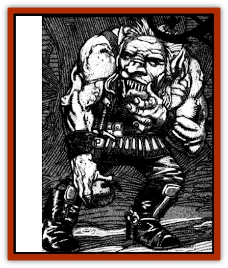

# Bakhna Rakhna

| Statistic | **Bakhna Rakhna** |
| --- | --- |
| **Activity Cycle:** | Night |
| **Alignment:** | Neutral evil |
| **Armor Class:** | 7 |
| **Climate/Terrain:** | Temperate woodlands |
| **Damage/Attack:** | 1d4 (by weapon) |
| **Diet:** | Omnivore |
| **Frequency:** | Uncommon |
| **Hit Dice:** | 1 |
| **Intelligence:** | Low (5-7) |
| **Magic Resistance:** | Nil |
| **Morale:** | Average (8-10) |
| **Movement:** | 6 |
| **No. Appearing:** | 4-24 (4d6) |
| **No. of Attacks:** | 1 |
| **Organization:** | Tribal |
| **Size:** | S (3' tall) |
| **Special Attacks:** | Poison weapons |
| **Special Defenses:** | Nil |
| **THAC0:** | 19 |
| **Treasure:** | C (K) |
| **XP Value:** | 175 |

These small jungle creatures look somewhat like albino [[Goblin|goblins]]. They are mischievous beings who make a habit of stealing food from the farms and settlements near their lairs. While it is possible to accommodate the bakhna rakhna, any efforts to thwart their depredations can result in disaster.

The bakhna rakhna are small humanoids with flat faces and sloping foreheads. They have broad noses and pointed ears as well as wide mouths filled with small sharp fangs. They walk upright and have long arms that hang to their knees. Their skin is white to pearl gray in color and their fatty hair sometimes has a pale yellow cast to it.

The bakhna rakhna speak their own language and some can communicate in halting common. Their vocabulary is fairly simple and tends to revolve around concepts like pain, pleasure, food, and naps.

**Combat:** These small creatures avoid direct physical confrontations whenever possible. They prefer to retreat to the brush where they can ambush their enemies if pursued.

Each bakhna rakhna carries a small bow as well as 1d6 pointed sticks that are coated with a paralytic poison. The sticks cause 1d4 points of damage and can be wielded as daggers or fired from the bows. Anyone struck by one of these sticks must make a saving throw vs. poison with a -3 penalty or be immediately paralyzed for 1d4 turns.

The bakhna rakhna generally will not kill opponents who have fallen in combat if the victims might serve as a future source of food to raid. If, however, any of their own are harmed, the bakhna rakhna's retribution can be quite ruthless. They will use their sticks to poke a single hole in the neck of a fallen paralyzed victim and allow his blood to drain away while he is fully conscious. A victim bleeding to death will lose 1 hit point per round but will die in 2d8+15 rounds even if he has hit points remaining. The bakhna rakhna never leave injured or dead comrades behind.

Bakhna rakhna are sensitive to sunlight and have infravision out to 180 feet. A *light* spell cast on a bakhna rakhna will cause it to have a fit that effectively paralyzes it for 1d4 turns it it fails its saving throw vs. spell.

The bakhna rakhna are extremely stealthy and have a 70% chance of hiding in shadows or moving silently. They also have the ability to *passwall* four times per day. A bakhna rakhna may cast *silence, 15' radius* twice per day. They are immune to all poisons.

**Habitat/Society:** Bakhna rakhna have an insatiable curiosity and prefer taking other people's food to hunting for their own. They use their ability to move through walls to gain entrance to homes and conduct their raids under the cover of their *silence* spells. Their raids are undertaken at night and they are rarely caught in the act. Unless food is set out for them, bakhna rakhna always manage to leave an extraordinary mess behind. If a raid is interrupted, the bakhna rakhna will flee through the walls.

The nuisance of this pillaging can be avoided if food is left out for the bakhna rakhna. If efforts are made to prevent their nocturnal visits, the bakhna rakhna will poison the food they have left behind with type G poison (ingested: 2d6 hours: 20/10). Additional attempts to stop these vermin can cause them to become a deadly menace.

Bakhna rakhna live in small clans of ten, but have been found in groups of as many as 30 creatures. They usually dwell in small underground burrows but may take up residence beneath the floor or porch of a human dwelling that has become a source of food.

**Ecology:** These small creatures live in forested areas and, while they can hunt and forage for food. do so only when in danger of starvation. They much prefer to live as scavengers, raiding neighboring settlements for the food and supplies they need to survive.

---
## Discovery & Documentation

**Source Publication:** Ravenloft Appendix III (1991)
**Campaign Setting:** Ravenloft
**Author(s):** Kirk Botulla

### Other Creatures Found in This Source Book
   * [[Akikage|Akikage]]
   * [[Animator_Common|Animator, Common]]
   * [[Animator_Greater|Animator, Greater]]
   * [[Animator_Minor|Animator, Minor]]
   * [[Animator_General_Information|Animator, General Information]]
   * [[Baobhan_Sith|Baobhan Sith]]
   * [[Beetle_Scarab|Beetle, Scarab]]
   * [[Boneless|Boneless]]
   * [[Boowray|Boowray]]
   * [[Bruja|Bruja]]
   * [[Carrionette|Carrionette]]
   * [[Carrion_Stalker|Carrion Stalker]]
   * [[Cat_Midnight|Cat, Midnight]]
   * [[Cat_Skeletal|Cat, Skeletal]]
   * [[Cloaker_Resplendent|Cloaker, Resplendent]]
   * [[Cloaker_Shadow|Cloaker, Shadow]]
   * [[Cloaker_Undead|Cloaker, Undead]]
   * [[Corpse_Candle|Corpse Candle]]
   * [[Death's_Head_Tree|Death's Head Tree]]
   * [[Doppelganger_Ravenloft|Doppelganger (Ravenloft)]]
   * [[Familiar_Pseudo-|Familiar, Pseudo-]]
   * [[Familiar_Undead|Familiar, Undead]]
   * [[Feathered_Serpent|Feathered Serpent]]
   * [[Fenhound|Fenhound]]
   * [[Figurine_Ceramic|Figurine, Ceramic]]
   * [[Figurine_Crystal|Figurine, Crystal]]
   * [[Figurine_Ivory|Figurine, Ivory]]
   * [[Figurine_Obsidian|Figurine, Obsidian]]
   * [[Figurine_Porcelain|Figurine, Porcelain]]
   * [[Figurine_General_Information|Figurine, General Information]]
   * [[Fleas_of_Madness|Fleas of Madness]]
   * [[Furies|Furies]]
   * [[Geist|Geist]]
   * [[Ghost_Animal|Ghost, Animal]]
   * [[Golem_Flesh_Ravenloft|Golem, Flesh (Ravenloft)]]
   * [[Golem_Mist_Ravenloft|Golem, Mist (Ravenloft)]]
   * [[Golem_Wax_Ravenloft|Golem, Wax (Ravenloft)]]
   * [[Gremishka|Gremishka]]
   * [[Hag_Spectral|Hag, Spectral]]
   * [[Head_Hunter|Head Hunter]]
   * [[Hearth_Fiend|Hearth Fiend]]
   * [[Hebi-No-Onna|Hebi-No-Onna]]
   * [[Hound_Phantom|Hound, Phantom]]
   * [[Hound_Skeletal|Hound, Skeletal]]
   * [[Imp_Wishing|Imp, Wishing]]
   * [[Ivy_Crawling|Ivy, Crawling]]
   * [[Jack_Frost|Jack Frost]]
   * [[Jolly_Roger|Jolly Roger]]
   * [[Kizoku|Kizoku]]
   * [[Lashweed|Lashweed]]
   * [[Leech_Magical|Leech, Magical]]
   * [[Leech_Psionic|Leech, Psionic]]
   * [[Lich_Defiler|Lich, Defiler]]
   * [[Lich_Drow|Lich, Drow]]
   * [[Lich_Elemental|Lich, Elemental]]
   * [[Lich_Psionic|Lich, Psionic]]
   * [[Living_Tattoo|Living Tattoo]]
   * [[Lycanthrope_Loup-garou|Lycanthrope, Loup-garou]]
   * [[Lycanthrope_Werejackal|Lycanthrope, Werejackal]]
   * [[Lycanthrope_Werejaguar_Ravenloft|Lycanthrope, Werejaguar (Ravenloft)]]
   * [[Lycanthrope_Wereleopard|Lycanthrope, Wereleopard]]
   * [[Lycanthrope_Wereray|Lycanthrope, Wereray]]
   * [[Mist_Ferryman|Mist Ferryman]]
   * [[Moor_Man|Moor Man]]
   * [[Obedient|Obedient]]
   * [[Odem|Odem]]
   * [[Paka|Paka]]
   * [[Plant_Blood_Rose|Plant, Blood Rose]]
   * [[Plant_Fearweed|Plant, Fearweed]]
   * [[Radiant_Spirit|Radiant Spirit]]
   * [[Recluse|Recluse]]
   * [[Remnant_Aquatic|Remnant, Aquatic]]
   * [[Rushlight|Rushlight]]
   * [[Sea_Spawn_Master|Sea Spawn, Master]]
   * [[Sea_Spawn_Minion|Sea Spawn, Minion]]
   * [[Shadow_Asp|Shadow Asp]]
   * [[Shattered_Brethren|Shattered Brethren]]
   * [[Skeleton_Archer|Skeleton, Archer]]
   * [[Skeleton_Insectoid|Skeleton, Insectoid]]
   * [[Skin_Thief|Skin Thief]]
   * [[Spirit_Psionic|Spirit, Psionic]]
   * [[Strahd_Skeleton|Strahd Skeleton]]
   * [[Strahd_Zombie|Strahd Zombie]]
   * [[Unicorn_Shadow|Unicorn, Shadow]]
   * [[Vampire_Drow|Vampire, Drow]]
   * [[Vampire_Nosferatu|Vampire, Nosferatu]]
   * [[Vampire_Oriental|Vampire, Oriental]]
   * [[Virus_General_Information|Virus, General Information]]
   * [[Virus_I|Virus I]]
   * [[Virus_II|Virus II]]
   * [[Virus_III|Virus III]]
   * [[Vorlog|Vorlog]]
   * [[Will_O'Dawn|Will O'Dawn]]
   * [[Will_O'Deep|Will O'Deep]]
   * [[Will_O'Mist|Will O'Mist]]
   * [[Will_O'Sea|Will O'Sea]]
   * [[Zombie_Cannibal|Zombie, Cannibal]]
   * [[Zombie_Desert|Zombie, Desert]]
   * [[Zombie_Wolf|Zombie Wolf]]
   * [[Zombie_Fog|Zombie Fog]]
