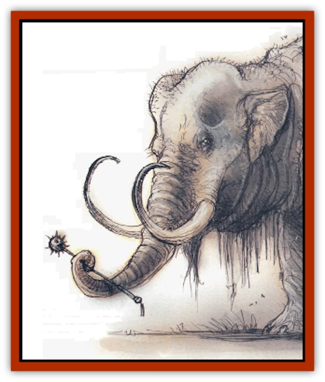

# Baku

| Statistic | **Baku** |
| --- | --- |
| **Activity Cycle:** | Day |
| **Alignment:** | Neutral (Any, see below) |
| **Armor Class:** | -2 |
| **Climate/Terrain:** | Semitropical/forests (Outlands) |
| **Damage/Attack:** | 3d6/2d6/2d6 |
| **Diet:** | Herbivore |
| **Frequency:** | Very rare |
| **Hit Dice:** | 12+12 |
| **Intelligence:** | Exceptional to Genius (15-18) |
| **Magic Resistance:** | 20% |
| **Morale:** | Elite (13-14) |
| **Movement:** | 21 |
| **No. Appearing:** | 1 (1d4+1) |
| **No. of Attacks:** | 3 |
| **Organization:** | Solitary (or group) |
| **Size:** | L (as 9' elephant) |
| **Special Attacks:** | Psionics, magical items, trumpet |
| **Special Defenses:** | Psionics, invisibility |
| **THAC0:** | 7 |
| **Treasure:** | See below |
| **XP Value:** | 14,000 |

**Psionics Summary**

| Level | Dis/Sci/Dev | Attack/Defense | Score | PSPs |
| --- | --- | --- | --- | --- |
| 12 | 4/6/17 | MT,PsC/All | =Int | 200 |

**Clairvoyance -** *Science:* aura sight; *Devotions:* comprehend writing, danger sense.

**Psychometabolism -** *Sciences:* animal affinity, metamorphosis; *Devotions:* absorb disease, cell adjustment, ectoplasmatic form, lend health, reduction.

**Telepathy -** *Sciences:* psionic crush, superior invisibility; *Devotions:* awe, conceal thoughts, contact, invisibility, mind link, mind thrust, telepathic projection, truthear.

**Psychoportation -** *Science:* probability travel; *Devotions:* dream travel, astral projection.

A baku looks like a strange [[Elephant|elephant]] with a lizard's tail. It has an elephantine head, complete with trunk, but its trunk is rarely longer than four feet. (Baku traditionally regard longer trunks as indicators of high abilities, but this is only superstition.) Two curving tusks jut upward from the creature's lower jaws. The front feet look like an elephant's, but the rear feet have leonine pads equipped with claws. Dragonlike scales cover a baku's back and thick tail; on male baku, the scales continue over the back of the head. The rest of the hide is rhino-tough.

**Combat:** Despite its size and bulk, a baku can move rapidly, attacking with a goring butt and two foreleg stomps. It stomps only man-sized opponents or those less than 6 feet tall. A baku's trunk can hold simple devices such as weapons or wands, so a baku of wealth or status may attack with a magical weapon or device. Baku can use psionics to become invisible at will. They expend no PSPs for this, and the power check always succeeds.

A baku's trumpeting roar affects creatures of certain alignments: Neutral good baku affect only evil creatures, dark (evil) baku affect good creatures, and holy baku can affect either good and/or evil creatures at their discretion. Any vulnerable creature wirhin 40 feet suffers 1d8 points of damage; it must also make a successful save vs. paralyzation or flee in panic as if affected by *fear* (as cast by a 12th-level wizard). Baku can trumpet once every four rounds.

Neutral good baku are usually timid, peace-loving creatures, but they resolutely battle evil and malicious monsters.

**Habitat/Society:** Baku come from the Outlands. They seldom travel in desolate settings and prefer to move invisibly among humanity.

Most baku (80%) are creatures of good will. They secretly dwell among humankind to serve its interests. Good baku favor societies in semitropical forests.

About 15% of all baku are of evil alignment. These baku, called <q>The Dark Ones</q> by their brethren, also move among humankind, thwarting the plans of their good brothers and causing suffering wherever they go.

The remaining 5% of baku are true neutral. Other baku know them as <q>Great Ones</q> or <q>Holy Ones</q>. Although no discernible abilities set them apart from their brethren, other baku reverently obey them. Holy baku always have an Intelligence of at least 18.

**Ecology:** Among evil merchants, baku tusks are worth 200 gp each. Good-aligned buyers regard traffic in tusks as an atrocity, and even neutrals regard it as tasteless. Holy baku who hear reports of tusk merchants sometimes travel long distances, either physically or by astral projection, to counsel the merchants against their evil trade. If a merchant ignores the counsel, the baku may try to enlist local adventures to steal the tusks and give them decent burial.

---
## Discovery & Documentation

**Source Publication:** MC Planescape I (1991)
**Campaign Setting:** Planescape
**Author(s):** various

### Other Creatures Found in This Source Book
   * [[Aasimon_Agathinon|Aasimon, Agathinon]]
   * [[Aasimon_Deva|Aasimon, Deva]]
   * [[Aasimon_Light|Aasimon, Light]]
   * [[Aasimon_General_Information|Aasimon, General Information]]
   * [[Aasimon_Planetar|Aasimon, Planetar]]
   * [[Aasimon_Solar|Aasimon, Solar]]
   * [[Animal_Lord|Animal Lord]]
   * [[Baatezu_Lesser_Abishai|Baatezu, Lesser, Abishai]]
   * [[Baatezu_Greater_Amnizu|Baatezu, Greater, Amnizu]]
   * [[Baatezu_Lesser_Barbazu|Baatezu, Lesser, Barbazu]]
   * [[Baatezu_Greater_Cornugon|Baatezu, Greater, Cornugon]]
   * [[Baatezu_Lesser_Erinyes|Baatezu, Lesser, Erinyes]]
   * [[Baatezu_General_Information|Baatezu, General Information]]
   * [[Baatezu_Greater_Gelugon|Baatezu, Greater, Gelugon]]
   * [[Baatezu_Lesser_Hamatula|Baatezu, Lesser, Hamatula]]
   * [[Baatezu_Lemure|Baatezu, Lemure]]
   * [[Baatezu_Least_Nupperibo|Baatezu, Least, Nupperibo]]
   * [[Baatezu_Lesser_Osyluth|Baatezu, Lesser, Osyluth]]
   * [[Baatezu_Greater_Pit_Fiend|Baatezu, Greater, Pit Fiend]]
   * [[Baatezu_Least_Spinagon|Baatezu, Least, Spinagon]]
   * [[Bariaur|Bariaur]]
   * [[Bebilith|Bebilith]]
   * [[Bodak|Bodak]]
   * [[Einheriar|Einheriar]]
   * [[Elemental_Grue_Chaggrin|Elemental Grue, Chaggrin]]
   * [[Elemental_Grue_Harginn|Elemental Grue, Harginn]]
   * [[Elemental_Grue_Ildriss|Elemental Grue, Ildriss]]
   * [[Elemental_Grue_Varrdig|Elemental Grue, Varrdig]]
   * [[Foo_Creature|Foo Creature]]
   * [[Gehreleth|Gehreleth]]
   * [[Githyanki|Githyanki]]
   * [[Githzerai|Githzerai]]
   * [[Hordling|Hordling]]
   * [[Hound_Yeth|Hound, Yeth]]
   * [[Imp|Imp]]
   * [[Incarnate|Incarnate]]
   * [[Larva|Larva]]
   * [[Maelephant|Maelephant]]
   * [[Marut|Marut]]
   * [[Mediator|Mediator]]
   * [[Mephit_General_Information|Mephit, General Information]]
   * [[Mephit_I_Air_Smoke|Mephit I (Air/Smoke)]]
   * [[Mephit_II_Earth_Ooze|Mephit II (Earth/Ooze)]]
   * [[Mephit_III_Fire_Radiant|Mephit III (Fire/Radiant)]]
   * [[Mephit_IV_Water_Ice|Mephit IV (Water/Ice)]]
   * [[Mephit_V_Dust_Salt|Mephit V (Dust/Salt)]]
   * [[Mephit_VI_Lightning_Mineral|Mephit VI (Lightning/Mineral)]]
   * [[Mephit_VII_Magma_Ash|Mephit VII (Magma/Ash)]]
   * [[Mephit_VIII_Mist_Steam|Mephit VIII (Mist/Steam)]]
   * [[Night_Hag|Night Hag]]
   * [[Nightmare|Nightmare]]
   * [[Per|Per]]
   * [[Shadow_Fiend|Shadow Fiend]]
   * [[Slaad|Slaad]]
   * [[Tanar'ri_Greater_Babau|Tanar'ri, Greater, Babau]]
   * [[Tanar'ri_Greater_Chasme|Tanar'ri, Greater, Chasme]]
   * [[Tanar'ri_Greater_Nabassu|Tanar'ri, Greater, Nabassu]]
   * [[Tanar'ri_Greater_Wastrilith|Tanar'ri, Greater, Wastrilith]]
   * [[Tanar'ri_Least_Dretch|Tanar'ri, Least, Dretch]]
   * [[Tanar'ri_Least_Manes|Tanar'ri, Least, Manes]]
   * [[Tanar'ri_Least_Rutterkin|Tanar'ri, Least, Rutterkin]]
   * [[Tanar'ri_Lesser_Alu-Fiend|Tanar'ri, Lesser, Alu-Fiend]]
   * [[Tanar'ri_Lesser_Bar-Lgura|Tanar'ri, Lesser, Bar-Lgura]]
   * [[Tanar'ri_Lesser_Cambion|Tanar'ri, Lesser, Cambion]]
   * [[Tanar'ri_Lesser_Succubus|Tanar'ri, Lesser, Succubus]]
   * [[Tanar'ri_Guardian_Molydeus|Tanar'ri, Guardian, Molydeus]]
   * [[Tanar'ri_True_Balor|Tanar'ri, True, Balor]]
   * [[Tanar'ri_True_Glabrezu|Tanar'ri, True, Glabrezu]]
   * [[Tanar'ri_True_Hezrou|Tanar'ri, True, Hezrou]]
   * [[Tanar'ri_True_Marilith|Tanar'ri, True, Marilith]]
   * [[Tanar'ri_True_Nalfeshnee|Tanar'ri, True, Nalfeshnee]]
   * [[Tanar'ri_True_Vrock|Tanar'ri, True, Vrock]]
   * [[Tiefling|Tiefling]]
   * [[Vargouille|Vargouille]]
   * [[Yugoloth_Greater_Arcanaloth|Yugoloth, Greater, Arcanaloth]]
   * [[Yugoloth_Lesser_Dergoloth|Yugoloth, Lesser, Dergoloth]]
   * [[Yugoloth_Lesser_Hydroloth|Yugoloth, Lesser, Hydroloth]]
   * [[Yugoloth_General_Information|Yugoloth, General Information]]
   * [[Yugoloth_Lesser_Mezzoloth|Yugoloth, Lesser, Mezzoloth]]
   * [[Yugoloth_Lesser_Piscoloth|Yugoloth, Lesser, Piscoloth]]
   * [[Yugoloth_Greater_Ultroloth|Yugoloth, Greater, Ultroloth]]
   * [[Yugoloth_Lesser_Yagnoloth|Yugoloth, Lesser, Yagnoloth]]
