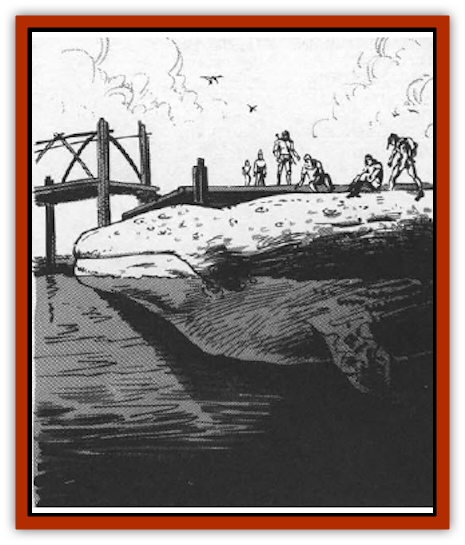

# Balaena

| Statistic | **Balaena** |
| --- | --- |
| **Activity Cycle:** | Any |
| **Alignment:** | Neutral good |
| **Armor Class:** | 4 |
| **Climate/Terrain:** | Upper planar seas and rivers |
| **Damage/Attack:** | 2d10 |
| **Diet:** | Omnivore |
| **Frequency:** | Rare |
| **Hit Dice:** | 9 |
| **Intelligence:** | Average (8-10) |
| **Magic Resistance:** | Nil |
| **Morale:** | Elite (13-14) |
| **Movement:** | Sw 18 |
| **No. Appearing:** | 1 (1-6) |
| **No. of Attacks:** | ½ |
| **Organization:** | Solitary (pod) |
| **Size:** | G (30' long) |
| **Special Attacks:** | Tail slap, song |
| **Special Defenses:** | See below |
| **THAC0:** | 11 |
| **Treasure:** | Nil |
| **XP Value:** | 5,000 |

Balaenas serve as the primary mode of transportation on the river Oceanus and are the equivalent of the lower planes' [[Yugoloth_Lesser_Hydroloth|hydroloths]]. They look very much like large gray [[Whale|whales]] with bright, intelligent eyes. Balaenas have a friendly demeanor about them and are often seen conversing with the inhabitants of the upper planes who visit their watery domain.

Balaena communicate using a form of telepathy.

**Combat:** Because of their peaceful nature, balaenas prefer to avoid combat whenever possible. Their considerable speed in water helps make retreat a viable option. When pressed, however, a balaena can attack with a ramming head-butt against targets submerged or on the surface of the water. Head-butt attacks do 2-20 points of damage per hit and are 50% likely to knock the victim off balance. Because of their size and the amount of room necessary to perform this ramming attack, balaenas can perform but one attack every two melee rounds.

Balenas can also perform a tail slap attack against an opponent in the water with it. Due to the size of the balaenas' tail, the tail slap acts as an area effect weapon. Any creature within 10 yards of the tail slap will automatically take 2-12 points of damage, no save allowed. Victims must then make a saving throw vs. paralyzation or be stunned for 1-6 melee rounds. If air breathers are stunned in the water, they must make a Constitution check for each round they are left stunned and unattended in the water. Failure means they take an additional 1-4 points of damage. A balaena will never willingly leave intelligent creatures helpless in the water after a tail slap.

A balaena's third means of defense is its magical song. The creature can sing only underwater, and its song affects only other creatures that are submerged. The balaena can make no other attacks during a round in which it sings. There are several possible effects of a balaena's song: first of all, it can use its song to summon help from any other nearby balaenas or to warn them of danger. If it summons help, there is a 30% chance that 1 or 2 other balaenas respond within 2 to 5 melee rounds. (In the River Oceanus, this chance increases to 80%.)

The second effect of the singing is a powerful *hypnotism* spell; any creature within 100 yards must successfully save versus spell or become susceptible to a telepathic suggestion from the singing balaena. Usually, the suggestion is to cease fighting or leave in peace. Last but not least, the song can be used to *charm* fish or aquatic monsters. The baleana can order these creatures to attack its enemies, but does so only under the direst of circumstances.

Because of the tough, leathery texture of their skin, balaenas will only take half damage from any bludgeoning attack. Because of their acute sense of hearing, balaena are only surprised on a roll of 1 when under water.

Balaenas can cast *know alignment* at will and can communicate with any intelligent creature with their powerful telepathy. Because of their telepathy, they are 50% likely to be able to tell when someone is lying to them.

**Habitat/Society:** Most balaenas are solitary creatures, but in the open oceans of the Upper planes it's possible to find a family of them gathered together in a pod. Half the pod will be youngsters, with 5 Hit Dice instead of 9 HD and ramming damage of only 1d10. Balaenas travelling without family members are very likely to be accompanied by a friend or fellow-traveller of another race: [[Aasimon_Agathinon|agathinons]] in whale form, [[Dolphin|dolphins]], or riders are all possible.

Balaenas serve a vital role in the upper planes. They are the most accessible means of transportation on the river Oceanus. Oceanus connects the planes of Elysium, Beastlands, and Olympus (and possibly more) much the same way that Styx links the lower planes.

There are several ways to attract the attention of balaenas to request transportation across Oceanus. The first method, developed by the rugged warriors of Elysium, is a form of ritual. It involves gathering a bushel of grapes from one of the many vineyards of Elysium. These are mixed with holly leaves, and the mixture is then burned on the shore of Oceanus. If all is done properly, there is an 80% chance of summoning a balaena.

The second method for summoning a balaena is more straightforward. A wizard must step into the water of Oceanus and cast any of the *monster summoning* spells. This method will always attract the attention of a balaena.

Because the river Oceanus is very large and can be dangerous to navigate, the balaena are a very well respected species. They will never aid evil creatures and are unlikely to aid nongood neutrals. They will use their know alignment ability before agreeing to transport anyone along Oceanus. If the people are evil, the balaena will leave. If they are neutrals, the balaena will inquire as to their mission, using its ability to sense lies. If the mission is not a good-aligned cause, the balaena will not help the group.

Regardless of alignment, balaena will always help any intelligent life form that is in danger in the water of Oceanus. The balaena will gently nudge the creature or person to the shore.

**Ecology:** Balaena are inoffensive creatures, and because of their important role, have no natural enemies. However, the denizens of the lower planes will often travel too the shores of Oceanus in order to try and trick or force a balaena to carry them to one of the upper planes. If they are unable, they will often attempt to brutally slay or capture it.

---
## Discovery & Documentation

**Source Publication:** MC8 Outer Planes Appendix (1990)
**Campaign Setting:** Planescape
**Author(s):** Timothy B. Brown, Jamie LaFountain

### Other Creatures Found in This Source Book
   * [[Aasimon_Agathinon|Aasimon, Agathinon]]
   * [[Aasimon_Deva|Aasimon, Deva]]
   * [[Aasimon_Light|Aasimon, Light]]
   * [[Aasimon_General_Information|Aasimon, General Information]]
   * [[Aasimon_Planetar|Aasimon, Planetar]]
   * [[Aasimon_Solar|Aasimon, Solar]]
   * [[Air_Sentinel|Air Sentinel]]
   * [[Animal_Lord|Animal Lord]]
   * [[Archon|Archon]]
   * [[Baatezu_Lesser_Abishai|Baatezu, Lesser, Abishai]]
   * [[Baatezu_Greater_Amnizu|Baatezu, Greater, Amnizu]]
   * [[Baatezu_Lesser_Barbazu|Baatezu, Lesser, Barbazu]]
   * [[Baatezu_Greater_Cornugon|Baatezu, Greater, Cornugon]]
   * [[Baatezu_Lesser_Erinyes|Baatezu, Lesser, Erinyes]]
   * [[Baatezu_General_Information|Baatezu, General Information]]
   * [[Baatezu_Greater_Gelugon|Baatezu, Greater, Gelugon]]
   * [[Baatezu_Lesser_Hamatula|Baatezu, Lesser, Hamatula]]
   * [[Baatezu_Lemure|Baatezu, Lemure]]
   * [[Baatezu_Least_Nupperibo|Baatezu, Least, Nupperibo]]
   * [[Baatezu_Lesser_Osyluth|Baatezu, Lesser, Osyluth]]
   * [[Baatezu_Greater_Pit_Fiend|Baatezu, Greater, Pit Fiend]]
   * [[Baatezu_Least_Spinagon|Baatezu, Least, Spinagon]]
   * [[Bariaur|Bariaur]]
   * [[Bebilith|Bebilith]]
   * [[Bodak|Bodak]]
   * [[Dog_Moon|Dog, Moon]]
   * [[Dragon_Adamantite|Dragon, Adamantite]]
   * [[Einheriar|Einheriar]]
   * [[Gehreleth|Gehreleth]]
   * [[Githyanki|Githyanki]]
   * [[Githzerai|Githzerai]]
   * [[Hordling|Hordling]]
   * [[Lammasu_Celestial|Lammasu, Celestial]]
   * [[Larva|Larva]]
   * [[Maelephant|Maelephant]]
   * [[Marut|Marut]]
   * [[Mediator|Mediator]]
   * [[Mortai|Mortai]]
   * [[Night_Hag|Night Hag]]
   * [[Nightmare|Nightmare]]
   * [[Noctral|Noctral]]
   * [[Per|Per]]
   * [[Phoenix|Phoenix]]
   * [[Slaad|Slaad]]
   * [[Tanar'ri_Greater_Babau|Tanar'ri, Greater, Babau]]
   * [[Tanar'ri_Greater_Chasme|Tanar'ri, Greater, Chasme]]
   * [[Tanar'ri_Greater_Nabassu|Tanar'ri, Greater, Nabassu]]
   * [[Tanar'ri_Least_Dretch|Tanar'ri, Least, Dretch]]
   * [[Tanar'ri_Least_Manes|Tanar'ri, Least, Manes]]
   * [[Tanar'ri_Least_Rutterkin|Tanar'ri, Least, Rutterkin]]
   * [[Tanar'ri_Lesser_Alu-Fiend|Tanar'ri, Lesser, Alu-Fiend]]
   * [[Tanar'ri_Lesser_Bar-Lgura|Tanar'ri, Lesser, Bar-Lgura]]
   * [[Tanar'ri_Lesser_Cambion|Tanar'ri, Lesser, Cambion]]
   * [[Tanar'ri_Lesser_Succubus|Tanar'ri, Lesser, Succubus]]
   * [[Tanar'ri_Guardian_Molydeus|Tanar'ri, Guardian, Molydeus]]
   * [[Tanar'ri_General_Information|Tanar'ri, General Information]]
   * [[Tanar'ri_True_Balor|Tanar'ri, True, Balor]]
   * [[Tanar'ri_True_Glabrezu|Tanar'ri, True, Glabrezu]]
   * [[Tanar'ri_True_Hezrou|Tanar'ri, True, Hezrou]]
   * [[Tanar'ri_True_Marilith|Tanar'ri, True, Marilith]]
   * [[Tanar'ri_True_Nalfeshnee|Tanar'ri, True, Nalfeshnee]]
   * [[Tanar'ri_True_Vrock|Tanar'ri, True, Vrock]]
   * [[Titan|Titan]]
   * [[Translator|Translator]]
   * [[T'uen-rin|T'uen-rin]]
   * [[Vaporighu|Vaporighu]]
   * [[Warden_Beast|Warden Beast]]
   * [[Yugoloth_Greater_Arcanaloth|Yugoloth, Greater, Arcanaloth]]
   * [[Yugoloth_Lesser_Dergoloth|Yugoloth, Lesser, Dergoloth]]
   * [[Yugoloth_Lesser_Hydroloth|Yugoloth, Lesser, Hydroloth]]
   * [[Yugoloth_General_Information|Yugoloth, General Information]]
   * [[Yugoloth_Lesser_Mezzoloth|Yugoloth, Lesser, Mezzoloth]]
   * [[Yugoloth_Greater_Nycaloth|Yugoloth, Greater, Nycaloth]]
   * [[Yugoloth_Lesser_Piscoloth|Yugoloth, Lesser, Piscoloth]]
   * [[Yugoloth_Greater_Ultroloth|Yugoloth, Greater, Ultroloth]]
   * [[Yugoloth_Lesser_Yagnoloth|Yugoloth, Lesser, Yagnoloth]]
   * [[Zoveri|Zoveri]]
