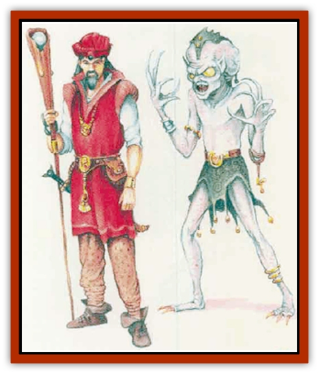

# Baldandar

| Statistic | **Baldandar** |
| --- | --- |
| **Activity Cycle:** | Any |
| **Alignment:** | Neutral evil |
| **Armor Class:** | 3 |
| **Climate/Terrain:** | Any |
| **Damage/Attack:** | 1d8 (claw)/1d8 (claw)/1d4 (bite) |
| **Diet:** | Carnivore |
| **Frequency:** | Very rare |
| **Hit Dice:** | 6 |
| **Intelligence:** | Exceptional (15-16) |
| **Magic Resistance:** | Nil |
| **Morale:** | Elite (14) |
| **Movement:** | 15 |
| **No. Appearing:** | 1 |
| **No. of Attacks:** | 3 |
| **Organization:** | Solitary |
| **Size:** | M (6-7' tall) |
| **Special Attacks:** | Illusions, poison bite, spells |
| **Special Defenses:** | Spells |
| **THAC0:** | 15 |
| **Treasure:** | P (B) |
| **XP Value:** | 2,000 |

In their true form, baldandars are tall, thin humanoids with large heads and glowing, yellow saucer-shaped eyes. However, few adventurers ever see this form, for baldandars are masters of illusion and deception.

These intelligent creatures can learn the language of many other races. They always speak Common, as well as their own tongue (which is incomprehensible to others).

**Combat:** A baldandar can project illusions up to 240 yards away, affecting all senses. The illusions last as long as the baldandar concentrates, and for one turn after it stops concentrating. During this time, the illusions function and react as if they were real. A baldandar illusion can be used to *veil* the creature (as the 6th-level wizard spell) or as an *advanced illusion* (5th-level spell). Except for duration, both spell effects function as though created by a 15th-level caster.

A baldandar usually appears either as a high-level human wizard (using spell-like illusions) or as a large dragon (using illusory breath weapons). Each victim of the illusory spell or breath will be affected by the attack as if it were real, unless a saving &row vs. spell is made with a -4 penalty to the roll. If successful, the illusion is recognized as such, and has no effect.

If cornered, a baldandar attacks with two claws (1d8 damage each) and its poisonous bite (1d4 damage). The victim of a bite attack must make a saving throw vs. poison with a -4 penalty, or fall asleep for 1d4 turns.

At will, a baldandar can become *invisible* and *fly*. Once per day, it can cast the following spells: *polymorph self*, *polymorph other*, *magic jar*, and *confusion*.

**Habitat/Society:** Baldandars are lonely, wicked creatures. Their illusions are subtle, even brilliant, and show a careful attention to detail. However, while they can mimic an amiable being's manner, just below that exterior lurks their own vicious and antisocial disposition. This is one factor contributing to the extreme scarcity of the species. It may not be long before the baldandar vanishes.

Mating is a rare event for these humanoids, occurring at best once in a decade. (Fortunately for the species, baldandars have long life spans; 100 or 150 years is not an uncommon age.) The gestation period is very long (12 months on average), after which a female gives birth to a single whelp.

The hormones involved with reproduction sway the female's behavior (effectively making her neutral in alignment). She nurtures the offspring for as long as a year, showing it the rudiments of hunting and survival. After the hormonal tide has ebbed, however, the female abandons the whelp (which is, by that time, about half the size of a grown adult).

A few baldandars join the company of other humanoids, such as [[Orc|orcs]] or [[Giant_Hill|hill giants]]. Such a baldandar assumes the appearance of its companions. Using its superior intelligence and magical skills, the baldandar may even achieve leadership among the humanoids and, perhaps what it values most, fearful admiration. Still, owing to its hidden nature, the leader never forms deep bonds with these <q>friends</q>.

Baldandars desire and collect valuables of all kinds, especially magic. They employ their magical items to further their own ends whenever possible.

**Ecology:** The baldandar is a carnivore. Its ability to project illusions is a great asset when it comes to hunting animals for food. Animals may, by sight and sound and smell, be driven toward the place where the hungry baldander lies in wait. The baldandar, invisible (and its scent hidden by illusion), bites the terrified prey. The prey falls asleep, and the baldandar feasts at its leisure.

In the lands of humans and other humanoid creatures, baldanders may operate differently. They often have private goals and ambitions, and will use their abilities to gain positions of influence and power. If, however, some tasty human delicacy stumbles into their plots, so much the better, for baldandars go to great lengths in devising illusions to deal with human prey.

---
## Discovery & Documentation

**Source Publication:** Mystara Appendix (1994)
**Campaign Setting:** Mystara
**Author(s):** John Nephew, Teeuwynn Woodruff, John Terra, Skip Williams

### Other Creatures Found in This Source Book
   * [[Actaeon|Actaeon]]
   * [[Agarat|Agarat]]
   * [[Ash_Crawler|Ash Crawler]]
   * [[Bargda|Bargda]]
   * [[Bhut|Bhut]]
   * [[Bird_Mystara|Bird (Mystara)]]
   * [[Blackball|Blackball]]
   * [[Choker|Choker]]
   * [[Coltpixie|Coltpixie]]
   * [[Crone_of_Chaos|Crone of Chaos]]
   * [[Darkhood|Darkhood]]
   * [[Darkwing|Darkwing]]
   * [[Decapus|Decapus]]
   * [[Deep_Glaurant|Deep Glaurant]]
   * [[Diabolus|Diabolus]]
   * [[Dimensional_Warper|Dimensional Warper]]
   * [[Dragon_Mystara_Crystalline|Dragon (Mystara), Crystalline]]
   * [[Dragon_Mystara_Jade|Dragon (Mystara), Jade]]
   * [[Dragon_Mystara_Onyx|Dragon (Mystara), Onyx]]
   * [[Dragon_Mystara_Ruby|Dragon (Mystara), Ruby]]
   * [[Drake_Mystara|Drake (Mystara)]]
   * [[Dragonfly|Dragonfly]]
   * [[Dusanu|Dusanu]]
   * [[Elemental_of_Chaos_Air_Earth|Elemental of Chaos, Air/Earth]]
   * [[Elemental_of_Chaos_Fire_Water|Elemental of Chaos, Fire/Water]]
   * [[Elemental_of_Law_Air_Earth|Elemental of Law, Air/Earth]]
   * [[Elemental_of_Law_Fire_Water|Elemental of Law, Fire/Water]]
   * [[Familiar_Mystara|Familiar (Mystara)]]
   * [[Frost_Salamander|Frost Salamander]]
   * [[Fundamental_Air_Earth|Fundamental, Air/Earth]]
   * [[Fundamental_Fire_Water|Fundamental, Fire/Water]]
   * [[Gargantua_Mystara|Gargantua (Mystara)]]
   * [[Geonid|Geonid]]
   * [[Ghostly_Horde|Ghostly Horde]]
   * [[Giant_Athach|Giant, Athach]]
   * [[Giant_Hephaeston|Giant, Hephaeston]]
   * [[Golem_Drolem|Golem, Drolem]]
   * [[Golem_Mystara_I|Golem (Mystara) I]]
   * [[Golem_Mystara_II|Golem (Mystara) II]]
   * [[Golem_Mystara_III|Golem (Mystara) III]]
   * [[Gray_Philosopher|Gray Philosopher]]
   * [[Guardian_Warrior|Guardian Warrior]]
   * [[Gyerian|Gyerian]]
   * [[Herex|Herex]]
   * [[Hivebrood|Hivebrood]]
   * [[Horde|Horde]]
   * [[Hsiao|Hsiao]]
   * [[Huptzeen|Huptzeen]]
   * [[Hutaakan|Hutaakan]]
   * [[Imp_Mystara|Imp (Mystara)]]
   * [[Jellyfish_Giant_Mystara|Jellyfish, Giant (Mystara)]]
   * [[Kna|Kna]]
   * [[Kopru|Kopru]]
   * [[Lizard_Mystara|Lizard (Mystara)]]
   * [[Lizard-kin_Mystara|Lizard-kin (Mystara)]]
   * [[Lupin|Lupin]]
   * [[Lycanthrope_Werejaguar_Mystara|Lycanthrope, Werejaguar (Mystara)]]
   * [[Lycanthrope_Wereswine|Lycanthrope, Wereswine]]
   * [[Magen|Magen]]
   * [[Manikin|Manikin]]
   * [[Mek|Mek]]
   * [[Mujina|Mujina]]
   * [[Nagpa|Nagpa]]
   * [[Neh-thalggu|Neh-thalggu]]
   * [[Nightshade_Mystara|Nightshade (Mystara)]]
   * [[Nuckalavee|Nuckalavee]]
   * [[Pegataur|Pegataur]]
   * [[Phanaton|Phanaton]]
   * [[Plant_Dangerous_Mystara|Plant, Dangerous (Mystara)]]
   * [[Plasm|Plasm]]
   * [[Rakasta|Rakasta]]
   * [[Rock_Man|Rock Man]]
   * [[Sabreclaw|Sabreclaw]]
   * [[Sacrol|Sacrol]]
   * [[Scamille|Scamille]]
   * [[Shapeshifter|Shapeshifter]]
   * [[Shargugh|Shargugh]]
   * [[Shark-kin|Shark-kin]]
   * [[Sollux|Sollux]]
   * [[Spectral_Death|Spectral Death]]
   * [[Spectral_Hound|Spectral Hound]]
   * [[Spider-kin|Spider-kin]]
   * [[Spirit_Mystara|Spirit (Mystara)]]
   * [[Statue_Living|Statue, Living]]
   * [[Surtaki|Surtaki]]
   * [[Tabi|Tabi]]
   * [[Thoul|Thoul]]
   * [[Thunderhead|Thunderhead]]
   * [[Tiger_Ebon|Tiger, Ebon]]
   * [[Topi|Topi]]
   * [[Tortle|Tortle]]
   * [[Vampire_Velya|Vampire, Velya]]
   * [[White_Fang|White Fang]]
   * [[Worm_Mystara|Worm (Mystara)]]
   * [[Wyrd|Wyrd]]
   * [[Yowler|Yowler]]
   * [[Zombie_Lightning|Zombie, Lightning]]
