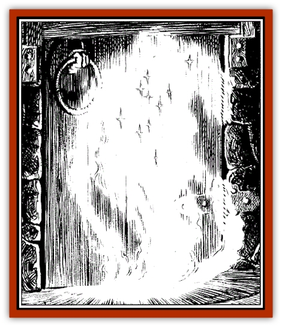

# Balhiir

| Statistic | **Balhiir** |
| --- | --- |
| **Activity Cycle:** | Any |
| **Alignment:** | Neutral |
| **Armor Class:** | 8 |
| **Climate/Terrain:** | Any |
| **Damage/Attack:** | Nil |
| **Diet:** | Energy/magic |
| **Frequency:** | Rare on Negative Energy Plane/Very Rare on Prime Material Plane |
| **Hit Dice:** | 18 |
| **Intelligence:** | Animal |
| **Magic Resistance:** | Special |
| **Morale:** | Steady (12) |
| **Movement:** | Fl 18 |
| **No. Appearing:** | 1 |
| **No. of Attacks:** | 1 |
| **Organization:** | Solitary |
| **Size:** | M (6'-diameter cloud) |
| **Special Attacks:** | Energy/magic drain |
| **Special Defenses:** | Magic absorption, immunity to physical damage |
| **THAC0:** | 3 |
| **Treasure:** | Nil |
| **XP Value:** | 16,000 |

The extremely rare balhiir normally appears as a man-sized, softly glowing cloud with diamond-shaped sparkles of light within. This cloudlike being flows through the air, and moves through all openings of at least 1” diameter. A balhiir is otherwise constrained by physical objects and can be trapped within such items. Wind, water, and physical weapons do not hinder its movements or harm it in any way.

**Combat:** The balhiir can sense life forces and magic up to 100' away, even through solid stone. It always moves toward the largest concentration of magic. Once in contact with the source of magic -  be it an item, a weapon, or living creature-it absorbs the magic following the spellfire rules detailed in the *Heroes' Lorebook* or *Volo's Guide to All Things Magical*. The balhiir is considered to have a Constitution of 18 for this purpose

However, the balhiir cannot unleash the magic as does a *spellfire* wielder. Instead, one spell level serves to sustain an active balhiir for one day. The creature doesn't suffer damage from holding more than five times its Constitution, but does shed those extra levels as radiant energy (light and heat) at the rates specified in the aforementioned *spellfire* rules

A balhiir has only one draining "attack" per round, but the creature can passively drain many items at once. Any spell or magical item that is cast or brought within 10' of the balhiir is absorbed as above.

Only two methods are known to defeat a balhiir. The first is that its magic-absorbing abilities must be overloaded, as with the *spellfire* ability. This method usually requires several high-level mages casting spells into the creature simultaneously. The second method involves binding the balhiir to a physical object or a creature. The specific details of this ancient ritual are left for DMs to decide and players to ponder

Once bound, the balhiir is freed upon the destruction of the vessel containing it. The balhiir can then be rebound only by the being that freed it. Its rescuer can attempt the ritual to rebind the balhiir or can attempt to draw the creature's energy into himself through sheer force of will. To do this, the character must save vs. death (the price of failure in this instance). Divide the total spell levels held by the balhiir by the character's Constitution score, rounding up, to reach a number similar to the *spellfire* danger rating. Apply a -1 modifier to the saving throw for each number above 5

If the save is made the character lives, and until the character uses up the balhiir's spell levels, the character can cast *spellfire* as a 1st-level wielder. All normal *spellfire* rules apply. Once the spell levels are used, the balhiir is destroyed and the character must make a system shock roll to survive the experience.

**Habitat/Society:**  Balhiirs normally reside on the Negative Energy Plane, and in the creatures' native environment, they can absorb all forms of energy, including life forces or experience levels. Little else is known of the balhiir's habits in its home plane, due to that plane's inimical effect on normal lifeforms.

**Ecology:** Balhiirs are very efficient in their use of the energy/magic they consume. These creatures can hold enough energy to keep them active for months. If they run out of energy however, they do not perish. Instead, they enter a form of hibernation that can last indefinitely. The presence of energy within its sensory range awakens it, a process that requires a full turn.

**History:**  While a prisoner of the Cult of the Dragon, Shandril accidentally released a balhiir trapped in a sphere of crystal when she struck a Cult mage with it. The creature then absorbed the Cult mage's magic, that of Shandril's companion Narm, and several members of the Knights of Myth Drannor, filling it with incredible amounts of raw magical energy

Elminster arrived on the scene and instructed Shandril that, as she was the one who released the balhiir, it must be she who destroyed it. Shandril did so, despite agonizing pain. This process also awakened her latent *spellfire* abilities, inherited from her mother, who also possessed the power to hurl bolts of raw magical energy

---
## Discovery & Documentation

**Source Publication:** Villains' Lorebook (1998)
**Campaign Setting:** Forgotten Realms
**Author(s):** Dale Donovan, Bill Olmesdahl, Todd Lockwood

### Other Creatures Found in This Source Book
   * [[Chosen_One|Chosen One]]
   * [[Darkenbeast|Darkenbeast]]
   * [[Dread_Warrior|Dread Warrior]]
   * [[Kalmari|Kalmari]]
   * [[Phaerimm|Phaerimm]]
   * [[Pteraman|Pteraman]]
   * [[Shadevari|Shadevari]]
   * [[Shadowmasters_the_Malaugrym|Shadowmasters (the Malaugrym)]]
   * [[Tanar'ri_Lesser_Yochlol|Tanar'ri, Lesser, Yochlol]]
