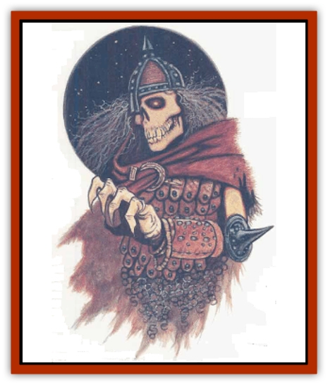

# Banedead

| Statistic | **Banedead** |
| --- | --- |
| **Activity Cycle:** | Any |
| **Alignment:** | Lawful evil |
| **Armor Class:** | 4 |
| **Climate/Terrain:** | Any |
| **Damage/Attack:** | 1d6/2d6 |
| **Diet:** | None |
| **Frequency:** | Rare |
| **Hit Dice:** | 6 |
| **Intelligence:** | Average (8-10) |
| **Magic Resistance:** | Nil |
| **Morale:** | Fanatic (17-18) |
| **Movement:** | 12 |
| **No. Appearing:** | 2d6 |
| **No. of Attacks:** | 2 |
| **Organization:** | Pack |
| **Size:** | M (5'+) |
| **Special Attacks:** | Dexterity drain |
| **Special Defenses:** | +1 or better weapon to hit, spell immunities, immune to poison |
| **THAC0:** | 15 |
| **Treasure:** | Nil |
| **XP Value:** | 2,000 |

Banedead (also called the shriveled dead of Bane) are a form of undead that surfaced after the Time of Troubles in the Moonsea region, especially in and around Zhentil Keep. Created from fanatical human worshipers, they appear as withered human males and females who have had the life sucked out of them. The malevolent force that now animates them manifests in their glowing red eyes. One of a Banedead's hands is always twisted into a hideous claw.

**Combat:** Banedead attack with sharp fangs that cause 1d6 points of damage, and one clawed hand that causes 2d6 points of damage. Despite the fact that Banedead have two hands, only the twisted one is used for attack, symbolizing the black hand of Bane.

Banedead derive their power from the Negative Energy Plane and from the clerical power of the ritual that created them. The touch of a Banedead (bite or claw) drains 2 points of Dexterity from the victim. If a victim's Dexterity reaches 0, the victim is paralyzed. Dexterity is regained at the rate of 1 point per turn; paralysis wears off when the first point is regained.

Due to their origins as fanatics, Banedead always go out of their way to attack priests and paladins above all others. Any attempt by priests or paladins to turn Banedead results in their becoming a target of choice. Banedead also seem to have a remnant memory or unearthly knowledge of religious symbols, and they target priests or paladins displaying such symbols. If there is more than one priest among available targets, a priest of a good-aligned deity takes precedence. The only exceptions to this order of preference are priests of Cyric. Banedead attack priests displaying the symbol of Cyric to the exclusion of anyone else in a group.

Banedead are immune to *sleep*, *charm*, and *hold* spells, as well as all illusions and poisons. They can be hit only by magical weapons of +1 or greater enchantment.

Banedead retain much of their mortal cunning. They use tactics and teamwork, much more so than most undead.

Banedead are turned as wraiths. Evil or neutral priests cannot attempt to control them, rather than turn them (except in the circumstances detailed below).

**Habitat/Society:** Banedead are usually found in the service of a specialty priest of either Bane or Xvim (the alleged Godson of Bane), or a wizard who worships one of the above two beings. In either case, the master must be of at least 11th level.

When Banedead have been found without a living master, they were roaming around ruins and sites consecrated to Bane or Xvim. Unverified reports claim that Banedead wander the ruined streets of Zhentil Keep, hunting down those who lost their faith in Bane during the Time of Troubles.

**Ecology:** Banedead are created by a special ritual that requires at least 12 worshipers (to be turned into Banedead), at least 24 living additional worshipers (to offer prayers), and a priest of Bane or Xvim of at least 12th level (to preside over the ritual). The ritual must be held in a place that is consecrated to either Bane or Xvim. People who are to become Banedead (also called the Promised Ones) must come forward voluntarily. Rumors of innocent folks captured by cultists and forcibly transformed into Banedead are patently false. At the end of the ritual, the new Banedead are placed under the control of their new master, the presiding priest.

The control that the master has over the Banedead can be broken only by another priest successfully turning the Banedead. Once this is done, the priest who originally controlled the Banedead must try to regain control by making a turning attempt. A priest who fails this roll can keep trying, once per round. A priest who controls Banedead can maintain control over the undead or bestow the control of that particular group of undead to a wizard who worships Bane or Xvim.

If a wizard loses control of Banedead, she or he would do well to flee. Banedead hate being subordinate to wizards, as the secular nature of wizardly magical power offends their fanatical leanings.

Some scholars are still trying to discern how a new breed of undead could be formed by a deity who is supposed to have been destroyed. A few sages believe that it is not Bane at all, but rather Xvim, who has introduced this new horror to the Realms. These sages speculate that the spirits of the Promised Ones are in fact shunted into Xvim somehow to nourish him, building his power so that he can eventually fill the void left by his father's death.

---
## Discovery & Documentation

**Source Publication:** Ruins of Zhentil Keep (1995)
**Campaign Setting:** Forgotten Realms
**Author(s):** John Terra and Kevin Melka

### Other Creatures Found in This Source Book
   * [[Banelich|Banelich]]
   * [[Burnbones|Burnbones]]
   * [[Elemental_Nature|Elemental, Nature]]
   * [[Gargoyle_Guardgoyle|Gargoyle, Guardgoyle]]
   * [[Golem_Magic|Golem, Magic]]
   * [[Golem_Vault_Guardian|Golem, Vault Guardian]]
   * [[Hybsil|Hybsil]]
   * [[Magedoom|Magedoom]]
   * [[Mist_Scarlet_Dancer|Mist, Scarlet Dancer]]
   * [[Orc_Ondonti|Orc, Ondonti]]
   * [[Rat_Zhentish_Sewer|Rat, Zhentish Sewer]]
   * [[Render|Render]]
   * [[Sacaanti|Sacaanti]]
   * [[Snake_Messenger|Snake, Messenger]]
   * [[Zhentarim_Spirit|Zhentarim Spirit]]
