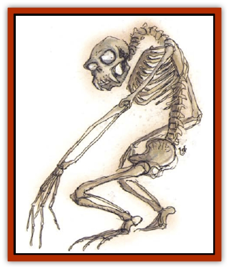

# Baneguard

| Statistic | **Baneguard** |
| --- | --- |
| **Activity Cycle:** | Any |
| **Alignment:** | Neutral evil |
| **Armor Class:** | 7 |
| **Climate/Terrain:** | Any land |
| **Damage/Attack:** | 1d6 or by weapon |
| **Diet:** | None |
| **Frequency:** | Rare |
| **Hit Dice:** | 4+4 |
| **Intelligence:** | Average (8-10) |
| **Magic Resistance:** | As for skeleton type |
| **Morale:** | Steady (11-12) |
| **Movement:** | 12 |
| **No. Appearing:** | 1d10 |
| **No. of Attacks:** | 1 |
| **Organization:** | Solitary |
| **Size:** | M (5-6' tall) |
| **Special Attacks:** | Magic missile |
| **Special Defenses:** | Blink |
| **THAC0:** | 15 |
| **Treasure:** | V |
| **XP Value:** | 975 |

Baneguards are [[Skeleton|skeletons]], usually but not always human, which are animated by clerical spells to serve as guardian creatures. The *create baneguard* spell was originally researched by priests of Bane (of the Forgotten Realms setting), but in the years since the demise of that deity, the secret of the spell has been spread such that many other evil (and not-so-evil) deities allow their priests to use it.

Usually found as guardians, baneguards are identical in appearance to normal skeletons, but have additional deadly powers which they reveal in combat.

**Combat:** All baneguards are silent but intelligent, evil servants, capable of independent, reasoned, malevolent behavior. They can *blink* (as the 3rd-level wizard spell) once per turn. This effect must be continuous - it lasts up to four rounds and cannot be stopped and then resumed; once ended, a full turn must pass before the baneguard can *blink* again. Baneguards can also cast one magic missile spell every three rounds. Each spell creates two missiles that inflict 1d4+1 points of damage each. They streak forth from the baneguard's bony fingertips (or any extremiys if the fingers are missing) and can be directed at seperate targets up to 60 feet away.

Baneguards can use all normal weapons or strike with a hand for 1d6 points of damage. Most are armed with swords or maces. Baneguards can employ all magical items that do not require verbal commands or living flesh or organs (e.g., ointments and potions).

Baneguards suffer damage from edged weapons, fire, spells, and holy water as normal skeletons do. They may break off combat if their orders permit. Baneguards are turned as wights.

**Habitat/Society:** Since baneguards are created, they have no society. They go where and do as they are commanded. They are used primarily by evil priests, but neutral-aligned priests (particularly those who venerate gods of death) with a ready supply of skeletal remains use baneguards as well.

**Ecology:** Baneguards eat nothing and do not contribute to the ecosystem in any way. As manufactured creatures, they have no natural habitat. As guardian creatures, they are found wherever they have been placed by their creators.

**Direguards**

  Some baneguards wear black, shadowy armor that is semitransparent so their bones show through, and red flames burn in their eye sockets. These *direguards* are AC 6, can see invisible objects and creatures, and are turned as wraiths. The *create direguard* spell is as the *create baneguard*, but is a 7th-level spell and has a casting time of one round. Direguards have an XP value of 1,200 each.

<h3>Create Bangeguard</h3>
| 6th-level Priest Spell |
| --- |
| Sphere: Necromantic |
| Range: Touch |
| Components: V, S, M |
| Duration: Special |
| Casting Time: 9 |
| Area of Effect: 1 skeletal body |
| Saving Throw: None |

The casting of this spell transforms an inanimate skeleton of size M or smaller into a baneguard, gifted with a degree of malicious intelligence. Only one baneguard may be created at a time using this spell. The baneguard is capable of using its abilities the round following creation, and needs no special commands to attack. The material components of this spell are the holy symbol of the priest and at least 20 drops of the blood of any sort of true dragon.

The *create direguard* spell is similar, save that it is a 7th-level spell and has a casting time of 1 round.

---
## Discovery & Documentation

**Source Publication:** Monstrous Compendium, 1994 Annual, Volume 1 (1995)
**Campaign Setting:** Advanced Dungeons & Dragons 2nd Edition
**Author(s):** David Wise

### Other Creatures Found in This Source Book
   * [[Abyss_Ant|Abyss Ant]]
   * [[Achaierai|Achaierai]]
   * [[Afanc|Afanc]]
   * [[Al-Jahar|Al-Jahar]]
   * [[Baelnorn|Baelnorn]]
   * [[Banelar|Banelar]]
   * [[Bird_Talking|Bird, Talking]]
   * [[Blazing_Bones|Blazing Bones]]
   * [[Campestri|Campestri]]
   * [[Caniquine|Caniquine]]
   * [[Cat_Winged|Cat, Winged]]
   * [[Crypt_Servant|Crypt Servant]]
   * [[Death's_Head_Tree|Death's Head Tree]]
   * [[Dog_Saluqi|Dog, Saluqi]]
   * [[Dragon_Electrum|Dragon, Electrum]]
   * [[Dragon_Fang|Dragon, Fang]]
   * [[Dragon_Linnorm_Corpse_Tearer|Dragon, Linnorm, Corpse Tearer]]
   * [[Dragon_Linnorm_Dread|Dragon, Linnorm, Dread]]
   * [[Dragon_Linnorm_Flame|Dragon, Linnorm, Flame]]
   * [[Dragon_Linnorm_Forest|Dragon, Linnorm, Forest]]
   * [[Dragon_Linnorm_Frost|Dragon, Linnorm, Frost]]
   * [[Dragon_Linnorm_Gray|Dragon, Linnorm, Gray]]
   * [[Dragon_Linnorm_Land|Dragon, Linnorm, Land]]
   * [[Dragon_Linnorm_Midgard|Dragon, Linnorm, Midgard]]
   * [[Dragon_Linnorm_Rain|Dragon, Linnorm, Rain]]
   * [[Dragon_Linnorm_Sea|Dragon, Linnorm, Sea]]
   * [[Dragon_Neutral_Jacinth|Dragon, Neutral, Jacinth]]
   * [[Dragon_Neutral_Jade|Dragon, Neutral, Jade]]
   * [[Dragon_Neutral_Pearl|Dragon, Neutral, Pearl]]
   * [[Dread|Dread]]
   * [[Dragon-kin|Dragon-kin]]
   * [[Elemental_Earth_Kin_Chrysmal|Elemental, Earth Kin, Chrysmal]]
   * [[Elemental_Earth_Kin_Earth_Weird|Elemental, Earth Kin, Earth Weird]]
   * [[Elemental_Fire_Kin_Azer|Elemental, Fire Kin, Azer]]
   * [[Elemental_Sandman|Elemental, Sandman]]
   * [[Elemental_Wind_Walker|Elemental, Wind Walker]]
   * [[Elemental_Vermin|Elemental Vermin]]
   * [[Feystag|Feystag]]
   * [[Flame_Skull|Flame Skull]]
   * [[Foulwing|Foulwing]]
   * [[Gambado|Gambado]]
   * [[Garbug|Garbug]]
   * [[Genie_Tasked_Administrator|Genie, Tasked, Administrator]]
   * [[Genie_Tasked_Deceiver|Genie, Tasked, Deceiver]]
   * [[Genie_Tasked_Harim_Servant|Genie, Tasked, Harim Servant]]
   * [[Genie_Tasked_Messenger|Genie, Tasked, Messenger]]
   * [[Genie_Tasked_Miner|Genie, Tasked, Miner]]
   * [[Genie_Tasked_Oathbinder|Genie, Tasked, Oathbinder]]
   * [[Gibbering_Mouther|Gibbering Mouther]]
   * [[Gnasher|Gnasher]]
   * [[Gnasher_Winged|Gnasher, Winged]]
   * [[Golem_Brain|Golem, Brain]]
   * [[Golem_Hammer|Golem, Hammer]]
   * [[Golem_Metagolem|Golem, Metagolem]]
   * [[Golem_Spiderstone|Golem, Spiderstone]]
   * [[Gorynych|Gorynych]]
   * [[Greelox|Greelox]]
   * [[Helmed_Horror|Helmed Horror]]
   * [[Jarbo|Jarbo]]
   * [[Laraken|Laraken]]
   * [[Lich_Psionic|Lich, Psionic]]
   * [[Living_Steel|Living Steel]]
   * [[Lock_Lurker|Lock Lurker]]
   * [[Loxo|Loxo]]
   * [[Lycanthrope_Loup_de_Noir|Lycanthrope, Loup de Noir]]
   * [[Lycanthrope_Werebadger|Lycanthrope, Werebadger]]
   * [[Lycanthrope_Werejaguar|Lycanthrope, Werejaguar]]
   * [[Lythlyx|Lythlyx]]
   * [[Magebane|Magebane]]
   * [[Marrashi|Marrashi]]
   * [[Metalmaster|Metalmaster]]
   * [[Mimic_House_Hunter|Mimic, House Hunter]]
   * [[Naga_Bone|Naga, Bone]]
   * [[Nautilus_Giant|Nautilus, Giant]]
   * [[Nightshade_Toril|Nightshade (Toril)]]
   * [[Nishruu|Nishruu]]
   * [[Noran|Noran]]
   * [[Opinicus|Opinicus]]
   * [[Ormyrr|Ormyrr]]
   * [[Parasite|Parasite]]
   * [[Pasari-Niml|Pasari-Niml]]
   * [[Plant_Vampire_Moss|Plant, Vampire Moss]]
   * [[Pteraman|Pteraman]]
   * [[Rautym|Rautym]]
   * [[Shadeling|Shadeling]]
   * [[Skum|Skum]]
   * [[Snake_Giant_Cobra|Snake, Giant Cobra]]
   * [[Snake_Stone|Snake, Stone]]
   * [[Spectral_Wizard|Spectral Wizard]]
   * [[Spell_Weaver|Spell Weaver]]
   * [[Spider_Brain|Spider, Brain]]
   * [[Suwyze|Suwyze]]
   * [[Tatalla|Tatalla]]
   * [[Tick_Heart|Tick, Heart]]
   * [[Tree_Dark|Tree, Dark]]
   * [[Tree_Singing|Tree, Singing]]
   * [[Tressym|Tressym]]
   * [[Troll_Snow|Troll, Snow]]
   * [[Tuyewera|Tuyewera]]
   * [[Ulitharid|Ulitharid]]
   * [[Undead_Dwarf|Undead Dwarf]]
   * [[Undead_Lake_Monster|Undead Lake Monster]]
   * [[Whipsting|Whipsting]]
   * [[Windghost|Windghost]]
   * [[Wolf_Dread|Wolf, Dread]]
   * [[Wolf_Stone|Wolf, Stone]]
   * [[Wolf_Vampiric|Wolf, Vampiric]]
   * [[Wraith_Shimmering|Wraith, Shimmering]]
   * [[Xantravar|Xantravar]]
   * [[Xaver|Xaver]]
