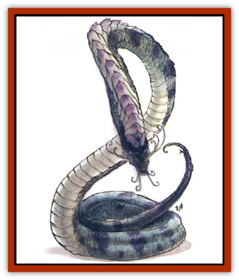

# Banelar

| Statistic | **Banelar** |
| --- | --- |
| **Activity Cycle:** | Any |
| **Alignment:** | Lawful evil |
| **Armor Class:** | 6 (head and stinger: 3; tentacles 1) |
| **Climate/Terrain:** | Hot to temperate/land or water |
| **Damage/Attack:** | 1d3 plus venom (bite)/2d4 plus venom (sting)/by weapon |
| **Diet:** | Carnivore |
| **Frequency:** | Rare |
| **Hit Dice:** | 7+7 |
| **Intelligence:** | Exceptional to Genius (15-18) |
| **Magic Resistance:** | Nil |
| **Morale:** | Champion (15-16) |
| **Movement:** | 12 |
| **No. Appearing:** | 1d4 |
| **No. of Attacks:** | Up to 5 |
| **Organization:** | Solitary or small bands |
| **Size:** | H (20-25' long) |
| **Special Attacks:** | Spells, poison, magical items |
| **Special Defenses:** | Regeneration (1 hp/round) |
| **THAC0:** | 15 |
| **Treasure:** | Any (especially Q,V) |
| **XP Value:** | 3,000 |

Banelar are evil, [[Naga|naga]]like creatures found on the land and in the water throughout warmer regions. Named for the many alliances between themselves and priests of the god Bane, banelar are native to the Prime Material Plane. They are quite independent in nature, and not all serve or obey servants of Bane.

Banelar have dark, snakelike bodies and a large humanoid head. They are dark purple-green in color, with white, glistening eyes and a brownish tail. Tiny tentacles grow in a ring about their mouths; these are too weak to wield weapons, but they can wear, manipulate, or carry minor items such as rings, keys, wands, and bits of food. Banelar can breathe air and water, alike, without harm or hesitation.

Banelar speak Common and Orcish in horrid, hissing voices.

**Combat:** A banelar casts spells as a 6th-level cleric and a 6th-level mage with no ability-score bonuses. Thus, it has the following spell capacities: wizard - 4/2/2, and priest - 3/3/2. A banelar can utter one spell per round in addition to making physical and weapon attacks. Banelar spells are verbal only, modified so that no material components are required, involving an increase of 3 to the casting time in all cases. Such spells must be found or learned from dragons, other banelar, or similar creatures that employ verbal-only magic.

A banelar can wield any magical item it happens to possess (up to the size and weight of a rod), regardless of class limitations (but alignment restrictions on weapons still apply). A banelar can also wear amulets and magical rings on its tentacles, with the usual maximum of two at any one time. Periapts, however, will not fit on banelar tentacles and confer no magical effects.

A banelar's bite and tail sting deliver poison to the wounds they inflict, turning the victim's skin blue and sustaining the above-listed damage. The casualty must then successfully save vs. poison or suffer unconsciousness for 1d4+1 turns and 2d6 points of additional damage.

**Habitat/Society:** Banelar tend to be selfish and solitary but they sometimes cooperate with both <q>lesser</q> creatures (such as humans, [[Orc|orcs]], and [[Hobgoblin|hobgoblins]]) and <q>greater</q> ones ([[Beholder_and_Beholder-kin_I|beholders]], [[Lich|liches]], evil [[Dragon_General_Information|dragons]], and even [[Vampire_General_Information|vampires]]) for common gain or to fight a specific foe. They are extremely paranoid, always planning against <q>sneak attacks</q> and seeking to strengthen their personal weaknesses and defenses. To do so, banelar collect and hoard treasure - particularly magical items - to use and trade for services, or to provide safety from powerful enemies. Banelar are wily and treacherous, adhering to the letter, and not the intent, of any bargain they make. They see nothing wrong in commanding or forcing their own servant creatures to break bargains.

**Ecology:** Banelar have been known to steal and tend entire herds of livestock for their own larders, and they can dine with perfect safety upon snakes and other creatures that generate poisons and acids (to which banelar seem immune). Banelar are also highly resistant to petrification (+3 to all saves). As hermaphrodites, they each give live birth to a single offspring each winter. A banelar parent hunts with its hungry offspring and teaches the youth spells until it is able to fend for itself, whereupon it leaves and seeks its own territory. Typically, a banelar mates whenever it encounters another, and it avoids fighting others of its kind. Beyond this, it avoids consorting with its fellows unless weakened or frightened. A banelar parent tends to raise its young in undersea or mountain caves, far from its usual haunts. This allows it to return to its favorite areas with little fear of being found after it sneaks away and leaves its young.

---
## Discovery & Documentation

**Source Publication:** Monstrous Compendium, 1994 Annual, Volume 1 (1995)
**Campaign Setting:** Advanced Dungeons & Dragons 2nd Edition
**Author(s):** David Wise

### Other Creatures Found in This Source Book
   * [[Abyss_Ant|Abyss Ant]]
   * [[Achaierai|Achaierai]]
   * [[Afanc|Afanc]]
   * [[Al-Jahar|Al-Jahar]]
   * [[Baelnorn|Baelnorn]]
   * [[Baneguard|Baneguard]]
   * [[Bird_Talking|Bird, Talking]]
   * [[Blazing_Bones|Blazing Bones]]
   * [[Campestri|Campestri]]
   * [[Caniquine|Caniquine]]
   * [[Cat_Winged|Cat, Winged]]
   * [[Crypt_Servant|Crypt Servant]]
   * [[Death's_Head_Tree|Death's Head Tree]]
   * [[Dog_Saluqi|Dog, Saluqi]]
   * [[Dragon_Electrum|Dragon, Electrum]]
   * [[Dragon_Fang|Dragon, Fang]]
   * [[Dragon_Linnorm_Corpse_Tearer|Dragon, Linnorm, Corpse Tearer]]
   * [[Dragon_Linnorm_Dread|Dragon, Linnorm, Dread]]
   * [[Dragon_Linnorm_Flame|Dragon, Linnorm, Flame]]
   * [[Dragon_Linnorm_Forest|Dragon, Linnorm, Forest]]
   * [[Dragon_Linnorm_Frost|Dragon, Linnorm, Frost]]
   * [[Dragon_Linnorm_Gray|Dragon, Linnorm, Gray]]
   * [[Dragon_Linnorm_Land|Dragon, Linnorm, Land]]
   * [[Dragon_Linnorm_Midgard|Dragon, Linnorm, Midgard]]
   * [[Dragon_Linnorm_Rain|Dragon, Linnorm, Rain]]
   * [[Dragon_Linnorm_Sea|Dragon, Linnorm, Sea]]
   * [[Dragon_Neutral_Jacinth|Dragon, Neutral, Jacinth]]
   * [[Dragon_Neutral_Jade|Dragon, Neutral, Jade]]
   * [[Dragon_Neutral_Pearl|Dragon, Neutral, Pearl]]
   * [[Dread|Dread]]
   * [[Dragon-kin|Dragon-kin]]
   * [[Elemental_Earth_Kin_Chrysmal|Elemental, Earth Kin, Chrysmal]]
   * [[Elemental_Earth_Kin_Earth_Weird|Elemental, Earth Kin, Earth Weird]]
   * [[Elemental_Fire_Kin_Azer|Elemental, Fire Kin, Azer]]
   * [[Elemental_Sandman|Elemental, Sandman]]
   * [[Elemental_Wind_Walker|Elemental, Wind Walker]]
   * [[Elemental_Vermin|Elemental Vermin]]
   * [[Feystag|Feystag]]
   * [[Flame_Skull|Flame Skull]]
   * [[Foulwing|Foulwing]]
   * [[Gambado|Gambado]]
   * [[Garbug|Garbug]]
   * [[Genie_Tasked_Administrator|Genie, Tasked, Administrator]]
   * [[Genie_Tasked_Deceiver|Genie, Tasked, Deceiver]]
   * [[Genie_Tasked_Harim_Servant|Genie, Tasked, Harim Servant]]
   * [[Genie_Tasked_Messenger|Genie, Tasked, Messenger]]
   * [[Genie_Tasked_Miner|Genie, Tasked, Miner]]
   * [[Genie_Tasked_Oathbinder|Genie, Tasked, Oathbinder]]
   * [[Gibbering_Mouther|Gibbering Mouther]]
   * [[Gnasher|Gnasher]]
   * [[Gnasher_Winged|Gnasher, Winged]]
   * [[Golem_Brain|Golem, Brain]]
   * [[Golem_Hammer|Golem, Hammer]]
   * [[Golem_Metagolem|Golem, Metagolem]]
   * [[Golem_Spiderstone|Golem, Spiderstone]]
   * [[Gorynych|Gorynych]]
   * [[Greelox|Greelox]]
   * [[Helmed_Horror|Helmed Horror]]
   * [[Jarbo|Jarbo]]
   * [[Laraken|Laraken]]
   * [[Lich_Psionic|Lich, Psionic]]
   * [[Living_Steel|Living Steel]]
   * [[Lock_Lurker|Lock Lurker]]
   * [[Loxo|Loxo]]
   * [[Lycanthrope_Loup_de_Noir|Lycanthrope, Loup de Noir]]
   * [[Lycanthrope_Werebadger|Lycanthrope, Werebadger]]
   * [[Lycanthrope_Werejaguar|Lycanthrope, Werejaguar]]
   * [[Lythlyx|Lythlyx]]
   * [[Magebane|Magebane]]
   * [[Marrashi|Marrashi]]
   * [[Metalmaster|Metalmaster]]
   * [[Mimic_House_Hunter|Mimic, House Hunter]]
   * [[Naga_Bone|Naga, Bone]]
   * [[Nautilus_Giant|Nautilus, Giant]]
   * [[Nightshade_Toril|Nightshade (Toril)]]
   * [[Nishruu|Nishruu]]
   * [[Noran|Noran]]
   * [[Opinicus|Opinicus]]
   * [[Ormyrr|Ormyrr]]
   * [[Parasite|Parasite]]
   * [[Pasari-Niml|Pasari-Niml]]
   * [[Plant_Vampire_Moss|Plant, Vampire Moss]]
   * [[Pteraman|Pteraman]]
   * [[Rautym|Rautym]]
   * [[Shadeling|Shadeling]]
   * [[Skum|Skum]]
   * [[Snake_Giant_Cobra|Snake, Giant Cobra]]
   * [[Snake_Stone|Snake, Stone]]
   * [[Spectral_Wizard|Spectral Wizard]]
   * [[Spell_Weaver|Spell Weaver]]
   * [[Spider_Brain|Spider, Brain]]
   * [[Suwyze|Suwyze]]
   * [[Tatalla|Tatalla]]
   * [[Tick_Heart|Tick, Heart]]
   * [[Tree_Dark|Tree, Dark]]
   * [[Tree_Singing|Tree, Singing]]
   * [[Tressym|Tressym]]
   * [[Troll_Snow|Troll, Snow]]
   * [[Tuyewera|Tuyewera]]
   * [[Ulitharid|Ulitharid]]
   * [[Undead_Dwarf|Undead Dwarf]]
   * [[Undead_Lake_Monster|Undead Lake Monster]]
   * [[Whipsting|Whipsting]]
   * [[Windghost|Windghost]]
   * [[Wolf_Dread|Wolf, Dread]]
   * [[Wolf_Stone|Wolf, Stone]]
   * [[Wolf_Vampiric|Wolf, Vampiric]]
   * [[Wraith_Shimmering|Wraith, Shimmering]]
   * [[Xantravar|Xantravar]]
   * [[Xaver|Xaver]]
