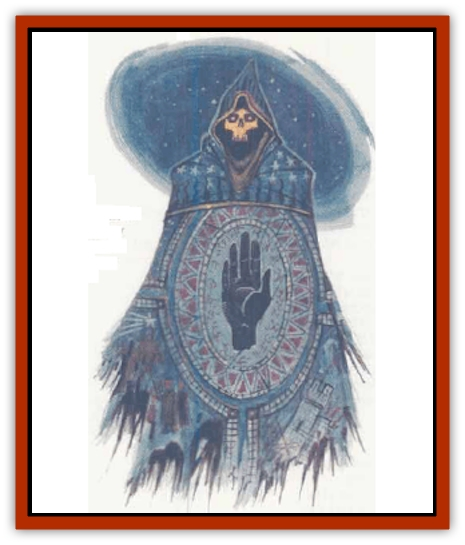

# Banelich

| Statistic | **Banelich** |
| --- | --- |
| **Activity Cycle:** | Any |
| **Alignment:** | Lawful evil |
| **Armor Class:** | 0 |
| **Climate/Terrain:** | Any |
| **Damage/Attack:** | 1d10 |
| **Diet:** | None |
| **Frequency:** | Very rare |
| **Hit Dice:** | 17+ |
| **Intelligence:** | Supra-genius (19-20) |
| **Magic Resistance:** | 25% |
| **Morale:** | Fanatic (17-18) |
| **Movement:** | 9 |
| **No. Appearing:** | 1 |
| **No. of Attacks:** | 1 |
| **Organization:** | Solitary |
| **Size:** | M (5-6' tall) |
| **Special Attacks:** | Priest spells, hopelessness touch, coldfire missiles, see below |
| **Special Defenses:** | +2 magical weapon needed to hit, fear aura, spell immunities, immune to poison, see below |
| **THAC0:** | 5 |
| **Treasure:** | A,S,Z |
| **XP Value:** | 22,000 +1,000 per HD over 17 |

When Bane, the God of Strife, was first establishing his church long ago, those who worshiped him were hounded to their deaths by the forces of good unless they gathered in significant numbers. Tired of his faithful becoming victims, every 50-60 years Bane chose the most powerful priest within the ranks of his clerics and revealed to him or her a foul rite that would transform the caster, through force of faith, strength of will, and Bane's divine hand, into a powerful, immortal form - a [[Lich|lich]] of Bane, or Banelich.

Baneliches are gaunt, skeletal, rotting humanoid forms with black eye sockets in which burn red pin points of light. They dress in decaying elegant clerical ceremonial robes and always wear Bane's holy symbol (the black hand of Bane) prominently.

**Combat:** Baneliches were at least 17th-level clerics before they were transformed, and several were 20th level or higher. Bane grants a Banelich's spells each day. The spells still require verbal and somatic components, but material components are no longer needed. Spells cast by a Banelich take the normal amount of time to cast. Baneliches may use any magical items normally usable by clerics of their alignment.

Baneliches radiate an aura of power such that any creature of fewer than 5 Hit Dice (or less than 5th level) that sees them must flee in terror for 564 rounds. Those with 5 or more Hit Dice (or levels) may make a saving throw vs. spell to avoid this effect.

The touch of a Banelich causes 1d10 points of unearthly cold damage and forces the victim to make a successful saving throw vs. spell as if hit with an *emotion* spell, or suffer from complete hopelessness.

Baneliches are also able to produce blue-green negative energy fire that inflicts 3d10 points of freezing damage. Even beings normally immune to cold damage (because of their nature or a magical item or effect) suffer half this damage. Baneliches can throw up to two balls of this coldfire per round. A coldfire missile has a range of 60 yards.

Baneliches can be hit only by magical weapons of +2 or greater enchantment. These ancient creatures are also immune to the following spells and spell types: *charm*, *sleep*, *enfeeblement*, *polymorph*, cold, electricity, insanity, and death. Baneliches are immune to all types of poisons and are not affected in any way by sunlight. They cannot be turned while in their lairs or areas dedicated to the worship of Bane. When outside their lairs, they are turned on the Special column. Holy water from a lawful good temple of Lathander inflicts 1d10 points of damage per vial to them; any other holy water causes only 1d6 points of damage.

Destruction of a Banelich is similar to that of the average lich, centering on the eradication of the creature's phylactery. Destroying a Banelich's phylactery kills it immediately. If the phylactery is not found and the creature is reduced to 0 hit points, it will reform in 2d10 days at the site of the phylactery. The person who destroys a Banelich's phylactery and anyone within 10 feet must make a successful saving throw vs. death magic at -1 or be struck dead by the force of an incredible negative energy explosion generated by its destruction.

**Habitat/Society:** In ancient times Baneliches used their remarkable powers to spread the word of Bane across Faer�n and defend the god's faithful. They were supposed to serve as ultimate guardians of the faith. Many Baneliches were worshiped as demipowers and were referred to as the <q>Mouths of Bane</q> by any who came into contact with them. However, once the followers of the good Faer�nian deities, especially Lathanderites, learned of the existence of a Banelich, they gathered in force to destroy it before the creature's power became too great. As a further problem, each Banelich considered himself or herself to be the natural leader of the church, and was reluctant to relinquish temporal power to a living High Imperceptor. This caused grave internal problems within the church. Consequently, Bane was not entirely satisfied with his Baneliches and chose not to reveal the dark ritual to any of his priesthood after 1010 DR. Before this date, records have revealed signs of at least 35 Baneliches coming into existence, and the deaths of only 10 have been documented.

**Ecology:** As a Banelich grows older, its power increases. For every 100 years of existence the creature gains one level of clerical experience (in regard to spells), 5% greater magic resistance, and one of the special abilities detailed  below. Other abilities may be gained after 400 years, but they have been undocumented by sages.

*Painwrack:* Any living creature that makes eye contact with the Banelich suffers 2d10 points of damage from severe, muscle-wrenching pain unless a successful saving throw vs. spell is made. The Banelich uses this power only when it wishes.

*Voice of Maleficence:* Failure of a saving throw vs. spell by a victim to whom the Banelich talks for one turn results in a sleepy trance wherein the victim reveals any secrets known to him or her. The saving throw may be rerolled every six turns. Each consecutive hour the Banelich talks to the victim, a +1 penalty is applied to subsequent saving rolls.

*Grasp of Death:* The touch of the Banelich kills instantly unless the target successfully saves vs. death magic. A person so killed can be resurrected only by a good priest and not by potions or magical items. The Banelich can use this power once a day. When it is active, a nimbus of coruscating black flame surrounds its hands.

---
## Discovery & Documentation

**Source Publication:** Ruins of Zhentil Keep (1995)
**Campaign Setting:** Forgotten Realms
**Author(s):** John Terra and Kevin Melka

### Other Creatures Found in This Source Book
   * [[Banedead|Banedead]]
   * [[Burnbones|Burnbones]]
   * [[Elemental_Nature|Elemental, Nature]]
   * [[Gargoyle_Guardgoyle|Gargoyle, Guardgoyle]]
   * [[Golem_Magic|Golem, Magic]]
   * [[Golem_Vault_Guardian|Golem, Vault Guardian]]
   * [[Hybsil|Hybsil]]
   * [[Magedoom|Magedoom]]
   * [[Mist_Scarlet_Dancer|Mist, Scarlet Dancer]]
   * [[Orc_Ondonti|Orc, Ondonti]]
   * [[Rat_Zhentish_Sewer|Rat, Zhentish Sewer]]
   * [[Render|Render]]
   * [[Sacaanti|Sacaanti]]
   * [[Snake_Messenger|Snake, Messenger]]
   * [[Zhentarim_Spirit|Zhentarim Spirit]]
