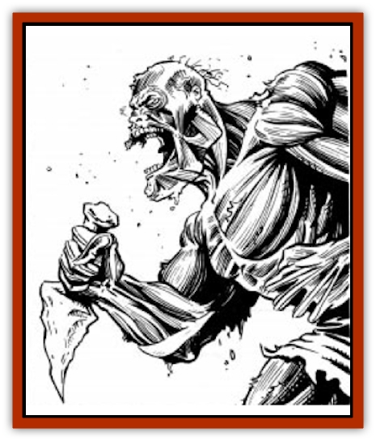

# Banshee - Dwarf

| Statistic | **Banshee, Dwarf** |
| --- | --- |
| **Activity Cycle:** | Any |
| **Alignment:** | Always evil (see below) |
| **Armor Class:** | 0 |
| **Climate/Terrain:** | Any |
| **Damage/Attack:** | 11-12 (1d2+10) punch or by weapon +10 |
| **Diet:** | None |
| **Frequency:** | Uncommon |
| **Hit Dice:** | As in life |
| **Intelligence:** | As in life |
| **Magic Resistance:** | See below |
| **Morale:** | Fanatic (17) |
| **Movement:** | 12 |
| **No. Appearing:** | 1 |
| **No. of Attacks:** | As in life |
| **Organization:** | Solitary |
| **Size:** | M (4-5') |
| **Special Attacks:** | Gaze, malediction, and psionic |
| **Special Defenses:** | Steel, or +1 or better weapon to hit |
| **THAC0:** | As in life |
| **Treasure:** | See below |
| **XP Value:** | Varies |

**Psionics Summary**

| Level | Dis/Sci/Dev | Attack/Defense | Score | PSPs |
| --- | --- | --- | --- | --- |
| 7 | 1/2/4 | -/IF,MB | 15 | 110 |

**Psychometabolism -** *Sciences:* death field, shadow form; *Devotions:* body weaponry, cause decay, chemical simulation, double pain.

(These psionic powers are gained in addition to any the dwarf possessed when it was alive.)

[[Dwarf_Athas|Dwarves]] who die before completing a major focus are often condemned to live out their afterlives as [[Banshee|banshees]]. In unlife they haunt their unfinished work or quest, unable to bear the fact that someone else may complete what they could not. Day or night, the pupils of their eyes flicker red as if a flame burns them from within.

A dwarven banshee's appearance changes as soon as the transformation from life to undeath begins. The skin rots away leaving the underlying muscles exposed. The muscle turns brown if exposed to sunlight and sand; if protected or underground, it becomes gray or moldy in color.

The dwarven banshee remembers all of the languages that it knew when it was alive.

**Combat:** Dwarven banshees retain all aspects of their former character class, including levels at the time of death. They retain the same armor and weapons (although they may acquire new ones or lose old ones) and the same level of skill in their given profession. They retain the ability to cast spells, and they can use any psionic abilities possessed when they were alive.

Trapped between the lands of the living and the dead, dwarven banshees are semi-material and can only be hit by at least a +1 or steel weapon.

The dwarven banshee also gains the ability to *curse* its victim(s). During the day, a dwarven banshee combines its cursed gaze attack with a physical one. If eye contact is made, the victim must save versus spells or fly into a berserker rage (+2 attack and damage bonus, may not leave the fight) for 2d6 rounds. Under rage effects, victims will only attack other party members and never the banshee, regardless if it attacks them or not. If no one else is in the area, a victim of this gaze attack will run for one turn in search of someone to fight before the effect ends. Once per night, the dwarven banshee also gains the ability to wail a cursed battle cry or malediction. All within earshot must save versus spells or fall into the berserker rage. Each character must make a separate saving throw for each wail or gaze from each dwarven banshee in a given area.

Fire-, water-, and air-based attacks only do half damage to the dwarven banshee. Earth-based spells cause double damage. Because of its single-mindedness, psionic spells requiring contact are ineffective. *Remove curse* negates the effect of the berserker rage on one individual per casting.

When the dwarven banshee's physical corpse reaches 0 hit points, the remainder crumbles to dust. If the dwarfs unfulfilled focus is not destroyed or somehow completed, this banshee returns full strength at the next sunset.

**Habitat/Society:** The approach of a living individual within a mile causes the banshee to rise, regardless of the time of day. It remains alert as long as the intruder remains within the area. The banshee often watches and waits to see what action the individual or party takes before attacking.

**Ecology:** Dwarven banshees only want to protect what was theirs. Fables say that the seventh son of a seventh son may lay a dwarven banshee to rest by finishing a focus for it. Elders say the flames within dwarven banshees' eyes originate from some ancient dwarven forge or the elemental plane of fire.

---
## Discovery & Documentation

**Source Publication:** MC12 Dark Sun Appendix I - Terrors of the Desert (1991)
**Campaign Setting:** Dark Sun
**Author(s):** Tom Prusa, Louis J. Prosperi, Walter M. Baas

### Other Creatures Found in This Source Book
   * [[Animal_Herd_Athas|Animal, Herd (Athas)]]
   * [[Animal_Household_Athas|Animal, Household (Athas)]]
   * [[Antloid_Desert|Antloid, Desert]]
   * [[Beetle_Agony|Beetle, Agony]]
   * [[Bog_Wader|Bog Wader]]
   * [[Brambleweed|Brambleweed]]
   * [[B'rohg|B'rohg]]
   * [[Burnflower|Burnflower]]
   * [[Cat_Psionic|Cat, Psionic]]
   * [[Cha'thrang|Cha'thrang]]
   * [[Cistern_Fiend|Cistern Fiend]]
   * [[Clam_Giant|Clam, Giant]]
   * [[Cloud_Ray|Cloud Ray]]
   * [[Drake_Athas_Air|Drake (Athas), Air]]
   * [[Drake_Athas_Earth|Drake (Athas), Earth]]
   * [[Drake_Athas_Fire|Drake (Athas), Fire]]
   * [[Drake_Athas_Water|Drake (Athas), Water]]
   * [[Dune_Runner|Dune Runner]]
   * [[Dune_Trapper|Dune Trapper]]
   * [[Elemental_Athas_Greater_Air|Elemental (Athas), Greater, Air]]
   * [[Elemental_Athas_Greater_Earth|Elemental (Athas), Greater, Earth]]
   * [[Elemental_Athas_Greater_Fire|Elemental (Athas), Greater, Fire]]
   * [[Elemental_Athas_Greater_Water|Elemental (Athas), Greater, Water]]
   * [[Elemental_Athas_Lesser_Air_Earth|Elemental (Athas), Lesser, Air/Earth]]
   * [[Elemental_Athas_Lesser_Fire_Water|Elemental (Athas), Lesser, Fire/Water]]
   * [[Elemental_Athas_General_Information|Elemental (Athas), General Information]]
   * [[Erdland|Erdland]]
   * [[Esperweed|Esperweed]]
   * [[Flailer|Flailer]]
   * [[Floater|Floater]]
   * [[Giant_Athas|Giant (Athas)]]
   * [[Golem_Athas_I|Golem (Athas) I]]
   * [[Golem_Athas_II|Golem (Athas) II]]
   * [[Golem_Athas_III|Golem (Athas) III]]
   * [[Golem_Athas_General_Information|Golem (Athas), General Information]]
   * [[Halfling_Renegade|Halfling, Renegade]]
   * [[Hej-kin|Hej-kin]]
   * [[Id_Fiend|Id Fiend]]
   * [[Insect_Swarm_Athas|Insect Swarm (Athas)]]
   * [[Kank_Wild|Kank, Wild]]
   * [[Kirre|Kirre]]
   * [[Megapede|Megapede]]
   * [[Mul_Wild|Mul, Wild]]
   * [[Nightmare_Beast|Nightmare Beast]]
   * [[Plant_Carnivorous_Athas|Plant, Carnivorous (Athas)]]
   * [[Pterran|Pterran]]
   * [[Pterrax|Pterrax]]
   * [[Pulp_Bee|Pulp Bee]]
   * [[Pyreen|Pyreen]]
   * [[Rasclinn|Rasclinn]]
   * [[Razorwing|Razorwing]]
   * [[Roc_Athas|Roc (Athas)]]
   * [[Sand_Bride|Sand Bride]]
   * [[Sand_Cactus|Sand Cactus]]
   * [[Sand_Vortex|Sand Vortex]]
   * [[Scrab|Scrab]]
   * [[Silt_Horror|Silt Horror]]
   * [[Silt_Runner|Silt Runner]]
   * [[Sink_Worm|Sink Worm]]
   * [[Sloth_Athas|Sloth (Athas)]]
   * [[So-ut|So-ut]]
   * [[Spider_Cactus|Spider Cactus]]
   * [[Spider_Crystal|Spider, Crystal]]
   * [[Spirit_of_the_Land|Spirit of the Land]]
   * [[T'Chowb|T'Chowb]]
   * [[Thrax|Thrax]]
   * [[Tohr-kreen_I|Tohr-kreen I]]
   * [[Villichi|Villichi]]
   * [[Zhackal|Zhackal]]
   * [[Zombie_Plant|Zombie Plant]]
