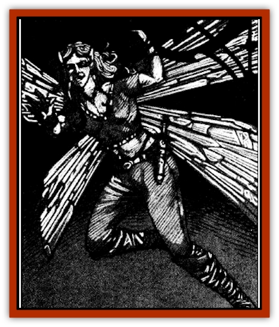

# Baobhan Sith

| Statistic | **Baobhan Sith** |
| --- | --- |
| **Activity Cycle:** | Night |
| **Alignment:** | Chaotic evil |
| **Armor Class:** | 6 |
| **Climate/Terrain:** | Temperate forest |
| **Damage/Attack:** | 1d4 (by weapon) |
| **Diet:** | Omnivore |
| **Frequency:** | Rare |
| **Hit Dice:** | 1 |
| **Intelligence:** | Average to very (8-12) |
| **Magic Resistance:** | 25% |
| **Morale:** | Average (8-10) |
| **Movement:** | 6, Fl 12 (B) |
| **No. Appearing:** | 5-30 (5d6) |
| **No. of Attacks:** | 1 |
| **Organization:** | Band |
| **Size:** | S (2' tall) |
| **Special Attacks:** | Laughter |
| **Special Defenses:** | See below |
| **THAC0:** | 19 |
| **Treasure:** | (X) |
| **XP Value:** | 270 |

The [[Human_Vistana|Vistani]] swear these desperate and bitter creatures are the descendants of a cursed [[Sprite|pixie]] clan captured by the mists of Ravenloft for the unspeakable arts they committed in a distant land. They are cruel creatures who take their greatest pleasure from the suffering of the weak and helpless.

The baobhan sith (or *black sprites*) stand two feet tall and have large transparent wings like those of a cicada. They have sharp [[Elf|elven]] features with long, almost [[Bat|bat]]-like ears. Even druids have difficulty distinguishing the baobhan sith from pixies, and it is only the dull luster of their wings and their distinctive ears that identify them. They favor garish clothing and wear colorful caps.

The baobhan sith speak common and it is believed that they may also know the languages of other [[Sprite|sprites]] and woodland animals.

**Combat:** Unless confident of victory, the baobhan sith will flee any direct confrontation in favor of returning at a later time to torment their opponent through cruel tricks that appeal to their particularly dark sense of humor. If forced to do battle, these creatures can become invisible at will and carry small daggerlike spears that inflict 1d4 points of damage in combat.

The baobhan sith have infravision out to 180 feet and hearing that is far more sensitive than that of a normal human. They are able to employ the following magical spells once per round at the 5th level of ability: *ventriloquism*, *trip*, and *change self*.

Perhaps the most bizarre characteristic of these twisted creatures is their infectious (and magical) laughter. Anyone within 15 feet of a laughing baobhan sith must make a saving throw vs. spell or suffer the effects of *Tasha's uncontrollable hideous laughter*. The baobhan sith cannot use this power at will but must be genuinely amused by something, They generally burst into laughter at the sight of human suffering or an opponent's mishap in combat.

**Habitat/Society:** There is something dark and desperate about the baobhan sith that drives them to ever greater acts of cruelty. They spend their waking hours in a frenzy of evil, fearful that even a moment's rest will cause them to reflect on the dark crime of their ancestors and lead to madness.

The greatest love of the baobhan sith is to cause misfortune for others. They will select a family or community to terrorize and torment them in a manner that will cause the most prolonged suffering, Pets are often captured and then returned dead after the family has had a week or more to search, or a family's sole workhorse may be spooked until it breaks a leg. The baobhan sith rarely kill someone through direct combat, but prefer instead to destroy the people and things about which their victims care most.

The baobhan sith prefer to prey upon the weak and helpless. Nothing is quite as satisfying to these creatures as pushing an elderly victim down a flight of stairs and then bursting into hysterical laughter that quickly spreads to the shocked onlookers.

Baobhan sith dwell in caverns beneath the twisted roots of trees in dark forest glades. They live in loose tribal structures and select leaders for their cruelty and deviousness. While the leader of a tribe is generally the most intelligent of the pack, there are constant power struggles and only the truly barbarous can maintain control for any period of time. While the baobhan sith place no value on magic objects, they will sometimes collect them in their lair to be used later as bait in their tricks.

**Ecology:** Baobhan sith live primarily on roots and insects. They occasionally fall prey to predators who mistake them for birds. Baobhan sith can live up to 200 years. The wings of the baobhan sith can be crushed to create *dust of disappearance*. Twenty-five wings can make one dose that must be used within 1d4 weeds or else it will lose its potency.

---
## Discovery & Documentation

**Source Publication:** Ravenloft Appendix III (1991)
**Campaign Setting:** Ravenloft
**Author(s):** Kirk Botulla

### Other Creatures Found in This Source Book
   * [[Akikage|Akikage]]
   * [[Animator_Common|Animator, Common]]
   * [[Animator_Greater|Animator, Greater]]
   * [[Animator_Minor|Animator, Minor]]
   * [[Animator_General_Information|Animator, General Information]]
   * [[Bakhna_Rakhna|Bakhna Rakhna]]
   * [[Beetle_Scarab|Beetle, Scarab]]
   * [[Boneless|Boneless]]
   * [[Boowray|Boowray]]
   * [[Bruja|Bruja]]
   * [[Carrionette|Carrionette]]
   * [[Carrion_Stalker|Carrion Stalker]]
   * [[Cat_Midnight|Cat, Midnight]]
   * [[Cat_Skeletal|Cat, Skeletal]]
   * [[Cloaker_Resplendent|Cloaker, Resplendent]]
   * [[Cloaker_Shadow|Cloaker, Shadow]]
   * [[Cloaker_Undead|Cloaker, Undead]]
   * [[Corpse_Candle|Corpse Candle]]
   * [[Death's_Head_Tree|Death's Head Tree]]
   * [[Doppelganger_Ravenloft|Doppelganger (Ravenloft)]]
   * [[Familiar_Pseudo-|Familiar, Pseudo-]]
   * [[Familiar_Undead|Familiar, Undead]]
   * [[Feathered_Serpent|Feathered Serpent]]
   * [[Fenhound|Fenhound]]
   * [[Figurine_Ceramic|Figurine, Ceramic]]
   * [[Figurine_Crystal|Figurine, Crystal]]
   * [[Figurine_Ivory|Figurine, Ivory]]
   * [[Figurine_Obsidian|Figurine, Obsidian]]
   * [[Figurine_Porcelain|Figurine, Porcelain]]
   * [[Figurine_General_Information|Figurine, General Information]]
   * [[Fleas_of_Madness|Fleas of Madness]]
   * [[Furies|Furies]]
   * [[Geist|Geist]]
   * [[Ghost_Animal|Ghost, Animal]]
   * [[Golem_Flesh_Ravenloft|Golem, Flesh (Ravenloft)]]
   * [[Golem_Mist_Ravenloft|Golem, Mist (Ravenloft)]]
   * [[Golem_Wax_Ravenloft|Golem, Wax (Ravenloft)]]
   * [[Gremishka|Gremishka]]
   * [[Hag_Spectral|Hag, Spectral]]
   * [[Head_Hunter|Head Hunter]]
   * [[Hearth_Fiend|Hearth Fiend]]
   * [[Hebi-No-Onna|Hebi-No-Onna]]
   * [[Hound_Phantom|Hound, Phantom]]
   * [[Hound_Skeletal|Hound, Skeletal]]
   * [[Imp_Wishing|Imp, Wishing]]
   * [[Ivy_Crawling|Ivy, Crawling]]
   * [[Jack_Frost|Jack Frost]]
   * [[Jolly_Roger|Jolly Roger]]
   * [[Kizoku|Kizoku]]
   * [[Lashweed|Lashweed]]
   * [[Leech_Magical|Leech, Magical]]
   * [[Leech_Psionic|Leech, Psionic]]
   * [[Lich_Defiler|Lich, Defiler]]
   * [[Lich_Drow|Lich, Drow]]
   * [[Lich_Elemental|Lich, Elemental]]
   * [[Lich_Psionic|Lich, Psionic]]
   * [[Living_Tattoo|Living Tattoo]]
   * [[Lycanthrope_Loup-garou|Lycanthrope, Loup-garou]]
   * [[Lycanthrope_Werejackal|Lycanthrope, Werejackal]]
   * [[Lycanthrope_Werejaguar_Ravenloft|Lycanthrope, Werejaguar (Ravenloft)]]
   * [[Lycanthrope_Wereleopard|Lycanthrope, Wereleopard]]
   * [[Lycanthrope_Wereray|Lycanthrope, Wereray]]
   * [[Mist_Ferryman|Mist Ferryman]]
   * [[Moor_Man|Moor Man]]
   * [[Obedient|Obedient]]
   * [[Odem|Odem]]
   * [[Paka|Paka]]
   * [[Plant_Blood_Rose|Plant, Blood Rose]]
   * [[Plant_Fearweed|Plant, Fearweed]]
   * [[Radiant_Spirit|Radiant Spirit]]
   * [[Recluse|Recluse]]
   * [[Remnant_Aquatic|Remnant, Aquatic]]
   * [[Rushlight|Rushlight]]
   * [[Sea_Spawn_Master|Sea Spawn, Master]]
   * [[Sea_Spawn_Minion|Sea Spawn, Minion]]
   * [[Shadow_Asp|Shadow Asp]]
   * [[Shattered_Brethren|Shattered Brethren]]
   * [[Skeleton_Archer|Skeleton, Archer]]
   * [[Skeleton_Insectoid|Skeleton, Insectoid]]
   * [[Skin_Thief|Skin Thief]]
   * [[Spirit_Psionic|Spirit, Psionic]]
   * [[Strahd_Skeleton|Strahd Skeleton]]
   * [[Strahd_Zombie|Strahd Zombie]]
   * [[Unicorn_Shadow|Unicorn, Shadow]]
   * [[Vampire_Drow|Vampire, Drow]]
   * [[Vampire_Nosferatu|Vampire, Nosferatu]]
   * [[Vampire_Oriental|Vampire, Oriental]]
   * [[Virus_General_Information|Virus, General Information]]
   * [[Virus_I|Virus I]]
   * [[Virus_II|Virus II]]
   * [[Virus_III|Virus III]]
   * [[Vorlog|Vorlog]]
   * [[Will_O'Dawn|Will O'Dawn]]
   * [[Will_O'Deep|Will O'Deep]]
   * [[Will_O'Mist|Will O'Mist]]
   * [[Will_O'Sea|Will O'Sea]]
   * [[Zombie_Cannibal|Zombie, Cannibal]]
   * [[Zombie_Desert|Zombie, Desert]]
   * [[Zombie_Wolf|Zombie Wolf]]
   * [[Zombie_Fog|Zombie Fog]]
