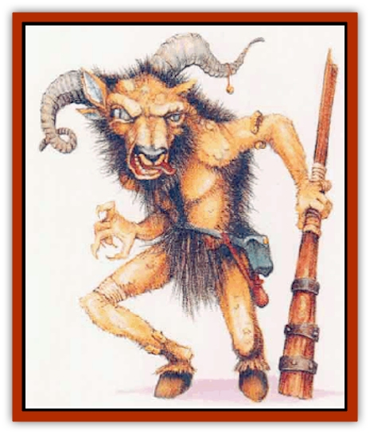

# Bargda

| Statistic | **Bargda** |
| --- | --- |
| **Activity Cycle:** | Night |
| **Alignment:** | Chaotic evil |
| **Armor Class:** | 4 |
| **Climate/Terrain:** | Any subterranean or wilderness |
| **Damage/Attack:** | 4d4 (club)/1d10 (bite) |
| **Diet:** | Omnivore |
| **Frequency:** | Rare |
| **Hit Dice:** | 12 |
| **Intelligence:** | Average (8-10) |
| **Magic Resistance:** | Nil |
| **Morale:** | Champion (16) |
| **Movement:** | 12 |
| **No. Appearing:** | 1d4 |
| **No. of Attacks:** | 2 |
| **Organization:** | Solitary |
| **Size:** | L (9' tall) |
| **Special Attacks:** | Diseased bite |
| **Special Defenses:** | Hideousness |
| **THAC0:** | 9 |
| **Treasure:** | O,R (D) |
| **XP Value:** | 4,000 |

Though the link is weak, bargdas are related to [[Minotaur|minotaurs]]. Bargdas are stronger and far more disgusting, however, for they have been cursed with a horrible putrefying disease. Their bent and twisted bodies stand an impressive 9 feet tall, and they have distorted ram heads with sickly green eyes.

While bargdas may speak Common (50%), the words are often so slurred and garbled that only other bargdas can understand them.

**Combat:** So hideous is this creature that humans and demihumans viewing it must make a saving throw vs. spell or suffer a -2 penalty to both attack and damage rolls.

A bargda attacks with a large, iron-shod wooden dub (with which it inflicts 4d4 points of damage) and with its vicious bite. Victims of this bite suffer not only 1d10 points of damage, but also must make a saving throw vs. poison or be stricken with a debilitating disease. The disease affects reflexes, slowing victims and causing them to lose initiative automatically in every round until the disease is cured. In addition, the disease results in the loss of 1 point of Dexterity per hour, to a minimum Dexterity of 3. A *cure disease* spell negates the effects of the disease with lost Dexterity points returning at the rate of 1 point per day.

**Habitat/Society:** Bargdas live in dark, dismal caves, emerging only to raid isolated settlements. They dwell either singly or in small groups, which include either a mated pair or a small family. A female gives birth to a litter of 4 to 8 about every two years. Offspring are born with the bargda's disease. Only the hardiest youngsters survive, and even fewer live long enough to propagate the species; most offspring die before they learn to walk. Young bargdas stay with the family until about the age of 15.

Bargdas hate all living creatures except [[Ogre|ogres]], [[Troll|trolls]], and [[Giant_Hill|hill giants]], which they dominate and force to do their bidding. Often, bargdas lead these creatures on raids against human and demihuman settlements. Any encounter with bargdas in settled lands is 90% likely to indude 2d12 ogres, trolls, or hill giants. The DM can select one of the three at random, or make the raiding party a mix of them all.)

Treasure is valued by the bargdas, and hoarded avariciously. They not only regard it as a symbol of prestige and power (it shows how many successful raids a bargda has led), but they also recognize its value in swaying other intelligent creatures. If a bargda is threatened in its lair, and the battle seems hopeless, it may bargain with its treasure to escape with its life. Bargdas are smart enough to hide their treasure well.

**Ecology:** These creatures are omnivores, eating anything from fungi to furry mammals. They cannot digest most food in its natural state, however. Whether plant or animal, the food must first be infected with a special enzyme. It is no coincidence that this enzyme is produced by the very microorganism causing the disease bargdas pass on to their victims.

In short, bargdas infect a would-be dinner with this microbe much like a cook marinading a tough cut of meat. If they kill a foe but fail to pass on the disease during battle, bargdas bite and lick the dead corpse to cover it with the germ. Then the body is set aside, allowing the germ to multiply. Later, the bargdas feast. This habit fills the bargda's lair with putrescent, <q>ripening</q> food. On a less disgusting note, bargdas may lick decaying plant stocks when the larder of corpses runs low, also setting the plants aside to ripen.

The disease carried by bargdas sustains them, but it also takes its toll. Eventually it wears them down, weakening the mighty humanoids as they approach the age of 40 or 50 years. As a bargda's own reflexes are worn away by the disease, its days are numbered; soon a younger bargda or resentful humanoid underlings will kill the weakened monster.

---
## Discovery & Documentation

**Source Publication:** Mystara Appendix (1994)
**Campaign Setting:** Mystara
**Author(s):** John Nephew, Teeuwynn Woodruff, John Terra, Skip Williams

### Other Creatures Found in This Source Book
   * [[Actaeon|Actaeon]]
   * [[Agarat|Agarat]]
   * [[Ash_Crawler|Ash Crawler]]
   * [[Baldandar|Baldandar]]
   * [[Bhut|Bhut]]
   * [[Bird_Mystara|Bird (Mystara)]]
   * [[Blackball|Blackball]]
   * [[Choker|Choker]]
   * [[Coltpixie|Coltpixie]]
   * [[Crone_of_Chaos|Crone of Chaos]]
   * [[Darkhood|Darkhood]]
   * [[Darkwing|Darkwing]]
   * [[Decapus|Decapus]]
   * [[Deep_Glaurant|Deep Glaurant]]
   * [[Diabolus|Diabolus]]
   * [[Dimensional_Warper|Dimensional Warper]]
   * [[Dragon_Mystara_Crystalline|Dragon (Mystara), Crystalline]]
   * [[Dragon_Mystara_Jade|Dragon (Mystara), Jade]]
   * [[Dragon_Mystara_Onyx|Dragon (Mystara), Onyx]]
   * [[Dragon_Mystara_Ruby|Dragon (Mystara), Ruby]]
   * [[Drake_Mystara|Drake (Mystara)]]
   * [[Dragonfly|Dragonfly]]
   * [[Dusanu|Dusanu]]
   * [[Elemental_of_Chaos_Air_Earth|Elemental of Chaos, Air/Earth]]
   * [[Elemental_of_Chaos_Fire_Water|Elemental of Chaos, Fire/Water]]
   * [[Elemental_of_Law_Air_Earth|Elemental of Law, Air/Earth]]
   * [[Elemental_of_Law_Fire_Water|Elemental of Law, Fire/Water]]
   * [[Familiar_Mystara|Familiar (Mystara)]]
   * [[Frost_Salamander|Frost Salamander]]
   * [[Fundamental_Air_Earth|Fundamental, Air/Earth]]
   * [[Fundamental_Fire_Water|Fundamental, Fire/Water]]
   * [[Gargantua_Mystara|Gargantua (Mystara)]]
   * [[Geonid|Geonid]]
   * [[Ghostly_Horde|Ghostly Horde]]
   * [[Giant_Athach|Giant, Athach]]
   * [[Giant_Hephaeston|Giant, Hephaeston]]
   * [[Golem_Drolem|Golem, Drolem]]
   * [[Golem_Mystara_I|Golem (Mystara) I]]
   * [[Golem_Mystara_II|Golem (Mystara) II]]
   * [[Golem_Mystara_III|Golem (Mystara) III]]
   * [[Gray_Philosopher|Gray Philosopher]]
   * [[Guardian_Warrior|Guardian Warrior]]
   * [[Gyerian|Gyerian]]
   * [[Herex|Herex]]
   * [[Hivebrood|Hivebrood]]
   * [[Horde|Horde]]
   * [[Hsiao|Hsiao]]
   * [[Huptzeen|Huptzeen]]
   * [[Hutaakan|Hutaakan]]
   * [[Imp_Mystara|Imp (Mystara)]]
   * [[Jellyfish_Giant_Mystara|Jellyfish, Giant (Mystara)]]
   * [[Kna|Kna]]
   * [[Kopru|Kopru]]
   * [[Lizard_Mystara|Lizard (Mystara)]]
   * [[Lizard-kin_Mystara|Lizard-kin (Mystara)]]
   * [[Lupin|Lupin]]
   * [[Lycanthrope_Werejaguar_Mystara|Lycanthrope, Werejaguar (Mystara)]]
   * [[Lycanthrope_Wereswine|Lycanthrope, Wereswine]]
   * [[Magen|Magen]]
   * [[Manikin|Manikin]]
   * [[Mek|Mek]]
   * [[Mujina|Mujina]]
   * [[Nagpa|Nagpa]]
   * [[Neh-thalggu|Neh-thalggu]]
   * [[Nightshade_Mystara|Nightshade (Mystara)]]
   * [[Nuckalavee|Nuckalavee]]
   * [[Pegataur|Pegataur]]
   * [[Phanaton|Phanaton]]
   * [[Plant_Dangerous_Mystara|Plant, Dangerous (Mystara)]]
   * [[Plasm|Plasm]]
   * [[Rakasta|Rakasta]]
   * [[Rock_Man|Rock Man]]
   * [[Sabreclaw|Sabreclaw]]
   * [[Sacrol|Sacrol]]
   * [[Scamille|Scamille]]
   * [[Shapeshifter|Shapeshifter]]
   * [[Shargugh|Shargugh]]
   * [[Shark-kin|Shark-kin]]
   * [[Sollux|Sollux]]
   * [[Spectral_Death|Spectral Death]]
   * [[Spectral_Hound|Spectral Hound]]
   * [[Spider-kin|Spider-kin]]
   * [[Spirit_Mystara|Spirit (Mystara)]]
   * [[Statue_Living|Statue, Living]]
   * [[Surtaki|Surtaki]]
   * [[Tabi|Tabi]]
   * [[Thoul|Thoul]]
   * [[Thunderhead|Thunderhead]]
   * [[Tiger_Ebon|Tiger, Ebon]]
   * [[Topi|Topi]]
   * [[Tortle|Tortle]]
   * [[Vampire_Velya|Vampire, Velya]]
   * [[White_Fang|White Fang]]
   * [[Worm_Mystara|Worm (Mystara)]]
   * [[Wyrd|Wyrd]]
   * [[Yowler|Yowler]]
   * [[Zombie_Lightning|Zombie, Lightning]]
