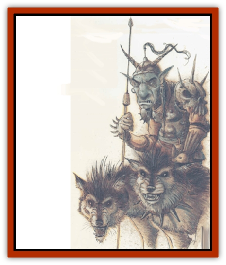

# Barghest

| Statistic | **Barghest** |
| --- | --- |
| **Activity Cycle:** | Any |
| **Alignment:** | Lawful evil |
| **Armor Class:** | 2 to -4 |
| **Climate/Terrain:** | Gehenna/Prime Material |
| **Damage/Attack:** | 2d4 + HD value |
| **Diet:** | Carnivore |
| **Frequency:** | Very rare |
| **Hit Dice:** | 6+6 to 12+12 |
| **Intelligence:** | High to genius (13-18) |
| **Magic Resistance:** | 5% per HD (ignore pluses) |
| **Morale:** | Champion (15) |
| **Movement:** | 15 |
| **No. Appearing:** | 1-2 |
| **No. of Attacks:** | 2 |
| **Organization:** | Solitary |
| **Size:** | M-L (5-9' tall) |
| **Special Attacks:** | See below |
| **Special Defenses:** | See below |
| **THAC0:** | 15 (6+6 HD) / 13 (7+7 to 8+8 HD) / 11 (9+9 to 10+10 HD) / 9 (11+11 to 12+12 HD) |
| **Treasure:** | See below |
| **XP Value:** | 6+6 HD: 2,000 / 7+7 HD: 3,000 / 8+8 HD: 4,000 / 9+9 HD: 5,000 / 10+10 HD: 6,000 / 11+11 HD: 8,000 / 12+12 HD: 9,000 |

Of the various monsters that inhabit the rifts of the plane of Gehenna, the barghest is certainly the most common and one of the most fearsome. The barghest's natural shape is very much the same as that of a large [[Goblin|goblin]], and when dwelling among goblins, it generally retains that form.

While it appears to be a large goblin when it is a whelp, its skin darkens from yellow to a bluish-red as it grows larger and stronger, and eventually its skin turns an even blue at adulthood. The eyes of the monster glow orange when it is excited, but otherwise they are indistinguishable from those of a normal goblin.

A barghest is also able to assume at will the form of a large war [[Dog|dog]] or a wild dog. Hence, the creature has oftentimes been referred to as a "devil-dog", but this is a misnomer. The precise form taken can vary from creature to creature, but all forms are those of typical wild or war dogs, and it is almost impossible (95% unlikely) to tell one from its natural counterpart. However, natural dogs instantly recognize, fear, and hate a barghest, and they will attack it at any opportunity.

**Combat:** Barghests employ a claw/claw attack in battle. (In canine form, they only bite.) They may only be hit by weapons of +1 or better enchantment. They are not particularly vulnerable to any attack form, but in their canine shape they risk the failure of a saving throw vs. spell when subjected to a *fireball*, *flame strike*, or *meteor swarm* spell: If attacked by such a spell while in canine form and a barghest fails its saving throw, it is instantly hurled to Gehenna. Those returned to the Outer Plane are most likely slain or enslaved by their full-grown fellows, but even if they are not so treated they cannot return to the Prime Material Plane without outside assistance.

Barghests are able to perform the following spell-like abilities, once per round, at will: *shape change* (into either canine or goblinlike form), *levitate*, *misdirection*, and *project image*. They are able to perform the following abilities once per day: *charm* (person or monster), *dimension door*, and *emotion*.

When in canine form, barghests are able to move at double their normal movement rate (maximum of 30), *pass without a trace* (as the spell), and become 75% unlikely to be noticed when motionless. If undetected, they impose a -2 penalty on opponents' surprise rolls.

**Habitat/Society:** These beings are native to Gehenna and tend to live in isolation on that plane. There, each barghest has its own stronghold and force of servitors, over which it rules despotically. Goblins readily recognize and worship barghests (even in their goblinoid form), but other races find them to be virtually indistinguishable from these common prime-material monsters. The goblin hosts fear and serve the barghests, often going to great lengths to bring them suitable gifts and sacrifices, and the barghests respond by slaying powerful enemies of the goblins as well as generally enriching the goblins' treasure hoards.

Occasionally, a barghest on Gehenna will spawn a litter of six young, which are immediately sent to the Prime Material Plane to feed and grow. Those that survive eventually return to Gehenna, but while they are away, they must feed upon humans and demihumans. Barghest whelps are found either alone or in pairs or the Prime Material Plane, generally living near isolatea communities of humans or with bands of goblins.

When barghest whelps first come to the Prime Material, they are relatively weak, having only 6+6 Hit Dice. However, for every energy (experience) level of human (or demihuman) life that they slay or devour, 1 hit point is added to their overall total. Once they absorb eight levels, they gain another Hit Die, plus an additional hit point per die. (Hence, a 6+6 HD barghest who absorbs eight experience levels becomes a 7+7 HD barghest.) Note that 0-level characters are worth only one-half of an experience level to the barghest, so they are considerably less attractive targets than high-level heroes. In addition, each time a barghest gains a Hit Die, its Armor Class decreases by 1 and its Strength score increases from an initial 18/00 to a maximum of 24. When the barghest finally achieves full growth and power, it discovers the ability to *plane shift* to Gehenna, where it seeks its own reeking valley rift to lord over.

What treasure barghests gather into their own strongholds in Gehenna is unknown, although it is rumored to be great. However, while they live upon the Prime Material Plane, they accumulate no personal treasure.

**Ecology:** The barghest passes through different stages in its life. As a whelp it is a hunter and tracker consigned to the Prime Material Plane. There it grows in cunning and wisdom until it is ready to enter into the next stage of its life. At this phase it returns to Gehenna and becomes a leader. It is still a hunter, though now its tactics and attitudes are greater, to match the game - other intelligent beings - that it hunts.

---
## Discovery & Documentation

**Source Publication:** Planescape Campaign Setting (1994)
**Campaign Setting:** Planescape
**Author(s):** David Cook

### Other Creatures Found in This Source Book
   * [[Aleax|Aleax]]
   * [[Astral_Searcher|Astral Searcher]]
   * [[Bariaur|Bariaur]]
   * [[Cranium_Rat|Cranium Rat]]
   * [[Dabus|Dabus]]
   * [[Magman|Magman]]
   * [[Minion_of_Set|Minion of Set]]
   * [[Modron|Modron]]
   * [[Nic'Epona|Nic'Epona]]
   * [[Spirit_of_the_Air|Spirit of the Air]]
   * [[Vortex|Vortex]]
   * [[Yugoloth_Lesser_Marraenoloth|Yugoloth, Lesser, Marraenoloth]]
