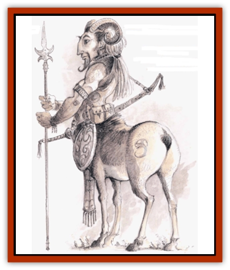

# Bariaur

| Statistic | **Bariaur** |
| --- | --- |
| **Activity Cycle:** | Day |
| **Alignment:** | Chaotic good |
| **Armor Class:** | 6 |
| **Climate/Terrain:** | Ysgard |
| **Damage/Attack:** | 1-8 or by weapon |
| **Diet:** | Herbivore |
| **Frequency:** | Uncommon |
| **Hit Dice:** | 7 |
| **Intelligence:** | High (13-14) |
| **Magic Resistance:** | 10% |
| **Morale:** | Steady (11-12) |
| **Movement:** | 15 |
| **No. Appearing:** | See below |
| **No. of Attacks:** | 1 |
| **Organization:** | Flock |
| **Size:** | L (7' tall) |
| **Special Attacks:** | Charge |
| **Special Defenses:** | +2 on surprise rolls |
| **THAC0:** | 13 |
| **Treasure:** | Nil |
| **XP Value:** | 2,000 |

Bariaurs, probably a hardy relative of the [[Centaur|centaur]] and created by the same sylvan being eons ago, have the body of a large ram or ewe and the torso of a muscular human. Their heads mix human and ramlike features; horns curl out of both sides of the skull of the male, for example. Bariaurs often carry large clubs as weapons. Details of bariaur dress and customs, and of the bariaur character class, appear in the *Planescape Campaign Setting* boxed set. This entry describes NPC bariaurs as encountered on their native plane of Ysgard, and they differ slightly from the bariaur player character race. Note that the special qualities listed below are attributed only to nonplayer character bariaurs.

**Combat:** Bariaurs are tough, skilled combatants. The bariaur warrior's club is a personal icon, a family or flock heirloom handed down through generations. Each weapon's history is etched on it in runes. To lose this personal weapon means such humiliation that the owner generally leaves Ysgard to wander other planes, returning home only when it has redeemed its honor.

In combat, a bariaur's club has the speed factor and damage characteristics of a two-handed sword.

Even weaponless, a bariaur can butt with its horns (1d8 points of damage). Male bariaurs use this attack in nonlethal battles for dominion over the flock.

A male bariaur can charge at up to half again its normal movement rate (3d8 points of damage, 50% likely to knock down an opponent the bariaur's size or smaller). The bariaur must move at least 30 feet to charge

Bariaur have uncanny senses of smell and hearing, and therefore receive a +2 bonus on surprise rolls. Bariaurs have a slight enchantment, common for creatures of sylvan origin, that makes them 10% resistant to magic. Even if the resistance roll fails, hariaurs still receive a +1 bonus to any save vs. spells. They also can move from layer to layer on the plane of Ysgard at will.

**Habitat/Society:** Like most natives of Ysgard, bariaurs are carefree and wild. Their powerful wanderlust keeps the entire flock constantly on the move.

A flock of bariaurs follows a single leader, stronger or more charismatic than other males in the flock. A leader's rule is absolute, but younger males who think themselves ready for leadership may challenge him. Such challenges, though, are formal and ritualized, never reckless; bariaurs' chaotic nature is directed outside of the flock, rather than within it. The loss of a duel of challenge brings no disgrace nor dishonor.

A flock holds 5 to 20 males, 10 to 30 females, and 1d12-1 young. Flocks are familial and under normal circumstances never split up.

An under-reported aspect of bariaur life is their robust playfulness. They believe that that the two great goods are the advancing of their strong sense of honor and the need to have a good time. The bariaur often meet in shows of friendly rivalry on the great grassy plains of Ysgard. At these festivals they stage singing contests, tell tales, and play an intricate game not unlike polo. Human observers often mistake the rivalry for pride or pettiness, and are often completely flabbergasted when, at the end of a festival, the bariaur depart on the friendliest terms.

Even bariaur adventurers on a hard quest may arrange simple contests to remind them of the joy of life. It is a magical moment when a grimly determined bariaur happens on one of his fellows and puts aside his honor-driven quest for a few minutes (or hours) of race and sport. Such events often do them as much good as a night's sleep. Then they return to their quests.

Nothing saddens a bariaur like learning that a companion is sad. These brave ones fear neither death nor the most monstrous manifestation of the powers of darkness; yet they have been known to journey across the most dangerous planar barriers to visit the sickbed of a valued friend.

**Ecology:** Bariaurs are herbivores, feeding on berries, nuts, leaves and other foods gathered in the forests. They do not usually travel from one layer of Ysgard to another, but do so if the food supply in an area warrants a move.

Bariaurs have few natural enemies in Ysgard, although they battle the giants there. Flocks even attack giant lairs all-out, trying to wipe out the beasts.

---
## Discovery & Documentation

**Source Publication:** Planescape Campaign Setting (1994)
**Campaign Setting:** Planescape
**Author(s):** David Cook

### Other Creatures Found in This Source Book
   * [[Aleax|Aleax]]
   * [[Astral_Searcher|Astral Searcher]]
   * [[Barghest|Barghest]]
   * [[Cranium_Rat|Cranium Rat]]
   * [[Dabus|Dabus]]
   * [[Magman|Magman]]
   * [[Minion_of_Set|Minion of Set]]
   * [[Modron|Modron]]
   * [[Nic'Epona|Nic'Epona]]
   * [[Spirit_of_the_Air|Spirit of the Air]]
   * [[Vortex|Vortex]]
   * [[Yugoloth_Lesser_Marraenoloth|Yugoloth, Lesser, Marraenoloth]]
