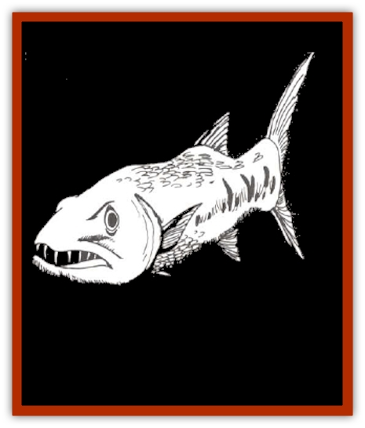

# Barracuda

| Statistic | **Barracuda** |
| --- | --- |
| **Activity Cycle:** | Day |
| **Alignment:** | Neutral |
| **Armor Class:** | 6 |
| **Climate/Terrain:** | Tropical ocean |
| **Damage/Attack:** | 2-8 |
| **Diet:** | Carnivore |
| **Frequency:** | Uncommon |
| **Hit Dice:** | 1-3 |
| **Intelligence:** | Non- (0) |
| **Magic Resistance:** | Nil |
| **Morale:** | Steady (11) |
| **Movement:** | Sw 30 |
| **No. Appearing:** | 2-12 |
| **No. of Attacks:** | 1 |
| **Organization:** | School |
| **Size:** | S (2') to L (12') |
| **Special Attacks:** | Nil |
| **Special Defenses:** | Nil |
| **THAC0:** | 1-2 HD: 19 / 3 HD: 17 |
| **Treasure:** | Nil |
| **XP Value:** | 1 HD: 15 / 2 HD: 35 / 3 HD: 65 |

Barracuda inhabit warm salt waters.

In appearance, the barracuda is long (up to 12 feet) and slender, with a cruel mouth and jaw that make it look particularly ferocious. The lower jaw projects out and the entire mouth is rimmed with fang-like teeth.

**Combat:** Barracuda bodies are shaped much like an arrow, and can be just as deadly in tropical oceans. Able to move very rapidly, these [[Fish|fish]] can dart in for a bite and then swim off just as suddenly. These predatory fish are lightning quick, going from a motionless state to full speed in a single melee round.

Barracuda are the bullies of their saltwater home; they attack any prey that is injured, appears helpless, or is relatively small. To the barracuda, this includes most human swimmers, who will yield tasty tidbits even if not entirely defeated. Each hit, for 2d4 points of damage, represents a whole mouthful of flesh for the hungry barracuda.

Worse yet, barracuda hunt in schools of up to 12 voracious fish, taking turns for who gets next bite. An unprotected human swimmer having to fight off two or three of these fast fish is virtually helpless, for even if he manages to fend off one, the others are likely to score in the meanwhile.

The barracuda hangs in the water about 20 feet away, watching its prey for any signs of weakness and patiently waiting for an opportunity to strike. With its ugly eyes staring through the murky depths, this can be an unnerving experience to the large fish's victim.

A school of barracuda has been known to dog a swimmer for hours, making feints and attacks now and again, until the swimmer finally succumbs. Many such opportunities do not last long enough for the barracuda to claim their victim, for if sharks are nearby, they come at the scent of blood once the first hit is made.

Barracuda are also attracted to shiny objects underwater, and unfortunately for the swimmer, light skin often qualifies as a shiny object, especially when wiggling just so. The first clue that a barracuda is in the area might be a sudden pain in the foot, as the marauder swims by and bites off a few tender toes. If the swimmer tries to cover himself up, that just makes any exposed areas all the more tempting.

Those using magic underwater are particularly cautioned against barracuda attacks. The sad tale of Grindonel the Mage is worth relating here. In an attempt to visit a city of [[Elf_Aquatic|sea elves]] that he had heard of, he wore a *ring of swimming* and dove beneath the ocean. The glints of sunlight off the ring, unfortunately, attracted the attentions of a school of barracuda, and on the first attack, the ring (and the finger on which it was worn) were gone. Grindonel, unable to cast a spell or to reach the surface in time, drowned a watery death.

**Habitat/Society:** As mentioned above, barracuda are usually encountered in small schools in tropical oceans, although some species are occasionally found in more temperate seas.

Mermen have learned to tame the ferocious barracuda, and it is common to find a large school (3d6 fish) of the larger sort guarding a merman community.

**Ecology:** Barracudas share the top of the food chain with other large, predatory sea creatures, feeding on smaller fish and sea mammals that appear weak or injured.

For those who enjoy deep sea fishing, the barracuda is an excellent game fish - fast, full of fight, and relatively easy to attract to a lure. Use a heavy line, and be certain to be fastened down in the boat. Being pulled overboard into a school of angry barracuda makes a much more interesting story if the teller survived the mishap.

---
## Discovery & Documentation

**Source Publication:** MC2 Volume II (1993)
**Campaign Setting:** Advanced Dungeons & Dragons 2nd Edition
**Author(s):** Jay Batista, Scott Bennie, Grant Boucher, William W. Connors, Steve Gilbert, Heike Kubasch, James Lowder, David Edward Martin, Bruce Nesmith, Jean Rabe, Rick Swan, John J. Terra, Gary L. Thomas

### Other Creatures Found in This Source Book
   * [[Ant|Ant]]
   * [[Ant_Lion_Giant|Ant Lion, Giant]]
   * [[Ape_Carnivorous|Ape, Carnivorous]]
   * [[Baboon|Baboon]]
   * [[Badger|Badger]]
   * [[Beetle_Giant|Beetle, Giant]]
   * [[Bulette|Bulette]]
   * [[Bullywug|Bullywug]]
   * [[Dwarf_Duergar|Dwarf, Duergar]]
   * [[Dwarf_Gully|Dwarf, Gully]]
   * [[Eagle|Eagle]]
   * [[Eel|Eel]]
   * [[Elemental_Air_Kin|Elemental, Air Kin]]
   * [[Elemental_Water_Kin|Elemental, Water Kin]]
   * [[Elemental_Water_Kin_Water_Weird|Elemental, Water Kin, Water Weird]]
   * [[Firestar|Firestar]]
   * [[Firetail|Firetail]]
   * [[Fish_Giant|Fish, Giant]]
   * [[Frog|Frog]]
   * [[Gorgon|Gorgon]]
   * [[Hawk|Hawk]]
   * [[Heucuva|Heucuva]]
   * [[Hippocampus|Hippocampus]]
   * [[Hippogriff|Hippogriff]]
   * [[Kelpie|Kelpie]]
   * [[Kenku|Kenku]]
   * [[Killmoulis|Killmoulis]]
   * [[Kuo-Toa|Kuo-Toa]]
   * [[Lamia|Lamia]]
   * [[Lammasu|Lammasu]]
   * [[Lamprey|Lamprey]]
   * [[Leech|Leech]]
   * [[Leprechaun|Leprechaun]]
   * [[Leucrotta|Leucrotta]]
   * [[Locathah|Locathah]]
   * [[Lycanthrope_Wereboar|Lycanthrope, Wereboar]]
   * [[Lycanthrope_Werefox|Lycanthrope, Werefox]]
   * [[Mammal_Minimal|Mammal, Minimal]]
   * [[Mammal_Small|Mammal, Small]]
   * [[Mimic|Mimic]]
   * [[Morkoth|Morkoth]]
   * [[Muckdweller|Muckdweller]]
   * [[Myconid|Myconid]]
   * [[Naga|Naga]]
   * [[Obliviax|Obliviax]]
   * [[Octopus_Giant|Octopus, Giant]]
   * [[Otyugh|Otyugh]]
   * [[Piranha|Piranha]]
   * [[Plant_Dangerous_I|Plant, Dangerous I]]
   * [[Plant_Intelligent|Plant, Intelligent]]
   * [[Poltergeist|Poltergeist]]
   * [[Porcupine|Porcupine]]
   * [[Rat_Osquip|Rat, Osquip]]
   * [[Roc|Roc]]
   * [[Roper|Roper]]
   * [[Rot_Grub|Rot Grub]]
   * [[Rust_Monster|Rust Monster]]
   * [[Sahuagin|Sahuagin]]
   * [[Sea_Lion|Sea Lion]]
   * [[Sea_Horse_Giant|Sea Horse, Giant]]
   * [[Shambling_Mound|Shambling Mound]]
   * [[Shark|Shark]]
   * [[Sphinx|Sphinx]]
   * [[Squid_Giant|Squid, Giant]]
   * [[Stirge|Stirge]]
   * [[Swanmay|Swanmay]]
   * [[Tarrasque|Tarrasque]]
   * [[Tasloi|Tasloi]]
   * [[Triton|Triton]]
   * [[Troglodyte|Troglodyte]]
   * [[Urchin|Urchin]]
   * [[Urd|Urd]]
   * [[Weasel|Weasel]]
   * [[Wolverine|Wolverine]]
   * [[Yellow_Musk_Creeper|Yellow Musk Creeper]]
