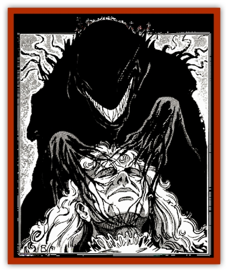

# Bastellus

| Statistic | **Bastellus** |
| --- | --- |
| **Activity Cycle:** | Night |
| **Alignment:** | Neutral evil |
| **Armor Class:** | 0 |
| **Climate/Terrain:** | Any city or village |
| **Damage/Attack:** | Nil |
| **Diet:** | Dream essences |
| **Frequency:** | Very rare |
| **Hit Dice:** | 4 |
| **Intelligence:** | Average (8-10) |
| **Magic Resistance:** | Nil |
| **Morale:** | Unsteady (5-7) |
| **Movement:** | Fl 15 (A) |
| **No. Appearing:** | 1 |
| **No. of Attacks:** | 1 |
| **Organization:** | Solitary |
| **Size:** | M (6' ta1l) |
| **Special Attacks:** | See below |
| **Special Defenses:** | See below |
| **THAC0:** | 17 |
| **Treasure:** | Nil |
| **XP Value:** | 6,000 |

The bastellus is a haunting, undead creature that comes in the night to feed upon the dream energies of helpless sleepers. In many cultures, it is known simply as a *nightmare* or *dream stalker* (see also "[[Dream_Stalker|dream stalker]]").

The bastellus is seldom seen, for it only appears in the presence of sleeping beings. Reports of the creature's true form, however, have been gathered from those who came across one while it was feeding. From these accounts, it is known that the bastellus looks like a hulking humanoid shadow. Utterly featureless, it feeds by placing its outstretched hand upon the victim's brow. When feeding, it always has its head thrown back as if it were in ecstasy, for the absorption of dream energy causes it great pleasure.

No recorded attempt to communicate with a bastellus has ever succeeded, so its language (if any) is unknown to mortal man. It is assumed, however, that a bastellus can impart messages to others through manipulation of their dreams, for many incidents have occurred in which previously unknown facts were available to someone after a visitation from a bastellus.

**Combat:** The eerie and spectral nature of the bastellus makes it largely invulnerable to physical harm. Only magical weapons of +3 or better can strike the creature, and even they do only half damage to it. Like most undead, it is immune to *charm*, *sleep*, or *hold* spells. Spells that depend on cold, heat, or electricity to inflict damage cannot injure bastelli and, as they have no physical bodies, they are immune to all manner of poisons. Holy water and the like cause no damage to bastelli, but they can be turned (as if they were [[Ghost|ghosts]]) by powerful priests and clerics. A *dispel evil* cast directly a at bastellus is the only sure way to destroy it, and even then it is allowed to a save vs. spells to avoid annihilation.

The bastellus can move about in dimly lit or shadowy places without detection 95% of the time. Even persons on their guard for a dark form moving through the shadows have little hope of spotting the horror - a percentage chance equal to the higher of their Intelligence or Wisdom scores.

A *protection from evil* spell will prevent the bastellus from entering a given area or attacking a given individual, but it is not harmed by these spells. A *negative plane protection* spell is fully effective against a bastellus and also breaks the creature of its desire to feed again on the same victim (although it may do so out of chance or proximity, it is no longer compelled to do so as described below).

If it desires to move into an area with awake beings in it, the bastellus can employ a powerful *sleep* spell that affects all beings within 50 feet. A saving throw vs. spells is permitted by those in range, but this roll is made at a -4 penalty. This spell is so powerful that elves are only 30% resistant to it and half elves are only 10% resistant.

Once all of the persons in a given area are asleep, the bastellus picks out a target and moves in to feed. Since the *sleep* it induces in others is a magical and dreamless one, it does not attack those who have been affected by its power. Thus, only someone who was asleep before its spell was cast will be targeted. In addition, the bastellus is unable to feed on the spirit essences of [[Elf|elves]] and [[Elf_Half-|half-elves,]] so they are safe from its preying as well.

To attack, the bastellus moves close to its victim and reaches out an arm to touch the target's brow. As soon as it makes contact, the dreams of the sleeper become twisted. Whatever scene he or she might have been imagening turns dark and evil. The only common thread in these visions of terror is that they will be drawn from the darkest part of the dreamer's mind - the id - and will reflect his or her greatest fears.

For example, if a paladin is worried about his chaste love for a sweet princess and is dreaming of an evening rendezvous with his cherished one, he might find that she has suddenly turned into a sultry temptress. Her actions might be so alluring that in his dream he cannot turn away from her, even though he knows that to yield to her invitations spells certain doom. In the end, he is forced to embrace the twisted mockrey of his betrothed and his soul seems to fade to absolute darkness.

When the dreamer awakes, he feels shaken and distraught. The night's sleep proves to be unrestful, and the memory of the horrible dream burns in his mind. No hit points are recovered from a sleep interrupted by a bastellus, and the character will awake too disturbed to be able to memorize new spells or perform any act of great mental concentration. In addition, the victim will find that he has been reduced by one level due to the feeding of the dark creature.

Any being reduced to below level 0 by the preying of a bastellus will die in its sleep, seemingly of a heart attack. If the body is not destroyed (via cremation, immersion in acid, or similar means), its spirit will rise in a number of days equal to the number of levels it lost to the bastellus. Thus, a 14th level wizard would rise up in two weeks. The new spirit is also a bastellus, but it has no connection with the monster that created it.

If caught unawares, the bastellus can be forced into actual combat - although it will always try to flee from such confrontations. In these cases, it is very limited in power, for its *sleep* spell does not work on those who can see it. The creature has other powers to enable it to escape in such cases, but they are not nearly so fearsome as its energy draining dreams. The bastellus can invoke an area of *darkness* within 50 feet of itself (often to cover its escape) and pass through any solid object without resistance.

As creatures of darkness, bastelli will shun brightly lighted areas. While their natural ability to create darkness is able to overcome magical light sources of less than 3rd level (a normal *light* spell, for example), it cannot darken an area illuminated by more powerful spells. Thus, a *continual light* spell will provide enough luminescence to prevent the bastellus from entering the lighted area. Note that bright light do not harm the creature, but serves to keep it at bay. Further, the presence of a bright light will not prevent the bastellus from employing its sleep spell on those in the illuminated area if it can draw near enough to them to do so.

Should the bastellus be forced to attack, it does so by moving through a living being (requiring a normal attack roll to do so). If the bastellus can do this, the victim must save vs. spells or be driven into an extreme state of paranoia. The victim's companions become (to him) his greatest enemies, as drawn from his own subconscious by the touch of the bastellus, and he will attack them without mercy. Although these delusions last only 1d4 rounds, the chaos that usually ensues during this time provides more than enough cover to allow the bastellus to escape.

If the bastellus is reduced to zero hit points but is not destroyed by the casting of dispel evil, It will rise again to plague the world. When the last blow is struck to the creature, it will seem to boil away into nothingness like the cloud of steam rising above a pot of boiling water. At the same time, it throws its head back and unleashes a telepathic cry of anguish and pain that causes all within 50 feet to make a fear check. If the creature was in contact with a victim when it was struck down, the shock to the dreamer is so intense that he or she must save vs. death or be instantly slain. On the next night, the bastellus will rise again at the place where it was first created to renew its dreadful preying.

The bastellus passes the day in a pocket dimension of shadows and nightmares (see below). Because of the regenerative effects of its slumber here, the creature is always returned to full hit points before the coming of night and its return to the prime material plane.

**Habitat/Society:** The bastellus is drawn to places where large numbers of people dwell and, thus, dream. Because of this, it frequently appears in cities and towns.

While in a given location, it seeks out those who have the most vivid dreams. Usually, this includes highly passionate or motivated individuals and those rare creative minds who can find true freedom of expression only in their nightly flights of fantasy. Because these people tend to be the most extroverted and well known persons in their area, their sudden and mysterious deaths often cause quite a stir. Before long, it becomes all too clear that some foul creature is stalking the citizenry and feeding on those who provide its fire and life.

Once the bastellus has fed upon a given person's dreams, it becomes obsessed with that person and will return to taste his or her esseces nightly until the victim dies. As soon as this fate befalls its chosen prey, the creature moves on in search of another energetic mind upon which to feast.

As mentioned earlier, those who die from the preying of a bastellus may well become one themselves. On the night that the disembodied spirit returns from the dead, it feels a burning hunger. Having no memory of its past life, the spirit knows only that it must seek out the dreams, aspirations, and loves of others in order to fill the void that aches within it. Before the night is done, it must taste the dream essences of another or fade away, never to return. Usually, this is not a problem as the victim probably died in a city and the spirit will reappear at the site of its death.

The pocket universe in which the bastellus passes the day is believed to be associated with an unusual conjunction of planes. Many luminaries have postulated that it must contain aspects of both the negative material plane and the dreaded demiplane of Ravenloft. As these creatures are encountered only in the latter realm, such an explanation seems likely.

**Ecology:** There are those who would argue that the bastellus is a creature from beyond the grave and, therefore, has no place in the biology of the natural world. In fact, there is a great deal of speculation that this is not the case. Numerous scholars have put forth the theory that the bastellus is actually a product of the unrecognized hopes and aspirations of living creatures. If this is true, then the bastellus is very much a by-product of the living world and at least nominally important to it. This debate has raged for countless centuries, however, and it seems that the scholars who put forth both arguments are no closer to a resolution of the issue than they were when the debate began.

The dream essences of the bastellus, while hard to obtain, are of almost incalculable value to necromancers and illusionists in the crafting of magical items. It is said that an illusionist who uses even the tiniest fraction of such a creature's substance as a material component in the creation of an illusion will find that the images they create are drastically more vivid than they might otherwise be - making it almost impossible for victims to convince themselves that they are not real.

---
## Discovery & Documentation

**Source Publication:** MC10 Ravenloft Appendix I (1989)
**Campaign Setting:** Planescape
**Author(s):** William W. Connors

### Other Creatures Found in This Source Book
   * [[Bat_Ravenloft|Bat (Ravenloft)]]
   * [[Bowlyn|Bowlyn]]
   * [[Broken_One|Broken One]]
   * [[Bussengeist|Bussengeist]]
   * [[Darkling|Darkling]]
   * [[Doom_Guard|Doom Guard]]
   * [[Doppelganger_Plant|Doppelganger Plant]]
   * [[Elemental_Ravenloft|Elemental (Ravenloft)]]
   * [[Ermordenung|Ermordenung]]
   * [[Ghoul_Lord|Ghoul Lord]]
   * [[Goblyn|Goblyn]]
   * [[Golem_III|Golem III]]
   * [[Golem_IV|Golem IV]]
   * [[Golem_Ravenloft|Golem (Ravenloft)]]
   * [[Grim_Reaper|Grim Reaper]]
   * [[Human_Abber_Nomad|Human, Abber Nomad]]
   * [[Human_Ravenloft|Human (Ravenloft)]]
   * [[Imp_Assassin|Imp, Assassin]]
   * [[Impersonator|Impersonator]]
   * [[Lycanthrope_Werebat|Lycanthrope, Werebat]]
   * [[Lycanthrope_Wereraven|Lycanthrope, Wereraven]]
   * [[Mist_Horror|Mist Horror]]
   * [[Mummy_Greater|Mummy, Greater]]
   * [[Quevari|Quevari]]
   * [[Quickwood|Quickwood]]
   * [[Ravenkin|Ravenkin]]
   * [[Reaver|Reaver]]
   * [[Scarecrow_Ravenloft|Scarecrow (Ravenloft)]]
   * [[Shadow_Fiend|Shadow Fiend]]
   * [[Skeleton_Giant|Skeleton, Giant]]
   * [[Strahd's_Skeletal_Steed|Strahd's Skeletal Steed]]
   * [[Treant_Evil|Treant, Evil]]
   * [[Treant_Undead|Treant, Undead]]
   * [[Valpurgeist|Valpurgeist]]
   * [[Vampire_Dwarf|Vampire, Dwarf]]
   * [[Vampire_Elf|Vampire, Elf]]
   * [[Vampire_Gnome|Vampire, Gnome]]
   * [[Vampire_Halfling|Vampire, Halfling]]
   * [[Vampire_General_Information|Vampire, General Information]]
   * [[Vampire_Kender|Vampire, Kender]]
   * [[Vampyre|Vampyre]]
   * [[Widow_Red|Widow, Red]]
   * [[Wolfwere_Greater|Wolfwere, Greater]]
   * [[Zombie_Lord|Zombie Lord]]
