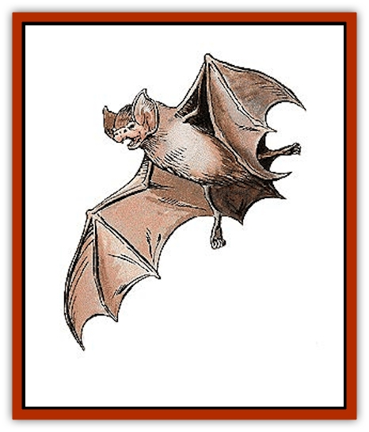

# Bat

| Statistic | **Azmyth** | **Common** | **Huge** | **Large** | **Night Hunter** | **Sinister** |
| --- | --- | --- | --- | --- | --- | --- |
| **Activity Cycle:** | Any | Night | Night | Night | Night/any | Any |
| **Alignment:** | Chaotic neutral | Neutral | Neutral evil | Neutral | Neutral evil | Lawful evil |
| **Armor Class:** | 2 | 8 (see below) | 7 (see below) | 8 | 6 | 3 |
| **Climate/Terrain:** | Any land | Any land | Warm caves | Any land | Any land | Any land |
| **Damage/Attack:** | 1/1-2 | 1 | 2d4 | 1d2 or 1d4 | 1-4/1-2/1-2/1-6 or 3-12 | 2-5 |
| **Diet:** | Omnivore | Omnivore | Omnivore | Omnivore | Carnivore | Omnivore |
| **Frequency:** | Rare | Common | Rare | Uncommon | Uncommon | Rare |
| **Hit Dice:** | 2 | 1-2 hp | 4-6 | 1d4 hp or 1 | 2+2 | 4+4 |
| **Intelligence:** | High (13-14) | Animal (1) | Low (5-7) | Animal (1) | Average to High (8-14) | Average to Except. (8-16) |
| **Magic Resistance:** | 40% | Nil | Nil | Nil | Nil | 70% |
| **Morale:** | Elite (14) | Unsteady (5-7) | Steady (11-12) | Unsteady (5-7) | Steady (11) | Champion (15-16) |
| **Movement:** | 3, Fl 24 (A) | 1, Fl 24 (B) | 3, Fl 15 (C) | 3, Fl 18 (C) | 2, Fl 18 (A) | 2, Fl 21 (A) |
| **No. Appearing:** | 1 | 1-100 | 1-8 | 3-18 | 1-12 (1-30 in lair) | 1d6 |
| **No. of Attacks:** | 2 | 1 | 1 | 1 | 4 | 1 |
| **Organization:** | Solitary | Swarm | Flock | Flock | Pack | Band |
| **Size:** | S (3') | T (1') | H (12-16') | M (5-6') | M (7') | L (9') |
| **Special Attacks:** | Magic use | See below | See below | Nil | Nil | Magic use |
| **Special Defenses:** | Magic use | Nil | See below | See below | Nil | Energy field |
| **THAC0:** | 19 | 20 | 17 (4 HD) / 15 (5-6 HD) | 19 or 20 | 19 | 17 |
| **Treasure:** | Nil | Nil | C | Nil | M,O,Z (in lair) | Nil |
| **XP Value:** | 650 | 15 | 420 (4 HD) / 650 (5 HD) / 975 (6 HD) | 35 | 175 | 2,000 |

Bats are common animals in many parts of the world. While ordinary bats are annoying but harmless, larger varieties can be quite deadly.

With almost 2,000 different species of bats known, one can find wingspans from less than two inches across to 15 feet or more. The small body of the ordinary bat resembles a mouse, while the wings are formed from extra skin stretched across its fore limbs. The larger bats are scaled up but otherwise similar in appearance.

Despite the common belief that bats are blind, nearly all known species have rather good eyesight. In the dark, however, they do not rely on their visual acuity, but navigate instead by echo-location. By emitting a high-pitched squeal and listening for it to bounce back to them, they can <q>see</q> their surroundings by this natural form of sonar.

**Combat:** Ordinary bats attack only if cornered and left with no other option. If startled, bats tend to become frightened and confused. This causes them to swarm around and often fly into things. The typical bat swarm ends up putting out torches (1% chance per bat encountered per round), confusing spell casting (Wisdom roll required to cast spells), inhibiting combatants' ability to wield weapons (by a -2 THAC0 penalty), and otherwise getting in the way. Under ideal flying conditions, a bat's Armor Class rating rises from 8 to 4.

**Habitat/Society:** While bats are found almost anywhere, they prefer warm and humid climes. Some species hibernate during the cold season and a few are know to migrate. Bats live in caves, dark buildings, or damp crevices, hanging by their toes during the day, and leaving at dusk to feed during the night. In large, isolated caverns there may be thousands of bats.

**Ecology:** Most bats eat fruit or insects, though some include small animals or fish in their diets. The rare vampire bat travels at night to drink the warm blood of living mammals, but its victims are rarely humans or demihumans. Care must be taken not to confuse the vampire bat with the true [[Vampire_General_Information|vampire]] in this regard. [[Rot_Grub|Rot grubs]] and [[Carrion_Crawler|carrion crawlers]] are among the few creatures known to live in the guano on the floor of large bat-infested caverns, making any expeditions into such caves dangerous indeed. If the noxious odor from the guano is not enough to subdue the hardiest of adventurers (a single Constitution check to stay conscious), these crawling denizens are.

**Large Bat**

  These creatures are large versions of the carnivorous variety of the ordinary bat with 3-foot-long bodies and 5- to 6-foot-long wingspans. They dwell in dark caverns, usually underground, and depend on their sonar in flight to compensate for their poor eyesight. Only 10% of giant bats are of the more powerful 1 Hit Die variety.

Extremely maneuverable in flight, large bats gain an Armor Class bonus of +3 when an opponent with a Dexterity of 13 or less fires a missile weapon at it. The creature must land (usually on its victim) to attack with its bite. The typical example of this species inflicts 1d2 points of damage with its teeth while the larger does 1d4 points of damage. Anyone bitten by a large bat has a 1% chance per point of damage done to contract rabies.

When rabies is contracted, there is a 1d4+6 day incubation period. Once this period has ended, the victim has 10 days to live. The victim cannot drink or eat anything and is overly irritable. Anything from loud noises to being awakened at night can set the victim off (the DM determines the temper triggers). If temper flares, the victim must roll a Wisdom check. If the check fails, the rabid person attacks until he is killed or knocked unconscious. When a character contracts rabies, he or she dies from the infliction, unless cured by a *wish*, *alter reality*, *limited wish*, *cure disease*, or similar spell.

**Huge Bat (Mobat)**

  Mobats prefer warm-blooded prey that they bite to death with their fangs. They have a dim and evil intelligence that gives them a desire for shiny objects. Because the typical mobat has a wingspan of 12 to 16 feet, they must have large areas to serve as flight runways.

Because Mobats' flight is so rapid and silent, their victims suffer a -3 penalty to their surprise rolls. They can also give a piercing screech that causes such great pain that victims seek to cover their ears rather than fight, unless a saving throw versus paralyzation is successful. This screech is always used if the prey resists and it is effective in a 20-foot radius about the mobat. Note that mobile mobats have an Armor Class of 2. Under crowded flying conditions, their Armor Class suffers and raises to 7. When not in flight, mobats have an Armor Class of 10.

**Azmyth**

  Azmyths live on flowers, small plants, and insects. They are solitary wanderers, though they do have <q>favorite haunts</q> to which they return. They often form partnerships with humanoids for mutual benefit, sometimes forming loyal friendships in the process. Azmyths have been known to accompany creatures for their entire lives, and then accompany the creatures' offspring. The life span of azmyths are presently unknown but is believed to be over 100 years. They are not familiars as wizards understand the term; no direct control can be exercised over one, except by spells.

Azmyths have crested heads and bearded chins, white, pupil-less eyes, and leathery gray, mauve, or emerald green skin. They emit shrill squeaks of alarm or rage, and endearing, liquid chuckles of delight or amusement. They communicate by *telepathy* that has a range of 60 feet, and have infravision to 90 feet. They can *know alignment* three times per day, *become invisible* (self only for six rounds or less, ending when the azmyth makes a successful attack) once per day, and *create silence 15' radius*, centered on themselves, once per day.

In combat, the azmyth bites for 1 point of damage and stabs with its powerful needle-sharp tails for 1d2 points. Twice per day, an azmyth can unleash a shocking grasp attack, transmitting 1d8+6 points of electrical damage through any direct physical contact with another creature. This attack can be combined with a physical attack for cumulative damage.

**Night Hunter**

  This species, know as dragazhar, is named after the adventurer who first domesticated one, long ago.

Nocturnal on the surface, it is active anytime in the gloom of the underworld. It eats carrion if it must, but usually hunts small beasts. Desperate dragazhar are known to attack livestock, drow, or humans.

Night hunters swoop down to bite prey (1d4), rake with their wing claws (1d2 each), and slash (1d6) or stab (3d4) with their dexterous, triangular-shaped, razor sharp tails. They stalk their prey, flying low and dodging behind hillocks, ridges, trees, or stalactites, to attack from ambush. They have infravision to a distance of 120 feet, but rarely surprise opponents, since they emit echoing, loon-like screams when excited.

Night hunter lairs usually contain over 30 creatures. They typically live in double-ended caves, or above ground in tall, dense woods. Night hunters do not tarry to eat where they feel endangered, so their lairs often contain treasure fallen from prey carried there. Night hunters roost head-down when sleeping. They are velvet in hue, even to their claws, and have violet, orange, or red eyes.

**Sinister**

  These mysterious jet-black creatures most closely resemble [[Ray|manta rays]]. They have no distinct heads and necks, and their powerfully-muscled wings do not show the prominent finger bones common to most bats. A natural ability of *levitation* allows them to hang motionless in midair. This unnerving appearance and behavior has earned them their dark name, but sinisters are not evil. Above ground, they prefer to hunt at night, when their 160'-range infravision is most effective. They eat carrion if no other food is available, and regularly devour flowers and seed pods of all sorts.

Sinisters are both resistant to magic and adept in its use. In addition to their pinpoint, precision *levitation*, they are surrounded at all times by a naturally-generated 5-foot-deep energy field akin to a *wall of force*. This field affords no protection against spells or melee attacks, but missile attacks are stopped utterly; normal missiles are turned away, and such effects as *magic missile* and *Melf's acid arrow* are absorbed harmlessly. In addition, all sinisters can cast one *hold monster* (as the spell) once per day. They usually save this for escaping from creatures more powerful than themselves, but may use it when hunting, if ravenous.

Curiously, though they are always silent (communicating only with others of its kind via 20-foot-range limited telepathy), sinisters love music - both vocal and instrumental. Many a bard making music at a wilderness campfire has found him or herself surrounded by a silent circle of floating sinisters. Unless they are directly attacked, the sinisters will not molest the bard in any way, but may follow the source of the music, gathering night after night to form a rather daunting audience.

Sinisters are usually encountered in small groups and are thought to have a long life span. Their social habits and mating rituals are unknown.

---
## Discovery & Documentation

**Source Publication:** Monstrous Manual (1995)
**Campaign Setting:** Advanced Dungeons & Dragons 2nd Edition
**Author(s):** Tim Beach

### Other Creatures Found in This Source Book
   * [[Aarakocra|Aarakocra]]
   * [[Aboleth|Aboleth]]
   * [[Ankheg|Ankheg]]
   * [[Arcane|Arcane]]
   * [[Argos|Argos]]
   * [[Aurumvorax|Aurumvorax]]
   * [[Baatezu_Lesser_Abishai|Baatezu, Lesser, Abishai]]
   * [[Baatezu_General_Information|Baatezu, General Information]]
   * [[Baatezu_Greater_Pit_Fiend|Baatezu, Greater, Pit Fiend]]
   * [[Banshee|Banshee]]
   * [[Basilisk|Basilisk]]
   * [[Bear|Bear]]
   * [[Beetle_Giant|Beetle, Giant]]
   * [[Behir|Behir]]
   * [[Beholder_and_Beholder-kin_I|Beholder and Beholder-kin I]]
   * [[Beholder_and_Beholder-kin_II|Beholder and Beholder-kin II]]
   * [[Bird|Bird]]
   * [[Brain_Mole|Brain Mole]]
   * [[Broken_One|Broken One]]
   * [[Brownie|Brownie]]
   * [[Bugbear|Bugbear]]
   * [[Bulette|Bulette]]
   * [[Bullywug|Bullywug]]
   * [[Carrion_Crawler|Carrion Crawler]]
   * [[Cat_Great|Cat, Great]]
   * [[Catoblepas|Catoblepas]]
   * [[Cat_Small|Cat, Small]]
   * [[Cave_Fisher|Cave Fisher]]
   * [[Centaur|Centaur]]
   * [[Centipede|Centipede]]
   * [[Chimera|Chimera]]
   * [[Cloaker|Cloaker]]
   * [[Cockatrice|Cockatrice]]
   * [[Couatl|Couatl]]
   * [[Crabman|Crabman]]
   * [[Crawling_Claw|Crawling Claw]]
   * [[Crocodile|Crocodile]]
   * [[Crustacean_Giant|Crustacean, Giant]]
   * [[Crypt_Thing|Crypt Thing]]
   * [[Death_Knight|Death Knight]]
   * [[Deepspawn|Deepspawn]]
   * [[Dinosaur_I|Dinosaur I]]
   * [[Displacer_Beast|Displacer Beast]]
   * [[Dog|Dog]]
   * [[Dog_Moon|Dog, Moon]]
   * [[Dolphin|Dolphin]]
   * [[Doppelganger|Doppelganger]]
   * [[Dracolich|Dracolich]]
   * [[Dragon_Brown|Dragon, Brown]]
   * [[Dragon_Chromatic_Black|Dragon, Chromatic, Black]]
   * [[Dragon_Chromatic_Blue|Dragon, Chromatic, Blue]]
   * [[Dragon_Chromatic_Green|Dragon, Chromatic, Green]]
   * [[Dragon_Cloud|Dragon, Cloud]]
   * [[Dragon_Chromatic_Red|Dragon, Chromatic, Red]]
   * [[Dragon_Chromatic_White|Dragon, Chromatic, White]]
   * [[Dragon_Deep|Dragon, Deep]]
   * [[Dragon_Gem_Amethyst|Dragon, Gem, Amethyst]]
   * [[Dragon_Gem_Crystal|Dragon, Gem, Crystal]]
   * [[Dragon_Gem_Emerald|Dragon, Gem, Emerald]]
   * [[Dragon_Gem_Sapphire|Dragon, Gem, Sapphire]]
   * [[Dragon_Gem_Topaz|Dragon, Gem, Topaz]]
   * [[Dragon_Metallic_Brass|Dragon, Metallic, Brass]]
   * [[Dragon_Metallic_Bronze|Dragon, Metallic, Bronze]]
   * [[Dragon_Metallic_Copper|Dragon, Metallic, Copper]]
   * [[Dragon_Mercury|Dragon, Mercury]]
   * [[Dragon_Metallic_Gold|Dragon, Metallic, Gold]]
   * [[Dragon_Mist|Dragon, Mist]]
   * [[Dragon_Metallic_Silver|Dragon, Metallic, Silver]]
   * [[Dragon_General_Information|Dragon, General Information]]
   * [[Dragon_Shadow|Dragon, Shadow]]
   * [[Dragon_Steel|Dragon, Steel]]
   * [[Dragon_Yellow|Dragon, Yellow]]
   * [[Dragonne|Dragonne]]
   * [[Dragon_Turtle|Dragon Turtle]]
   * [[Dragonet_Faerie_Dragon|Dragonet, Faerie Dragon]]
   * [[Dragonet_Fire_Drake|Dragonet, Fire Drake]]
   * [[Dragonet_Pseudodragon|Dragonet, Pseudodragon]]
   * [[Dryad|Dryad]]
   * [[Dwarf_Derro|Dwarf, Derro]]
   * [[Dwarf|Dwarf]]
   * [[Elemental_Athas_General_Information|Elemental (Athas), General Information]]
   * [[Elemental_Air_Kin|Elemental, Air Kin]]
   * [[Elemental_Earth_Kin|Elemental, Earth Kin]]
   * [[Elemental_Fire_Kin|Elemental, Fire Kin]]
   * [[Elemental_Water_Kin|Elemental, Water Kin]]
   * [[Elemental_of_Chaos_Air_Earth|Elemental of Chaos, Air/Earth]]
   * [[Elemental_of_Chaos_Fire_Water|Elemental of Chaos, Fire/Water]]
   * [[Elemental_Composite|Elemental, Composite]]
   * [[Elemental_Air_Earth|Elemental, Air/Earth]]
   * [[Elemental_Fire_Water|Elemental, Fire/Water]]
   * [[Elemental_General_Information|Elemental, General Information]]
   * [[Elephant|Elephant]]
   * [[Elf|Elf]]
   * [[Elf_Aquatic|Elf, Aquatic]]
   * [[Elf_Drow|Elf, Drow]]
   * [[Ettercap|Ettercap]]
   * [[Eyewing|Eyewing]]
   * [[Feyr|Feyr]]
   * [[Fish|Fish]]
   * [[Frog|Frog]]
   * [[Fungus|Fungus]]
   * [[Galeb_Duhr|Galeb Duhr]]
   * [[Gargantua|Gargantua]]
   * [[Gargoyle_I|Gargoyle I]]
   * [[Genie|Genie]]
   * [[Ghost|Ghost]]
   * [[Ghoul|Ghoul]]
   * [[Giant_Cloud|Giant, Cloud]]
   * [[Giant_Cyclops|Giant, Cyclops]]
   * [[Giant_Desert|Giant, Desert]]
   * [[Giant_Ettin|Giant, Ettin]]
   * [[Giant_Firbolg|Giant, Firbolg]]
   * [[Giant_Fire|Giant, Fire]]
   * [[Giant_Fog|Giant, Fog]]
   * [[Giant_Fomorian|Giant, Fomorian]]
   * [[Giant_Frost|Giant, Frost]]
   * [[Giant_Hill|Giant, Hill]]
   * [[Giant_Jungle|Giant, Jungle]]
   * [[Giant_Mountain|Giant, Mountain]]
   * [[Giant_Reef|Giant, Reef]]
   * [[Giant_Stone|Giant, Stone]]
   * [[Giant_Storm|Giant, Storm]]
   * [[Giant_Verbeeg|Giant, Verbeeg]]
   * [[Giant_Wood|Giant, Wood]]
   * [[Gibberling|Gibberling]]
   * [[Giff|Giff]]
   * [[Gith|Gith]]
   * [[Gith_Pirate_of|Gith, Pirate of]]
   * [[Githyanki|Githyanki]]
   * [[Githzerai|Githzerai]]
   * [[Gloomwing|Gloomwing]]
   * [[Gnoll|Gnoll]]
   * [[Gnome|Gnome]]
   * [[Gnome_Spriggan|Gnome, Spriggan]]
   * [[Goblin|Goblin]]
   * [[Golem_General_Information|Golem, General Information]]
   * [[Golem_I_Greater_Golem|Golem I (Greater Golem)]]
   * [[Golem_II_Lesser_Golem|Golem II (Lesser Golem)]]
   * [[Golem_III|Golem III]]
   * [[Golem_IV|Golem IV]]
   * [[Golem_V|Golem V]]
   * [[Golem_VI_Stone_Variants|Golem VI (Stone Variants)]]
   * [[Gorgon|Gorgon]]
   * [[Grell_Colonial|Grell, Colonial]]
   * [[Gremlin_Jermlaine|Gremlin, Jermlaine]]
   * [[Gremlin|Gremlin]]
   * [[Griffon|Griffon]]
   * [[Grimlock|Grimlock]]
   * [[Grippli|Grippli]]
   * [[Hag|Hag]]
   * [[Halfling|Halfling]]
   * [[Harpy|Harpy]]
   * [[Hatori|Hatori]]
   * [[Haunt|Haunt]]
   * [[Hell_Hound|Hell Hound]]
   * [[Heucuva|Heucuva]]
   * [[Hippocampus|Hippocampus]]
   * [[Hippogriff|Hippogriff]]
   * [[Hobgoblin|Hobgoblin]]
   * [[Homunculus|Homunculus]]
   * [[Hook_Horror|Hook Horror]]
   * [[Horse|Horse]]
   * [[Human|Human]]
   * [[Hydra|Hydra]]
   * [[Imp|Imp]]
   * [[Insect_Giant|Insect, Giant]]
   * [[Insect_Swarm|Insect Swarm]]
   * [[Intellect_Devourer|Intellect Devourer]]
   * [[Invisible_Stalker|Invisible Stalker]]
   * [[Ixitxachitl|Ixitxachitl]]
   * [[Jackalwere|Jackalwere]]
   * [[Kenku|Kenku]]
   * [[Ki-rin|Ki-rin]]
   * [[Kirre|Kirre]]
   * [[Kobold|Kobold]]
   * [[Kuo-Toa|Kuo-Toa]]
   * [[Lamia|Lamia]]
   * [[Lammasu|Lammasu]]
   * [[Leech|Leech]]
   * [[Leprechaun|Leprechaun]]
   * [[Leucrotta|Leucrotta]]
   * [[Lich|Lich]]
   * [[Living_Wall|Living Wall]]
   * [[Lizard|Lizard]]
   * [[Lizard_Man|Lizard Man]]
   * [[Locathah|Locathah]]
   * [[Lurker|Lurker]]
   * [[Lycanthrope_General_Information|Lycanthrope, General Information]]
   * [[Lycanthrope_Seawolf|Lycanthrope, Seawolf]]
   * [[Lycanthrope_Werebear|Lycanthrope, Werebear]]
   * [[Lycanthrope_Wereboar|Lycanthrope, Wereboar]]
   * [[Lycanthrope_Werebat|Lycanthrope, Werebat]]
   * [[Lycanthrope_Werefox|Lycanthrope, Werefox]]
   * [[Lycanthrope_Wererat|Lycanthrope, Wererat]]
   * [[Lycanthrope_Wereraven|Lycanthrope, Wereraven]]
   * [[Lycanthrope_Weretiger|Lycanthrope, Weretiger]]
   * [[Lycanthrope_Werewolf|Lycanthrope, Werewolf]]
   * [[Mammal|Mammal]]
   * [[Mammal_Giant|Mammal, Giant]]
   * [[Mammal_Herd_I|Mammal, Herd I]]
   * [[Mammal_Small|Mammal, Small]]
   * [[Manscorpion|Manscorpion]]
   * [[Manticore|Manticore]]
   * [[Medusa_Maedar|Medusa, Maedar]]
   * [[Medusa|Medusa]]
   * [[Mephit_General_Information|Mephit, General Information]]
   * [[Merman|Merman]]
   * [[Mimic|Mimic]]
   * [[Mind_Flayer|Mind Flayer]]
   * [[Minotaur|Minotaur]]
   * [[Mist_Crimson_Death|Mist, Crimson Death]]
   * [[Mist_Vampiric|Mist, Vampiric]]
   * [[Mold_I|Mold I]]
   * [[Moldman|Moldman]]
   * [[Mongrelman|Mongrelman]]
   * [[Morkoth|Morkoth]]
   * [[Muckdweller|Muckdweller]]
   * [[Mudman|Mudman]]
   * [[Mummy_Greater|Mummy, Greater]]
   * [[Mummy|Mummy]]
   * [[Myconid|Myconid]]
   * [[Naga|Naga]]
   * [[Naga_Dark|Naga, Dark]]
   * [[Neogi|Neogi]]
   * [[Nightmare|Nightmare]]
   * [[Nymph|Nymph]]
   * [[Octopus_Giant|Octopus, Giant]]
   * [[Ogre|Ogre]]
   * [[Ogre_Half-|Ogre, Half-]]
   * [[Ooze_Slime_Jelly_I|Ooze/Slime/Jelly I]]
   * [[Ooze_Slime_Jelly_II|Ooze/Slime/Jelly II]]
   * [[Ooze_Slime_Jelly_Slithering_Tracker|Ooze/Slime/Jelly, Slithering Tracker]]
   * [[Orc|Orc]]
   * [[Otyugh|Otyugh]]
   * [[Owlbear_I|Owlbear I]]
   * [[Pegasus|Pegasus]]
   * [[Peryton|Peryton]]
   * [[Phantom|Phantom]]
   * [[Phoenix|Phoenix]]
   * [[Piercer|Piercer]]
   * [[Plant_Dangerous_I|Plant, Dangerous I]]
   * [[Plant_Intelligent|Plant, Intelligent]]
   * [[Poltergeist|Poltergeist]]
   * [[Pudding_Deadly|Pudding, Deadly]]
   * [[Quaggoth|Quaggoth]]
   * [[Rakshasa|Rakshasa]]
   * [[Rat|Rat]]
   * [[Rat_Osquip|Rat, Osquip]]
   * [[Remorhaz|Remorhaz]]
   * [[Revenant|Revenant]]
   * [[Roc|Roc]]
   * [[Roper|Roper]]
   * [[Rust_Monster|Rust Monster]]
   * [[Sahuagin|Sahuagin]]
   * [[Satyr|Satyr]]
   * [[Scorpion|Scorpion]]
   * [[Sea_Lion|Sea Lion]]
   * [[Selkie|Selkie]]
   * [[Shadow|Shadow]]
   * [[Shedu|Shedu]]
   * [[Sirine|Sirine]]
   * [[Skeleton|Skeleton]]
   * [[Skeleton_Giant|Skeleton, Giant]]
   * [[Skeleton_Warrior|Skeleton, Warrior]]
   * [[Slaad|Slaad]]
   * [[Slug_Giant|Slug, Giant]]
   * [[Snake|Snake]]
   * [[Snake_Winged|Snake, Winged]]
   * [[Spectre|Spectre]]
   * [[Sphinx|Sphinx]]
   * [[Spider|Spider]]
   * [[Sprite|Sprite]]
   * [[Squid_Giant|Squid, Giant]]
   * [[Stirge|Stirge]]
   * [[Su-Monster|Su-Monster]]
   * [[Swanmay|Swanmay]]
   * [[Tabaxi|Tabaxi]]
   * [[Tako|Tako]]
   * [[Tanar'ri_True_Balor|Tanar'ri, True, Balor]]
   * [[Tanar'ri_True_Marilith|Tanar'ri, True, Marilith]]
   * [[Tarrasque|Tarrasque]]
   * [[Tasloi|Tasloi]]
   * [[Thought_Eater|Thought Eater]]
   * [[Thri-kreen|Thri-kreen]]
   * [[Titan|Titan]]
   * [[Toad_Giant|Toad, Giant]]
   * [[Treant|Treant]]
   * [[Triton|Triton]]
   * [[Troglodyte|Troglodyte]]
   * [[Troll|Troll]]
   * [[Umber_Hulk|Umber Hulk]]
   * [[Unicorn|Unicorn]]
   * [[Urchin|Urchin]]
   * [[Vampire|Vampire]]
   * [[Wemic|Wemic]]
   * [[Whale|Whale]]
   * [[Wight|Wight]]
   * [[Will_O'Wisp|Will O'Wisp]]
   * [[Wolf|Wolf]]
   * [[Wolfwere|Wolfwere]]
   * [[Worm|Worm]]
   * [[Wraith|Wraith]]
   * [[Wyvern|Wyvern]]
   * [[Xorn|Xorn]]
   * [[Yeti|Yeti]]
   * [[Yuan-ti_Histachii|Yuan-ti, Histachii]]
   * [[Yuan-ti|Yuan-ti]]
   * [[Yugoloth_Guardian|Yugoloth, Guardian]]
   * [[Zaratan|Zaratan]]
   * [[Zombie|Zombie]]
