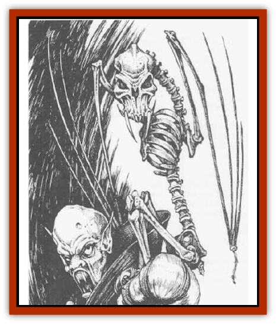

# Bat - Bonebat

| Statistic | **Bat, Bonebat** |
| --- | --- |
| **Activity Cycle:** | Any |
| **Alignment:** | Neutral evil |
| **Armor Class:** | 7 |
| **Climate/Terrain:** | Any land |
| **Damage/Attack:** | 2d4 |
| **Diet:** | None |
| **Frequency:** | Rare |
| **Hit Dice:** | 4 |
| **Intelligence:** | Low (5-7) |
| **Magic Resistance:** | Nil |
| **Morale:** | Special |
| **Movement:** | 3, Fl 18 (C) |
| **No. Appearing:** | 2-8 |
| **No. of Attacks:** | 1 |
| **Organization:** | Flock |
| **Size:** | M (5-6') |
| **Special Attacks:** | Paralysis (1d6+2 rounds) |
| **Special Defenses:** | Never surprised, half damage from edged and piercing weapons, immune to paralysis, <i>charm</i>, <i>sleep</i>, and <i>hold</i> |
| **THAC0:** | 17 |
| **Treasure:** | Nil (unless a guardian) |
| **XP Value:** | 975 / Battlebat: 1,400 |

Bonebats are undead [[Bat|bats]] that serve as messengers, guardians, and battle allies to evil priests and wizards and to powerful undead (such as [[Lich|liches]], [[Lich|archliches]], and [[Vampire_General_Information|vampires]]). They appear as skeletal giant bats with dark, empty eye sockets and attack in eerie silence, never emitling cries. Some (known as *battlebats*) possess strange skeletal appendages.

**Combat:** Bonebats have 120-foot infravision, and can see invisible creatures and objects withh 60 feet. They never sleep and are never surprised.

Bonebats have a chilling bite that inflicts 2d4 points of damage upon all creatures except other undead, who suffer only its 1d3 points of physical damage. A bonebat's bite also paralyzes all living creatures except elves for 1d6+2 rounds, unless a successful saving throw vs. paralyzation is made. Bonebats themselves are immune to all forms of paralysis.

Bonebats always attack fearlessly, only withdrawing when brought to 3 hit points or less. They will fight to their destruction if ordered to do so by their creator or undead master.

Bonebats are immune to *sleep*, *charm*, and *hold* spells. They can be mentally controlled only by their creator or a powerful undead creature. Once one being controls a bonebat, no other being can ever control it - even if the controlling being is slain or absent. Typical commands are simple - attack (specified target), cease, come, stay, wait (place), and fetch (specified object) - but obedience is absolute.

Like skeletons, bonebats suffer normal damage from fire and blunt weapons, but only half damage from piercing or edged weapons. Holy water has no effect on bonebats. They are turned as ghouls.

**Habitat/Society:** Bonebats are most frequently encountered in the lairs of their masters - ruins, caverns, tombs, or evil temples. They prefer darkness, but light does not harm them. Bonebats may be encountered anywhere if their creator sends them forth or is slain.

Requiring no food or water, bonebats are often shut into closets, coffins, or chests to serve as guardians, attacking thieves and other beings who open or enter their hiding place.

Bonebats can carry single objects weighing up to three pounds, on which they can get a good grip. They often fetch keys, wands, and the like for their masters. Bonebats cannot trigger magical items, but are sometimes fitted with wired-on protective devices to strengthen them as guardians.

**Ecology:** Bonebats are not thought to occur naturally, but the secrets of their making have been known in the Realms for a very long time, and many have gone feral. Bonebats slay living bats whenever they encounter them.

Bonebats seem to enjoy killing. Indeed, if uncontrolled, they will from time to time go on killing flights. During such flights, they will fight all creatures of their own size or smaller that they encounter until they have killed at least twice. Bonebats never fight other bonebats.

Bonebats are usually constructed by evil priests and wizards working together. An intact giant bat skeleton, or a skeleton assembled from the bones of several bats, is required. A spell known as *Nulathoe's ninemen* is cast on the skeleton. In the case of a bonebat, this spell links the skeletal wing bones with an invisible membrane of force to allow flight. *Fly*, *detect invisibility*, *infravision*, and *animate dead* spells complete the process. Further spells may be necessary to train the bonebat to serve as an obedient aide, but the spells listed here must be cast within two rounds of each other, and in the order given, or the process will fail.

**Battlebat**

  Battlebats are bonebats onto which other bones - usually claws, talons, stings, or spurs - have been grafted.

Battlebats are in all regards identical to bonebats except that they have one additional Hit Die, are Armor Class 8, have two or three additional attacks (typically 1d2 points of damage from claw rakes or 1d4+1 points of damage from sting jabs - either of these might be temporarily tipped with poison by the battlebat's controller). They fly at rate of 15 (Class D) and are turned as wights.

---
## Discovery & Documentation

**Source Publication:** Monstrous Compendium, 1996 Annual, Volume 3 (1995)
**Campaign Setting:** Advanced Dungeons & Dragons 2nd Edition
**Author(s):** Jon Pickens

### Other Creatures Found in This Source Book
   * [[Alaghi|Alaghi]]
   * [[Alhoon|Alhoon]]
   * [[Aranea_Savage_Coast|Aranea (Savage Coast)]]
   * [[Arcane_Head|Arcane Head]]
   * [[Banedead|Banedead]]
   * [[Banelich|Banelich]]
   * [[Beetle|Beetle]]
   * [[Belgoi|Belgoi]]
   * [[Bladeling|Bladeling]]
   * [[Braxat|Braxat]]
   * [[Bunyip|Bunyip]]
   * [[Burbur|Burbur]]
   * [[Bvanen|Bvanen]]
   * [[Cat_Great_Snow_Tiger|Cat, Great, Snow Tiger]]
   * [[Chosen_One|Chosen One]]
   * [[Chronovoid|Chronovoid]]
   * [[Cildabrin|Cildabrin]]
   * [[Coffer_Corpse|Coffer Corpse]]
   * [[Disenchanter|Disenchanter]]
   * [[Dog_Temporal|Dog, Temporal]]
   * [[Dragon_Cerilia|Dragon (Cerilia)]]
   * [[Dragon_Ghost|Dragon, Ghost]]
   * [[Dragon_Lesser_Undead|Dragon, Lesser Undead]]
   * [[Dragon_Neutral_Amber|Dragon, Neutral, Amber]]
   * [[Dread_Warrior|Dread Warrior]]
   * [[Dreamweaver|Dreamweaver]]
   * [[Dream_Spawn_Greater_Ennui|Dream Spawn, Greater, Ennui]]
   * [[Dream_Spawn_Lesser_Morph|Dream Spawn, Lesser, Morph]]
   * [[Dwarf_Arctic|Dwarf, Arctic]]
   * [[Dwarf_Urdunnir|Dwarf, Urdunnir]]
   * [[Eel_Giant_Moray|Eel, Giant Moray]]
   * [[Elemental_Fire_Kin_Tome_Guardian|Elemental, Fire Kin, Tome Guardian]]
   * [[Elf_Rockseer|Elf, Rockseer]]
   * [[Ethyk|Ethyk]]
   * [[Faerie_Faerie_Fiddler|Faerie, Faerie Fiddler]]
   * [[Faerie_Petty_Bramble|Faerie, Petty, Bramble]]
   * [[Faerie_Petty_Gorse|Faerie, Petty, Gorse]]
   * [[Faerie_Petty|Faerie, Petty]]
   * [[Firenewt|Firenewt]]
   * [[Formian|Formian]]
   * [[Gargoyle_II|Gargoyle II]]
   * [[Giant_Cerilia|Giant (Cerilia)]]
   * [[Goblin_Cerilia|Goblin (Cerilia)]]
   * [[Golem_Magic|Golem, Magic]]
   * [[Golem_Shaboath|Golem, Shaboath]]
   * [[Hag_Bheur|Hag, Bheur]]
   * [[Hamadryad|Hamadryad]]
   * [[Hound_of_Ill-Omen|Hound of Ill-Omen]]
   * [[Human_Cerilia|Human (Cerilia)]]
   * [[Hybsil|Hybsil]]
   * [[Ibrandlin|Ibrandlin]]
   * [[Imp_Chaos|Imp, Chaos]]
   * [[Ixitxachitl_Ixzan|Ixitxachitl, Ixzan]]
   * [[Jabberwock|Jabberwock]]
   * [[Kyton|Kyton]]
   * [[Kyuss_Son_of|Kyuss, Son of]]
   * [[Lillend|Lillend]]
   * [[Life-Shaped_Creation_Guardian|Life-Shaped Creation, Guardian]]
   * [[Life-Shaped_Creation_Transport|Life-Shaped Creation, Transport]]
   * [[Lycanthrope_Werecrocodile|Lycanthrope, Werecrocodile]]
   * [[Lycanthrope_Werespider|Lycanthrope, Werespider]]
   * [[Magedoom|Magedoom]]
   * [[Manotaur|Manotaur]]
   * [[Mastiff_Shadow|Mastiff, Shadow]]
   * [[Meazel|Meazel]]
   * [[Mist_Scarlet_Dancer|Mist, Scarlet Dancer]]
   * [[Needleman|Needleman]]
   * [[Orc_Neo-Orog|Orc, Neo-Orog]]
   * [[Orc_Ondonti|Orc, Ondonti]]
   * [[Owlbear_II|Owlbear II]]
   * [[Pegataur|Pegataur]]
   * [[Phaerimm|Phaerimm]]
   * [[Reggelid|Reggelid]]
   * [[Render|Render]]
   * [[Saurial|Saurial]]
   * [[Scalamagdrion|Scalamagdrion]]
   * [[Sharn|Sharn]]
   * [[Snake_Messenger|Snake, Messenger]]
   * [[Spirit_Forest_Uthraki|Spirit, Forest, Uthraki]]
   * [[Spirit_Forest_Wood_Man|Spirit, Forest, Wood Man]]
   * [[Spirit_Ice_Orglash|Spirit, Ice, Orglash]]
   * [[Spirit_Rock_Thomil|Spirit, Rock, Thomil]]
   * [[Strider_Giant|Strider, Giant]]
   * [[Tembo|Tembo]]
   * [[Temporal_Glider|Temporal Glider]]
   * [[Temporal_Stalker|Temporal Stalker]]
   * [[Tether_Beast|Tether Beast]]
   * [[Thessalmonster|Thessalmonster]]
   * [[Time_Dimensional|Time Dimensional]]
   * [[Tomb_Tapper|Tomb Tapper]]
   * [[Undead_Dragon_Slayer|Undead Dragon Slayer]]
   * [[Unicorn_Black_Toril|Unicorn, Black (Toril)]]
   * [[Vaath|Vaath]]
   * [[Vortex_Spider|Vortex Spider]]
   * [[Weredragon|Weredragon]]
   * [[Zhentarim_Spirit|Zhentarim Spirit]]
