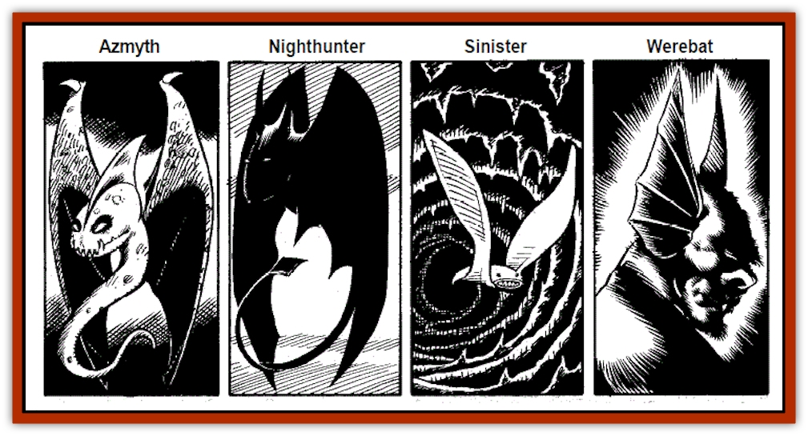

# Bat - Deep

| Statistic | **Azmyth** | **Night Hunter** | **Sinister** | **Werebat** |
| --- | --- | --- | --- | --- |
| **Activity Cycle:** | Any | Nocturnal/any | Any | See below |
| **Alignment:** | Chaotic neutral | Neutral evil | Lawful neutral | Varies |
| **Armor Class:** | 2 | 6 | 3 | 7 |
| **Climate/Terrain:** | Any temperate/any | Any temperate/any | Any/any | Any/any |
| **Damage/Attack:** | 1/1-2 | 1-4/1-2/1-2/1-6 or 3-12 | 2-5 | 1-2 |
| **Diet:** | Omnivore | Carnivore | Omnivore | Any/blood (in bat form) |
| **Frequency:** | Rare | Uncommon | Rare | Very Rare |
| **Hit Dice:** | 2 | 2+2 | 4+4 | Varies |
| **Intelligence:** | High (13-14) | Average to high (8-14) | Average to Exceptional (8-16) | Varies |
| **Magic Resistance:** | 40% | Nil | 70% | Nil |
| **Morale:** | Elite (14) | Steady (11) | Champpion (15-16) | Varies (12+) |
| **Movement:** | 3, Fl 24 (A) | 2, Fl 18 (A) | 2, Fl 21 (A) | Vaires (usually 12)/1, Fl 14 (C) |
| **No. Appearing:** | 1 | 1-12 (1-30 in lair) | 1-6 | 1 (1-2) |
| **No. of Attacks:** | 2 | 4 | 1 | 1 |
| **Organization:** | Solitary | Hunting Packs | Bands | Solitary |
| **Size:** | S (3' wingspan, length up to 4') | M (up to 7' wingspan) | L (9' wingspan) | M |
| **Special Attacks:** | Magic use | Nil | Magic use | Bite effects |
| **Special Defenses:** | Magic use | Nil | Energy field | Nil |
| **THAC0:** | 19 | 19 | 17 | 13 |
| **Treasure:** | Nil | M, O, Z (in lair) | Nil | All posible |
| **XP Value:** | 650 | 175 | 2000 | Varies (usually 975) |

"Deep bats" are Faerunian varieties of bat known to be active in both the surface world and the Underdark. The four most important of these species are described in this collective entry.

**Azmyth**

Azmyths live on flowers, small plants, and insects. They are solitary wanderers, though they do have "favorite haunts" to which they often return. They often form partnerships with humanoids for mutual benefit, sometimes forming loyal friendships with such beings. Azmyths have been known to accompany creatures for their entire lives, and then accompany the creatures' offspring. The lifespan and mating details of azmyths are presently unknown. They are not familiars as wizards understand the term; no direct control can be exercised over one except by spells.

Azymths have crested heads and bearded chins, white, pupilless eyes, and leathery gray, mauve, or emerald green skin. They emit shrill squeaks of alarm or rage, and endearing, liquid chuckles of delight or amusement. They communicate by 60'-range telepathy, and have 90'-range infravision. They can know alignment thrice per day, become invisible (self only, for 6 rounds or less; ending when the azymth makes any successful attack) once per day, and create silence 15' radius, centered on themselves, once a day.

In combat, azmyths bite (1 hp damage) and stab with their powerful needle-sharp tails (1-2 points). Twice per day, an azmyth can unleash a shocking grasp attack, transmitting 1d8+6 points of electrical damage through any direct physical contact with another creature. This attack can be combined with a physical attack for cumulative damage.

**Night Hunter**

This species is also known as a "dragazhar," after the adventurer who first domesticated one as a pet, long ago. Nocturnal in the surface Realms, it is active at any time in the gloom of the Underdark. It will eat carrion if it must, but usually hunts small beasts. Desperate dragazhar have been known to attack livestock, drow, or humans

Night hunter packs (known as "swoops") dip down to bite prey (1d4), rake with their wing claws (1-2 each), and slash (1d6) or stab (3d4 damage) with their dexterous, triangular-shaped, razor-sharp tails. They often stalk their prey, flying low and dodging behind hillocks, ridges, trees, or stalagmites, so as to attack from ambush. Night hunters have 180'-range infravision, but rarely surprise opponents, as they emit weird, echoing loon-like screams when excited.

Night hunter lairs usually contain over thirty creatures (three hunting bands or so). They typically live in doubledended caves, or aboveground in tall trees, in dense woods. Night hunters will not tarry to eat where they feel endangered, so their lairs often contain treasure fallen from prey carried there. Night hunters roost head-downwards when sleeping. They are velvet black in hue, even to their claws, and have violet, orange, or red eyes.

**Sinister**

hese mysterious, jet-black creatures most closely resemble manta rays - they have no distinct heads and necks, and their powerfully-muscled wings do not show the prominent fingerbones common to most bats. A natural ability of *levitation* allows them to hang motionless in midair. This unnerving appearance and behavior has earned them their dark name, but “sinisters” are not evil.

Aboveground, they prefer to hunt at night, when their 160'-range infravision is most effective. They will eat carrion if no other food is available, and regularly devour flowers and seed-heads of all sorts

  Sinisters are both resistant to magic and adept in its use. In addition to their pinpoint-precision levitation, they are at all times, when alive, surrounded by a naturally-generated, 5'-deep energy field akin to a wall of force. This field affords no protection against spells or melee attacks. Missile attacks are stopped utterly; normal missiles are turned away, and such effects as *magic missile* and Melf's acid arrow

 are absorbed harmlessly

In addition, all sinisters can cast one *hold monster* (as the spell) per day. They usually save this for escaping from creatures more powerful than themselves, but may use it when hunting, if ravenous.

Curiously, though they are always silent (communicating only with others of their kind, via 20'-range, limited telepathy), sinisters love music; both song and instrumental work. Many a harper or bard making music at a wilderness campfire has found himself surrounded by a silent circle of floating sinisters. Unless they are directly attacked, the sinisters will not molest the bard in any way, but may follow the source of the music, gathering night after night to form a rather daunting audience

Sinisters are usually encountered in small groups, and are thought to have a long lifespan. Their social habits and numbers are unknown

**Werebat**

The bite of a werebat can transmit a rare variety of lycanthropy. Humanoids bitten by werebats change to a bat-like form at night-even if deep in the Underdark. Werebats retain the intelligence, alignment, Hit Dice, and ability of speech possessed in their other form. They are fully alert and aware in both forms, and possess acute hearing in either form.

Werebats are heavy and clumsy in flight. Driven by blood-lust, they hunt in bat-form (usually alone). The bite of a werebat's long, hollow fangs punctures and drains blood for 1-2 hp damage, and saliva on the fangs causes weakness with no saving throw. The effects are equal to the wizardly *ray of enfeeblement* spell, and last 1d4 rounds. In addition, if a *cure disease* or *neutralize poison* spell is not cast on the bitten victim within nine turns (application of a slow poison allows the curative spells given above to be successful if cast within 36 turns), the victim has a 80% chance of contracting lycanthropy. The lycanthropy will be of werebat-form only, and its effects will be felt gradually, over the month following the werebat's attack.

Werebats are virtually indistinguishable from nonlycanthropes when in their humanoid form, but once afflicted, most tend to become solitary, and may be dark-eyed, shy, and elusive. They rarely inhabit lairs as bats, returning to the habitations of their other form between excursions in bat form.

Most werebats are desperate, lonely individuals. Many actively seek treasure, hoarding it so that they can purchase a magical cure for their lycanthropy. Silver, holy water, and the like do no special damage to werebats in either form. They are not undead, cannot be turned, and are immune from controlling attempts by bat-influencing magic or vampires.

---
## Discovery & Documentation

**Source Publication:** The Drow of the Underdark (1991)
**Campaign Setting:** Forgotten Realms
**Author(s):** Ed Greenwood

### Other Creatures Found in This Source Book
   * [[Dragon_Deep|Dragon, Deep]]
   * [[Myrlochar|Myrlochar]]
   * [[Pedipalp|Pedipalp]]
   * [[Rothe_Deep|Rothe, Deep]]
   * [[Solifugid|Solifugid]]
   * [[Spider_Subterranean|Spider, Subterranean]]
   * [[Spitting_Crawler|Spitting Crawler]]
   * [[Yochlol_Underdark|Yochlol (Underdark)]]
