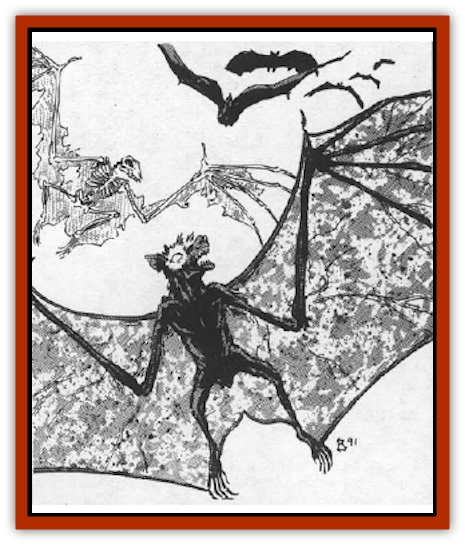

# Bat - Ravenloft

| Statistic | **Sentinel** | **Skeletal** |
| --- | --- | --- |
| **Activity Cycle:** | Night | Night |
| **Alignment:** | Special | Neutral |
| **Armor Class:** | 6 | 5 |
| **Climate/Terrain:** | Any land | Any land |
| **Damage/Attack:** | 1-4 (1d4) | 1-3 (1d6/2) |
| **Diet:** | Carnivore | None |
| **Frequency:** | Very rare | Rare |
| **Hit Dice:** | 1 | 1-1 |
| **Intelligence:** | Average (8-10) | Non- (0) |
| **Magic Resistance:** | Nil | Nil |
| **Morale:** | Fearless (20) | Fearless (20) |
| **Movement:** | 3, Fl 18 (C) | 1, Fl 15 (C) |
| **No. Appearing:** | 1 | 2-12 |
| **No. of Attacks:** | 1 | 1 |
| **Organization:** | Solitary | Solitary |
| **Size:** | T (1') | T (1') |
| **Special Attacks:** | See below | Nil |
| **Special Defenses:** | See below | See below |
| **THAC0:** | 19 | 20 |
| **Treasure:** | Nil | Nil |
| **XP Value:** | 65 | 65 |

[[Bat|Bats]] are more common in the dark realms of Ravenloft than they are anywhere else in the known universe. All of the traditional varieties of bat (common, large, giant, huge, mobat, and so forth) are represented in one domain or another, but two distinct species of bat are found only in Ravenloft.

A *sentinel bat* is a strange form of bat that is drawn to powerful undead and serves them as familiars serve wizards. While they look much like common bats, being roughly the same size and coloration, they are often marked in some way by their masters. Thus, a sentinel bat that is serving a [[Vampire_General_Information|vampire]] whose family crest is a silver crown might develop a grey crown-shaped patch of fur.

The eyes of a sentinel bat are normally deep black, but when their master wishes to see through them, their eyes glow like pinpoints of fiery red light.

Through a series of clicks and ultrasonic whistles they are able to speak with and command other species of common (or even giant) bats. In this way, a single sentinel bat can provide its master with a vast intelligence network composed wholly of bats.

**Combat:** Sentinel bats are unusual enemies. They seldom engage in direct combat, preferring to flee any potentially dangerous situation. Often, they will call upon other bats in the area and command them to cover their escape. When they do attack, they will swoop down upon a victim and bite them, inflicting 1d4 points of damage per successful attack. In addition, they have the traditional powers of their masters available to them. Thus, a sentinel bat who is serving a [[Wight|wight]] has the ability to drain 1 level of life energy with each strike, is hit only by silver or +1 or better magical weapons, and is immune to *sleep*, *hold*, and *charm* spells. They never have the ability to create undead, however, so any creature slain by a sentinel bat serving a wight would not rise up as a wight themselves. The life energy drain (if any) of a sentinel bat is less potent than that of its master, however; lost levels are regained at a rate of 1 per day or by the casting of a remove curse or atonement spell upon the victim.

**Habitat/Society:** Sentinel bats are to undead what familiars are to wizards. When any free-willed, intelligent undead creature in Ravenloft desires a companion, it can call upon the Mists to deliver to it a sentinel bat. Such a request can be made but once every decade, and only one bat serves an undead individual at any given time. The request for a bat must be made near a bat lair at midnight, on a night when the moon is full. During the next full moon, the undead creature returns to the lair and one of the bats, now transformed into a sentinel, will fly to join him. Thereafter, the bat's master can look through the eyes of its pet whenever it desires and see what the bat sees. In all other regards, however, the link between the two creatures functions as if the two were linked by a *find familiar* spell. Because the death of a sentinel bat can result in the death of its master, these creatures are seldom sent into dangerous situations.

**Ecology:** Sentinel bats are normal creatures who have been empowered by the Mists of Ravenloft. Like their mundane kin, they have an acute natural sonar, keen eyesight, and subsist on a diet of insects and such. The body of a sentinel bat has been used with great success in the creation of devices and potions intended to convey power over the undead.

**Skeletal Bat**

  Skeletal bats are created by the use of an *animate dead* spell and are often associated with necromancers or evil priests. They are to bats what traditional [[Skeleton|skeletons]] are to humans - mindless animated remains.

Skeletal bats attack with their bony claws (inflicting 1-3 points of damage) and are often used as guardians by those who create them. In addition, they radiate an *aura of fear* that causes all creatures who view them to make a fear check. A bonus of +1 is allowed on the check for every 3 full hit dice that the victim has. Thus, a 5th level character looking upon a skeletal bat is entitled to a +1 on his fear check.

Skeletal bats are nothing more than puppets who will obey simple instructions given to them by their creator. These cannot be overly long (two or three concepts is the most one of these monsters can understand) and must be very clearly worded. Because of this, their tasks are usually quite simple.

The bones of skeletal bats can be used in the creation of [[Golem_III|bone golems]].

---
## Discovery & Documentation

**Source Publication:** MC10 Ravenloft Appendix I (1989)
**Campaign Setting:** Planescape
**Author(s):** William W. Connors

### Other Creatures Found in This Source Book
   * [[Bastellus|Bastellus]]
   * [[Bowlyn|Bowlyn]]
   * [[Broken_One|Broken One]]
   * [[Bussengeist|Bussengeist]]
   * [[Darkling|Darkling]]
   * [[Doom_Guard|Doom Guard]]
   * [[Doppelganger_Plant|Doppelganger Plant]]
   * [[Elemental_Ravenloft|Elemental (Ravenloft)]]
   * [[Ermordenung|Ermordenung]]
   * [[Ghoul_Lord|Ghoul Lord]]
   * [[Goblyn|Goblyn]]
   * [[Golem_III|Golem III]]
   * [[Golem_IV|Golem IV]]
   * [[Golem_Ravenloft|Golem (Ravenloft)]]
   * [[Grim_Reaper|Grim Reaper]]
   * [[Human_Abber_Nomad|Human, Abber Nomad]]
   * [[Human_Ravenloft|Human (Ravenloft)]]
   * [[Imp_Assassin|Imp, Assassin]]
   * [[Impersonator|Impersonator]]
   * [[Lycanthrope_Werebat|Lycanthrope, Werebat]]
   * [[Lycanthrope_Wereraven|Lycanthrope, Wereraven]]
   * [[Mist_Horror|Mist Horror]]
   * [[Mummy_Greater|Mummy, Greater]]
   * [[Quevari|Quevari]]
   * [[Quickwood|Quickwood]]
   * [[Ravenkin|Ravenkin]]
   * [[Reaver|Reaver]]
   * [[Scarecrow_Ravenloft|Scarecrow (Ravenloft)]]
   * [[Shadow_Fiend|Shadow Fiend]]
   * [[Skeleton_Giant|Skeleton, Giant]]
   * [[Strahd's_Skeletal_Steed|Strahd's Skeletal Steed]]
   * [[Treant_Evil|Treant, Evil]]
   * [[Treant_Undead|Treant, Undead]]
   * [[Valpurgeist|Valpurgeist]]
   * [[Vampire_Dwarf|Vampire, Dwarf]]
   * [[Vampire_Elf|Vampire, Elf]]
   * [[Vampire_Gnome|Vampire, Gnome]]
   * [[Vampire_Halfling|Vampire, Halfling]]
   * [[Vampire_General_Information|Vampire, General Information]]
   * [[Vampire_Kender|Vampire, Kender]]
   * [[Vampyre|Vampyre]]
   * [[Widow_Red|Widow, Red]]
   * [[Wolfwere_Greater|Wolfwere, Greater]]
   * [[Zombie_Lord|Zombie Lord]]
