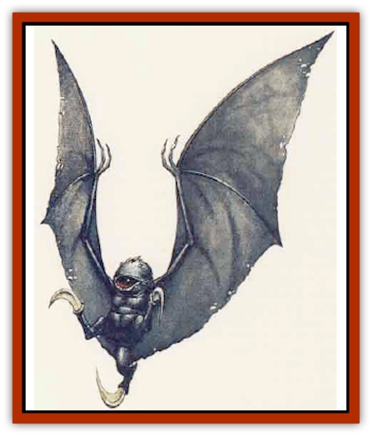

# Bat - Sporebat

| Statistic | **Bat, Sporebat** |
| --- | --- |
| **Activity Cycle:** | Night |
| **Alignment:** | Neutral |
| **Armor Class:** | 8 |
| **Climate/Terrain:** | Temperate hills and plains |
| **Damage/Attack:** | 2d6 each |
| **Diet:** | Carnivore |
| **Frequency:** | Very rare |
| **Hit Dice:** | 8 |
| **Intelligence:** | Average to Very (8-12) |
| **Magic Resistance:** | Nil |
| **Morale:** | Elite (14) |
| **Movement:** | 3, Fl 30 (B) |
| **No. Appearing:** | 14 |
| **No. of Attacks:** | 3 |
| **Organization:** | Clutch |
| **Size:** | M (3' long, 8' wingspan) |
| **Special Attacks:** | Surprise, poison eye-blast |
| **Special Defenses:** | Alertness, immune to heat and fire |
| **THAC0:** | 13 |
| **Treasure:** | Nil |
| **XP Value:** | 7,000 |

This fungoid predator, sometimes called a *flying eye*, is a deadly opponent when airborne, but is nearly helpless when on the ground. The creature is about 3 feet long, with a wingspan of more than double that. It has three powerful claws and a single, dark eye that emits poisonous blasts. Its flesh is a deep gray or flat black.

The thinking process of the sporebat is quite alien, nearly unfathomable to animal lifeforms. They possess no language that can be understood by humanoids, some sages believe their reactions in certain situations indicate an understanding of several human, demihuman, and humanoid languages. In addition, their hunting techniques indicate a cold intelligence.

**Combat:** The sporebat is extremely stealthy. It moves with complete silence, and its dark coloration allows it to blend into shadows, or to remain unnoticed against a night sky. The creature remains at the same temperature as its surroundings, so cannot be detected because of a temperature difference. In addition, the sporebat hides and lies in wait for victims, swooping quickly to attack when something comes into view. All this adds up to an impressive -6 to opponents' surprise rolls, as well as a -2 penalty to opponents' attack rolls in darkness. The sporebat is very alert itself and gains a +3 bonus to its surprise rolls.

Sporebats are fearless predators and might attack even a large and well-armed group. They often begin an attack using their devastating eye-blasts. A sporebat can project a poisonous ray from its eye, in a cone 50 yards long and 10 yards wide at the base. Any creature caught in this area takes 4d6 points of damage, though a successful saving throw vs. breath weapon reduces damage by half. The eye-blast must then recharge, a process that requires 1 round per 1d6 of damage; thus, if the sporebat recharges for 2 rounds, it can unleash a blast that causes 2d6 damage (a saving throw for half damage still applies). The sporebat usually waits until fully recharged before using the eye-blast again, unless severely injured. A *slow poison* spell doubles the amount of time needed for the creature to recharge its eye-blast; a *neutralize poison* (which requires the caster to touch the sporebat) destroys any stored potential for an eye-blast, but the creature begins recharging immediately thereafter.

While the sporebat waits for its eye-blast to recharge, it launches a series of swooping attacks, returning every other round from a different direction to claw at its opponents. When more than one sporebat is present, they take turns attacking, so that at least one sporebat attacks every round. Each of the sporebat's three vicious claw inflicts 2d6 damage on a successful strike.

The sporebat is immune to heat and fire-based attacks, as well as to the sporebat eye-blast.

After the sporebat has slain all opponents in view, it settles over its kills and uses its claws to slice them into very small pieces, then eats the juicy remains with its toothy mouth. During breeding season (in the late fall), a sporebat might instead plant spores in one of its kills.

**Habitat/Society:** Found in places that allow them space to fly, sporebats usually travel and hunt in <q>clutches</q>, groups born from spores planted in the same carrion. They have no society that can be understood by humans. All attempts at using psionic methods or *ESP* spells to communicate with them yield only a series of strange and disturbing images, none comprehensible. Still, the creatures do seem to communicate with one another, perhaps telepathically, perhaps through the use of spores, perhaps by some other unknown method.

Sporebats seem to place great value on the companions in their clutch, often seeming to become enraged when a spore-mate is slain.

Sporebat reproduction requires that two sporebats release spores over the same recently-killed animal flesh at the same time. Several of the spores unite in the dead flesh, and 1d6 young sporebats grow within a day. A young sporebat is about a foot long, with a 3-foot wingspan; its attacks cause only half damage. A sporebat grows to adulthood in six months and can live for more than a century.

**Ecology:** Sporebats are dangerous predators that feed on all types of animals, including both herbivores and other predators. Camivores find the taste of sporebat flesh revolting, though some herbivores feed happily on dead sporebats. The flesh of a sporebat is considered a delicacy by some human and humanoid cultures.

---
## Discovery & Documentation

**Source Publication:** Monstrous Compendium, 1995 Annual, Volume 2 (1995)
**Campaign Setting:** Advanced Dungeons & Dragons 2nd Edition
**Author(s):** Jon Pickens

### Other Creatures Found in This Source Book
   * [[Aboleth_Savant|Aboleth, Savant]]
   * [[Addazahr|Addazahr]]
   * [[Amiq_Rasol|Amiq Rasol]]
   * [[Arch-Shadow|Arch-Shadow]]
   * [[Automaton_Scaladar|Automaton, Scaladar]]
   * [[Automaton_Trobriand's|Automaton, Trobriand's]]
   * [[Beetle_Dragon|Beetle, Dragon]]
   * [[Bi-nou|Bi-nou]]
   * [[Boggle|Boggle]]
   * [[Brownie_Dobie|Brownie, Dobie]]
   * [[Brownie_Quickling|Brownie, Quickling]]
   * [[Cat_Crypt|Cat, Crypt]]
   * [[Cat_Great_Cath_Shee|Cat, Great, Cath Shee]]
   * [[Centaur-kin_Dorvesh|Centaur-kin, Dorvesh]]
   * [[Centaur-kin_Gnoat|Centaur-kin, Gnoat]]
   * [[Centaur-kin_Ha'pony|Centaur-kin, Ha'pony]]
   * [[Centaur-kin_Zebranaur|Centaur-kin, Zebranaur]]
   * [[Chronolily|Chronolily]]
   * [[Curst|Curst]]
   * [[Darktentacles|Darktentacles]]
   * [[Dinosaur_Aquatic|Dinosaur, Aquatic]]
   * [[Dinosaur_II|Dinosaur II]]
   * [[Dinosaur_III|Dinosaur III]]
   * [[Doppelganger_Greater|Doppelganger, Greater]]
   * [[Dragon_Brine|Dragon, Brine]]
   * [[Dragon_Half-|Dragon, Half-]]
   * [[Dragon-kin_Sea_Wyrm|Dragon-kin, Sea Wyrm]]
   * [[Dwarf_Wild|Dwarf, Wild]]
   * [[Ekimmu|Ekimmu]]
   * [[Elemental_Nature|Elemental, Nature]]
   * [[Elf_Winged|Elf, Winged]]
   * [[Fish_Great_Glacier|Fish (Great Glacier)]]
   * [[Fish_Subterranean|Fish, Subterranean]]
   * [[Fish_Toril|Fish (Toril)]]
   * [[Flareater|Flareater]]
   * [[Flumph|Flumph]]
   * [[Froghemoth|Froghemoth]]
   * [[Ghost_Casurua|Ghost, Casurua]]
   * [[Ghost_Ker|Ghost, Ker]]
   * [[Ghul|Ghul]]
   * [[Ghul-Kin|Ghul-Kin]]
   * [[Giant_Half-giant|Giant, Half-giant]]
   * [[Golem_Burning_Man|Golem, Burning Man]]
   * [[Golem_Phantom_Flyer|Golem, Phantom Flyer]]
   * [[Gulguthhydra|Gulguthhydra]]
   * [[Hakeashar|Hakeashar]]
   * [[Horse_Moon-|Horse, Moon-]]
   * [[Human_Dragonslayer|Human, Dragonslayer]]
   * [[Human_Vistana|Human, Vistana]]
   * [[Jellyfish_Giant|Jellyfish, Giant]]
   * [[Kalin|Kalin]]
   * [[Kholiathra|Kholiathra]]
   * [[Laerti|Laerti]]
   * [[Leucrotta_Greater|Leucrotta, Greater]]
   * [[Lich_Suel|Lich, Suel]]
   * [[Lurker_Shadow|Lurker, Shadow]]
   * [[Lycanthrope_Werepanther|Lycanthrope, Werepanther]]
   * [[Lycanthrope_Wereshark|Lycanthrope, Wereshark]]
   * [[Mammal_Herd_II|Mammal, Herd II]]
   * [[Marl|Marl]]
   * [[Meenlock|Meenlock]]
   * [[Mimic_Greater|Mimic, Greater]]
   * [[Mold_II|Mold II]]
   * [[Mummy_Creature|Mummy, Creature]]
   * [[Nyth|Nyth]]
   * [[Ooze_Slime_Jelly_Ghaunadan|Ooze/Slime/Jelly, Ghaunadan]]
   * [[Palimpsest|Palimpsest]]
   * [[Peltast|Peltast]]
   * [[Plant_Dangerous_II|Plant, Dangerous II]]
   * [[Pleistocene_Animal|Pleistocene Animal]]
   * [[Pudding_Subterranean|Pudding, Subterranean]]
   * [[Raggamoffyn|Raggamoffyn]]
   * [[Snake_Serpent|Snake, Serpent]]
   * [[Snake_Serpent_Vine|Snake, Serpent Vine]]
   * [[Sphinx_Draco-|Sphinx, Draco-]]
   * [[Sprite_Seelie_Faerie|Sprite, Seelie Faerie]]
   * [[Sprite_Unseelie_Faerie|Sprite, Unseelie Faerie]]
   * [[Squealer|Squealer]]
   * [[Turtle_Giant|Turtle, Giant]]
   * [[Umpleby|Umpleby]]
   * [[Vizier's_Turban|Vizier's Turban]]
   * [[Wall_Walker|Wall Walker]]
   * [[Webbird|Webbird]]
   * [[Yak-Man|Yak-Man]]
   * [[Zorbo|Zorbo]]
