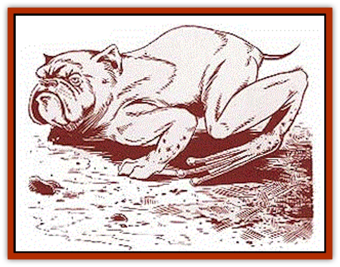

# Batracine

| Statistic | **Batracine** |
| --- | --- |
| **Activity Cycle:** | Dusk, dawn |
| **Alignment:** | Neutral |
| **Armor Class:** | 8 |
| **Climate/Terrain:** | River |
| **Damage/Attack:** | 1d4 |
| **Diet:** | Carnivore |
| **Frequency:** | Common |
| **Hit Dice:** | 2+2 |
| **Intelligence:** | Animal (1) |
| **Magic Resistance:** | Nil |
| **Morale:** | Unsteady (5-7) |
| **Movement:** | 6, Sw 12 |
| **No. Appearing:** | 1d4 |
| **No. of Attacks:** | 1 |
| **Organization:** | Family |
| **Size:** | S (2' tall) |
| **Special Attacks:** | Nil |
| **Special Defenses:** | Leap |
| **THAC0:** | 19 |
| **Treasure:** | Nil |
| **XP Value:** | 175 |

Batracines live in the Dream River at the eastern edge of the kingdom of Renardy. These inoffensive creatures are often kept as pets. Unfortunately, they are also sometimes killed for their blood, which can be used to make magical potions.

A batracine possesses the body of a large [[Frog|frog]], the head of a bull[[Dog|dog]], and a short tail. Its front feet end in webbed paws similar to those on dogs, but the rear feet are the large webbed variety found on most frogs. Short, oily hair covers the entire body. Batracines are normally brown or gray, but occasionally black or silver ones appear.

These creatures average about two feet tall and weigh around fifty pounds. Their strong, pointed teeth are all the more fearsome due to their powerful jaws. Many of those who pose any kind of threat flee at the sound of their loud, deep barks.

**Combat:** Batracines usually attack only creatures small enough to be considered prey. However, if running in a pack, they might attack something larger and slower. A batracine's long, sticky tongue catches its prey and pulls it directly to its mouth. A few bites with their powerful teeth finish the job. If attacked by a larger creature or a determined small creature, batracines simply attempt to flee.

When hunting for food, a batracine's leap ability (can jump forward or up 20 feet, plus 1 foot per HD, maximum of 35 feet) allows it to actually attack birds in the air. Batracines never wander too far from the river, and if threatened on land, will use Leap to reach the safety of the water.

**Habitat/Society:** Batracines live in the Dream River at the eastern edge of Renardy and are immune to the sleep effects of the [[Plant_Savage_Coast|amber lotus]]. They can be found both up and downstream from the Renardy waterlock at Ch�teau-Roan.

Small forest animals are the usual prey of these creatures, which forage in areas along the river. Birds are their favorite meal, and batracines will strike at any which foolishly wander too close. Batracines never eat fish or other amphibians. Occasionally, when the food supply is low, batracines will gather in packs and roam a bit further from the river, looking for larger game.

Batracines dig out small dens in the side of the river bank or burrow in between the roots of large trees on the banks. They remain solitary unless in mating season, at which time they invite a single mate to share a den. The male is responsible for all hunting during this period, while the female guards the pups. Two to four pups can be expected in a single litter.

Batracine pups can be tamed and raised as loyal pets. They are a favorite of the [[Lupin|lupins]], who breed them for size, shape, and color. Pups are worth 5 gp each, and a trained batracine is worth 20 gp.

**Ecology:** Batracines occupy a solid place in the middle of the food chain. They do not venture far beyond the Dream River, however, unless taken as pets. These creatures are sometimes hunted for their blood, which can be made into a potion to negate the effects of sleep-inducing magic.

Though batracines are often plagued by the [[Parasite_Savage_Coast|cardinal tick]], they would foolishly rather eat the [[Lyra_Bird_Saragón|Sarag�n lyra bird]] than allow it to rid them of this infestation.

---
## Discovery & Documentation

**Source Publication:** Monstrous Compendium Savage Coast Appendix (Online Exclusive) (1995)
**Campaign Setting:** Mystara
**Author(s):** Loren L Coleman, Ted James, Thomas Zuvich, Cindi M. Rice

### Other Creatures Found in This Source Book
   * [[Aranea_Savage_Coast|Aranea (Savage Coast)]]
   * [[Arashaeem|Arashaeem]]
   * [[Cat_Marine|Cat, Marine]]
   * [[Cinnavixen|Cinnavixen]]
   * [[Clockwork_Swordsman|Clockwork Swordsman]]
   * [[Critter_Temple|Critter, Temple]]
   * [[Cursed_One|Cursed One]]
   * [[Deathmare|Deathmare]]
   * [[Dragon_Savage_Coast_Crimson|Dragon (Savage Coast), Crimson]]
   * [[Dragon_Savage_Coast_Red_Hawk|Dragon (Savage Coast), Red Hawk]]
   * [[Echyan|Echyan]]
   * [[Ee'aar|Ee'aar]]
   * [[Enduk|Enduk]]
   * [[Fachan_Savage_Coast|Fachan (Savage Coast)]]
   * [[Feliquine|Feliquine]]
   * [[Fiend_Narvaezan|Fiend, Narvaezan]]
   * [[Frelôn|Frelôn]]
   * [[Ghriest|Ghriest]]
   * [[Glutton_Sea|Glutton, Sea]]
   * [[Goatman|Goatman]]
   * [[Golem_Naâruk|Golem, Naâruk]]
   * [[Golem_Savage_Coast|Golem (Savage Coast)]]
   * [[Grudgling|Grudgling]]
   * [[Heraldic_Servant_I|Heraldic Servant I]]
   * [[Heraldic_Servant_II|Heraldic Servant II]]
   * [[Heraldic_Servant_III|Heraldic Servant III]]
   * [[Heraldic_Servant_IV|Heraldic Servant IV]]
   * [[Heraldic_Servant_V|Heraldic Servant V]]
   * [[Heraldic_Servant_General_Information|Heraldic Servant, General Information]]
   * [[Hermit_Sea|Hermit, Sea]]
   * [[Jorri|Jorri]]
   * [[Juhrion|Juhrion]]
   * [[Kla'a-tah|Kla'a-tah]]
   * [[Leech_Legacy|Leech, Legacy]]
   * [[Lich_Inheritor|Lich, Inheritor]]
   * [[Lizard_Kin_Savage_Coast|Lizard Kin (Savage Coast)]]
   * [[Lupasus|Lupasus]]
   * [[Lupin|Lupin]]
   * [[Lyra_Bird_Saragón|Lyra Bird, Saragón]]
   * [[Malfera|Malfera]]
   * [[Manscorpion_Nimmurian|Manscorpion, Nimmurian]]
   * [[Mythuínn_Folk|Mythuínn Folk]]
   * [[Neshezu|Neshezu]]
   * [[Nikt'oo|Nikt'oo]]
   * [[Nosferatu|Nosferatu]]
   * [[Omm-wa|Omm-wa]]
   * [[Omshirim|Omshirim]]
   * [[Parasite_Savage_Coast|Parasite (Savage Coast)]]
   * [[Phanaton|Phanaton]]
   * [[Plant_Savage_Coast|Plant (Savage Coast)]]
   * [[Pudding_Vermilion|Pudding, Vermilion]]
   * [[Rakasta|Rakasta]]
   * [[Ray_Forest|Ray, Forest]]
   * [[Shedu_Greater_Savage_Coast|Shedu, Greater (Savage Coast)]]
   * [[Shimmerfish|Shimmerfish]]
   * [[Skinwing|Skinwing]]
   * [[Spawn_of_Nimmur|Spawn of Nimmur]]
   * [[Spider-spy|Spider-spy]]
   * [[Spirit_Heroic|Spirit, Heroic]]
   * [[Spirit_Walleran|Spirit, Walleran]]
   * [[Succulus|Succulus]]
   * [[Swampmare|Swampmare]]
   * [[Symbiont_Shadow|Symbiont, Shadow]]
   * [[Tortle|Tortle]]
   * [[Troll_Legacy|Troll, Legacy]]
   * [[Trosip|Trosip]]
   * [[Tyminid|Tyminid]]
   * [[Utukku|Utukku]]
   * [[Voat|Voat]]
   * [[Voat_Herathian|Voat, Herathian]]
   * [[Vulturehound|Vulturehound]]
   * [[Wallara|Wallara]]
   * [[Wurmling|Wurmling]]
   * [[Wynzet|Wynzet]]
   * [[Yeshom|Yeshom]]
   * [[Zombie_Red|Zombie, Red]]
