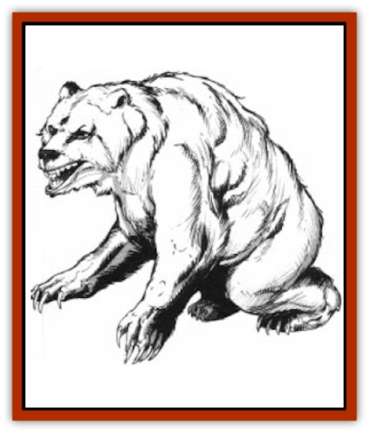

# Bear - Ice

| Statistic | **Bear, Ice** |
| --- | --- |
| **Activity Cycle:** | Day |
| **Alignment:** | Neutral |
| **Armor Class:** | 6 |
| **Climate/Terrain:** | Arctic/Plain, hill, and mountain |
| **Damage/Attack:** | 1-8/1-8/2-16 |
| **Diet:** | Carnivore |
| **Frequency:** | Uncommon |
| **Hit Dice:** | 6+2 |
| **Intelligence:** | Low (5-7) |
| **Magic Resistance:** | Nil |
| **Morale:** | Average (10) |
| **Movement:** | 12, Sw 3 |
| **No. Appearing:** | 1-4 |
| **No. of Attacks:** | 3 |
| **Organization:** | Pack |
| **Size:** | L (12' tall) |
| **Special Attacks:** | Hugs for 2-12 |
| **Special Defenses:** | See below |
| **THAC0:** | 15 |
| **Treasure:** | Nil |
| **XP Value:** | 975 |

Resembling a cross between a [[Bear|polar bear]] and a [[Bear|cave bear]], the ice bear is a ferocious meat-eater inhabiting the southernmost regions of Krynn. It is the most intelligent of all bears.

A mature ice bear averages 12 feet in length and weighs nearly 1,500 pounds. Its coat of dense white fur keeps it warm and makes it difficult to see against a background of ice and snow. It has a huge head, long ears, and bright blue eyes. Thick pads on its feet enable it to walk on ice without slipping. Its lean body and powerful legs enable it to swim with relative ease.

Ice bears have no formal language, but can communicate simple ideas to each other by a system of grunts. Ice bears who have established relationships with other races are able to understand brief spoken phrases from them.

**Combat:** Irritable and aggressive, the ice bear is a fearsome opponent. The ice bear has excellent vision and hearing. Its sense of smell is so acute that it can sniff out prey up to 100 yards away. Because of its sharp senses, an ice bear gains a +5 bonus to its surprise roll when encountering victims.

When attacking, the ice bear rears on its hind legs and lunges at its victim, striking with its forepaws and jaws. If the ice bear scores a paw hit with an 18 or better, it also hugs for an additional 2d6 points of damage. It continues to fight for 1d4 rounds after reaching 0 to -8 hit points. When reduced to -9 or fewer hit points, it dies immediately.

The ice bear is immune to all harmful effects of cold temperatures. It is similarly immune to *cone of cold* and all other cold-based spells.

**Habitat/Society:** Caves in icebergs serve as lairs for ice bears. Most ice bears live near arctic coastlines, but some live on small islands hundreds of miles from the mainland. Ice bears spend most of their waking hours swimming and fishing; their preferred hunting area is the edge of an ice floe where they can scoop passing fish out of the water. Ice bears seldom stray more than a few miles from their lairs.

Every winter, a female ice bear retires to her cave and gives birth to one or two cubs. Though not as dangerous as their parents, ice bear cubs older than six months are also formidable opponents (AC 7, HD 4, THAC0 17, Dmg 1d4/1d4/1d8, hugs for 1d6 points of damage). The cubs remain with their parents until they reach maturity (about seven years), then leave to establish lairs of their own.

The ice bear has an uncanny ability to track prey over snow and ice. If no new snow has fallen, an ice bear has a 100% chance of following a trail that is one day old or less. For each day (after the first) since the trail was made, this chance is reduced by 10%. The chance is reduced by an additional 10% for each inch of snow that has fallen on the trail. (For instance, if the trail is two days old and is covered by an inch of new snow, an ice bear's chance of following the trail is 80%.) A tracking roll is made once per day; if the roll is successful, the ice bear can follow the trail for the entire day. Otherwise, the trail is lost forever.

Ice bears have been known to establish cooperative relationships with members of other races, including [[Minotaur|minotaurs]] and humans. Most commonly, ice bears establish relationships with the [[Thanoi|thanoi]] (also known as walrus men). The ice bears track prey for the thanoi, who then slay the quarry and share the meat with the bears. When threatened, ice bears and thanoi unite to defend themselves against common enemies. To facilitate movement over ice and snow, the thanoi have designed special sleds that can be pulled by ice bear teams.

Though often associated with evil races, ice bears are not inherently evil themselves. Their memories are long, and they remain friendly to those who have helped them in the past, regardless of race or alignment. Characters who feed starving ice bears, free them from traps, or heal their wounds can find themselves befriended by those bears years or even decades later. Ice bears can help friends by serving as guides through hostile arctic terrain or by joining them as allies to fight off hostile creatures.

**Ecology:** The ice bear mainly eats fish and seals, but any type of prey that stumbles into its path is likely to be eaten as well. Ice bear pelts can be made into warm coats, gloves, and mufflers. Some races, especially evil- and neutral-aligned humans, value ice bear claws as jewelry; a finely crafted ice bear claw necklace can fetch as much as ten stl.

---
## Discovery & Documentation

**Source Publication:** MC4 Dragonlance Appendix (w/binder #2) (1989)
**Campaign Setting:** Dragonlance
**Author(s):** Rick Swan

### Other Creatures Found in This Source Book
   * [[Anemone_Giant_Sea|Anemone, Giant Sea]]
   * [[Beast_Undead|Beast, Undead]]
   * [[Bird_Krynn|Bird (Krynn)]]
   * [[Disir|Disir]]
   * [[Draconian_Aurak|Draconian, Aurak]]
   * [[Draconian_Baaz|Draconian, Baaz]]
   * [[Draconian_Bozak|Draconian, Bozak]]
   * [[Draconian_Kapak|Draconian, Kapak]]
   * [[Draconian_General_Information|Draconian, General Information]]
   * [[Draconian_Sivak|Draconian, Sivak]]
   * [[Draconian_Proto-_Traag|Draconian, Proto-, Traag]]
   * [[Dragon_Amphi|Dragon, Amphi]]
   * [[Dragon_Astral|Dragon, Astral]]
   * [[Dragon_Kodragon|Dragon, Kodragon]]
   * [[Dragon_Krynn_Othlorx_General_Information|Dragon (Krynn), Othlorx, General Information]]
   * [[Dragon_Krynn_General_Information|Dragon (Krynn), General Information]]
   * [[Dragon_Sea|Dragon, Sea]]
   * [[Dreamshadow|Dreamshadow]]
   * [[Dreamwraith|Dreamwraith]]
   * [[Dwarf_Daergar|Dwarf, Daergar]]
   * [[Dwarf_Hill_Neidar|Dwarf, Hill, Neidar]]
   * [[Dwarf_Mountain_Hylar|Dwarf, Mountain, Hylar]]
   * [[Dwarf_Theiwar|Dwarf, Theiwar]]
   * [[Dwarf_Zakhar|Dwarf, Zakhar]]
   * [[Elf_Half-|Elf, Half-]]
   * [[Elf_High_Qualinesti|Elf, High, Qualinesti]]
   * [[Elf_High_Silvanesti|Elf, High, Silvanesti]]
   * [[Elf_Sea_Dargonesti|Elf, Sea, Dargonesti]]
   * [[Elf_Sea_Dimernesti|Elf, Sea, Dimernesti]]
   * [[Elf_Wild_Kagonesti|Elf, Wild, Kagonesti]]
   * [[Eyewing|Eyewing]]
   * [[Fetch|Fetch]]
   * [[Fire_Minion|Fire Minion]]
   * [[Fireshadow|Fireshadow]]
   * [[Gnome_Tinker|Gnome, Tinker]]
   * [[Gurik_Cha'ahl|Gurik Cha'ahl]]
   * [[Haunt_Knight|Haunt, Knight]]
   * [[Horax|Horax]]
   * [[Human_Krynn|Human (Krynn)]]
   * [[Imp_Blood_Sea|Imp, Blood Sea]]
   * [[Kalothagh|Kalothagh]]
   * [[Kani_Doll|Kani Doll]]
   * [[Kender|Kender]]
   * [[Kyrie|Kyrie]]
   * [[Lizard_Man_Krynn|Lizard Man (Krynn)]]
   * [[Minotaur_Krynn|Minotaur, Krynn]]
   * [[Ogre_High|Ogre, High]]
   * [[Ogre_Krynn|Ogre (Krynn)]]
   * [[Phaethon|Phaethon]]
   * [[Saqualaminoi|Saqualaminoi]]
   * [[Shadowperson|Shadowperson]]
   * [[Shimmerweed|Shimmerweed]]
   * [[Skrit|Skrit]]
   * [[Spectral_Minion|Spectral Minion]]
   * [[Spider_Krynn|Spider (Krynn)]]
   * [[Stag|Stag]]
   * [[Tayling|Tayling]]
   * [[Thanoi|Thanoi]]
   * [[Tylor|Tylor]]
   * [[Wichtlin|Wichtlin]]
   * [[Wyndlass|Wyndlass]]
   * [[Yaggol|Yaggol]]
